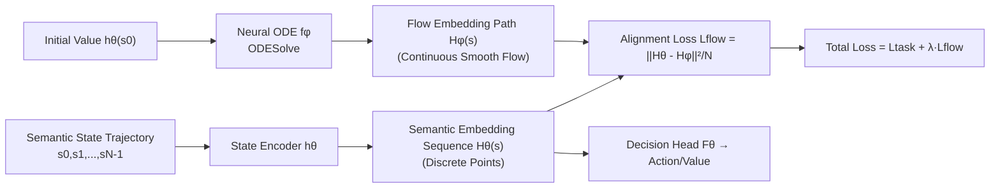

# Flowing Through States: Neural ODE Regularization for Reinforcement Learning

**Conference**: ICLR 2026  
**OpenReview**: [https://openreview.net/forum?id=FHFDCsB9UC](https://openreview.net/forum?id=FHFDCsB9UC)  
**Code**: To be confirmed  
**Area**: Reinforcement Learning / Representation Learning  
**Keywords**: Neural ODE, Representation Learning, Actor-Critic, A2C, Latent Space Regularization, MDP Dynamics  

## TL;DR
This paper proposes **FlowReg**: using a neural ODE to fit a smooth and continuous trajectory flow in the latent space, and forcing the agent's state encoder to align the latent representations of adjacent states along this ODE flow via an alignment loss. This explicitly injects "environment transition dynamics" into representation learning, achieving significant performance improvements on Atari (A2C) and MiniGrid (PPO).

## Background & Motivation
- **Background**: Neural networks in sequential decision-making (RL) perform decision-making in the latent space. However, how the semantic state evolutions (transition dynamics $P(s'|s,a)$) occur is typically left to be learned implicitly through task losses, leaving the transition structure of the latent space to "drift freely."
- **Limitations of Prior Work**: Inductive biases for perception tasks (such as translation equivariance and locality in CNNs) only characterize the local structure of single objects, whereas sequential decision-making requires a **global** structure of "how states correlate over time." This is especially severe in **discrete-state** MDPs—where discrete states are isolated from each other with no prior concept of proximity or smoothness. Continuity must be "artificially imposed" in the latent space; otherwise, embeddings of adjacent states might jump erratically or cross over each other.
- **Key Challenge**: Neural ODEs can naturally describe continuous flows where the "initial state uniquely determines the subsequent trajectory," which aligns well with the Markov property. However, using ODEs directly for inference is prohibitively slow (relying on numerical integration), and discrete jumps in semantic states violate the assumption of continuity, making them impractical for engineering.
- **Goal**: To achieve both the global topological structure (smoothness, consistency, determinism) provided by continuous ODE flows and the inference efficiency of conventional forward networks.
- **Core Idea**: **Utilize the neural ODE as a "training-time latent space plugin regularizer" rather than an inference model**. An ODE flow model is trained to describe latent dynamics, and an alignment penalty forces the semantic encoder to mimic the ODE flow trajectories. The two shape each other, and the ODE is discarded entirely during inference.

## Method

### Overall Architecture
FlowReg maintains two models: the target agent model $\theta$ (including a state encoder $h_\theta$ and a downstream decision head $F_\theta$) and a flow regularizer $\phi$ (a neural ODE network $f_\phi$). For a state trajectory $s=s_0,\dots,s_{N-1}$, the encoder directly produces a "semantic embedding sequence" $H_\theta(s)=\{h_\theta(s_i)\}$, while the ODE integrates from the initial value $h_\theta(s_0)$ to produce a "flow embedding path" $H_\phi(s)$. During training, the alignment loss between the two is added to the task loss, forcing the encoder's discrete points to fit the smooth continuous path of the ODE. During inference, only $\theta$ is used.

### Key Designs

**1. Analogizing MDP trajectories to ODE flows to provide a "global deterministic backbone" for the latent space** — The starting point is that the Markov property of an MDP is highly isomorphic to the uniqueness of the initial value in an ODE: the current state completely determines the future. Thus, a neural ODE $\frac{dh(t)}{dt}=f_\phi(h(t),t)$ (guaranteeing a unique continuous trajectory under Lipschitz continuity conditions) is used to define the "flow field" of the latent space. Since MDP states themselves lack timestamps, integration times $\tau_i$ must be manually assigned for each state in the trajectory. Furthermore, because the Markov property makes the underlying ODE autonomous (time-invariant), the time sampling method is critical. The authors provide two types: index sampling $\tau_i=i$, and exponential decay $\tau_i=\gamma^i$ consistent with the agent's discount factor (compressing integration time into $[0,1]$ to avoid instability caused by large intervals). Flow embeddings are given by numerical solutions: $H_\phi(s)=\text{ODESolve}(f_\phi, h_\theta(s_0), \{\tau_i\})$.

**2. Path Alignment: Using MSE for mutual shaping between the encoder and ODE flow** — The intuition is that initially, the ODE flow only carries "curvature/topological" information while the semantic encoder only carries "task" information. The authors aim to fuse these signals. The approach is simple: directly minimize the Mean Squared Error between the semantic embedding sequence and the sampled flow path:
$$
L_{\text{flow}}(s) := \frac{\lVert H_\theta(s) - H_\phi(s)\rVert_2^2}{N}.
$$
The beauty of this loss is that it differentiates with respect to both $\theta$ and $\phi$. it trains the encoder $\theta$ to follow the continuous ODE flow (inheriting smooth topology) and trains the ODE $\phi$ to adapt to the latent space shaped by the current task. This is a **bidirectional alignment** rather than unidirectional distillation. Compared to methods that only constrain "adjacent state predictability" (e.g., TACO), the uniqueness of the ODE flow implies predictability from **any** predecessor, representing a stronger temporal consistency constraint.

**3. Total Objective and "Training-time Plugin" Positioning: Low-frequency updates with zero inference overhead** — The flow loss is merged into the task loss as a weighted term $L(s,y)=L_{\text{task}}(F_\theta(H_\theta(s)),y)+\lambda L_{\text{flow}}(s)$. For A2C, this is $L=L_{\text{actor}}+\beta L_{\text{critic}}+\lambda L_{\text{flow}}$. A key engineering point is the **update frequency of FlowReg relative to the agent**. While numerical integration for neural ODEs is expensive, experiments show that performing flow regularization only once every 5~20 agent updates is sufficient. This maintains the gains while keeping training costs comparable to the baseline. Furthermore, the ODE acts as an adaptive regularizer **only during training** and is removed entirely during inference, incurring no additional inference cost.

## Key Experimental Results

### Main Results (Atari A2C, 11 environments, 10M steps, 10 seeds)
Best average episodic rewards under different time sampling modes (Table 1, 16 episodes × 10 seeds):

| A2C Agent | Qbert | Riverraid | BeamRider |
|---|---|---|---|
| Base | 4374 ± 958 | 1862 ± 2400 | 961 ± 748 |
| FlowReg (Index) | **8306 ± 1753** | 2946 ± 2788 | 1591 ± 1033 |
| FlowReg (Exp-Decay) | 6903 ± 2158 | **2948 ± 2799** | **1593 ± 962** |

FlowReg outperformed the baseline in all 11 environments, and both time sampling modes were effective.

### Ablation Study: Update Frequency (Qbert, U-m = flow regularization every m agent updates, Table 2)

| A2C Agent | Qbert (Index) | Qbert (Exp-Decay) |
|---|---|---|
| Base | 4374 ± 958 | 4374 ± 958 |
| FlowReg U-5 | **8306 ± 1753** | 5287 ± 1270 |
| FlowReg U-10 | 6570 ± 2646 | **6903 ± 2158** |
| FlowReg U-20 | 5986 ± 2756 | 6783 ± 1877 |

Even U-20 (halving the flow loss updates) still shows significant gains—indicating that flow regularization can surpass the baseline without aggressive optimization, making training costs friendly.

### Latent Space Smoothness (Table 3, normalized by trajectory length, lower is smoother)

| Qbert | Path Length | Net Disp. | Accel. Energy | Reward |
|---|---|---|---|---|
| A2C | 34.39 | 0.44 | 4424.75 | 4374 |
| A2C+TACO | 6.13 | 0.03 | 106.38 | 2434 |
| A2C+FlowReg | **4.20** | 0.10 | **64.17** | **8306** |

### Key Findings
- **Smoothness and Performance Gain**: FlowReg significantly smoothens latent trajectories (sharp drops in path length/acceleration energy) while performance increases rather than decreases.
- **Smoothness $\neq$ Performance Gain; The Key is Respecting Transition Dynamics**: TACO also smoothens paths but loses points in two environments. FlowReg's alignment loss imposes a **diffeomorphic** structure, maintaining semantic structure while smoothing, resulting in lower variance and stable gains.
- **Effectiveness with PPO + MiniGrid**: Significantly outperforms the baseline on FourRooms and DynamicObstacles, and ties on DoorKey (both solve the environment), verifying generalization across algorithms (A2C→PPO) and more discrete domains.

## Highlights & Insights
- Positioning the **"ODE as a regularizer rather than an inference engine"** is clever: it bypasses the two fatal flaws of neural ODEs—slow inference and the disruption of continuity by discrete jumps—while capturing the global topological benefits of continuous flows.
- The **bidirectional alignment loss** allows the ODE and encoder to adapt to each other, rather than treating the ODE as a fixed prior for hard distillation, avoiding "smoothing for the sake of smoothing" that destroys semantics.
- The use of three smoothness metrics (path length / displacement / acceleration energy) to quantify latent geometry, combined with comparisons against TACO, clarifies the distinction between "smoothness itself vs. respecting dynamics," making the argument robust.
- The method is minimally invasive to task losses or architectures, adding only an external regularizer, which lowers the barrier for practical implementation.

## Limitations & Future Work
- Evaluation scale is relatively small: validated only on A2C (11 Atari) + PPO (3 MiniGrid), with no tests on SAC, continuous control (MuJoCo), or larger-scale benchmarks.
- The design of time sampling $\tau_i$ is somewhat heuristic (index / exp-decay), lacking adaptive or theoretical guidance; the paper admits this choice "affects performance considerably."
- Numerical integration for ODE still carries training overhead, mitigated by lower update frequencies, but the trade-off between runtime overhead and gains varies by environment.
- λ was simply set to 1 without fully exploring weight scheduling; the robustness of flow loss in reward-sparse or highly stochastic environments is unknown.

## Related Work & Insights
- **Neural ODE as Continuous Deep Networks** (Chen et al. 2018; Euler discretization perspective for ResNet): Ours changes the perspective—instead of single-layer transitions, it views the "entire latent trajectory produced by the encoder acting on a state sequence."
- **Neural ODE for Continuous Control** (Jia & Benson 2019; Alvarez et al. 2020): These methods use ODEs as the primary inference model to predict semantic trajectories, which is difficult for discrete domains; Ours uses the ODE only as an uncoupled regularizer.
- **Predictive Coding/Contrastive Representations** (TACO, SPR, etc.): Shaping the latent space by "predicting the successor from the predecessor"; FlowReg leverages ODE flow uniqueness to impose stronger consistency of "predicting from any predecessor."
- **Insight**: Encoding "known domain structures (Markov → ODE unique flow)" into a differentiable plugin regularizer—aligned during training and discarded during inference—is a general paradigm for injecting dynamical priors into representation learning, extendable to time-series prediction and world models.

## Rating
- **Novelty**: ⭐⭐⭐⭐ Analogy between MDP and ODE flows plus the "ODE as training-only regularizer" positioning is novel and self-consistent; bidirectional alignment loss is cleverly designed.
- **Experimental Thoroughness**: ⭐⭐⭐ Comparison across A2C/PPO and smoothness analysis is convincing, but environment scale is small with missing continuous control benchmarks.
- **Writing Quality**: ⭐⭐⭐⭐ Logic from motivation to method to experiments is clear; geometric analysis and comparison with TACO thoroughly explain causality.
- **Value**: ⭐⭐⭐⭐ Provides a low-intrusion, zero-inference-overhead, cross-algorithm transferable dynamic prior regularization paradigm with high practical value.

<!-- RELATED:START -->

## Related Papers

- [\[ICLR 2026\] Neural+Symbolic Approaches for Interpretable Actor-Critic Reinforcement Learning](neuralsymbolic_approaches_for_interpretable_actor-critic_reinforcement_learning.md)
- [\[ICLR 2026\] From Ticks to Flows: Dynamics of Neural Reinforcement Learning in Continuous Environments](from_ticks_to_flows_dynamics_of_neural_reinforcement_learning_in_continuous_envi.md)
- [\[ICLR 2026\] Neural Predictor-Corrector: Solving Homotopy Problems with Reinforcement Learning](neural_predictor-corrector_solving_homotopy_problems_with_reinforcement_learning.md)
- [\[ICLR 2026\] RESCHED: Rethinking Flexible Job Shop Scheduling from a Transformer-based Architecture with Simplified States](resched_rethinking_flexible_job_shop_scheduling_from_a_transformer-based_archite.md)
- [\[ICLR 2026\] Critique-RL: Training Language Models for Critiquing Through Two-Stage Reinforcement Learning](critique-rl_training_language_models_for_critiquing_through_two-stage_reinforcem.md)

<!-- RELATED:END -->
