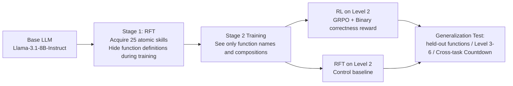

# From $f(x)$ and $g(x)$ to $f(g(x))$: LLMs Learn New Skills in RL by Composing Old Ones

**Conference**: ICLR 2026  
**OpenReview**: [https://openreview.net/forum?id=jt7oCtYqHE](https://openreview.net/forum?id=jt7oCtYqHE)  
**Code**: TBD  
**Area**: Reinforcement Learning / LLM Post-training / Compositional Generalization  
**Keywords**: RLVR, Skill Acquisition, Compositional Generalization, GRPO, easy-to-hard generalization, cross-task transfer  

## TL;DR
The paper uses a decontaminated synthetic string transformation task to demonstrate that when LLMs have mastered "atomic skills" through pre-training, **as long as RL training explicitly incentivizes "composition"**, they can truly learn entirely new compositional skills that cannot be explained by atomic skills alone. These models generalize to deeper nesting levels and even completely different tasks—directly contradicting the pessimistic view that "RL only rearranges the existing capabilities of the base model."

## Background & Motivation
- **Background**: RLVR (RL with Verifiable Rewards) has shown significant success in math and reasoning, even allowing training directly on base models without SFT warm-up. However, there is a heated debate over whether "RL actually teaches the model anything new."
- **Limitations of Prior Work**: The core evidence for the pessimistic view is the **pass@k phenomenon**—as the number of samples $k$ increases, the gap between the base model and the RL model narrows. This leads to the inference that RL only "re-ranks" existing solutions in the base model to pass@1 rather than learning new skills. Other work suggests that the "aha moment" merely amplifies pre-existing cognitive behaviors in the base model.
- **Key Challenge**: These conclusions are based on **vague definitions of "skills"** (using the frequency of certain reasoning patterns as a proxy metric) and **dirty benchmarks with mixed difficulty**. The base model likely encountered similar data during pre-training, leaving RL with neither the motivation nor the space to learn new skills. This makes it impossible to distinguish between "true skill acquisition" and "activation of existing capabilities."
- **Goal**: Construct a synthetic framework with precise control over task difficulty, complete decontamination, and clear skill boundaries to cleanly answer three questions: (1) Does RL teach LLMs new skills? (2) If so, how is it incentivized? (3) Can learned skills generalize?
- **Core Idea (RL Compositionality Hypothesis)**: Inspired by Anderson (1982) in cognitive science—humans acquire new cognitive skills by **composing and internalizing existing skills**. The authors hypothesize: **once a model masters the necessary atomic (indivisible) skills through NTP training, RL with proper incentives can teach it to compose these atomic skills into complex new abilities**, and this "ability to compose" is itself a new skill in the cognitive science sense.

## Method

### Overall Architecture
The paper strictly defines a "skill" as the ability to infer the output of a transformation function $f(x)$ for a given input string $x$. Atomic skills are single indivisible transformations $f(x)$, while compositional skills are nested compositions $h(x)=g(f(x))$. Difficulty is precisely controlled by the nesting depth (Level $n$ = composition of $n$ functions). The study employs a **two-stage training protocol** to completely separate "atomic skill acquisition" from "compositional skill learning," followed by generalisation testing across three dimensions: held-out functions, higher difficulty, and cross-task transfer.

### Key Designs

**1. Decontaminated String Transformation Testbed: Turning "Skills" into Controllable Variables.** The paper constructs 25 unique string transformation functions (covering character manipulation, reordering, filtering, structural modification, etc.) and assigns each a **meaningless identifier** (e.g., `func_16`) to prevent inference of function from the name. During the RL stage, all function definitions are hidden. The key to this design is that these tasks do not exist in LLM pre-training corpora and are **impossible to solve** without the atomic skill training provided in this paper, thereby excluding confounding factors like data contamination or "base model already knows." Difficulty is continuously adjustable via nesting depth: Level 1 `func_16(x)` is an atomic task, while Level 2 `func_16(func_15(x))` requires compositional reasoning, demanding the model perform deductive reasoning to provide the transformed output string.

**2. Two-Stage Training Protocol: Separating Atomic Acquisition and Compositional Learning.** Stage 1 uses Rejection Fine-Tuning (RFT) to let the model acquire atomic skills. During data collection, **explicit function definitions are provided** to allow the model to generate correct reasoning trajectories, but these definitions are **removed** during fine-tuning. This forces the model to predict outputs based solely on function identifiers, "internalizing" function behavior as atomic skills. This is the only time the model encounters function implementations. In Stage 2, the model only sees function names and compositions (e.g., `func_2(func_16(x))`) with definitions hidden, forcing it to rely on internalized atomic knowledge to learn systematic composition. Stage 2 compares two paths: **Online RL** using binary rewards based on output correctness updated via **GRPO** (to check if RL is necessary for compositional skill acquisition), and **Offline RFT** performing NTP on correct reasoning trajectories of compositional problems (to check if "seeing composition examples" is sufficient).

**3. Compositional Incentive as a Necessary Condition for RL Skill Acquisition.** The paper isolates the role of "compositional incentive" using three Stage 2 configurations: RL Level 1 (trained only on atomic tasks), RL Level 2 (trained only on two-layer compositions), and RL Level 1+2 (uniform mixture). Results show that training only on atomic skills (RL Level 1) reaches ~90% on Level 1 but stays below 25% on Level 2 and near zero on Levels 3-6. **Learning atomic skills is insufficient for learning composition.** Only when compositional data is included in RL can the model generalize to deeper nestings unseen during training. This explains why Sun et al. (2025) concluded that "RL does not promote compositional generalization": their training **lacked explicit compositional incentives.**

**4. Resolving the "Reranking Illusion" via Fine-Grained Difficulty Spacing.** The paper attributes the pass@k narrowing observed by pessimists to two factors: first, **evaluation on mixed-difficulty benchmarks**, where improvements in specific skills (like composition) are masked by other bottleneck skills; second, **lack of incentive for new skills during RL training**. This controllable framework isolates skills by difficulty level, revealing that: while the gap indeed narrows with $k$ on simple problems where the base model already has high pass@k (Level 1-2, consistent with the reranking narrative), the RL model's advantage **widens as $k$ increases** on difficult compositional problems where the base is near zero (Level 3-8). For example, on Level 5, the gap between the RL model and RFT base grows from 4% at pass@1 to approximately 25% at pass@1024, providing clear evidence of new skill acquisition.

## Key Experimental Results

The base model used consistently is Llama-3.1-8B-Instruct (identified by recent work as a clean testbed with low data contamination).

### Main Results: Compositional Data + RL Teaches Generalizable Skills (held-out, Level 3-6)

| Stage 2 Configuration | Level 1 | Level 2 | Level 3 | Level 4 |
|---|---|---|---|---|
| RL Level 1 (Atomic only) | ~90% | <25% | ~0% | ~0% |
| RL Level 2 / Level 1+2 | High | Strong | 5%→**~30%** | 1%→**~15%** |

Non-trivial gains persist at Level 5, indicating the model learns **generalizable compositional principles** rather than memorizing answers.

### RL vs RFT (Same Level 2 Data)

| Method | Level 2 | Level 3 |
|---|---|---|
| Iterative RFT | Only **15%** | Always <2.6% |
| RL Level 2 | **64%** | **27%** |

RFT fails to generalize even on held-out Level 2 tasks of the same difficulty as training (only 15%), proving that **merely seeing compositional examples is insufficient; RL is the key factor.**

### Cross-task Transfer (Countdown, no Countdown RL)

| Model Configuration | Countdown Atomic Skills | String Composition RL | Countdown Lvl3 Avg@32 |
|---|---|---|---|
| String-Base + RL L1+2 | ✗ | ✓ | Complete Failure |
| Multi-Base (Atomic only) | ✓ | ✗ | ~17% |
| Multi-Base + RL L1 | ✓ | Atomic RL only | ~20% |
| Multi-Base + RL L1+2 | ✓ | ✓ | **~35%** |

Compositional skills learned on string tasks transfer to Countdown, with Level 3 improving by >18% and Level 4 remaining around 6% (while other models stay near zero). However, String-Base + RL L1+2 fails completely, proving that **atomic skills for the target task are a prerequisite for transfer to take effect.** Compositional skills act as a "meta-skill," amplifying the utilization of atomic knowledge in the target task.

### Behavioral Analysis (Gemini-2.5-Pro Classification of Level 3 Failure Modes)
Failure modes for RFT Base, RFT Level 2, and RL Level 1 are highly similar: >50% ignore composition, and >35% misunderstand compositional structure. In contrast, the RL Level 2 model **completely eliminates "ignoring composition" errors**. With an accuracy of 28.1%, its primary failure mode shifts to "atomic errors" (55%)—meaning the model can correctly parse and execute a compositional plan, but fails due to lower-level execution errors.

### Key Findings
- **Takeaway 1**: RL on compositional data teaches new skills that generalize to unseen compositions of known atomic skills.
- **Takeaway 2**: RFT fails to learn composition even with compositional data; RL is another critical factor for acquiring generalizable compositional skills.
- **Takeaway 3**: Compositional skills learned via RL can transfer to different tasks where the model already possesses the requisite atomic skills.
- **Takeaway 4**: The conclusion that "RLVR only exploits base reasoning patterns" is likely an artifact of "evaluating or training on tasks where the base model already has high pass@k."
- **Takeaway 5**: RL does not just improve accuracy; it **fundamentally changes model behavior**, enabling true understanding and processing of compositions.

## Highlights & Insights
- **Methodological Paradigm Value**: It settles a grand debate (whether RL teaches new skills) by using a synthetic sandbox with clear skill boundaries, continuously controllable difficulty, and complete decontamination. This makes "skill acquisition" a causally attributable variable for the first time—the paper's greatest contribution.
- **Conceptualization of the "Reranking Illusion"**: It points out that mixed-difficulty benchmarks conflate different types of abilities, masking true skill acquisition. This provides an elegant unified explanation for the pass@k debate.
- **Practical Implications**: compositional skills are transferable across tasks and depend on atomic skills. This explains phenomena like Logic-RL (logic training improving math) and Guru (greater cross-task gains in domains with high pre-training exposure). It suggests that base model development and post-training strategies should be co-designed from a "skill acquisition" perspective.

## Limitations & Future Work
- **Extrapolation of Synthetic Tasks**: Both string transformation and Countdown are highly structured synthetic tasks. Whether these conclusions apply to open-domain natural language reasoning, real-world code, or mathematics remains to be verified.
- **Sufficiency vs. Necessity**: The paper proves that "possessing atomic skills" is a **sufficient condition** for RL to unlock compositional abilities but explicitly does not claim it is strictly necessary. The issue of extremely low exploration efficiency without atomic skills is left for future work.
- **Scale and Model Diversity**: Experiments were only conducted on Llama-3.1-8B-Instruct. It remains unknown how compositional skill acquisition scales with model size or across different base model families.
- **Simple Reward Format**: Only binary correctness rewards and GRPO were used. The impact of more complex reward shaping or different algorithms on compositional skill acquisition was not explored.

## Related Work & Insights
- **Pessimists** (Yue et al. 2025, Wu et al. 2025a): The pass@k gap narrows as $k$ increases → RL only reranks and does not learn new skills. This paper counters this using fine-grained difficulty levels.
- **Cognitive Science Foundations**: Anderson's (1982) skill acquisition theory and Lake et al.'s (2016) compositionality serve as the theoretical pillars for "composition as a new skill."
- **Compositional Generalization**: Sun et al. (2025) found that RL on atomic skills alone does not enable compositional generalization (explained here as a lack of compositional incentive); Yin et al. (2025) achieved compositional improvements via ICL rather than RL.
- **Insights**: Base models should be intentionally seeded with necessary foundational atomic skills to allow post-training to efficiently "compose" new abilities. When evaluating new skills, fine-grained analysis stratified by difficulty/domain is essential to avoid being misled by aggregated metrics.

## Rating
- **Novelty**: ⭐⭐⭐⭐⭐ — The causal verification of the RL debate using a clean synthetic framework and the introduction of the "reranking illusion" concept are highly original in both perspective and methodology.
- **Experimental Thoroughness**: ⭐⭐⭐⭐ — Targeted experiments (held-out / RL vs RFT / cross-task / pass@k / behavioral analysis) provide a rigorous logical loop for each research question. Points deducted for using only a single base model and single task family, lacking validation on scale and open domains.
- **Writing Quality**: ⭐⭐⭐⭐⭐ — The motivation is presented step-by-step, Figure 1 provides a clear overview, and the five Takeaways weave the main arguments together clearly. This is a model example of an "evidence-based position" paper.
- **Value**: ⭐⭐⭐⭐⭐ — Directly addresses the most central controversy in LLM post-training, offering substantial guidance for the allocation of "pre-training vs. post-training" resources and the co-design of base models and RL strategies.

<!-- RELATED:START -->

## Related Papers

- [\[ICLR 2026\] RL Grokking Recipe: How Does RL Unlock and Transfer New Algorithms in LLMs?](rl_grokking_recipe_how_does_rl_unlock_and_transfer_new_algorithms_in_llms.md)
- [\[ICLR 2026\] RL Squeezes, SFT Expands: A Comparative Study of Reasoning LLMs](rl_squeezes_sft_expands_a_comparative_study_of_reasoning_llms.md)
- [\[ICLR 2026\] Principled RL for Diffusion LLMs Emerges from a Sequence-Level Perspective](principled_rl_for_diffusion_llms_emerges_from_a_sequence-level_perspective.md)
- [\[ICLR 2026\] Reinforcement Learning with Verifiable Rewards Implicitly Incentivizes Correct Reasoning in Base LLMs](reinforcement_learning_with_verifiable_rewards_implicitly_incentivizes_correct_r.md)
- [\[ICLR 2026\] Getting Your LLMs Ready for Reinforcement Learning with Lightweight SFT](getting_your_llms_ready_for_reinforcement_learning_with_lightweight_sft.md)

<!-- RELATED:END -->
