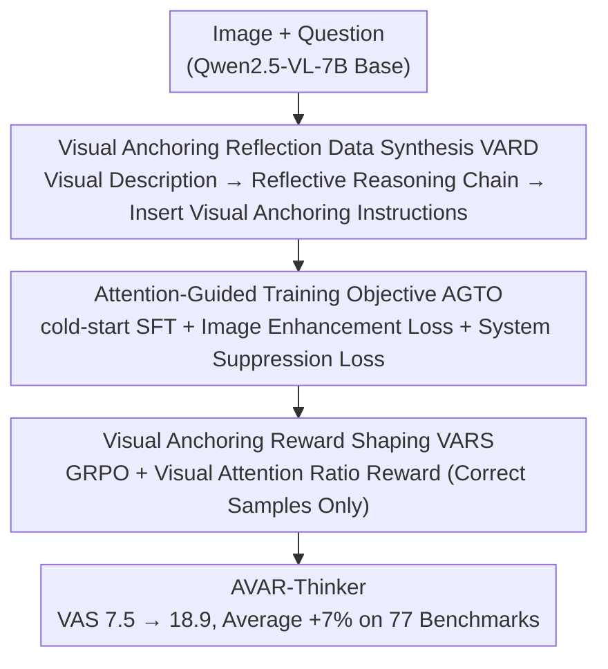

# From Narrow to Panoramic Vision: Attention-Guided Cold-Start Reshapes Multimodal Reasoning

**Conference**: ICLR 2026  
**arXiv**: [2603.03825](https://arxiv.org/abs/2603.03825)  
**Code**: [https://github.com/lrlbbzl/Qwen-AVAR](https://github.com/lrlbbzl/Qwen-AVAR)  
**Area**: Reinforcement Learning  
**Keywords**: Visual Attention, Multimodal Reasoning, cold-start, Attention-Guided Training, GRPO

## TL;DR
It is discovered that the reasoning performance of Multimodal LLMs is highly correlated with Visual Attention Scores (VAS) ($r=0.96$). The AVAR framework is proposed to enhance VAS through three stages: visual anchoring data synthesis, attention-guided training objectives, and visual anchoring reward shaping, achieving an average improvement of 7% across 77 benchmarks.

## Background & Motivation

**Background**: Multimodal LLMs (e.g., Qwen2.5-VL) have made significant progress in reasoning tasks. However, research indicates their reasoning processes often exhibit a "laziness to look at images"—models tend to focus on system tokens rather than visual tokens.

**Limitations of Prior Work**: Following multimodal cold-start training, the Visual Attention Score (VAS) of models does not improve and may even decrease. VAS measures the proportion of attention reasoning tokens pay to visual tokens; low VAS implies the model fails to fully utilize image information during reasoning.

**Key Challenge**: "Lazy Attention Localization"—models learn to "lazily" reason using cues in text descriptions and system instructions instead of truly examining key information within the images.

**Goal**: How to force the model to increase attention to visual tokens during the cold-start and RL stages?

**Key Insight**: VAS is found to be positively correlated with reasoning performance ($r=0.96$). Directly optimizing VAS serves as a training signal.

**Core Idea**: Explicit supervision at the attention level—enhancing image attention and suppressing system attention—forces the model to "look back at the image."

## Method

### Overall Architecture

This paper addresses the problem of "lazy looking" in Multimodal LLMs, where models concentrate attention on system tokens during reasoning, resulting in low VAS (Visual Attention Score), which is highly positively correlated with reasoning performance ($r=0.96$). The AVAR approach is straightforward: since VAS is measurable and linked to performance, it is used as a training signal for optimization. The overall workflow is a three-stage pipeline from data to training objectives to rewards: first, visual anchoring data with "look back" instructions is used for cold-start SFT; next, two regularization terms acting directly on attention maps are added to the SFT loss; finally, VAS is converted into a reward in GRPO reinforcement learning, allowing the model to autonomously explore better visual attention strategies. The three stages correspond to a progressive increase in VAS from 7.5 → 10.1 → 13.8 → 18.9.

### Key Designs

**1. Visual Anchoring Reflection Data Synthesis (VARD): Teaching the model to "look back" at the data level**

The success of cold-start SFT depends on whether the data contains reasoning demonstrations that explicitly reference images; pure text reasoning chains only reinforce "laziness." VARD synthesizes such data in three stages: Stage 1 uses Gemini 2.5-Pro to generate high-precision visual descriptions to explain image content thoroughly; Stage 2 uses Qwen3-235B to generate reflective reasoning chains based on these descriptions; Stage 3 uses Qwen3-32B to insert visual anchoring instructions (e.g., "Look back at the position of the triangle") into the reasoning chains. This effectively adds a visual version to the Chain-of-Thought—repeatedly requiring the retrieval of evidence from the image during reasoning rather than guessing based on text cues.

**2. Attention-Guided Training Objective (AGTO): Direct constraints on attention maps**

While VARD provides indirect guidance through data demonstrations, AGTO goes further by adding two regularization terms directly to the SFT loss that act on the attention distribution, embedding "look more at images, look less at system prompts" into the gradients. The image enhancement loss applies to all layers and attention heads, maximizing the logarithm of the average attention of reasoning tokens to image tokens; the system suppression loss inversely minimizes the logarithm of the average attention of reasoning tokens to system tokens. Both are weighted and added to the language modeling loss for the total objective:

$$L = L_{\text{LM}} + 0.15 \cdot L_{\text{enhance-img}} + 0.15 \cdot L_{\text{suppress-sys}}$$

Operating directly on the attention map is significantly more effective than "hinting" at the model to look at images via data augmentation—adding AGTO raises the cold-start VAS from 7.5 to 13.8.

**3. Visual Anchoring Reward Shaping (VARS): Autonomous exploration of visual attention strategies during RL**

During the SFT stage, the model can only imitate attention patterns in the training data and cannot reach optimal strategies beyond the demonstrations; VARS incorporates VAS into the reward of GRPO, allowing the model to explore during reinforcement learning. For correctly answered samples, the reward is:

$$r = r_{\text{accuracy}} + 0.3 \cdot r_{\text{visual}} + 0.1 \cdot r_{\text{format}}$$

Where $r_{\text{visual}}$ is the ratio of attention from reasoning tokens to image tokens versus system tokens—a higher ratio indicates the model prioritizes the image more. Crucially, the visual reward is **only issued when the answer is correct**, otherwise, the attention patterns associated with incorrect answers would also be reinforced. VARS is the largest contributor among the three components (+3.5%), indicating that RL offers more room than SFT for optimizing attention patterns.

## Key Experimental Results

### Main Results (Average of 77 Benchmarks)

| Model | MathVision | MMMU | HallusionBench | Total Average |
|------|-----------|------|---------------|-------|
| Qwen2.5-VL-7B | 25.2% | 58.1% | 50.7% | 49.1% |
| **AVAR-Thinker** | **37.4%** | **63.8%** | **59.5%** | **56.1%** |
| Gain | +12.2% | +5.7% | +8.8% | +7.0% |

### Ablation Study

| Component | VAS | Performance |
|------|-----|------|
| Baseline | 7.5 | 49.1% |
| +VARD Data | 10.1 | 51.0% |
| +AGTO Attention Guidance | 13.8 | 52.6% |
| **+VARS Reward Shaping** | **18.9** | **56.1%** |

### Key Findings
- The Pearson correlation coefficient between VAS and reasoning performance is as high as 0.96, indicating that visual attention is a key bottleneck in multimodal reasoning.
- VARS (RL stage) contributes the most (+3.5%), suggesting RL is better suited than SFT for optimizing attention patterns.
- Improvements are most significant in mathematical reasoning and hallucination detection, tasks that rely most heavily on visual information.
- The three components are complementary and progressive; none are dispensable.

## Highlights & Insights
- **VAS as an Optimizable Metric**: The abstract concept of "whether the model is looking at the image" is quantified into a specific, differentiable VAS metric and directly optimized. This approach of "measure first, then optimize" is noteworthy.
- **Explicit Constraints at the Attention Level**: Most methods optimize only at the input/output level; this paper directly imposes constraints on the attention map, which is more direct.
- **Three-Stage Progressive Design**: Data (VARD) -> Training Objective (AGTO) -> Reward (VARS), guiding the model to increase visual attention from shallow to deep levels.

## Limitations & Future Work
- The attention-guided loss imposes the same constraints on all layers and heads; the optimal attention distribution may vary across different layers/heads.
- VARD data relies on Gemini 2.5-Pro and Qwen3-235B, leading to high synthesis costs.
- Verification was only performed on Qwen2.5-VL-7B; effectiveness on larger models remains unknown.
- The VAS metric assumes that higher visual attention is always better, but some text-only reasoning steps may not require visual attention.

## Related Work & Insights
- **vs Qwen2.5-VL**: Used as the base model, demonstrating the insufficiency of standard cold-start training.
- **vs GRPO**: This paper adds a visual attention reward to standard GRPO, representing an interesting exploration of RLVF.

## Rating
- Novelty: ⭐⭐⭐⭐⭐ The correlation discovery between VAS and reasoning performance + attention-guided training is novel.
- Experimental Thoroughness: ⭐⭐⭐⭐⭐ Large-scale evaluation across 77 benchmarks is very persuasive.
- Writing Quality: ⭐⭐⭐⭐⭐ The motivation chain is clear, and the analysis of VAS is convincing.
- Value: ⭐⭐⭐⭐⭐ Reveals and addresses the issue of insufficient visual attention in Multimodal LLMs.

<!-- RELATED:START -->

## Related Papers

- [\[ACL 2026\] Visually-Guided Policy Optimization for Multimodal Reasoning](../../ACL2026/reinforcement_learning/visually-guided_policy_optimization_for_multimodal_reasoning.md)
- [\[ICLR 2026\] Unveiling the Cognitive Compass: Theory-of-Mind-Guided Multimodal Emotion Reasoning](unveiling_the_cognitive_compass_theory-of-mind-guided_multimodal_emotion_reasoni.md)
- [\[ACL 2026\] AttnPO: Attention-Guided Process Supervision for Efficient Reasoning](../../ACL2026/reinforcement_learning/attnpo_attention-guided_process_supervision_for_efficient_reasoning.md)
- [\[AAAI 2026\] Vision-Language Reasoning for Geolocalization: A Reinforcement Learning Approach](../../AAAI2026/reinforcement_learning/vision-language_reasoning_for_geolocalization_a_reinforcement_learning_approach.md)
- [\[ICLR 2026\] Spotlight on Token Perception for Multimodal Reinforcement Learning](spotlight_on_token_perception_for_multimodal_reinforcement_learning.md)

<!-- RELATED:END -->
