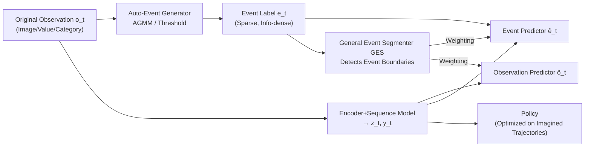

# From Observations to Events: Event-Aware World Models for Reinforcement Learning

**Conference**: ICLR 2026  
**OpenReview**: [https://openreview.net/forum?id=OWkkFaq1IZ](https://openreview.net/forum?id=OWkkFaq1IZ)  
**Code**: [https://github.com/MarquisDarwin/EAWM](https://github.com/MarquisDarwin/EAWM)  
**Area**: reinforcement learning  
**Keywords**: Model-based Reinforcement Learning, World Models, Event-Aware Representation, Sample Efficiency, Visual Generalization  

## TL;DR
Inspired by the cognitive science concept that "humans segment continuous sensory streams into discrete events," this paper proposes EAWM, a general framework that enables world models to **additionally predict "events"** (significant changes in brightness, values, or categories) alongside future observations. This allows learning compact kinematic representations, improving strong baselines such as DreamerV3 and Simulus by 10%–45% on benchmarks like Atari, Craftax, and DMC.

## Background & Motivation
- **Background**: Model-based Reinforcement Learning (MBRL) significantly improves sample efficiency by learning a world model to predict future states from raw observations and optimizing policies on imagined trajectories. Prevailing methods (DreamerV3, Transformer-based TWISTER, RetNet-based Simulus, Diffusion-based DIAMOND) focus training objectives on the **observation space**—reconstructing or generating the next frame as precisely as possible.
- **Limitations of Prior Work**: Observation-space objectives lead to three issues: ① Accumulation of long-range prediction errors; ② Observations are filled with redundant information (textures, colors, backgrounds) useless for policy making; ③ Predicting raw pixels in stochastic environments is inherently ill-posed ("the side of a coin cannot be predicted before it lands"). Consequently, models generalize poorly to scenes with structural similarity but visual variations (texture/color shifts).
- **Key Challenge**: World models expend computational power "reconstructing every pixel of every frame," whereas decision-making is driven by **dynamic changes** rather than static appearance—this objective mismatch results in inefficient and non-robust policy learning.
- **Goal**: Inject "event-awareness" into any world model without altering its backbone, forcing the representation space to focus on meaningful spatio-temporal transitions without requiring manual annotations.
- **Key Insight**: **[Events as Decision Units]** Drawing from neurobiological findings (Superior Colliculus neurons respond only to changes in visual scenes and map dynamic features like velocity to motor trajectories), "events" (significant changes in log-luminance, jumps in values/categories) are defined as algorithmically generated discrete signals. World models are tasked with **predicting events** rather than just observations—event prediction is naturally simpler than observation prediction because it filters out redundant low-level changes through an information bottleneck.

## Method

### Overall Architecture
EAWM decomposes modern world models into two parts: the **WM part** (sequence model, representation model, dynamics predictor, reward/continue predictor, observation predictor—the standard five-piece suite of most mainstream world models) and the newly added **EA part** (Event Predictor + General Event Segmenter, GES). The EA part only processes the output of the WM part as a post-processor, allowing it to be integrated as a plugin into architectures like DreamerV3 or Simulus (resulting in EADream and EASimulus, respectively). The workflow involves: an automatic event generator calculating event labels from raw observations → an event predictor forecasting these events in latent space → GES detecting "event boundaries" to dynamically adjust the weights of the event and observation loss branches.

### Key Designs

**1. Auto-Event Generator: Algorithmizing "change" into self-supervised signals.** The foundation of the method is defining event generation rules for three types of modalities without manual labeling. For visual inputs, a naive definition triggers an event if log-luminance $L_t(x,y)=\log I_t(x,y)$ exceeds a contrast threshold $C_I$. To suppress noise and false positives from slow illumination changes, the authors employ an **Adaptive Gaussian Mixture Model (AGMM)**: each pixel maintains $K$ Gaussian components $p(L_t)=\sum_k w_k\mathcal{N}(L_t;\mu_k,\Sigma_k)$. The Mahalanobis distance $D_{k}=(L_{t+1}-\mu_k)^\top\Sigma_k^{-1}(L_{t+1}-\mu_k)$ to the new observation is calculated; an event is generated only when the model is "surprised" ($D_k$ is large) or "uncertain" (weight of the matched component is too low). For ordered data (joint angles, velocities), events are triggered by relative changes exceeding threshold $C_o$; for nominal data (discrete categories), they are triggered by category jumps. This results in an event stream that is sparse but information-dense and far more robust to noise and slow lighting changes than raw observations.

**2. Event Predictor: Shaping representation space via auxiliary event prediction.** An independent decoder is set for each modality to estimate the category probability of each event location $p(\hat e_{t,i}|\text{sg}(y_t),y_{t+1},\hat z_t,z_t)\in[0,1]$. A stop-gradient $\text{sg}(\cdot)$ is applied to the target to prevent gradient backpropagation from causing loss spikes, forcing the representation to be more predictable. Losses vary by modality: cross-entropy for ordered data, and focal loss for visual/nominal data (due to extreme event sparsity/class imbalance), summed with weights $\beta_e^{(m)}$. Crucially, event prediction is an auxiliary target for shaping representations and **does not directly affect policy training**—the event and observation predictors can be omitted during inference, incurring no additional computational overhead for policy execution.

**3. General Event Segmenter (GES): Detecting event boundaries and dynamically reallocating attention.** Human predictive and memory capacities decline at "event boundaries" (start/end of a meaningful segment, e.g., a collision). Enforcing event prediction at these moments can be detrimental. GES detects boundaries by calculating the event ratio $\alpha_t^{(m)}=\frac{1}{N^m}\sum_i \mathbb{I}(e_{t,i}^{(m)}\text{ occurs})$ for each modality as a boundary indicator. It **integrates without trainable parameters**, implemented as a deterministic function $g(\alpha_t^{(m)},\alpha_{thr}^{(m)})$ (simplified to $\mathbb{I}(\alpha_t<\alpha_{thr})$ in EADream). When a boundary is detected ($g=0$), the event prediction loss is suppressed: $L_e=\sum_m\beta_e^{(m)}g(\cdot)L_e^{(m)}$. Simultaneously, an event-aware observation loss shifts attention from events back to raw observations: $L_o=L_o'+\sum_m\sum_i \omega\, g(\cdot)[\mathbb{I}(e_{t,i})-1]L_o'(o_{t,i},\hat o_{t,i})$, using weight $\omega$ to balance overall observation and event-specific attention.

**4. Unified Formula + RSSM-OP: Proof of universality.** The authors derive a unified formula (Eq. 3) for "seemingly different" world model architectures, demonstrating that the EA part can always be derived from the WM part's outputs. Thus, the framework applies to DreamerV3 (RSSM), Simulus (RetNet), and even model-free RL. In implementation, EADream modifies the observation predictor to predict $\hat o_t\sim p_\theta(\hat o_t|y_t,\hat z_t)$ directly from the prior state (denoted RSSM-OP, unlike DreamerV3 which decodes from posterior $z_t$). EASimulus designs GES to increase as events become sparser: $g=\mathbb{I}(\alpha_t<\alpha_{thr})/\text{arsinh}(\text{clip}(\alpha_t/\alpha_{thr},\epsilon_\alpha,1))$ to better highlight sparse events. The total loss is $L=L_{WM}+\beta_o L_o+\beta_e L_e$.

## Key Experimental Results

### Main Results

| Benchmark | Baselines | EAWM Variant | Key Metrics |
|---|---|---|---|
| Atari 100K | DreamerV3 (Mean 1.222) / Simulus (Mean 1.609) | EADream / EASimulus | EASimulus Mean **1.818**, IQM **1.004** (First superhuman IQM), EADream Mean 1.290 |
| Craftax 1M | Best-TWM / Simulus | EASimulus | Score **7.23%** (as % of max score), new record |
| DMC 500K (10 hard tasks) | TD-MPC2 (559.2) / DreamerV3 (606.3) | EADream | Mean **723.8** / Median **805.3**, SOTA among RL methods |
| DMC-GB2 500K | DreamerV3 / SADA | EADream | Significantly outperforms DreamerV3 and exceeds SADA (designed for generalization) without paired augmented images |

Overall improvements: Atari 100K +13%, Craftax 1M +10%, DMC 500K +19%, DMC-GB2 500K +45%. Maximum single-task gains include Breakout +55% and Acrobot Swingup +115%.

### Ablation Study

| Ablation Configuration | Observation | Conclusion |
|---|---|---|
| w/o Event Predictor | Mean HNS drops by ~0.4 for both world models | Representation learning from event prediction is core, especially in tasks like Breakout/Krull where "events are rewards." |
| w/o GES | Median HNS grows slowly with high variance | GES stabilizes training; critical in continuous control robot tasks where single errors require long sequences to correct. |
| w/o Observation Prediction (Event only) | Mean drops from 737.2 to 519.5 on 4 DMC tasks | Event and observation prediction are tightly coupled; both are necessary. |
| DreamerV3 + RSSM-OP (Decoding only) | Limited improvement | Gains primarily stem from joint modeling of observations and events, not RSSM-OP itself. |

### Key Findings
- Even if imagined frames deviate from ground truth in object positioning, the event predictor accurately locates spatial boundaries—indicating event prediction is inherently simpler and more robust to perturbations than observation prediction.
- Multimodal event awareness (map + status in Craftax) directly facilitates policy learning, verifying the framework's adaptability to multimodal observations.
- Strong generalization (visual interference in DMC-GB2) can be achieved without relying on extra supervision or paired augmented images.

## Highlights & Insights
- **Cross-Architecture Universal Plugin**: Not just another standalone world model, but a framework to add EA modules to "five-piece" world models like DreamerV3 and Simulus with minimal migration cost. This differs fundamentally from DyMoDreamer (which uses frame differences as input)—EAWM **predicts** events rather than feeding in differences.
- **Zero-Parameter GES**: Implementation of event boundary detection via a deterministic event ratio function adds no trainable parameters, providing substantial stability gains with engineering simplicity.
- **Cognitive Science → Computational Framework**: Translates findings like "Superior Colliculus responds only to change" and "the brain predicts events, not observations" into algorithmizable event generation and auxiliary prediction tasks.
- **Zero Inference Overhead**: Predictors do not directly affect policy execution and can be discarded during deployment, ensuring no slowdown in policy speed.

## Limitations & Future Work
- **GES Simplification**: Currently implemented as a deterministic threshold function for efficiency; the authors acknowledge that neural network modeling of event boundaries (e.g., based on changes in reconstruction error) could enhance expressivity while needing to avoid redundancy.
- **Cross-Task Knowledge Sharing**: While EADream/EASimulus use fixed hyperparameters across domains, "a unified model solving multiple tasks with shared general knowledge" remains an open challenge.
- **LLM/VLM Integration**: Combining with large-scale pre-trained VLMs to enhance generalization and cross-modal grounding is a promising but unexplored direction.
- Visual event generation relies on AGMM and thresholds $C_I/C_o$; while fixed across benchmarks, robustness to extreme modalities outside the test distribution remains to be verified.

## Related Work & Insights
- **MBRL Spectrum**: From World Models and Dreamer (RSSM) to Transformer world models (IRIS/TWM/TWISTER), RetNet-based Simulus, and Diffusion-based DIAMOND, the main thread focuses on fine-grained modeling in observation space. TD-MPC2 predicts states but is hard to apply to images. This work provides an orthogonal "event-aware" increment outside that line.
- **RL Representation Learning**: Auxiliary tasks in UNREAL, contrastive learning, image augmentation, and depth/motion prediction all attempt to extract task-relevant structures, but often require static visual priors or extra labels. This work uses **event prediction as an unlabelled auxiliary task**, allowing agents to capture task-relevant dynamics unsupervised.
- **Insight**: When "predicting the raw signal" becomes ill-posed or redundant, stepping back to predict "significant changes in the signal (events)" often serves as a more compact, learnable, and generalizable proxy goal. This logic is transferable to video prediction, robotic perception, and temporal anomaly detection.

## Rating
- Novelty: ⭐⭐⭐⭐ Systematically introduces the "event" concept from event cameras/cognitive science into world models as a general framework, not just simple frame differencing.
- Experimental Thoroughness: ⭐⭐⭐⭐ Covers four benchmarks (Atari/Craftax/DMC/DMC-GB2), 55 tasks, two heterogeneous architectures, and 5 seeds. Ablations isolate the effect of RSSM-OP effectively.
- Writing Quality: ⭐⭐⭐⭐ Clear logic from motivation to biology to formulation and experiments. Rigorous unified formula and multimodal definitions.
- Value: ⭐⭐⭐⭐ Plug-and-play, zero inference overhead, and 10%–45% gains across architectures provide strong reusable value for the MBRL community.

<!-- RELATED:START -->

## Related Papers

- [\[ICLR 2026\] Mixture-of-World Models: Scaling Multi-Task Reinforcement Learning with Modular Latent Dynamics](mixture-of-world_models_scaling_multi-task_reinforcement_learning_with_modular_l.md)
- [\[ICLR 2026\] Learning to Be Uncertain: Pre-training World Models with Horizon-Calibrated Uncertainty](learning_to_be_uncertain_pre-training_world_models_with_horizon-calibrated_uncer.md)
- [\[ICLR 2026\] WIMLE: Uncertainty-Aware World Models with IMLE for Sample-Efficient Continuous Control](wimle_uncertainty-aware_world_models_with_imle_for_sample-efficient_continuous_c.md)
- [\[ICLR 2026\] Learning Massively Multitask World Models for Continuous Control](learning_massively_multitask_world_models_for_continuous_control.md)
- [\[ICLR 2026\] Object-Centric World Models from Few-Shot Annotations for Sample-Efficient Reinforcement Learning](object-centric_world_models_from_few-shot_annotations_for_sample-efficient_reinf.md)

<!-- RELATED:END -->
