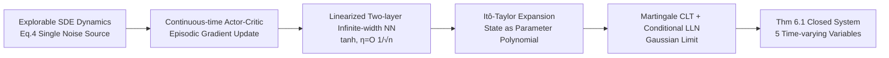

# From Ticks to Flows: Dynamics of Neural Reinforcement Learning in Continuous Environments

**Conference**: ICLR 2026  
**OpenReview**: [https://openreview.net/forum?id=TdiRLe3rPA](https://openreview.net/forum?id=TdiRLe3rPA)  
**Code**: To be confirmed  
**Area**: reinforcement learning / continuous control theory  
**Keywords**: Continuous-time RL, Actor-Critic, Stochastic Differential Equations, Infinite-width neural networks, Itô-Taylor expansion, Two-timescale  

## TL;DR
This paper models deep RL for continuous control as a continuous-time stochastic process. By introducing two timescales—the "environment clock" and the "gradient clock"—and employing Itô-Taylor expansion with linearized infinite-width networks, it derives the first equations for the infinitesimal evolution of the state distribution at each gradient step, ultimately simplifying the process into a closed system with only five time-varying variables.

## Background & Motivation
**Background**: Neural networks have significantly driven the success of deep RL (especially Actor-Critic algorithms) in simulated games and robotic control. In supervised learning, mature theories (NTK, infinite-width limits, parameter distribution evolution) explain why over-parameterized networks are effective.

**Limitations of Prior Work**: However, the success of deep RL remains a theoretical "black box"—particularly for continuous state/action control tasks, where theoretical analysis involving neural network function approximation is scarce. **Key Challenge**: In supervised learning, the data distribution is fixed, allowing for clean study of parameter evolution per gradient step. In RL, the data distribution itself changes with policy (parameter) updates; the state distribution is coupled with the parameters, making it impossible to directly apply supervised learning theories.

**Goal**: Characterize how the state distribution of an Actor-Critic agent changes locally during the learning process in response to gradient updates—not by describing the global evolution of the entire environment trajectory, but by describing the infinitesimal changes brought by "each small gradient step."

**Key Insight**: **[Two-timescale modeling]** Drawing from the philosophy in stochastic control that "describing instantaneous change is easier than describing global evolution," the agent's state is viewed as being driven by two clocks simultaneously—a fast "environment clock" (moving from 0 to horizon $T$) and a slow "gradient clock" (moving only $\eta$ per step). **[Infinite-width Linearization + Itô-Taylor]** By using linearized two-layer infinite-width networks to express states as polynomials of parameters, combined with the Gaussianity of network outputs, the authors derive non-parametric evolution equations across the two timescales.

## Method

### Overall Architecture
The paper presents a theoretical derivation chain: it first formalizes continuous control RL as an "explorable" Stochastic Differential Equation (SDE) model, provides a continuous-time Actor-Critic gradient update algorithm, utilizes linearized infinite-width networks as analytically tractable proxy models, and finally uses Itô-Taylor expansion and the Martingale Central Limit Theorem to derive a closed-form system of equations for how "state/action/value change within a single gradient step."

### Key Designs

**1. Explorable Stochastic Dynamics: Synthesizing policy noise and environmental noise into a single source.** The paper defines continuous-time RL on a control-affine MDP, where states evolve according to the SDE $ds_t = (g(s_t)+h(s_t)a_t)dt + \sigma(s_t)dw_t$. To ensure the agent actually explores, the authors introduce an exploratory SDE with both policy noise $w'_t$ and environmental noise $w_t$, and prove (Lemma 3.1) that for $d_s=d_a=1$, it is distributionally equivalent to a dynamics with **only a single noise source** $d\tilde s^\pi_t = (g+h\pi)dt + \sqrt{h(\tilde s)^2+\sigma(\tilde s)^2}\,dw_t$ (Eq.4). The significance of this step is that it corrects the relaxed-control formulation of Wang et al. (2020)—where policy stochasticity disappears in deterministic environments ($\sigma\equiv0$)—whereas the exploratory dynamics here maintain exploration even in deterministic settings. Meanwhile, the single noise source makes subsequent discrete numerical simulations and neural network analysis tractable.

**2. Continuous-time Episodic Actor-Critic: Driving continuous-time gradients with temporal-difference residuals.** Building on the exploratory dynamics, the authors adapt the continuous-time policy gradient of Jia & Zhou to provide Actor and Critic updates under a deterministic policy (Eq.5). The core is a continuous-time TD-error residual $\delta = \partial_t v + r - \beta v$ (expressing the Bellman residual as a partial derivative with respect to time). Both policy and value gradients take the form of discounted integrals $\int_0^T e^{-\beta l}\,\partial_\theta(\cdot)\,\delta\,dl$. Algorithm 1 performs stochastic updates on a discrete grid using single trajectories (episodic RL), structured similarly to a coagent network. This update explicitly separates the "integration over environment time" from the "parameter movement in gradient time," paving the way for the two-clock analysis.

**3. Linearized Two-layer Infinite-width Networks: Making policy/value analytical polynomials of parameters.** Both Actor and Critic use two-layer tanh networks $F(s;W,C)=\frac{1}{\sqrt n}\sum_\kappa C_\kappa \phi(W_\kappa\cdot s)$, training only the first layer $W$ while fixing the output layer $C$, and linearizing around the initialization $W^0$: $F^{lin}_\pi(s;W)=F_\pi(s;W^0)+\Phi(s;W^0)(W-W^0)$. Tanh is chosen for its symmetry and smoothness (ensuring differentiable dynamics), with a learning rate $\eta=O(1/\sqrt n)$. This step makes the policy linear with respect to $W$ but non-linear with respect to $s$ and $W^0$, allowing the state variables to be expanded as polynomials of the parameters—the foundation for the entire analytical theory.

**4. Itô-Taylor Expansion + Martingale CLT: Reducing single gradient step changes to a five-variable closed system (Core Conclusion Thm 6.1).** This is the main result. The state random variable, via Itô-Taylor expansion, can be written as an (infinite) polynomial of $W^\tau-W^0$. Applying the Martingale CLT and the Law of Large Numbers to the value, action, and their derivatives reveals that their changes within a single gradient step ($\Delta v_{t,\tau}, \Delta v'_{t,\tau}, \Delta a_{t,\tau}, \Delta a'_{t,\tau}$) are **Gaussian** (mean as discounted integrals, variance proportional to $(\Delta s_{t,\tau})^2$), with error $O(1/\sqrt n)$. The change in state itself is $\Delta\tilde s_{t,\tau}=\eta Z_{t,\tau}-M_{t,\tau}+G_{t,\tau}+O(1/n)$. **Key Insight**: The evolution of these auxiliary variables depends on $\Delta s$ and the TD-error term $q_{l,\tau}=v'_{l,\tau}+r-\beta v_{l,\tau}$, while the change in state depends only on $q$ and these five variables themselves—thus the system is **closed**. The single-step gradient dynamics is determined by five time-varying variables (state, action, action derivative, value, value time-derivative). Notably, $\Delta s_{t,\tau}$ is not of order $O(\eta)$ due to divergent terms from environmental stochasticity (though its random part has zero mean).

## Key Experimental Results

As a theoretical paper, the experiments serve to "corroborate" rather than "beat SOTA," validated on a toy continuous control task (LQR).

### Exploration Dynamics Validation

| Setting | Phenomenon |
|------|------|
| Additive Wiener noise $\pi(s_t)+w_t$ (Deterministic environment $\sigma=0$) | Smooth trajectories, **insufficient exploration**, poor state-action coverage |
| Ours exploratory dynamics (Eq.4) | Shows stochastic jumps, better state-action coverage; smooth convergence to mean trajectory as $\Delta t\to 0$ |

### Main Results: Episodic Continuous-time Actor-Critic
LQR Environment: $g(s)=s, h(s)=1, \sigma(s)=0.1$, exploration noise $\times 0.05$, $\beta=0.1$, $s_0=2.0$, action range $[-5,5]$, $r(s)=-500s^2$ (driving back to origin), $\Delta t=0.02, T=1$ (50 steps per episode), results averaged over 20 random seeds.

| Dimension $d_s$ | Result |
|-----------|------|
| 1 / 2 / 8 / 32 | Agents across all dimensions learned **near-optimal policies** |

### Key Findings
- **Theoretical Model vs. Real Algorithm**: Curves simulated using the theoretical model in Thm 6.1 (black dashed lines) show **high alignment** with actual measurements from online episodic Actor-Critic (Algorithm 1), directly validating the theorem’s characterization of gradient-time dynamics.
- The exploratory dynamics maintain effective exploration in deterministic environments compared to additive noise schemes.

## Highlights & Insights
- **The "Two Clocks" metaphor is highly explanatory**: Explicitly splitting RL learning into a fast environment clock and a slow gradient clock cleanly separates the core difficulty of deep RL theory—that "data distribution changes with parameters."
- **The "Five-variable closed system" is a startling simplification**: Starting from infinite-width over-parameterized networks, the final single-gradient-step dynamics depend on only 5 time-varying variables, suggesting that complex neural RL conceals a simple structure derived from fundamental principles of probability and stochastic processes.
- **First derived gradient-time evolution equations for state distributions in continuous RL** (under vanishing learning rates), building a bridge between stochastic control and modern over-parameterized RL.
- Corrected the degradation of existing exploratory dynamics (relaxed control) in deterministic environments, with a single-noise-source equivalent formulation that is practical for both theory and discrete simulation.

## Limitations & Future Work
- **Dimensionality constraints**: The core theorem is provided for $d_s=d_a=1$. Higher dimensions introduce $d_s\times d_s$ coupling terms, significantly increasing proof complexity; this is left for future work.
- **"Lazy regime" assumption**: Linearization and infinite width lock the analysis in the lazy regime—where features remain unchanged and the learning rate is relatively slow—distancing the theory from real-world feature learning scenarios.
- **Strong assumptions**: Relies on smooth dynamics, single hidden layer, asymptotic width, and smooth activations like tanh. Extensions to finite width, non-smooth activations, partial observability, and richer continuous control benchmarks are natural next steps.
- Experiments are limited to toy LQR, lacking end-to-end validation on complex environments (e.g., MuJoCo); convergence and regret analysis are not yet expanded.

## Related Work & Insights
- **Continuous-time RL**: Built on the continuous-time RL frameworks of Doya and Jia & Zhou (2022/2023), providing a contrast and correction to relaxed-control exploration (Wang et al. 2020).
- **Neural Network Theory**: Borrows from NTK / infinite-width linearization (Jacot et al. 2018; Lee et al. 2019) and over-parameterization convergence theories (Allen-Zhu et al. 2019; Arora et al. 2019) to express networks in analytical forms.
- **Stochastic Approximation ODE Perspective**: Complementary to Borkar & Meyn’s ODE method and analyses of learning dynamics in parameter space, but the innovation here lies in characterizing the evolution of the **state distribution** in gradient time rather than parameter trajectories.
- **Insight**: This approach of "reducing over-parameterized network learning in RL to a closed system of a few random variables" provides a template for designing simpler theoretical models of deep RL and even deriving algorithmic improvements from theory.

## Rating
- **Novelty**: ⭐⭐⭐⭐⭐ First to derive gradient-time evolution equations for state distributions in continuous RL. The "two-clock + 5-variable closed system" framework is a fresh perspective in deep RL theory.
- **Experimental Thoroughness**: ⭐⭐⭐ As a purely theoretical paper, experiments serve only as corroboration. Validated alignment between theory and algorithm on toy LQR, but lacks complex environments and quantitative convergence/regret analysis.
- **Writing Quality**: ⭐⭐⭐⭐ Clear derivation logic (equipped with a proof flowchart) and intuitive two-clock metaphor; however, the dense SDE/Itô-Taylor notation presents a high barrier to entry.
- **Value**: ⭐⭐⭐⭐ Provides a new paradigm for theoretical analysis of continuous control deep RL, bridging stochastic control and over-parameterized RL. High foundational significance for the theoretical community; practical value awaits realization in future work.

<!-- RELATED:START -->

## Related Papers

- [\[ICLR 2026\] Value Flows](value_flows.md)
- [\[ICLR 2026\] Continuous-Time Value Iteration for Multi-Agent Reinforcement Learning](continuous-time_value_iteration_for_multi-agent_reinforcement_learning.md)
- [\[ICLR 2026\] Neural+Symbolic Approaches for Interpretable Actor-Critic Reinforcement Learning](neuralsymbolic_approaches_for_interpretable_actor-critic_reinforcement_learning.md)
- [\[ICLR 2026\] Flowing Through States: Neural ODE Regularization for Reinforcement Learning](flowing_through_states_neural_ode_regularization_for_reinforcement_learning.md)
- [\[ICLR 2026\] Safe Continuous-time Multi-Agent Reinforcement Learning via Epigraph Form](safe_continuous-time_multi-agent_reinforcement_learning_via_epigraph_form.md)

<!-- RELATED:END -->
