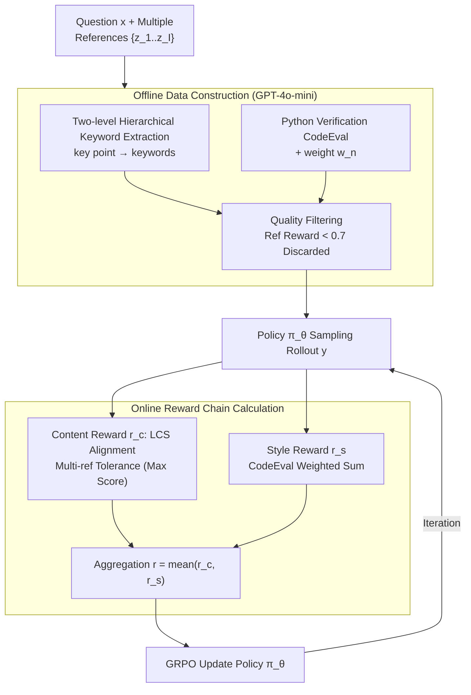

# From Verifiable Dot to Reward Chain: Harnessing Verifiable Reference-based Rewards for RL of Open-ended Generation

**Conference**: ICLR 2026  
**arXiv**: [2601.18533](https://arxiv.org/abs/2601.18533)  
**Code**: [https://github.com/YJiangcm/RLVRR](https://github.com/YJiangcm/RLVRR)  
**Area**: Reinforcement Learning / LLM Alignment  
**Keywords**: RLVR, Open-ended Generation, Reward Chain, Verifiable Reward, GRPO

## TL;DR

This paper proposes the RLVRR framework, extending RLVR (Reinforcement Learning with Verifiable Rewards) from mathematical and code reasoning to open-ended text generation. By extracting keyword sequences (content reward) and executable Python check functions (style reward) from high-quality reference answers, it constructs a "Reward Chain" to replace single-point verification signals. With only 10K data, it outperforms 100K SFT and advanced reward models across more than 10 benchmarks.

## Background & Motivation

**Background**: RLVR (e.g., DeepSeek-R1, GRPO) has achieved significant success in math and code generation by provide reward signals through checking the correctness of the final answer (a "verifiable dot"). Meanwhile, RLHF utilizes preference reward models to guide the alignment of open-ended generation tasks.

**Limitations of Prior Work**: (a) RLVR cannot be directly applied to open-ended generation as there is no unique correct answer, making single-point verification inapplicable. (b) RLHF reward models are prone to reward hacking (overfitting surface features) and require large-scale preference annotations, resulting in high training costs and instability.

**Key Challenge**: Open-ended generation requires evaluating multi-dimensional quality (content integrity, format, style), yet lacks deterministic verification signals similar to those found in mathematical answers.

**Goal**: Design a method to automatically extract multi-dimensional verifiable signals from reference answers, enabling the RLVR paradigm to extend to open-ended generation.

**Key Insight**: Treat reference answers as "sources of rules." Just as mathematical reasoning derives rules from ground truth, this approach extracts ordered linguistic signals (reward chains) from high-quality references, upgrading single-point supervision to chain-style supervision.

**Core Idea**: Decompose reference answers into keywords (content) and Python verification functions (style). Rule-based rewards from these two verifiable dimensions are used to replace traditional reward models.

## Method

### Overall Architecture

RLVRR addresses the limitation where the "single verifiable dot" paradigm of RLVR only functions for math or code. Since open-ended generation lacks a unique correct answer, single-point verification is unfeasible. The proposed solution treats the high-quality reference answer $z$ as a "source of rules," decomposing it offline into a sequence of verifiable linguistic signals to guide online RL.

The framework consists of two stages. In the **Data Construction** stage (offline), given a question $x$ and a reference answer $z$, GPT-4o-mini extracts two types of signals: hierarchical keywords for the content dimension and executable Python checking code for the style dimension, followed by quality filtering. In the **RL Training** stage (online), the policy $\pi_\theta$ is optimized using GRPO. For each rollout $y$, content reward $r_c$ and style reward $r_s$ are calculated and aggregated into a total reward $r_\phi(x,y) = \mathcal{F}(r_c(x,y,z), r_s(x,y,z))$ (implemented as the mean of both). Essentially, the "single verification point" is replaced by a "reward chain" comprising keyword chains and style checks, upgrading supervision granularity from a point to a chain.

### Key Designs

**1. Hierarchical Keyword Extraction (Content Reward): Converting "Content Accuracy" into Verifiable Keyword Alignment**

Evaluating open-ended content lacks a standard answer for direct comparison, and using full-text similarity forces models to mimic phrasing, losing expressive freedom. RLVRR uses an LLM to extract $M$ key points (e.g., "explain risks," "refuse harmful requests") from the reference, then extracts specific keywords (each <3 words) for each point. During reward calculation, the alignment between the rollout keyword sequence $K_y^m$ and the reference sequence $K_z^m$ is measured point-by-point using the Longest Common Subsequence (LCS):

$$r_c = \frac{1}{M}\sum_{m=1}^{M}\frac{\text{len}(\text{LCS}(K_z^m, K_y^m))}{\max(\text{len}(K_z^m), \text{len}(K_y^m))}$$

Hierarchical extraction ensures systematic coverage. LCS is used instead of bag-of-words to preserve the order and frequency of keywords, characterizing the structure more precisely. Extracted keywords account for only ~15% of the reference, allowing the model freedom in linguistic organization while focusing on core points.

**2. Python Verification Functions (Style Reward): Delegating "Style Constraints" to Deterministic Code**

Beyond content, open-ended responses must satisfy style constraints like length and Markdown formatting. RLVRR generates $N$ Python CodeEval functions (e.g., "check if length is within range," "check for Markdown headers") for each reference, each with a weight $w_n$. The style reward is the weighted sum of these checks:

$$r_s = \sum_{n=1}^{N} w_n \cdot \text{CodeEval}_n(y)$$

Deterministic code-based checks provide zero-cost, verifiable judgment that avoids the reward hacking or distribution drift associated with large-scale reward models.

**3. Multi-reference Fault Tolerance: Mitigating Single-reference Bias**

A single reference may not represent the only reasonable way to answer. RLVRR supports using $I=3$ reference answers simultaneously, taking the maximum alignment score across references for each key point. This "hits any reasonable version" approach improves consistency and robustness.

### Loss & Training

- **Optimization Algorithm**: Group Relative Policy Optimization (GRPO)
- **KL Divergence Constraint**: $\beta \mathbb{D}_{KL}[\pi_\theta || \pi_{ref}]$
- **Training Data**: 10K open-ended instruction-response pairs (filtered from 100K); GPT-4o-mini used for data construction.
- **Quality Filtering**: Samples with combined content and style rewards $< 0.7$ are discarded.

## Key Experimental Results

### Main Results

Comparison on 5 open-ended benchmarks using Qwen2.5-3B-Instruct:

| Method | Data Size | AlpacaEval2 (LC%) | ArenaHard (WR%) | MTBench | IFEval | FollowBench |
| :--- | :--- | :--- | :--- | :--- | :--- | :--- |
| SFT | 100K | 25.1 | 32.9 | 7.5 | 35.9 | 51.3 |
| RM (Skywork-8B) | 10K | 28.8 | 32.3 | 7.6 | 34.5 | 51.4 |
| GRM (GPT-4o-mini) | 10K | 27.1 | 28.7 | 7.4 | 35.2 | 50.9 |
| DPO | 10K | 24.8 | 28.8 | 7.5 | 35.5 | 49.5 |
| **RLVRR (Ours)** | **10K** | **31.5** | **36.2** | **7.7** | **36.8** | **53.1** |

Ours surpasses 100K SFT and 8B reward models across all metrics using only 10K data.

### Ablation Study

| Configuration | AlpacaEval2 | ArenaHard | Insight |
| :--- | :--- | :--- | :--- |
| Full RLVRR | 31.5 | 36.2 | Full framework |
| w/o Hierarchical Extraction | 30.6 | 35.0 | Hierarchy gain: +0.9 |
| w/o Style Reward | 29.8 | 33.1 | Style signal is effective |
| w/o Multi-reference (I=1) | 30.2 | 34.5 | Multi-ref improves robustness |
| BLEU as Reward | 24.3 | 27.5 | n-gram is inferior to keywords |
| Random Reward | 22.5 | 25.1 | Baseline |

### Key Findings

- **Efficiency**: RLVRR adds negligible computational overhead (+0.71% compared to random rewards), whereas loading a separate reward model incurs significant GPU memory and compute costs.
- **Unified RL**: RLVRR seamlessly integrates with RLVR, allowing for unified training across reasoning and open-ended tasks.
- **Diversity**: Analysis shows RLVRR improves quality while maintaining output diversity, avoiding the mode collapse often seen in SFT.
- **BLEU Limitations**: n-gram precision fails to capture critical content aligned with human preferences.

## Highlights & Insights

- **Conceptual Innovation**: The "Reward Chain" is a natural evolution of the RLVR paradigm. Keyword chains maintain deterministic verifiability while allowing expressive freedom, bridging the gap between SFT precision and RL exploration.
- **Reward Model Removal**: Replacing multi-billion parameter reward models with deterministic checks (regex, Python code) significantly reduces training instability and costs.
- **Data Efficiency**: Surpassing 100K SFT with 10K data demonstrates that the RL exploration mechanism is far more data-efficient than supervised learning for alignment.

## Limitations & Future Work

- **Reference Quality**: Keywords and style checks depend on the reference; poor or biased references will lead the model to learn incorrect patterns.
- **LLM Dependency**: Data construction relies on GPT-4o-mini; the effectiveness of open-source alternatives for extraction is unverified.
- **Surface-level Style**: Current checks focus on surface attributes (length, format). Deep style elements like tone and logical coherence are not yet captured by simple code.
- **Scalability**: Performance on models larger than 7B remains to be explored.

## Related Work & Insights

- **vs. RLHF/DPO**: RLHF requires preference data and reward models (costly/hackable); DPO is offline and lacks online exploration. RLVRR provides online exploration without a reward model.
- **vs. BLEU-as-reward**: BLEU lacks the ability to distinguish core concepts from filler text. RLVRR uses hierarchical keywords for precise concept capture.
- **vs. RLPR**: RLPR uses self-token probabilities as rewards, effective mainly for short answers, whereas RLVRR handles long-form generation.

## Rating

- **Novelty**: ⭐⭐⭐⭐ The "Reward Chain" concept is novel, though content rewards via keyword matching are an incremental technical step.
- **Experimental Thoroughness**: ⭐⭐⭐⭐⭐ Comprehensive evaluation on 10+ benchmarks, multiple models, and detailed efficiency/diversity analyses.
- **Writing Quality**: ⭐⭐⭐⭐ Clear narrative with an intuitive "dot to chain" analogy.
- **Value**: ⭐⭐⭐⭐⭐ Highly practical, providing a low-cost, scalable RL training solution for tasks without standard answers.

<!-- RELATED:START -->

## Related Papers

- [\[ICLR 2026\] Rubrics as Rewards: Reinforcement Learning Beyond Verifiable Domains](rubrics_as_rewards_reinforcement_learning_beyond_verifiable_domains.md)
- [\[ICLR 2026\] Towards High Data Efficiency in Reinforcement Learning with Verifiable Reward](towards_high_data_efficiency_in_reinforcement_learning_with_verifiable_reward.md)
- [\[ICLR 2026\] Reinforcement Learning with Verifiable Rewards Implicitly Incentivizes Correct Reasoning in Base LLMs](reinforcement_learning_with_verifiable_rewards_implicitly_incentivizes_correct_r.md)
- [\[ICLR 2026\] LongRLVR: Long-Context Reinforcement Learning Requires Verifiable Context Rewards](longrlvr_long-context_reinforcement_learning_requires_verifiable_context_rewards.md)
- [\[ICLR 2026\] QuRL: Rubrics As Judge For Open-Ended Question Answering](qurl_rubrics_as_judge_for_open-ended_question_answering.md)

<!-- RELATED:END -->
## Related Papers

- [\[ICLR 2026\] LongRLVR: Long-Context Reinforcement Learning Requires Verifiable Context Rewards](longrlvr_long-context_reinforcement_learning_requires_verifiable_context_rewards.md)
- [\[ICLR 2026\] Rubrics as Rewards: Reinforcement Learning Beyond Verifiable Domains](rubrics_as_rewards_reinforcement_learning_beyond_verifiable_domains.md)
- [\[ICLR 2026\] Towards High Data Efficiency in Reinforcement Learning with Verifiable Reward](towards_high_data_efficiency_in_reinforcement_learning_with_verifiable_reward.md)
- [\[ICLR 2026\] Reinforcement Learning with Verifiable Rewards Implicitly Incentivizes Correct Reasoning in Base LLMs](reinforcement_learning_with_verifiable_rewards_implicitly_incentivizes_correct_r.md)
- [\[ICLR 2026\] RLVMR: Reinforcement Learning with Verifiable Meta-Reasoning Rewards for Robust Long-Horizon Agents](rlvmr_reinforcement_learning_with_verifiable_meta-reasoning_rewards_for_robust_l.md)

<!-- RELATED:END -->
