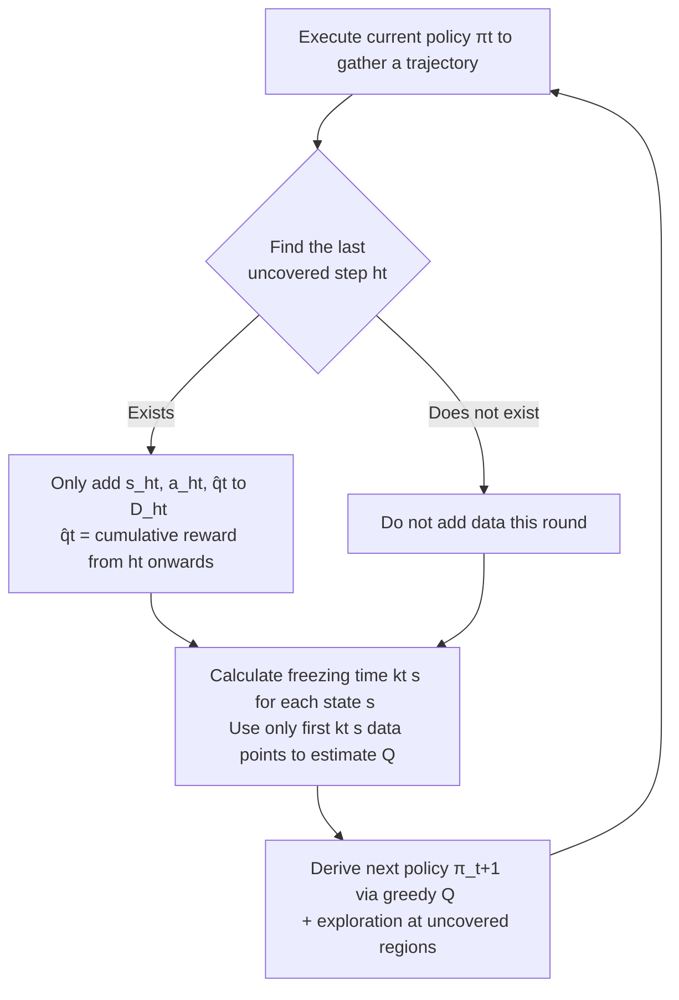

# Frozen Policy Iteration: Computationally Efficient RL under Linear $Q^{\pi}$ Realizability for Deterministic Dynamics

**Conference**: ICLR 2026  
**OpenReview**: [https://openreview.net/forum?id=kW0SudrQEQ](https://openreview.net/forum?id=kW0SudrQEQ)  
**Code**: To be confirmed  
**Area**: RL Theory / Linear Function Approximation  
**Keywords**: linear $Q^\pi$ realizability, policy iteration, online RL, regret bound, deterministic dynamics  

## TL;DR
Under the mild assumption that "the Q-function of any policy is linearly representable" (linear $Q^\pi$ realizability), this paper proposes **Frozen Policy Iteration (FPI)**—the first computationally and statistically efficient online RL algorithm without a simulator for deterministic MDPs. It achieves a regret of $\tilde O(\sqrt{d^2 H^6 T})$, answering an open problem posed by Weisz et al. (2023).

## Background & Motivation
**Background**: When approximating RL value functions with linear features, there are two core structural assumptions. One is **linear Bellman completeness** (the Bellman backup of a linear Q-function remains linear), which naturally fits value-iteration-type algorithms (e.g., FQI); recent works have bridged its "computational-statistical" gap. The other is **linear $Q^\pi$ realizability** (the $Q^\pi$ of any policy $\pi$ is linear in the given features), which fits policy-iteration-type algorithms (e.g., LSPI).

**Limitations of Prior Work**: $Q^\pi$ realizability possesses a desirable property lacking in Bellman completeness: **monotonicity**. Adding dimensions to features never destroys realizability (whereas it might break Bellman completeness, as noted by Chen & Jiang 2019). This is crucial for modern RL with large-scale neural networks. Paradoxically, the "computational-statistical" gap under $Q^\pi$ realizability remained largely unsolved: Weisz et al. (2023) provided the first polynomial sample complexity algorithm but relied on maintaining a complex version space, making it **computationally infeasible**; Mhammedi (2025) relies on a cost-sensitive classification oracle that is NP-hard in the worst case; other polynomial-time algorithms (Du 2019, Lattimore 2020, Yin 2022, Weisz 2022) all require **(local) access to a simulator**—the ability to restart and resample from any visited state.

**Key Challenge**: Simulator resampling is the lifeblood of these policy-iteration algorithms. Before adding $(s,a)$ to a dataset, they must perform repeated rollouts from $(s,a)$ to ensure successor states are sufficiently explored; if a new under-explored state emerges, the entire process restarts. However, in **online RL with random initial states**, where the state space is large, the agent may **never encounter the same state twice**, making resampling impossible.

**Goal**: In the online RL setting (random initial states, stochastic rewards, deterministic transitions), provide the first $Q^\pi$ realizability algorithm that is both computationally and statistically efficient **without requiring a simulator**.

**Core Idea**: **"Freezing + High-confidence segments"**—only feeding high-confidence parts of trajectories into the dataset and **freezing** policies for states that are already sufficiently explored. This ensures all data used by the algorithm remains "effectively on-policy" throughout learning, bypassing the need for resampling.

## Method

### Overall Architecture
FPI follows the skeleton of approximate policy iteration (maintaining step-wise datasets $D_h$, estimating $Q$ via least squares, and deriving greedy policies) but introduces two key modifications to eliminate off-policy data: **(1) Only the first "under-explored" state-action pair in a trajectory is added to the dataset**, while the rest are discarded; **(2) Once a state is sufficiently covered by the dataset, its policy is frozen** and no longer updated. The paper presents a PAC version (Algorithm 1) followed by a regret-minimization version (Algorithm 2) with multi-accuracy levels.

### Key Designs

**1. Elliptical Confidence Coverage (Cover): A unified metric for reliability and exploration.** Given dataset $D=\{(s_i,a_i,q_i)\}_{i=1}^n$ for step $h$, define the regularized empirical covariance $\Sigma=\lambda I+\sum_i \phi(s_i,a_i)\phi(s_i,a_i)^\top$, and characterize the "reliable region" as state-action pairs with small elliptical norms: $\mathrm{Cover}(D,\varepsilon)=\{(s,a):\|\phi(s,a)\|_{\Sigma^{-1}}\le\varepsilon\}$. Intuitively, the least-squares estimation error for $(s,a)$ in $\mathrm{Cover}$ is bounded by $\varepsilon$. The policy $\pi_t$ is defined accordingly: if **all** actions for a state $s$ are in $\mathrm{Cover}$, it takes the greedy action based on estimated $Q_t$; otherwise, there exists some $(s,a)\notin\mathrm{Cover}$, and that action is chosen for **exploration**. This unifies "greedy for trust, exploration for uncertainty" using an elliptical metric.

**2. Storing Only High-confidence Segments: Eliminating off-policy contamination at the source.** Upon receiving a trajectory, let $h_t=\max\{h:(s_h^{(t)},a_h^{(t)})\notin\mathrm{Cover}(D_{t,h},\varepsilon)\}$, which is the **last** under-covered step. Only $(s_{h_t}^{(t)},a_{h_t}^{(t)},\hat q_t)$ is added to $D_{h_t}$, where $\hat q_t=\sum_{h\ge h_t} r_h^{(t)}$ is the cumulative reward from $h_t$; all other steps are discarded. The reasoning is: for all steps $h>h_t$, by the definition of $\pi_t$, all their actions are covered, meaning $\pi_t$ is already near-optimal at these successor states, and $\hat q_t$ is a reliable estimate for $(s_{h_t},a_{h_t})$. Since $a_{h_t}^{(t)}$ itself may be a sub-optimal exploration action, only it is kept. Combined with the standard elliptical potential lemma, the size of each $D_h$ is upper-bounded by $D=\tfrac{2d}{\varepsilon^2}\ln(1+4\varepsilon^{-4}/\lambda^2)$, ensuring polynomial time/space.

**3. Freezing High-confidence States: Keeping historical data "always on-policy".** Even if only high-confidence segments are stored, using **all** data in $D_{t,h}$ for least squares could still allow the policy of covered states to change in later rounds, mixing different policies' returns into the dataset. FPI's novel trick is defining a **freezing time** for each state $s$:

$$k_t(s)=\min\Big\{k:(s,a)\in\mathrm{Cover}\big(\{(s_{h,i},a_{h,i},q_{h,i})\}_{i=1}^{k},\varepsilon\big)\ \forall a\in A\Big\}\wedge|D_{t,h}|,$$

which is the index of the data point that first causes all actions of $s$ to be covered. Then, $Q$ is estimated using **only the first $k_t(s)$ data points**: $Q_t(s,a)=\tilde Q_{k_t(s)}(s,a)$, where $\tilde Q_k(s,a)=\langle\phi(s,a),\Sigma_{h,k}^{-1}\sum_{i\le k}\phi_{h,i}q_{h,i}\rangle$. This effectively **freezes** the policy for $s$ once it is sufficiently covered. Lemma 2 proves that once $(s,a)$ enters the dataset, its $Q$-value under any subsequent policy $\pi_{t'}$ remains unchanged—formalizing the intuition that data remains "on-policy," which is critical for the concentration (Lemmas 3-4) and sub-optimality analysis (Lemmas 5-6).

**4. Regret Minimization via Multi-accuracy Layers (FPI-Regret).** The PAC version uses a fixed $\varepsilon$, which is insufficient for $\sqrt{T}$ regret. Algorithm 2 maintains a set of datasets $D_h^{(l)}$ and policies $\pi_t^{(l)}$ indexed by accuracy level $l$ (with coverage threshold $2^{-l}$). It checks coverage conditions $I_t^{(l)}$ layer-by-layer along the trajectory, exploring at the first level that fails and freezing/greedy-acting at levels that succeed. Leveraging an accuracy-level framework similar to He et al. (2021) (adapted from value-iteration to policy-iteration), it achieves $\tilde O(\sqrt{d^2 H^6 T})$ regret (which degrades to the **optimal** bound for linear contextual bandits when $H=1$) and extends to Uniform-PAC guarantees and function classes with bounded Eluder dimension.

## Key Experimental Results

### Main Results Setting
- Environments: OpenAI Gym **CartPole-v1** and **InvertedPendulum-v4** (deterministic dynamics, random reset, fitting the assumptions perfectly).
- Features: Tile coding with 4 tiles per dimension; InvertedPendulum actions discretized to 4 with 60 steps per episode.
- Hyperparameters: $\lambda=10^{-3}$, $\varepsilon=1$; to save memory, only the 20 most recent $\Sigma_{h,k}$ are kept per $h$. Results averaged over 5 random seeds with 95% confidence intervals.

### Ablation Study (Impact of Freezing)

| Environment | FPI (with freezing) | w/o freezing (using all data for Q) |
|------|--------------|-------------------------------|
| CartPole-v1 | Converges to higher reward (~300) | Significantly lower and more unstable |
| InvertedPendulum-v4 | Higher, more stable reward | Lower performance |

### Key Findings
- **Freezing is effective**: Learning curves for both tasks degraded significantly without the freezing operation, validating that "freezing keeps data on-policy" is not just a theoretical requirement but also provides empirical performance gains.
- This is a **proof-of-concept** implementation intended to demonstrate the algorithm's feasibility and isolate the contribution of freezing, rather than to beat SOTA.

## Highlights & Insights
- **Paradigm shift away from simulators**: While previous PI algorithms relied on "resampling the same state" to ensure on-policy data, this work uses "storing high-confidence segments + freezing" to ensure on-policy validity from the data construction level, completely removing the hard dependency on a simulator.
- **Answering an open problem**: Weisz et al. (2023) explicitly listed "polynomial-time algorithms under $Q^\pi$ realizability" as an open problem; this work provides a positive answer for deterministic transitions.
- **Tightness of bounds**: The regret reduces to the optimal bound for linear contextual bandits when $H=1$, indicating the correct dependency on $T$ and $d$.
- **Elegant unification of theory and implementation**: The algorithm is simple enough to run directly on Gym, yet the theoretical analysis (Lemmas 1-6) is rigorous and coherent.

## Limitations & Future Work
- **Strong dependency on deterministic transitions**: The analysis relies on the fact that "after storing $(s,a)$, the entire subsequent trajectory falls within the high-confidence region," which cannot be guaranteed under stochastic transitions. Extending this to stochastic dynamics is a non-trivial challenge.
- **High dependency on $H$**: The $H^6$ factor in regret/Uniform-PAC primarily stems from the accuracy-level framework used to ensure optimal actions are preserved across levels. Improving $H$ dependency is future work.
- **Scale of experiments**: Only verified on two simple control tasks as a proof-of-concept; large-scale comparisons with deep RL baselines are missing, and tile coding features are relatively rudimentary.
- **Dependency on random initial states**: While the algorithm allows for adversarial initial states, exploration efficiency still benefits from the state diversity provided by the initial distribution.

## Related Work & Insights
- **Linear $Q^\pi$ realizability lineage**: Du 2019, Lattimore 2020, Yin 2022, Weisz 2022 (require generative model / local access), Weisz 2023 (online but computationally infeasible), Mhammedi 2025 (oracle may be NP-hard)—this work distinguishes itself in Table 1 as "online RL + computationally efficient + regret guarantee."
- **Linear Bellman completeness**: Works like Zanette 2020, Wu 2024, and Golowich & Moitra 2024 bridged the gap for Bellman completeness, providing inspiration, though Bellman completeness lacks monotonicity.
- **Uniform-PAC and accuracy-level framework**: The value-iteration framework from He et al. (2021) was adapted to the policy-iteration context in this work.
- **Eluder Dimension**: Use of the bounded Eluder dimension (Russo & Van Roy 2013) allows results to generalize from linear approximation to more general function classes.
- **Insight**: "Using confidence coverage + freezing to artificially maintain on-policy properties" is a transferable strategy—any scenario lacking a simulator and fearing off-policy drift could benefit from this "only trust high-confidence, lock what is learned" data governance approach.

## Rating
- **Novelty**: ⭐⭐⭐⭐⭐ Solves the open problem by Weisz et al. (2023); "freezing + high-confidence segments" is a genuine methodological innovation for bypassing simulators.
- **Experimental Thoroughness**: ⭐⭐⭐ Proof-of-concept ablations on two simple tasks; sufficient to validate theory but limited in scale (acceptable for a theory paper).
- **Writing Quality**: ⭐⭐⭐⭐⭐ Clear and rigorous motivation, comparative tables (Table 1), and lemma chains.
- **Value**: ⭐⭐⭐⭐ Advances the computational-statistical frontier in RL theory; long-term significance for online policy-iteration, though the deterministic constraint slightly limits immediate practical impact.

<!-- RELATED:START -->

## Related Papers

- [\[ICLR 2026\] Information-based Value Iteration Networks for Decision Making Under Uncertainty](information-based_value_iteration_networks_for_decision_making_under_uncertainty.md)
- [\[NeurIPS 2025\] Computational Hardness of Reinforcement Learning with Partial $q^\pi$-Realizability](../../NeurIPS2025/reinforcement_learning/computational_hardness_of_reinforcement_learning_with_partial_qπ-realizability.md)
- [\[ICLR 2026\] REA-RL: Reflection-Aware Online Reinforcement Learning for Efficient Reasoning](rea-rl_reflection-aware_online_reinforcement_learning_for_efficient_reasoning.md)
- [\[ICLR 2026\] Guided Policy Optimization under Partial Observability](guided_policy_optimization_under_partial_observability.md)
- [\[ICLR 2026\] A Unifying View of Coverage in Linear Off-Policy Evaluation](a_unifying_view_of_coverage_in_linear_off-policy_evaluation.md)

<!-- RELATED:END -->
