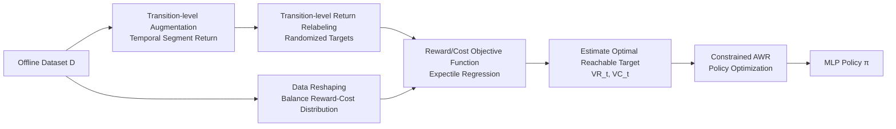

# GAS: Enhancing Reward-Cost Balance of Generative Model-assisted Offline Safe RL

**Conference**: ICLR 2026  
**OpenReview**: [https://openreview.net/forum?id=sGrrKMK0cn](https://openreview.net/forum?id=sGrrKMK0cn)  
**Code**: To be confirmed  
**Area**: Reinforcement Learning / Offline Safe RL  
**Keywords**: Offline Safe RL, Generative Models, Trajectory Stitching, Objective Function, Expectile Regression, Reward-Cost Trade-off  

## TL;DR
GAS enhances generative model-driven Offline Safe RL with trajectory stitching capabilities through objective functions, transition-level data augmentation/relabeling, and data reshaping. It automatically calibrates user-specified (potentially unreliable) reward-cost targets into the optimal reachable targets within the dataset that satisfy constraints, achieving higher safety under tight constraints and higher rewards under loose constraints.

## Background & Motivation
**Background**: Offline Safe RL (OSRL) aims to learn policies that maximize returns while satisfying safety constraints using only pre-collected data without online exploration. A mainstream approach recent years has been to reformulate decision-making as a "conditional generation" problem—exemplified by Decision Transformer—where generative models (GM) take reward-to-go $R_t$ and cost-to-go $C_t$ as input conditions to generate actions. This approach bypasses the OOD extrapolation issues of Bellman backup in traditional RL and offers flexibility by allowing zero-shot adaptation to different safety thresholds at test time.

**Limitations of Prior Work**: However, generative methods face two critical issues in constrained scenarios. First, they **lack trajectory stitching capabilities**—essentially being "goal-conditioned behavior cloning," they use attention to memorize history as context. Given a suboptimal history, the model simply replicates suboptimal actions, failing to combine superior segments from different trajectories as traditional RL does. Empirical findings show that increasing the memory length of CDT from $K=1$ to $K=10$ results in almost no performance change, suggesting that attention designed for NLP does not effectively capture temporal transitions in an MDP. Second, they **fail to balance reward maximization and constraint satisfaction**—CDT merely concatenates $\hat R$ and $\hat C$ into the context without a mechanism to judge feasibility. If a user specifies an unreachable high reward with a strict cost, the policy fails.

**Key Challenge**: The flexibility of generative methods stems from human-specified targets, but these targets often mismatch the optimal reachable targets in the dataset. This mismatch, coupled with the lack of stitching, leads to instability.

**Goal**: To retain the advantages of generative methods (avoiding Bellman backup, zero-shot adaptation) while adding trajectory stitching and automatically calibrating human targets to reachable optimal reward-cost targets.

**Core Idea**: **[Objective Functions as Intermediaries]** Instead of forcing the policy to directly reach human-specified targets, the framework first uses a set of "objective functions" to estimate optimal reachable reward-to-go and its corresponding cost-to-go given a state and target. This estimated optimal target then guides the policy. Objective functions are trained via expectile regression, entirely avoiding Bellman backup.

## Method

### Overall Architecture
GAS replaces the attention structure of CDT with a pure MLP for "transition-level stitching." The process consists of three steps: First, it performs **transition-level augmentation and relabeling** on offline data, allowing a state to "borrow" higher-reward or lower-cost segments from other transitions. Second, it uses **expectile regression to train reward/cost objective functions**, estimating the optimal reachable targets and feeding them into the policy via "constrained AWR." Finally, **data reshaping** is used to balance the highly skewed reward-cost distribution to stabilize training.

### Key Designs

**1. Temporal Segment Return Augmentation: Moving from "Full Trajectories" to "Arbitrary Intervals"** Standard $R_t$ and $C_t$ are returns accumulated from the current step to the end of the trajectory. However, valuable transitions often occur within small windows. GAS expands each transition into a family of cumulative returns for different window lengths: $(s_t,a_t,R_t,C_t)\to\{(s_t,a_t,R_{t:\Gamma},C_{t:\Gamma})\mid \Gamma=t,\dots,T\}$, where $R_{t:\Gamma}=r_t+\dots+r_\Gamma$ and $C_{t:\Gamma}=c_t+\dots+c_\Gamma$. This allows GAS to find superior segments from other transitions where $R_{t:\Gamma}>R_{t'}$ and $C_{t:\Gamma}\le C_{t'}$. This multiplies training data and enables more flexible cross-timestep stitching.

**2. Transition-level Return Relabeling: Exposing Objective Functions to Unbalanced Targets** The behavior cloning nature of generative methods causes performance drops when human targets at test time mismatch training inputs. GAS refines the trajectory-level relabeling of CDT to the transition level. For sampled transitions, it perturbs reward/cost targets randomly within a range: $\hat R_{t:\Gamma}=U((1-\delta)R_{t:\Gamma},(1+\delta)R_{t:\Gamma})$ and $\hat C_{t:\Gamma}=U(C_{t:\Gamma},C_{\max})$. Training with these randomized targets makes the objective functions robust to "incorrect" user inputs. Crucially, GAS does not update the policy directly with these relabeled values but transforms them into "intermediate optimal targets" via objective functions.

**3. Objective Functions with Expectile Regression: Estimating "Optimal Reachable Returns"** Conceptually, the optimal reward target should be $V^R_t(s,\hat R,\hat C)=\max_{(s_t=s,a_t,R_t,C_t)\sim D}R_t\cdot\mathbb{1}(C_t\le\hat C)$. However, a direct maximum is sensitive to "lucky" transitions in the data. GAS employs expectile regression: reward advantage is defined as $A^R_{t:\Gamma}=\mathbb{1}(V^C_{t:\Gamma}<\hat C_{t:\Gamma})\cdot R_{t:\Gamma}-V^R_{t:\Gamma}$, downweighting transitions that violate constraints. The loss $L^R=\mathbb{E}_{\hat D}[|\alpha-\mathbb{1}(A^R_{t:\Gamma}<0)|\cdot(A^R_{t:\Gamma})^2]$ forces $V^R$ to converge to the $\alpha$-expectile of "maximum reward return-to-go satisfying constraints." The cost objective function uses a different weighting to estimate the "cost corresponding to the optimal reward" rather than minimum cost: $L^C=\mathbb{E}_{\hat D}[|\alpha-\mathbb{1}(A^R_{t:\Gamma}<0)|\cdot(A^C_{t:\Gamma})^2]$, reusing the reward-side indicator to give larger weights to high-reward transitions.

**4. Constrained AWR Policy Guidance + Data Reshaping** Once optimal targets $V^R_{t:\Gamma}$ and $V^C_{t:\Gamma}$ are estimated, they are used as policy inputs. The policy is trained via a constrained version of Advantage Weighted Regression: $L_\pi=\mathbb{E}_{\hat D}[\mathbb{1}(V^C_{t:\Gamma}<\hat C_{t:\Gamma})\cdot|\alpha-\mathbb{1}(A^R_{t:\Gamma}<0)|\cdot(\pi(a\mid s_t,\hat R_{t:\Gamma},\hat C_{t:\Gamma},V^R_{t:\Gamma},V^C_{t:\Gamma},t')-a_t)^2]$, which only performs weighted regression on "safe and high-reward" transitions. To handle the data imbalance where most transitions are "low-reward low-cost," GAS utilizes data reshaping by upsampling transitions in the top $q\%$ of rewards for a given cost level, improving training stability.

## Key Experimental Results

### Main Results
Evaluated on Bullet-Safety-Gym and Safety-Gymnasium across 12 scenarios against 8 baselines (CPQ, COptiDICE, WSAC, VOCE, CDT, FISOR, CAPS, CCAC). Normalized cost threshold is set to 1 ($C\le 1$ is safe).

| Setting | Metric | CPQ | COptiDICE | CDT | FISOR | GAS |
|------|------|------|-----------|-----|-------|-----|
| Tight (10/20/30%) | Reward R↑ | 0.39 | 0.59 | 0.67 | 0.36 | **0.66** |
| Tight (10/20/30%) | Cost C↓ | 1.42 | 2.26 | 1.12(Fail) | **0.03** | **0.67(Safe)** |
| Loose (70/80/90%) | Reward R↑ | 0.52 | 0.63 | 0.80 | 0.36 | **0.86** |
| Loose (70/80/90%) | Cost C↓ | 0.60 | 0.50 | 0.76 | 0.03 | 0.87(Safe) |

Under tight constraints, only GAS achieved the "safe and optimal" balance across all tasks; while CDT had high rewards, it violated constraints in many scenarios, and FISOR was safe but suffered from heavily suppressed rewards. Under loose constraints, GAS achieved a reward of 0.86, significantly higher than CDT's 0.80, validating the advantage of stitching for reward maximization.

### Ablation Study
Ablations focus on the three main components (temporal segment augmentation, transition-level relabeling, and data reshaping). Findings: Removing stitching components leads to decreased safety under tight constraints; removing data reshaping leads to poor training stability. CDT's performance was virtually unchanged between $K=1$ and $K=10$, providing evidence that temporal attention is ineffective in OSRL, justifying the use of stitching.

### Key Findings
- The safety gain over CDT under tight constraints stems from stitching—GAS can sew together safe transitions across different time steps and trajectories. Under loose constraints, the **~6% reward gain** over CDT comes from stronger reward maximization.
- Changing $K$ from 1 to 10 in CDT does not improve results, proving that long-term attention is unnecessary in OSRL and that pure MLP stitching is more effective.
- GAS maintains zero-shot threshold adaptation and robustly handles imbalanced or human-specified targets.

## Highlights & Insights
- **Decoupling "Human Targets" from "Reachable Optimal Targets"**: Using an objective function as an intermediary is a clean insight—it avoids Bellman backup while providing stitching and avoiding the fragility of directly trusting user-specified targets.
- **Dual usage of expectile regression**: A single $\alpha$-expectile framework for both reward (optimal return) and cost (cost at optimal return) is a compact and theoretically sound design.
- **Empirical rebuttal of attention utility**: Proving that $K=10$ provides no benefit over $K=1$ justifies the simplification from Transformer to MLP based on evidence rather than intuition.
- **Addressing data imbalance via reshaping**: Explicitly identifying and upsampling ideal transitions targets a core difficulty in OSRL datasets.

## Limitations & Future Work
- The method introduces several hyperparameters ($\delta, \alpha, q, \epsilon$), and the sensitivity to these parameters is not fully explored.
- Evaluation is concentrated on simulated control tasks; generalizability to high-dimensional real-world OSRL like autonomous driving or robotics needs verification.
- Theoretical guarantees for objective functions rely on the implicit assumption of dataset coverage; performance may remain conservative if ideal transitions are extremely scarce.
- A direct comparison with concurrent works like COPDT (condition-generation with cost targets) is missing.

## Related Work & Insights
GAS sits at the intersection of generative offline RL and safety constraints. In generative offline RL, the Decision Transformer family treats decision-making as return-conditioned generation, with variants like QDT or WT using Q-values or expectile RTG to add stitching, but these focus on unconstrained settings. In safety-aware offline RL, CDT converts OSRL to target-conditioned generation, and FISOR uses feasibility-guided diffusion. GAS differentiates itself by "discarding attention in favor of MLP-based transition stitching guided by robust objective functions." This provides a roadmap for future work: when facing untrusted user targets in conditional generation, rather than improving the generator, one should insert an estimation layer to calibrate the reachable optimal target.

## Rating
- Novelty: ⭐⭐⭐⭐ Target calibration via objective functions and transition stitching in OSRL is novel and well-justified.
- Experimental Thoroughness: ⭐⭐⭐⭐ Solid evaluation across 12 scenarios and 8 baselines; well-motivated empirical evidence.
- Writing Quality: ⭐⭐⭐⭐ Clear logic from motivation to method; key concepts like the dual usage of expectile regression are well-explained.
- Value: ⭐⭐⭐⭐ Effectively addresses the "untrusted user target" problem in generative OSRL with a reproducible and concise method.

<!-- RELATED:START -->

## Related Papers

- [\[ICLR 2026\] Enhancing Generative Auto-bidding with Offline Reward Evaluation and Policy Search](enhancing_generative_auto-bidding_with_offline_reward_evaluation_and_policy_sear.md)
- [\[ICLR 2026\] P-GenRM: Personalized Generative Reward Model with Test-time User-based Scaling](p-genrm_personalized_generative_reward_model_with_test-time_user-based_scaling.md)
- [\[ICLR 2026\] ROMI: Model-based Offline RL via Robust Value-Aware Model Learning with Implicitly Differentiable Adaptive Weighting](model-based_offline_rl_via_robust_value-aware_model_learning_with_implicitly_dif.md)
- [\[ICLR 2026\] R1-Reward: Training Multimodal Reward Model Through Stable Reinforcement Learning](r1-reward_training_multimodal_reward_model_through_stable_reinforcement_learning.md)
- [\[ICLR 2026\] BA-MCTS: Bayes Adaptive Monte Carlo Tree Search for Offline Model-based RL](bayes_adaptive_monte_carlo_tree_search_for_offline_model-based_reinforcement_lea.md)

<!-- RELATED:END -->
