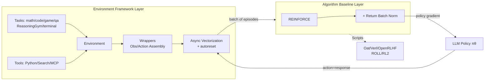

# GEM: A Gym for Agentic LLMs

**Conference**: ICLR 2026  
**OpenReview**: [https://openreview.net/forum?id=vsqQ1lG52a](https://openreview.net/forum?id=vsqQ1lG52a)  
**Code**: [https://github.com/axon-rl/gem](https://github.com/axon-rl/gem)  
**Area**: Reinforcement Learning / Agentic LLM / RL Environment Framework  
**Keywords**: agentic LLM, RL environment, multi-turn RL, REINFORCE, return normalization, tool use  

## TL;DR
GEM is an open-source "environment simulator" for the LLM agent era—comparable to OpenAI-Gym—providing a unified environment-agent interface, asynchronous vectorized execution, rich tools, and 24 standardized multi-turn environments. It also introduces a REINFORCE + Return Batch Normalization (ReBN) baseline algorithm compatible with dense step-wise rewards and arbitrary discount factors.

## Background & Motivation
**Background**: LLM training paradigms are shifting from static datasets to "experiential learning"—where agents acquire skills by interacting with complex environments. RL has become a mainstream method for enhancing LLM reasoning capabilities (e.g., OpenAI o1, DeepSeek-R1), but current research focuses largely on **single-turn tasks**, such as solving a math problem or retrieving a piece of information.

**Limitations of Prior Work**: Single-turn settings severely oversimplify real-world multi-turn interactions. Crucially, algorithms that perform excellently in single-turn settings (especially GRPO) **cannot be applied to full multi-turn problems**. GRPO relies on sampling a group of trajectories for the same state to perform group normalization; in multi-turn scenarios, performing such sampling at every turn (state) leads to an exponential explosion in complexity. A common industry compromise is to "treat the entire interaction as a single action," but this forces the discount factor to be fixed at $\gamma=1$ (losing the incentive to "solve as quickly as possible") and restricts learning to single trajectory-level rewards, discarding fine-grained step-wise credit assignment.

**Key Challenge**: To train agentic LLMs capable of long-term planning, trial-and-error, and iterative improvement, research must migrate to test platforms supporting multi-turn interactions. However, existing RL infrastructure (environment standards, algorithms) is tailored for single-turn/contextual bandits, lacking a unified foundation like OpenAI-Gym.

**Goal**: To provide "infrastructure" for the LLM agent era—unified environment interfaces + standardized environment suites + seamless integration with mainstream training frameworks + a simple, strong baseline compatible with full multi-turn RL settings.

**Core Idea**: **(1) Environment Standardization**—Replicate the OpenAI-Gym `reset()`/`step()` interface, composing "tasks × tools" into environments with asynchronous vectorization and modular wrappers; **(2)回归 action=response perspective**—Avoid the "entire interaction as action" compromise and use REINFORCE for policy gradients at the response granularity, augmented with Return Batch Normalization (a lightweight normalization) to remain compatible with dense rewards and arbitrary $\gamma$.

## Method

### Overall Architecture
GEM consists of two layers: the **Environment Framework Layer** providing Gym-style standard interfaces, seven task categories, three tool types (Python/Search/MCP), asynchronous vectorized execution, and stackable wrappers; and the **Algorithm Baseline Layer** offering REINFORCE + ReBN, a policy gradient method compatible with full multi-turn RL. The two layers are decoupled: the environment side "generates experience," while the training side can interface with five major frameworks (Oat, Verl, OpenRLHF, ROLL, RL2), each provided with single-file example scripts.

### Key Designs

**1. Unified Gym-style Interface + Task × Tool Assembly: Converging Heterogeneous LLM Tasks to `reset/step`** —— GEM strictly follows the OpenAI-Gym main interface: after obtaining initial observations via `env.reset()`, users loop through `next_obs, reward, terminated, truncated, info = env.step(action)`. It decomposes environments into two orthogonal components: tasks (covering Math, Math-with-image, Code, Game, QA, ReasoningGym, and Terminal) and tools (Python, Search, MCP). The key insight is that **adding tools to single-turn tasks automatically transforms them into multi-turn tasks**: tasks like Math or ReasoningGym that originally yield an answer in one step become multi-turn interactions ("call tool → see output → decide again") once tool calling is enabled.

**2. Asynchronous Vectorization + Autoreset: High-throughput Sampling and Correct Critic Learning** —— To collect experience efficiently, GEM executes vectorized environments in parallel via asynchronous tool calls. The autoreset mechanism automatically resets an environment after a trajectory is `terminated`, ensuring a continuous stream of data. Crucially, the `terminated` flag is used to **prevent value bootstrapping across episode boundaries**—ensuring that a critic does not incorrectly bootstrap returns from the end of one episode to the start of the next, thereby maintaining the correctness of multi-turn critic learning.

**3. action=response Perspective + REINFORCE: Bypassing Compromises** —— The paper compares three perspectives for integrating LLM-environment interactions into RL: ① action=single token (excessive episode length, difficult credit assignment); ② action=response (at the cost of multi-turn complexity if using GRPO); ③ action=entire interaction (forced $\gamma=1$ and trajectory-only rewards). GEM returns to **Perspective ② while retaining the multi-turn structure**: treating each response as an action and using the vanilla on-policy gradient REINFORCE:
$$J_{\text{REINFORCE}}(\theta)=\frac{1}{N}\sum_{n=1}^{N}\sum_{t=0}^{T^{(n)}-1} G_t^{(n)}\log\pi_\theta(a_t^{(n)}\mid s_t^{(n)}),\quad G_t=\sum_{k=t}^{T-1}\gamma^{k-t} r_k$$
where $s_t$ and $a_t$ are token sequences, and $G_t$ supports arbitrary $\gamma \le 1$ and dense rewards—something GRPO cannot achieve as its advantage $A_{\text{GRPO}}$ is a constant estimate shared across all turns.

**4. Return Batch Normalization (ReBN): Stable Fine-grained Advantage Without Critics or Exponential Sampling** —— Vanilla REINFORCE is sensitive to reward shaping. While A2C/PPO can use GAE for fine-grained advantages, they require training a critic, which is often unstable. ReBN uses the **returns of all transitions within a batch** for normalization to serve as the advantage:
$$A_{\text{ReBN},t}^{(n)}=\frac{G_t^{(n)}-\text{mean}(\mathcal{G})}{\text{std}(\mathcal{G})},\quad \mathcal{G}=\{G_t^{(n)}\}_{n\in[1,N],\,t\in[1,T^{(n)}-1]}$$
This retains the flexibility of REINFORCE while gaining stable, fine-grained advantage signals similar to a critic, without adding extra networks or requiring tree-like resampling.

## Key Experimental Results

### Main Results: 8-Environment Algorithm Benchmark (Qwen3-Base)
A head-to-head comparison of GRPO / PPO / REINFORCE / REINFORCE+ReBN on 8 representative GEM environments:

| Algorithm | Single-turn (rg) | Multi-turn Dense Reward (GuessTheNumber/Sudoku) | Overall Performance |
|-----------|------------------|-----------------------------------------------|---------------------|
| GRPO      | Decent           | **Significantly lags** (Poor credit assignment)| Only for single-turn|
| PPO (turn-level) | Average    | Best returns on long-range Sudoku (when stable)| Critic hard to train|
| Vanilla REINFORCE | Strong      | Prone to sub-optimal convergence             | Sensitive to shaping|
| **REINFORCE+ReBN (Ours)**| **Strong** | **Significantly outperforms vanilla** | **$\ge$ PPO/GRPO on all envs** |

### Key Findings
- **GRPO is fundamentally limited on multi-turn dense rewards**: Sharing a constant advantage across all turns leads to poorer performance as rewards become less sparse.
- **Consistent Gains with ReBN**: ReBN consistently improves vanilla REINFORCE across all tested environments without requiring critic learning.
- **Tool + RL Synergies**: RL fine-tuning significantly boosts performance, and adding tools (Python/Search) yields the highest scores in every environment.
- **$\gamma$ Matters**: Using the `GuessTheNumber` environment, the study demonstrates that $\gamma < 1$ is necessary to incentivize the optimal binary search strategy, whereas $\gamma = 1$ (as forced by interaction-level GRPO) fails to recover it.

## Highlights & Insights
- **"Environment Standardization" is the missing link**: While many focus on training frameworks, environment interfaces remain fragmented. GEM replicates the role of OpenAI-Gym for the LLM agent era.
- **"Task × Tool → Multi-turn" is an elegant design**: Instead of creating new tasks, adding tools to existing single-turn tasks (like the 100+ tasks in ReasoningGym) automatically enables multi-turn interaction dimensions.
- **Return to basics in algorithms**: While much of the field is adding tricks to GRPO, the authors demonstrate its fundamental incompatibility with multi-turn scenarios and show that classic REINFORCE with lightweight normalization provides a stronger baseline.

## Limitations & Future Work
- **ReBN as an Engineering Heuristic**: It is a practical normalization technique rather than a fundamental theoretical breakthrough; its success stems more from bypassing GRPO's limitations.
- **Under-explored Critic Route**: PPO achieved the best results on complex Sudoku, but the critic failed on Minesweeper. Robustly learning a multi-turn critic remains an open problem.
- **Grader Sensitivity**: Math scores are highly sensitive to the specific implementation of the grader (e.g., `math_verify`), making cross-paper absolute value comparisons difficult.

## Related Work & Insights
- **OpenAI-Gym (Brockman 2016)**: The direct spiritual predecessor; GEM aims to catalyze the LLM agent era just as Gym did for traditional RL.
- **GRPO (Shao 2024)**: The representative algorithm for single-turn verifiable reward RL; this paper systematically demonstrates its limitations in multi-turn dense reward settings.
- **Training Frameworks (Oat/Verl/OpenRLHF/ROLL/RL2)**: GEM integrates with these through a decoupled architecture, promoting an "environment and training are independent" paradigm.

## Rating
- **Novelty**: ⭐⭐⭐⭐ — Engineering integration of interfaces/tasks/tools is high-value; the perspective shift on GRPO incompatibility is insightful.
- **Experimental Thoroughness**: ⭐⭐⭐⭐⭐ — Comprehensive benchmarking across 24 environments and 4 major algorithms.
- **Writing Quality**: ⭐⭐⭐⭐ — Clear comparison of RL perspectives; well-structured motivations.
- **Value**: ⭐⭐⭐⭐⭐ — Fills a critical gap in LLM agent infrastructure with an open-source, multi-framework integrated foundation.

<!-- RELATED:START -->

## Related Papers

- [\[ICLR 2026\] Learn the Ropes, Then Trust the Wins: Self-imitation with Progressive Exploration for Agentic Reinforcement Learning](learn_the_ropes_then_trust_the_wins_self-imitation_with_progressive_exploration_.md)
- [\[ICLR 2026\] TIPS: Turn-Level Information-Potential Reward Shaping for Search-Augmented LLMs](tips_turn-level_information-potential_reward_shaping_for_search-augmented_llms.md)
- [\[ICLR 2026\] Reasoning Boosts Opinion Alignment in LLMs](reasoning_boosts_opinion_alignment_in_llms.md)
- [\[ICLR 2026\] Routing, Cascades, and User Choice for LLMs](routing_cascades_and_user_choice_for_llms.md)
- [\[ICLR 2026\] Reward is Enough: LLMs are In-Context Reinforcement Learners](reward_is_enough_llms_are_in-context_reinforcement_learners.md)

<!-- RELATED:END -->
