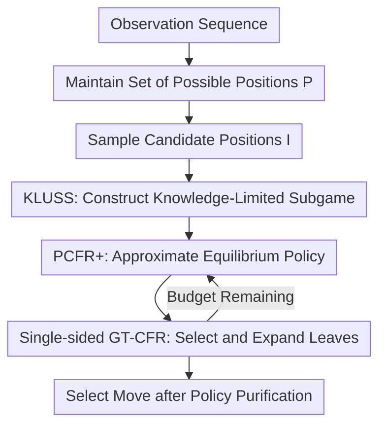

# General search techniques without common knowledge for imperfect-information games, and application to superhuman Fog of War chess

**Conference**: ICLR2026  
**OpenReview**: [https://openreview.net/forum?id=afaakBqkvb](https://openreview.net/forum?id=afaakBqkvb)  
**论文**: [OpenReview](https://openreview.net/forum?id=afaakBqkvb)  
**Code**: No public code available  
**Area**: Reinforcement Learning / Imperfect-Information Game Search  
**Keywords**: Imperfect-information games, subgame solving, Fog of War chess, CFR, game search  

## TL;DR
This paper proposes Obscuro, which extends real-time imperfect-information search to Fog of War chess by employing knowledge-limited subgame solving that avoids enumerating common knowledge sets, single-sided GT-CFR expansion, and policy purification, achieving superhuman performance in this game for the first time.

## Background & Motivation
**Background**: Games have always served as benchmarks for AI search capabilities. In perfect-information board games, search boundaries are clear: the current board state naturally defines a subgame where minimax, MCTS, or neural-network-guided search can expand forward. Imperfect-information games like Texas Hold'em also have successful paradigms for real-time subgame solving; systems such as Libratus and DeepStack demonstrate that constructing appropriate public subgames and re-solving during decision-time significantly improves policy quality.

**Limitations of Prior Work**: The difficulty of Fog of War (FoW) chess lies not in the chess search itself, but in the knowledge hierarchy caused by the "unseen." Players only see squares reachable by their own pieces, so a single observation may correspond to thousands of possible true positions. More problematically, subgame solving typically requires knowing what is mutually known. Traditional safe subgame solving constructs a gadget game around a common knowledge set, but in FoW chess, the common knowledge set can reach a magnitude of $10^{18}$, and even determining whether two histories belong to the same common knowledge set can be difficult. Consequently, the "enumerate public states, then solve" pipeline used in poker fails here.

**Key Challenge**: A strong FoW chess agent requires three things simultaneously: first, tactical foresight like in chess; second, the ability to maintain mixed strategies and bluffing like in poker; third, real-time decision-making as information sets rapidly expand and contract. These requirements conflict: focusing only on one's own possible positions ignores what the opponent knows, while assuming the opponent is omniscient loses the room for bluffing, and handling full common knowledge is entirely unscalable.

**Goal**: The authors aim to design a more general imperfect-information search technique that allows agents to perform real-time subgame solving in large-scale turn-based zero-sum games without enumerating common knowledge sets. Specifically for FoW chess, the goal is to maintain a set of possible positions from one's own perspective, sample a small number of representative states to construct solvable approximate imperfect-information subgames, and output an action distribution that possesses both tactical depth and stochasticity within a limited time.

**Key Insight**: The central observation is that higher-order knowledge ("I know that you know that I know...") is not always equally important for the current decision. If certain states are already outside a sufficiently distant knowledge level, they can be pruned as irrelevant parts during practical search. While this sacrifices safety in the worst-case scenario, it transforms the non-enumerable common knowledge problem into a subgame with a controllable order of knowledge.

**Core Idea**: Replace the "full common knowledge subgame" with a "knowledge-limited but re-optimizable subgame," then use CFR with selective tree expansion to approximate the equilibrium within the real-time budget. This allows imperfect-information search to run on games like FoW chess, which are significantly larger than poker.

## Method
### Overall Architecture
Obscuro is a pure real-time search agent. At each step, it maintains two objects: a set $P$ of all possible true board positions under the current observation, and a partial search tree $\hat{\Gamma}$ with approximate policies left over from the previous move. When it is its turn to move, it does not perform a deep search on the entire set $P$. Instead, it samples up to a few hundred candidate positions, constructs a knowledge-limited subgame based on these positions and the old search tree, and alternates between PCFR+ solving and GT-CFR style leaf expansion within this subgame. Finally, it makes a move after purifying the obtained mixed strategy.

The core of this process is not "wrapping a chess engine in a fog-of-war shell," but rather placing a perfect-information evaluation function inside an imperfect-information game search shell. Stockfish is only responsible for evaluating the perfect-information value of newly expanded leaves; it is KLUSS, the Resolve/Maxmargin gadget, PCFR+, and the tree expansion strategy that actually determine the opponent's uncertainty, mixed strategies, bluffing opportunities, and risk control.

### Key Designs
**1. KLUSS: Bypassing Common Knowledge Enumeration with Second-Order Knowledge Subgames**

Traditional imperfect-information subgame solving starts from the current information set and traverses information set connections to find the common knowledge set $I^\infty$, then constructs a safe subgame on this set. Since this set is too large in FoW chess, the paper suggests keeping only the low-order knowledge region near the current information set: if an old tree node already satisfies a high-order exclusion condition like "we know that the opponent knows that we know it is not the true position," it is deleted from the current subgame. The resulting KLUSS (knowledge-limited unfrozen subgame solving) essentially assumes that the second-order knowledge region $I^2$ already contains the most relevant strategic interactions for the current decision.

A critical difference from the older KLSS method is that it is "unfrozen." KLSS freezes nodes one layer beyond the current information set to the blueprint strategy from the previous round, which prevents these potential bluffing branches from being re-learned in the current subgame. Obscuro retains these nodes and lets CFR optimize them together. While this still lacks worst-case safety guarantees, it allows the system to keep deeper bluffing opportunities and room for opponent miscalculation within the search tree, rather than discarding them once they pass a local horizon.

**2. Resolve/Maxmargin and Non-Uniform Root Distribution for Subgame Stability**

Obscuro draws from the classic Resolve and Maxmargin gadgets: the opponent can choose to enter an information set at the root of the subgame or exit with an "alternate value"; the goal is to ensure the opponent's value at these root information sets does not improve. While literature often uses the best-response value $u^*(x\mid J)$ as the alternate value, this paper uses $u(x,y\mid J)$ under the current strategy profile, and the gift estimation uses counterfactual values rather than counterfactual best responses. The reason is practical: Obscuro’s "blueprint" is just a depth-limited strategy from the previous move; the quality of deep nodes is unstable, and using best-response values might amplify local errors into overly pessimistic constraints.

The distribution of root information sets for Resolve is also no longer uniform. Let $m$ be the number of opponent root information sets in the current subgame and $y(J)$ be the probability of reaching information set $J$ given the previous strategy. The paper uses:

$$
\alpha(J)=\frac{1}{2}\left(\frac{y(J)}{\sum_{J'} y(J')}+\frac{1}{m}\right).
$$

This distribution splits its trust between the opponent information sets deemed more likely by the old strategy and maintaining positive probability coverage for all information sets. It acts as a trade-off between scalability and robustness: the system does not waste search budget on a vast number of nearly impossible root states, nor does it completely ignore a low-probability but potentially dangerous state.

**3. Single-sided GT-CFR: Expanding Leaves for Equilibrium Paths**

The solver part uses PCFR+, but Obscuro does not fix a complete tree before solving; instead, it grows the tree while solving for equilibrium. Leaf expansion follows the GT-CFR idea: one player is chosen as the exploring player, while the other player follows the current CFR strategy. The explorer uses a mixture of the current support-set strategy and a PUCT-style exploration term to get $\tilde{x}^t$, then samples a path according to $(\tilde{x}^t,y^t)$ and expands a leaf. The PUCT term takes the form:

$$
\bar{Q}(I,a)=u(x^t,y^t\mid I,a)+C\sigma^t(I,a)\frac{\sqrt{N^t(I)}}{1+N^t(I,a)}.
$$

Here $u(x^t,y^t\mid I,a)$ biases towards actions that currently appear valuable, while the visit count and variance terms encourage exploring uncertain actions. Critically, the paper allows only one side to use the exploration strategy rather than both simultaneously. If a tree node is not reached by either player's current strategy, it does not help prove the current equilibrium, so there is no rush to expand it within a limited time. The authors show in the appendix that in finite two-player zero-sum games, this single-sided GT-CFR still converges to an approximate Nash equilibrium because any unexpanded node reachable by one party with positive probability will eventually be expanded.

**4. Policy Purification: Retaining Necessary Randomness while Suppressing Jitter**

FoW chess cannot use completely deterministic moves like normal chess. If the opponent knows you are playing a pure strategy, they can reconstruct hidden information almost as if it were regular chess, eliminating bluffing and baiting. Thus, Obscuro must maintain a mixed strategy. However, the final iterations of CFR within a limited time often exhibit jitter, and sampling from the full distribution might lead to poor-quality instantaneous actions.

The purification rule is to mix only when the algorithm deems the strategy "safe" and only among at most $m\leq 3$ actions with the highest probability. If using Resolve or if the current margin is unsafe, the action with the highest probability is selected. Besides the highest probability action, candidate actions must consistently appear in the support set during the second half of search iterations to be considered "stable actions." This design contracts randomness from "any action with a tiny probability might be played" to "mixing between a few long-term stable candidates," preventing complete predictability by the opponent while reducing low-level blunders caused by CFR non-convergence noise.

## Key Experimental Results
### Main Results
The paper evaluates Obscuro using three categories of matches: against the previous FoW chess SOTA AI (ZS21), against human players of various levels, and against the #1 ranked Fog of War blitz chess player on chess.com. The results show that Obscuro is not only stronger than previous AI but also achieves superhuman performance against top humans.

| Opponent / Setup | Games | Obscuro Record | Win Rate / Conclusion |
|--------|------|------|----------|
| ZS21 Prev. SOTA AI | 1000 | +834 =33 -133 | 85.1%, significantly stronger than previous AI |
| Humans (1450-2006 Elo) | 100 valid | +97 =0 -3 | 97%, clearly stronger than this level |
| World #1 Human Player | 20 | +16 =0 -4 | 80%, approx. +241 Elo, $p=0.0118$ |
| Random Opponent | 1000 | +1000 =0 -0 | Sanity check, no accidental failures |

Time-scaling experiments further demonstrate that search itself provides the gain. Versions of Obscuro with longer thinking times consistently beat versions with shorter times, though with diminishing returns (e.g., $1/8$s per move vs $1/16$s version scored 56.4%; $16$s version vs $8$s version scored 52.3%). This is consistent with evidence from Go and standard Chess: search time increases strength, but marginal gains decrease.

### Ablation Study
The authors turned off key technologies one by one to compare the full Obscuro against weakened versions. All results were highly significant, indicating that the improvement is not an accidental effect of a single evaluation function or trick, but the aggregation of multiple search components.

| Configuration | Games | Full Obscuro Score | Note |
|------|---------|------|------|
| Disable Policy Purification | 1000 | 70.2% | Without support set limits, performance drops significantly |
| Disable KLUSS (revert to Frozen) | 1000 | 58.0% | Re-optimizing 2nd-order knowledge is crucial |
| Disable single-sided GT-CFR (Double) | 10000 | 53.3% | Single-sided expansion provides small but stable gains |
| Disable non-uniform Resolve root dist. | 10000 | 53.3% | More rational root weights contribute stably |
| GT-CFR (double) vs ZS21 only | 1000 | 72.6% | The new tree search framework alone is stronger than previous LP |
| Replace Stockfish with simple-eval | 1000 | 81.9% | Eval is important, but search algorithm remains the core |

One interesting result: the "simple-eval" Obscuro, using only material difference and the number of visible squares as an evaluation function, still beat ZS21 with a 55.0% win rate over 10,000 games. This demonstrates that the contribution is not just from borrowing Stockfish's proficiency; even with crude leaf evaluation, the new imperfect-information search framework provides a visible boost.

### Key Findings
- KLUSS is one of the most significant algorithmic changes. Disabling it drops the score to 58.0%, proving that unfreezing and re-optimizing the agent's own nodes in the second-order knowledge region allows the agent to capture long-term bluffing and information manipulation opportunities that the old KLSS could not retain.
- Policy Purification makes a large contribution. FoW chess requires mixed strategies, but more "mixing" is not always better. Limiting randomness to a few stable actions prevents CFR noise from becoming real in-game blunders.
- The search-time curve validates the value of real-time search. Even without large-scale training or cluster inference, increasing the search budget on consumer-grade CPUs translates stably into increased skill.

## Highlights & Insights
- The biggest highlight is turning the "non-enumeration of common knowledge" into an operational search algorithm. While many imperfect-information methods assume public states are constructible, this paper directly addresses the explosion of common knowledge sets and provides a system that works in a real, large-scale game.
- The idea of KLUSS is simple but effective: instead of seeking worst-case safety, it retains low-order knowledge interactions most relevant to the current decision. This engineering trade-off is well-suited for games and security scenarios that lack poker’s specific structures but require real-time decisions.
- The perspective of single-sided GT-CFR is practical: there is no need to expand tree nodes that neither player's current strategy reaches. It combines "solving" and "expansion," concentrating the search budget near the current approximate equilibrium rather than spreading it uniformly.
- Policy purification reflects a subtle point in imperfect-information AI: a strong agent can neither be completely deterministic nor randomly stochastic. Randomness must serve hidden information and anti-exploitation, rather than disguising solver noise as strategy diversity.

## Limitations & Future Work
- Like KLSS, KLUSS has no worst-case safety guarantee. The paper admits that pruned high-order knowledge regions could still influence correct decisions in certain constructed games; thus, it is a motivated heuristic rather than a strictly safe subgame solving method.
- Obscuro still relies on maintaining a full set $P$ of possible positions. In FoW chess, the information sets usually fit in memory, but more complex war simulations or real-world security tasks might be unable to enumerate all candidate states, requiring particle filters, learned state sampling, or generative models.
- Leaf evaluation heavily relies on the similarity between FoW chess and standard chess. Stockfish provides strong perfect-information evaluations for hidden board states, but in domains without mature engines, a learned evaluation function or a combination with deep RL would be necessary.
- The current system approximates equilibrium play rather than explicitly modeling opponent weaknesses. Against weak opponents, this might be more conservative than an exploitative strategy.

## Related Work & Insights
- **vs. Traditional Perfect-Information Search**: Systems like AlphaZero can search current board positions as complete states; this paper deals with hidden states and asymmetric knowledge where search must occur over information sets and strategy distributions.
- **vs. Libratus / DeepStack / Pluribus**: Poker systems rely on public/private card structures and manageable public state sets. Obscuro’s contribution is extending search to games where the common knowledge set is non-enumerable by sacrificing some high-order knowledge via KLUSS.
- **vs. Zhang & Sandholm 2021 (ZS21)**: ZS21 previously proposed subgame search for FoW chess that doesn't rely on full common knowledge, but it freezes certain nodes and uses older equilibrium computation and expansion strategies. Obscuro significantly improves strength via KLUSS, PCFR+, and single-sided GT-CFR.
- **vs. Student of Games / GT-CFR**: Obscuro adapts the growing-tree CFR concept to a single-sided expansion acting directly on the game tree rather than the public tree to suit games with weak common knowledge.

## Rating
- Novelty: ⭐⭐⭐⭐⭐ Solving real-time imperfect-information search when common knowledge is non-enumerable is a hard problem; the combination of KLUSS and single-sided GT-CFR is highly distinctive.
- Experimental Thoroughness: ⭐⭐⭐⭐⭐ Includes matches against old AI, human experts, and the world #1 player, alongside massive ablation and time-scaling experiments.
- Writing Quality: ⭐⭐⭐⭐ The main method is clear and the appendix is solid, though the numerous algorithmic components require the reader to cross-reference frequently.
- Value: ⭐⭐⭐⭐⭐ It not only solves FoW chess but also provides a transferable engineering paradigm for large-scale imperfect-information search.

<!-- RELATED:START -->

## Related Papers

- [\[ICLR 2026\] Look-ahead Reasoning with a Learned Model in Imperfect Information Games](look-ahead_reasoning_with_a_learned_model_in_imperfect_information_games.md)
- [\[ICLR 2026\] Reevaluating Policy Gradient Methods for Imperfect-Information Games](reevaluating_policy_gradient_methods_for_imperfect-information_games.md)
- [\[ICLR 2026\] Chessformer: A Unified Architecture for Chess Modeling](chessformer_a_unified_architecture_for_chess_modeling.md)
- [\[ICLR 2026\] Nearly-Optimal Bandit Learning in Stackelberg Games with Side Information](nearly-optimal_bandit_learning_in_stackelberg_games_with_side_information.md)
- [\[ICLR 2026\] TIPS: Turn-Level Information-Potential Reward Shaping for Search-Augmented LLMs](tips_turn-level_information-potential_reward_shaping_for_search-augmented_llms.md)

<!-- RELATED:END -->
