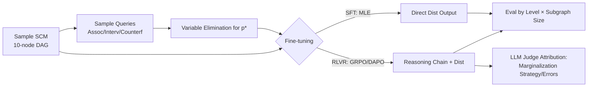

# Generalization of RLVR Using Causal Reasoning as a Testbed

**Conference**: ICLR 2026  
**OpenReview**: [https://openreview.net/forum?id=DZjbL9BuHs](https://openreview.net/forum?id=DZjbL9BuHs)  
**Code**: [https://github.com/zhichul/rlcausal](https://github.com/zhichul/rlcausal)  
**Area**: Reinforcement Learning / RLVR Generalization  
**Keywords**: RLVR, GRPO, Causal Inference, Generalization, SFT Comparison, Reasoning Priors  

## TL;DR
This paper uses "probabilistic inference on causal graphs" as a strictly verifiable microscope to decompose the generalization advantages of RLVR (Reinforcement Learning from Verifiable Rewards) over SFT. The findings suggest that RLVR's benefits emerge only when the model possesses sufficient initial reasoning capability, primarily manifesting through improved marginalization strategies and reduced intermediate derivation errors.

## Background & Motivation
- **Background**: RLVR has become a mainstream paradigm for post-training LLMs to solve complex reasoning tasks (math, theorem proving, code) by leveraging "reliable automated correctness signals from verifiers." However, the extent to which it **generalizes beyond the training distribution** remains under-researched.
- **Limitations of Prior Work**: Existing studies (e.g., Chu et al. 2025) have compared RL and SFT generalization on text/vision reasoning variants. However, they lack a testbed that can precisely partition tasks along orthogonal axes of "difficulty type" and "difficulty magnitude" while allowing exact calculation of ground truths. Natural language causal benchmarks (e.g., CLadder) conflate "task identification" with "actual derivation," making it difficult to isolate the latter.
- **Key Challenge**: Researching RLVR generalization requires task difficulty to be **hierarchical and controllable**, while remaining **strictly verifiable**, and allowing "reasoning steps" to serve as a continuous knob—a combination hard to achieve.
- **Goal**: To construct a fully specified (full-SCM parameterized) causal inference task, RLCausal, stratified across the three levels of the causal ladder (Association / Intervention / Counterfactual) and subgraph sizes. The goal is to compare in-level and cross-level generalization of RLVR versus SFT on Qwen2.5-Instruct 3B/7B/32B.
- **Core Idea**: **Utilizing causal inference as a "controllable and verifiable generalization probe."** The three causal levels correspond to different reasoning patterns (abduction / deduction / hybrid), and subgraph size directly maps to reasoning steps, thus breaking "how and why RLVR generalizes" into measurable sub-questions.

## Method

### Overall Architecture
The paper builds an empirical pipeline: "Synthetic Causal Data → RLVR/SFT Fine-tuning → Multi-dimensional Generalization Eval → Trajectory Attribution." The input is a fully parameterized binary-variable SCM (10 nodes) plus a query. The RLVR model outputs a reasoning chain followed by a probability distribution $\hat p$, while SFT outputs $\hat p$ directly. Reference answers $p^\star$ are calculated precisely using variable elimination. Experiments are swept across model scales and training causal levels, with LLM judges used for strategy and error type labeling.

### Key Designs

**1. Dual-axis Difficulty Stratification.** Tasks are split into two orthogonal axes: **Causal Hierarchy**—Association $p(v_i\mid v_j=v_j)$ requires abduction (summing over ancestors in posterior); Intervention $p(v_i(v_j=c))$ requires deduction (eliminating ancestors after fixing $v_j$); Counterfactuals require abduction then deduction. **Structural Complexity** $|V_{rel}|$ represents the number of nodes in the subgraph relevant to the query. This allows measuring cross-level generalization (train $\neq$ test level) and difficulty curves within levels. Notably, with full-SCM input, the difficulty order "Association < Intervention" is reversed because posterior inference often requires more steps than fixed-value deduction.

**2. Verifiable Reward Design.** RLVR optimizes $\mathbb{E}_{x\sim T}\mathbb{E}_{y\sim p_\theta(x)}[r(y)]$. The reward is a weighted combination of format and accuracy: $r(y)=0.8\cdot r_{ans}(\hat p_y,p^\star_x)+0.2\cdot r_{format}(y)$. The term $r_{ans}(p,q)=\mathbf{1}[D(p,q)<t]$ uses Total Variation distance $D(p,q)=\frac12\sum_x|p(x)-q(x)|$, with answers rounded to two decimals and a threshold $t=0.01$. This produces a clean, binary reward for continuous probability outputs.

**3. Controlled Synthetic Data Generation.** A four-step sampler ensures precise ground truths and zero leakage: D1 Graph Sampler (10-node random DAG) → D2 Mechanism Sampler (CPTs sampled from Dirichlet distributions) → D3 Query Sampler (targets/conditions/interventions) → D4 Solver (variable elimination). Binary variables are used to keep exact inference tractable. Training/Dev/Test sets use non-overlapping SCMs.

**4. Trajectory Attribution.** To explain gains, o4-mini labels 80 trajectories per level for **Marginalization Strategy** (Incremental / Brute Force / Neighbors / None) and **Probabilistic Derivation Errors** (missing dependencies, confounding intervention with observation, etc.). This translates black-box score changes into mechanistic explanations.

## Key Experimental Results

### Main Results: RLVR vs SFT Generalization

| Dimension | Conclusion |
|------|------|
| In-level Generalization | RLVR outperforms SFT only in specific (scale, level) combinations: significantly better on Assoc/Interv for models $\ge$7B. |
| In-level (Weak Zone) | For 3B models across all levels, and Counterfactuals across all scales, RLVR **underperforms** SFT. |
| Cross-level Generalization | When training level $\neq$ test level, RLVR is consistently superior on models $\ge$7B. |
| Scaling Effects | Larger scales reduce the gap between in-level and out-of-level performance for both RLVR and SFT. |
| Precision | RLVR results are generally more precise than SFT, with the gap widening on complex queries. |

### Key Findings
- **RLVR is a "Conditional Refiner"**: RLVR significantly boosts performance only when the base model already has a non-zero initial reasoning success rate. Otherwise (e.g., 3B), it degrades into direct answer prediction, abandoning explicit marginalization. This highlights the "cold-start" problem in RLVR.
- **The Counterfactual Bottleneck**: Models fail to construct twin-networks or infer exogenous variables before or after fine-tuning. Even providing twin-network hints (oracle experiment) barely improves accuracy, suggesting a fundamental lack of reasoning paradigm rather than insufficient reward signals.
- **Mechanistic Shift**: In successful cases, RLVR shifts the model towards **incremental marginalization** and reduces abstract derivation errors and calculation slips.

## Highlights & Insights
- **Deconstructing Generalization**: Using dual axes (level $\times$ subgraph size) allows "where generalization happens" to be localized to specific cells rather than broad claims.
- **Mechanistic Attribution over Benchmarking**: Decoding accuracy gains into "strategy migration + error reduction" provides a deeper answer to how RLVR functions.
- **Difficulty Inversion Insight**: In full-SCM settings, association is harder than intervention, warning that "causal ladder" intuition is highly context-dependent.
- **Practical Implication**: To make RLVR effective, ensure the base model has a baseline reasoning capability first; otherwise, prioritize "capability cold-starting" via SFT or distillation.

## Limitations & Future Work
- **Domain Specificity**: The 3B model's failure might reflect a "causal domain cold-start" issue rather than an intrinsic limit of RLVR.
- **Task Simplification**: Observations and interventions are restricted to single binary variables. Future work should cover multi-variable, high-cardinality, and continuous mechanisms.
- **Unresolved Counterfactuals**: Hints do not solve counterfactual reasoning, indicating a need for explicit paradigm introduction (like twin-networks) beyond scaling rewards.

## Related Work & Insights
- **RLVR Post-training**: Complements work like DeepSeek-R1 and GRPO by providing a diagnostic testbed.
- **RL vs SFT Debate**: Adds controlled evidence to the debate on RL generalization (e.g., Chu et al. 2025) using exact verification.
- **Insights**: The methodology of "Synthetic Verifiable Task + Dual-axis Stratification + Trajectory Attribution" is transferable to other domains requiring rigorous RLVR analysis, such as planning or combinatorial optimization.

## Rating
- **Novelty**: ⭐⭐⭐⭐
- **Experimental Thoroughness**: ⭐⭐⭐⭐
- **Writing Quality**: ⭐⭐⭐⭐
- **Value**: ⭐⭐⭐⭐

<!-- RELATED:START -->

## Related Papers

- [\[ICLR 2026\] Controllable Exploration in Hybrid-Policy RLVR for Multi-Modal Reasoning](controllable_exploration_in_hybrid-policy_rlvr_for_multi-modal_reasoning.md)
- [\[ICLR 2026\] Negotiated Reasoning: On Provably Addressing Relative Over-Generalization](negotiated_reasoning_on_provably_addressing_relative_over-generalization.md)
- [\[ICML 2026\] Safety Generalization Under Distribution Shift in Safe Reinforcement Learning: A Diabetes Testbed](../../ICML2026/reinforcement_learning/safety_generalization_under_distribution_shift_in_safe_reinforcement_learning_a_.md)
- [\[ICLR 2026\] Exploration vs Exploitation: Rethinking RLVR through Clipping, Entropy, and Spurious Reward](exploration_vs_exploitation_rethinking_rlvr_through_clipping_entropy_and_spuriou.md)
- [\[ICLR 2026\] PROS: Towards Compute-Efficient RLVR via Rollout Prefix Reuse](pros_towards_compute-efficient_rlvr_via_rollout_prefix_reuse.md)

<!-- RELATED:END -->
