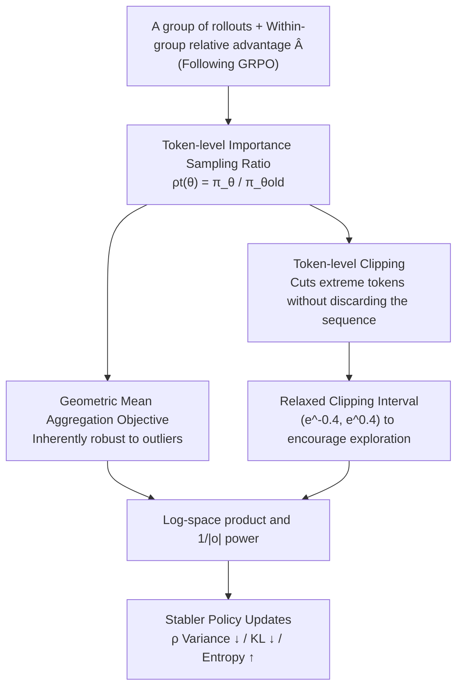

# Geometric-Mean Policy Optimization

**Conference**: ICLR 2026  
**OpenReview**: [https://openreview.net/forum?id=nCEs0tSwc2](https://openreview.net/forum?id=nCEs0tSwc2)  
**Code**: https://github.com/callsys/GMPO  
**Area**: Reinforcement Learning / LLM Reasoning  
**Keywords**: GRPO, Policy Optimization, Geometric Mean, Importance Sampling, Training Stability

## TL;DR
This work replaces the "arithmetic mean" used in GRPO for optimizing token-level rewards with a "geometric mean." By leveraging the inherent robustness of the geometric mean to outliers, the method suppresses extreme importance sampling ratios, thereby stabilizing policy updates without sacrificing exploration capability. Mathematically, it achieves a Pass@1 improvement of up to 4.1% over GRPO in reasoning tasks.

## Background & Motivation
**Background**: Verifiable-reward reinforcement learning, represented by GRPO (Group Relative Policy Optimization), has become a mainstream post-training technique for enhancing the reasoning capabilities of large models. By sampling a group of rollouts for each problem and estimating the advantage using within-group relative rewards, it eliminates the need for expensive value models and has achieved strong results in mathematics, code, and multimodal reasoning.

**Limitations of Prior Work**: The optimization objective of GRPO is the **arithmetic mean** of token-level importance-weighted rewards $\rho_t(\theta)\hat{A}$. However, the arithmetic mean is extremely sensitive to outliers. During training, if an importance sampling ratio $\rho_t(\theta)=\frac{\pi_\theta(o_t\mid q,o_{<t})}{\pi_{\theta_{old}}(o_t\mid q,o_{<t})}$ deviates significantly from 1 (an extreme value), it triggers an overly aggressive policy update. This further amplifies the variance of $\rho_t$, leading to a vicious cycle of "increasing training instability."

**Key Challenge**: To suppress extreme ratios, GRPO typically employs a narrow clipping interval $(\epsilon_{low},\epsilon_{high})$ (e.g., 0.8 to 1.2) for hard truncation. However, narrow clipping restricts exploration and causes the policy to converge prematurely to a deterministic state, which in turn hinders test-time scaling. **Stability and exploration are fundamentally constrained by the blunt tool of clipping.**

**Key Insight**: The authors observe that the root of instability lies not in the tightness of clipping, but in the **choice of aggregation operator**. Arithmetic means amplify outliers. If replaced with an aggregation operator naturally robust to outliers, the distribution of importance sampling ratios can be narrowed at the source, allowing for more relaxed clipping to benefit exploration while maintaining stability.

**Core Idea**: The core proposal is to use the **geometric mean** of token-level rewards instead of the arithmetic mean as the optimization objective (a plug-and-play modification). The geometric mean is insensitive to outliers and produces a lower-variance distribution of importance sampling ratios, which further permits the use of wider clipping intervals than those used in GRPO or DAPO.

## Method

### Overall Architecture
GMPO maintains the sampling and advantage estimation processes of GRPO. It specifically modifies the step of "aggregating importance-weighted rewards of all tokens in a rollout into a sequence objective." While GRPO uses the arithmetic mean, GMPO adopts the geometric mean. Complementing the geometric mean are two key engineering designs: moving clipping from the sequence level to the token level and significantly broadening the clipping interval.

The sequence-level objective function is defined as follows (the optimization direction is maintained by $\mathrm{sgn}(\hat{A}_i)$ when taking logarithms):

$$J_{GMPO}(\pi_\theta)=\mathbb{E}\left[\frac{1}{G}\sum_{i=1}^{G}\left(\prod_{t=1}^{|o_i|}\min\big(\rho_{i,t}(\theta)\hat{A}_i,\ \mathrm{clip}(\rho_{i,t}(\theta),\epsilon_{low},\epsilon_{high})\hat{A}_i\big)\right)^{\frac{1}{|o_i|}}\mathrm{sgn}(\hat{A}_i)\right]$$

For numerical stability, the continuous multiplication and roots are implemented in log-space (summation followed by division by the number of valid tokens, then applying the exponential function).

### Key Designs

**1. Geometric Mean Aggregation: Using a Robust Operator to Narrow Ratios at the Source**

This is the core of GMPO. In the GRPO objective, token-level rewards are aggregated via an arithmetic mean $\frac{1}{|o_i|}\sum_t \rho_{i,t}(\theta)\hat{A}_i$. If a single $\rho_{i,t}$ is extremely large or small, the objective and gradient for the entire sequence are skewed. GMPO adopts the geometric mean $\big(\prod_t \rho_{i,t}(\theta)\hat{A}_i\big)^{1/|o_i|}$. The geometric mean is naturally insensitive to outliers, effectively compressing the variance of the importance sampling ratio distribution.

The authors justify its stability from two perspectives. First, the **narrower value range**: it can be proven by inequalities that $|J^*_{GMPO}(\pi_\theta)|\le|J^*_{GRPO}(\pi_\theta)|$; a narrower range implies lower variance during optimization. Second, **more balanced gradients**: gradients for both objectives are weighted sums of token-level policy gradients. In GRPO, the weight for token $o_{i,t}$ is its own $\rho_{i,t}(\theta)$, meaning a single outlier can cause extreme gradients for that token. In GMPO, the weight is the geometric mean of all ratios in the sequence $\big(\prod_k \rho_{i,k}(\theta)\big)^{1/|o_i|}$, causing tokens in a sequence to share a "smoothed" update signal.

**2. Token-level Clipping: Truncating Extreme Tokens Rather Than Discarding Sequences**

The geometric mean objective involves a product $\prod_t \rho_{i,t}(\theta)$, which is similar to the sequence-level reward form in DeepSeek-R1. A natural approach would be sequence-level clipping (clipping the entire product). However, the authors find token-level clipping superior for two reasons: sequence-level clipping results in a wider range of importance sampling ratios (as shown in Figure 3), which can create extreme gradients; furthermore, sequence-level clipping is too aggressive—once triggered, it zeros out gradients for all tokens in the sequence, losing informative updates from other tokens. Token-level clipping only affects specific boundary-crossing tokens, preserving valuable signals.

**3. Relaxed Clipping Intervals: Utilizing Stability Budget for Exploration**

Prior work like DAPO noted that narrow clipping restricts exploration and leads to premature stagnation, suggesting an increase of the upper bound from 1.2 to 1.28. Because the geometric mean inherently narrows the $\rho_t$ distribution, GMPO can more boldly relax clipping. Visualizing the max/min importance sampling ratios suggests that while GRPO's ratios widen over time (becoming more aggressive/unstable), GMPO maintains a narrower range. However, clipping cannot be completely removed, as an infinite interval $(-\infty, +\infty)$ reintroduces instability. A balanced interval of $(\epsilon_{low},\epsilon_{high}) = (e^{-0.4},e^{0.4})$ was chosen, which is significantly wider than GRPO and DAPO, fostering stronger exploration and higher performance.

### Loss & Training
The final loss is calculated as $-\hat{A}\cdot\exp\big(\frac{1}{|o|}\sum_t \text{(signed log-ratio after token-level clip)}\big)$, computed entirely in log-space. For language tasks, the setup follows Dr.GRPO (training on 8,523 MATH Level 3–5 problems, 8 rollouts per problem, max response of 3,000 tokens, 1,024 rollouts per iteration, updated with batch size 128 over 8 epochs). Mathematical rewards are verifiable binary 0/1 values.

## Key Experimental Results

### Main Results
Across five mathematical reasoning benchmarks of varying difficulty (AIME24 / AMC / MATH500 / Minerva / OlympiadBench), GMPO consistently outperforms GRPO, with the magnitude of improvement increasing with model strength:

| Model / Setting | Benchmark | GMPO | GRPO | Gain |
|--------|------|------|------|------|
| DeepSeek-R1-Distill-Qwen-7B | 5 Math Benchmarks Avg. | 63.4 | 59.3 | +4.1% |
| Qwen2.5-Math-7B | 5 Math Benchmarks Avg. | 52.7 | 51.2 | +1.5% |
| Qwen2.5-Math-1.5B | 5 Math Benchmarks Avg. | 43.9 | 42.5 | +1.4% |
| Qwen3-32B (MoE) | MATH500 | 96.7 | 94.6 | +2.1% |
| Qwen2.5-VL-7B | Geometry3K (Multimodal) | 54.7 | 53.3 | +1.4% |
| Qwen2.5-Instruct-1.5B | ALFWorld (Agentic) | 85.9 | 72.8 | +13.1% |

In horizontal comparisons with SOTA methods, GMPO-7B (R1-Distill) at 63.4% exceeds Oat-Zero-7B's 61.5%, with notable leads in AMC (78.3), MATH500 (91.4), and OlympiadBench (62.5).

### Ablation Study
Table 3 decomposes the modifications in GMPO relative to GRPO (Qwen2.5-Math-7B, 5-Benchmark Avg.):

| Configuration | Avg. | Description |
|------|------|------|
| (1) GRPO (Arithmetic) | 51.2 | Baseline |
| (2) GMPO w/o clipping | 52.3 | Superior to GRPO even without clipping, but 0.4% lower than full version |
| (3) GMPO sequence-level clip | 52.6 | Similar performance but wider and less stable $\rho_t$ range |
| (4) GMPO w/o $1/|o|$ normalization | 52.0 | Drops 0.7%; normalization term is critical |
| (5) GMPO (Full) | 52.7 | Geometric mean + Token-level clip + Normalization |

Clipping interval sensitivity (Table 4): $(e^{-0.2},e^{0.2})$=52.4, $(e^{-0.4},e^{0.4})$=52.7 (Best), $(e^{-0.8},e^{0.8})$=52.1, $(-\infty,+\infty)$=52.3. Intervals that are too narrow restrict exploration, while those too wide introduce instability; $(e^{-0.4},e^{0.4})$ is the sweet spot.

### Key Findings
- **Geometric mean is the primary contributor**: Simply switching from arithmetic to geometric mean (keeping other factors constant) provides a +1.5% gain, validating that the "choice of aggregation operator" is the root cause of stability.
- **Observable evidence of stability**: Across training curves, GMPO maintains higher token entropy (sustained exploration without premature collapse), smaller gradient fluctuations, and lower KL divergence from the reference model.
- **Larger gains in unstable scenarios**: GMPO's advantages are most prominent in MoE settings (Qwen3-32B), which are sensitive to stability, and in agentic tasks like ALFWorld (+13.1%).
- **Normalization is indispensable**: Removing the $1/|o|$ term (similar to some Dr.GRPO variants) leads to a 0.7% drop, highlighting the necessity of length normalization in the geometric mean framework.

## Highlights & Insights
- **Intuitive Problem Diagnosis**: While others patch stability via clip search, baseline estimation, or reward shaping, GMPO identifies that instability stems from the "arithmetic mean amplifying outliers" at the operator level.
- **Plug-and-play simplicity**: The implementation involves only about a dozen lines of code, centered on summing log-ratios, averaging, and then exponentiating. It can be easily integrated into existing frameworks like verl.
- **Recycling Stability Budget for Exploration**: The philosophy of first narrowing the distribution variance via a robust operator to "earn" a stability budget, then spending that budget on relaxed clipping to encourage exploration, is a design principle applicable to other RL objectives.

## Limitations & Future Work
- Gains are strongly correlated with base model strength: The performance increase is modest for weak models (1.5B, +1.4%) compared to stronger ones (R1-Distill-7B, +4.1%). The benefit relies on scenarios where a model has a strong reasoning foundation but suffers from training instability.
- Evaluation focused on verifiable 0/1 rewards (Math/Geometry/Agentic). Whether geometric means remain robust for noisy, continuous rewards or open-ended generation tasks remains to be fully explored.
- The clipping interval $(e^{-0.4},e^{0.4})$ is empirically determined. An automated mechanism for adaptive clipping would be a natural future direction.

## Related Work & Insights
- **vs GRPO**: Both use within-group relative advantages and omit the value model. The difference lies in token-level aggregation: GRPO uses arithmetic mean (sensitive to outliers, requiring narrow clipping), while GMPO uses geometric mean (robust, allowing relaxed clipping).
- **vs DAPO**: DAPO addresses narrow clipping by slightly increasing the upper bound (clip-higher). GMPO addresses the root cause via the aggregation operator, enabling even wider intervals than DAPO.
- **vs Dr.GRPO**: Dr.GRPO removes length normalization to mitigate length bias. GMPO's ablations show that removing $1/|o|$ normalization is detrimental, suggesting different trade-offs for normalization in the geometric mean context.
- **vs OPO / BNPO / GRPO-lead**: These methods improve stability via better baselines or reward shaping; GMPO provides an orthogonal perspective via robust aggregation.

## Rating
- **Novelty**: ⭐⭐⭐⭐ Attributes stability to the aggregation operator and solves it via geometric mean—a fresh and orthogonal approach.
- **Experimental Thoroughness**: ⭐⭐⭐⭐ Covers language, multimodal, agentic tasks, and MoE architectures. Includes theoretical analysis and multiple lines of stability evidence.
- **Writing Quality**: ⭐⭐⭐⭐ Clear logical chain from motivation to theory to experiments.
- **Value**: ⭐⭐⭐⭐ Plug-and-play, low-cost implementation for RLHF/reasoning practitioners.

<!-- RELATED:START -->

## Related Papers

- [\[ICLR 2026\] Single-stream Policy Optimization](single-stream_policy_optimization.md)
- [\[ICLR 2026\] GRACE: Generative Representation Learning via Contrastive Policy Optimization](grace_generative_representation_learning_via_contrastive_policy_optimization.md)
- [\[ICLR 2026\] SHAPO: Sharpness-Aware Policy Optimization for Safe Exploration](shapo_sharpness-aware_policy_optimization_for_safe_exploration.md)
- [\[ICLR 2026\] Mean Flow Policy with Instantaneous Velocity Constraint for One-step Action Generation](mean_flow_policy_with_instantaneous_velocity_constraint_for_one-step_action_gene.md)
- [\[ICLR 2026\] Group Verification-based Policy Optimization for Interactive Coding Agents](group_verification-based_policy_optimization_for_interactive_coding_agents.md)

<!-- RELATED:END -->
