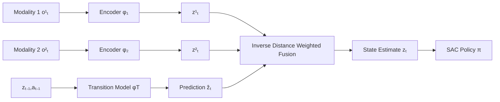

# Geometry of Uncertainty: Learning Metric Spaces for Multimodal State Estimation in RL

**Conference**: ICLR 2026  
**OpenReview**: [https://openreview.net/forum?id=rw0vvcHZPe](https://openreview.net/forum?id=rw0vvcHZPe)  
**Code**: [https://github.com/reichlin/MetricMultiModal](https://github.com/reichlin/MetricMultiModal)  
**Area**: reinforcement learning  
**Keywords**: state representation learning, multimodal sensor fusion, metric spaces, uncertainty estimation, POMDP, noise robustness  

## TL;DR
Uncertainty estimation is reformulated as a geometric problem in metric spaces—constructing a latent space where Euclidean distance represents the "minimum number of actions between two states," then fusing multimodal sensors via inverse distance weighting. This achieves robust state estimation against unseen sensor corruptions without any noise assumptions or training on noisy data.

## Background & Motivation
**Background**: Estimating environmental states from high-dimensional, noisy, multimodal observations is a core challenge in RL. Classical approaches utilize Bayesian filtering (Kalman or Particle filters), which theoretically provide optimal estimates with uncertainty. However, these methods either restrict state distributions to Gaussian forms or require expensive Monte Carlo sampling, and both necessitate prior knowledge of the observation model and noise functions. Deep learning approaches (variational methods, Recurrent State Space Models, Neural Processes) can handle high-dimensional observations but still require training on noisy data to learn uncertainty, often assuming specific noise distributions.

**Limitations of Prior Work**: ① Reliance on explicit noise/observation models and prior assumptions makes generalization to unseen noise types difficult; ② Robustness typically requires noise augmentation during training, which demands prior knowledge of corruption types, slows down exploration, and reduces asymptotic returns; ③ Multimodal fusion is challenging—Bayesian filtering struggles with multiple modalities, and naive concatenation or linear combinations can be misled by erroneous signals when one modality fails.

**Key Challenge**: To be "robust to arbitrary noise," traditional paradigms require "knowing the noise characteristics beforehand." These two requirements are inherently contradictory—explicit probabilistic modeling places the burden of uncertainty on the "correctness of assumptions."

**Goal**: To learn a state representation that interfaces with any RL algorithm while maintaining high returns under sensor corruptions unseen during training, without requiring noise samples or noise distribution priors.

**Core Idea** (**Geometric Uncertainty**): The authors argue that transition model errors are "local within the space induced by dynamics"—predicted states will only fall into neighborhoods reachable by "similar action sequences." Thus, the latent space is structured as a metric space where Euclidean distance is proportional to the "minimum number of actions between two states" (temporal distance). Consequently, an observation encoding is considered more credible the closer it is to the transition prediction; uncertainty is interpreted as "distance," eliminating the need for probabilistic modeling.

## Method

### Overall Architecture
METRICMM assigns an encoder $\phi_i: O_i \to Z$ to each modality, along with a latent transition model $\phi_T: Z \times A \to Z$. During training, a contrastive temporal distance loss shapes the latent space such that "distance = minimum actions," and an invariance loss aligns modalities into the same space. During inference, the transition model predicts $\hat z_t$, and modalities are fused using inverse distance weighting based on their distance to $\hat z_t$ to obtain the state estimate $z_t$, which is then fed into a standard RL algorithm (SAC) for end-to-end joint optimization.

### Key Designs
**1. Metric Space Hypothesis: Confining Transition Errors to an $\epsilon$-ball.** The foundation is a geometric hypothesis—the true state $z_t$ must fall within a small ball around the transition prediction: $z_t \in B(\phi_T(z_{t-1}, a_{t-1}), \epsilon)$, where $B(z,\epsilon)=\{z': d(z,z')\le\epsilon\}$. The intuition is that while transition models have errors, they only shift the state to neighbors with "similar action distances" rather than points reachable only via distant dynamics. The latent space is defined as a metric space $M=(Z, \|\cdot\|_2)$, where distance corresponds to temporal distance. While using a norm as distance is naturally symmetric (approximating $\min\{d(s_1,s_2), d(s_2,s_1)\}$), the formulation of MDP Homomorphism shows this symmetric metric is sufficient for geometric reasoning.

**2. Inverse Distance Weighted Sensor Fusion: Using Distance for Confidence.** Assuming observations closer to the transition prediction are more reliable, fusion uses weights based on the inverse of the distance to the prediction:

$$z_t = \left(\sum_i \frac{1}{\|z_t^i - \hat z_t\|_2 + \delta}\right)^{-1} \sum_i \frac{z_t^i}{\|z_t^i - \hat z_t\|_2 + \delta}$$

where $\hat z_t = \phi_T(z_{t-1},a_{t-1})$, $z_t^i = \phi_i(o_t^i)$, and $\delta=10^{-5}$. Modality encodings contaminated by noise deviate from the prediction, increasing distance and automatically reducing weight, while reliable modalities maintain small distances and high weights. This corresponds to a MAP principle—estimates more consistent with the transition model receive higher weights—enabling adaptive robust fusion without explicit noise distributions.

**3. Triple Loss for Metric Structure (Noiseless Training).** The mean of modality encodings $\bar z_t = \frac1N\sum_i \phi_i(o_t^i)$ (equivalent to the fused estimate in the absence of noise) is used to define three losses. **Contrastive Temporal Distance Loss** pulls adjacent states closer and pushes random states apart: a positive term $L^+ = \mathbb{E}[(\|\bar z_{t+1}-\bar z_t\|_2 - 1)^2]$ enforces unit distance for single-step transitions, while a negative term $L^- = \mathbb{E}[-\log(\|\bar z_r - \bar z_t\|_2)]$ prevents representation collapse. Together with the triangle inequality, these constraints recover temporal distances for non-adjacent pairs. **Latent Transition Loss** $L_T = \mathbb{E}[(\phi_T(\bar z_t, a_t)-\bar z_{t+1})^2]$ ensures transition accuracy. **Multimodal Invariance Loss** $L_{inv} = \mathbb{E}[(\phi_i(o_t^i)-\phi_j(o_t^j))^2]$ aligns all modalities. The total loss $L = L_T + \lambda_1 L^+ + \lambda_2 L^- + \lambda_3 L_{inv}$ is optimized with the RL objective. No noisy samples are needed during training—this is key to achieving robustness without prior noise knowledge.

## Key Experimental Results
Evaluations cover MuJoCo (Hopper, HalfCheetah, Ant, Walker2d, Humanoid, InvertedPendulum with synchronous RGB and Depth streams) and Fetch (7-DoF robotic arm manipulation with RGB, Depth, and Point Cloud). SAC is trained end-to-end on the representation module (5 seeds). During testing, 7 types of unseen corruptions are injected (Gaussian, Salt-and-Pepper, Patches, Puzzle, Texture, Failure, Hallucination).

### Main Results
Returns on Fetch–PickAndPlace with Patch corruption applied to **both modalities** simultaneously:

| Model | 0.1 | 0.25 | 0.5 | 0.75 | 0.9 | 0.99 |
|-----|-----|------|-----|------|-----|------|
| LinearComb | -0.89 | -1.99 | -1.76 | -2.57 | -2.67 | -2.17 |
| Concat | -0.04 | -1.13 | -2.84 | -2.06 | -2.53 | -2.43 |
| CURL | 1.43 | -1.55 | -3.76 | -3.51 | -3.40 | -2.58 |
| GMC | -0.01 | -0.91 | -2.04 | -1.95 | -1.88 | -2.41 |
| α-MDF | 2.20 | 0.93 | -1.04 | -1.75 | -2.16 | -2.34 |
| CORAL | -0.36 | -0.86 | -1.51 | -1.23 | -1.38 | -1.47 |
| **MetricMM** | **1.91** | **1.87** | **1.43** | **0.92** | -0.91 | -1.47 |

On Fetch–Slide with Failure corruption on both modalities: MetricMM maintains a return of **5.95** at a probability of 0.5 and **4.55** at 0.75, whereas all baselines drop near zero or negative values at 0.5 (the best baseline, ConCat, only achieves 4.01@0.5 and 0.06@0.75).

### Ablation Study

| Analysis Dimension | Conclusion |
|----------|------|
| Single Modality Damage (MuJoCo) | MetricMM shows the most gradual degradation, remaining the only estimator to maintain stable returns under high-frequency perturbations. |
| High-DoF Tasks (Humanoid, etc.) | The performance gap between MetricMM and the strongest baselines widens as perturbation frequency increases. |
| Noise Injection during Training | Injecting noise slows exploration and lowers asymptotic returns; heavy noise can delay the start of learning. MetricMM is robust without noise injection. |
| Point Cloud Utilization | Most baselines barely drop in performance when only point clouds are corrupted, indicating over-reliance on RGB/Depth. MetricMM shows more uniform sensitivity, suggesting true utilization of each modality. |
| Temporally Correlated Noise | MetricMM remains the most reliable method when frames fail consecutively (3/10 frames). |

### Key Findings
- **Graceful Degradation vs. Immediate Collapse**: Baselines quickly turn negative as corruption probability rises; MetricMM degrades slowly by redistributing weights to remaining reliable modalities.
- **Resilience with Majority Modality Failure**: Even when two out of three sensor channels are corrupted, MetricMM maintains significantly higher returns.
- **Noise-free Training is Superior**: Training with noise requires prior knowledge and increases computation. Geometric distance weighting naturally absorbs observation uncertainty.

## Highlights & Insights
- **Paradigm Shift**: Replacing "uncertainty estimation" with "metric distance" bypasses the fundamental constraint of Bayesian filtering requiring assumed noise forms.
- **Fusion as MAP**: Inverse distance weighting is not just an engineering trick; it represents a Maximum A Posteriori (MAP) principle where consistency with the transition model determines credibility.
- **Zero-Noise Robustness**: By transferring robustness from "data augmentation" to "spatial geometry," the method avoids dependence on known corruption types and side effects of noise injection.
- **Plug-and-play**: The representation is decoupled from the RL algorithm; $z_t$ can be fed into any policy optimizer.

## Limitations & Future Work
- **Symmetric Metric Constraints**: Using a norm limits the space to symmetric temporal distances, failing to capture asymmetric reachability in POMDPs (where action counts to go from A to B differ from B to A). Quasimetrics might be more general.
- **$\epsilon$-ball Fragility**: The method relies on transition errors remaining local. In environments with long-range jumps or high stochasticity, geometric confidence may become distorted.
- **Determinism Assumption**: The framework assumes a deterministic transition $T$, which may not fully adapt to highly stochastic dynamics.
- **Collective Failure**: If all modalities deviate from the prediction in the same direction, inverse distance weighting cannot discriminate—it requires at least one modality to stay near the prediction.
- **Simulation focus**: Evaluations utilize synthetic corruptions; real-world hardware verification is needed.

## Related Work & Insights
- **State Representation Learning**: Early methods used reconstruction or contrastive losses (CURL) for invariant representations but often lacked spatial structure. This work uses metric structures to preserve geometry.
- **Bayesian / Differentiable Filtering**: Kalman/Particle filters are optimal but restrictive. While $\alpha$-MDF uses Transformer attention as a replacement for Kalman Gain, this work explicitly avoids estimating uncertainty parameters, remaining agnostic to noise types.
- **Metric Learning in RL**: Previous works used temporal distance for planning or value functions (Eysenbach, Park, Wang). This work is the first to apply metric spaces to "uncertainty estimation under multimodal noise."

## Rating
- **Novelty**: ⭐⭐⭐⭐ — Geometricizing uncertainty and using inverse distance as MAP-based fusion is a creative application of metric learning.
- **Experimental Thoroughness**: ⭐⭐⭐⭐ — Comprehensive across 8 tasks, 7 unseen corruptions, and various failure scenarios, though missing real-world validation.
- **Writing Quality**: ⭐⭐⭐⭐ — Clear logical flow from motivation to hypothesis and loss functions; good balance of intuition and math.
- **Value**: ⭐⭐⭐⭐ — Provides a plug-and-play, interpretable solution for robust multimodal state estimation, particularly relevant for robotics.

<!-- RELATED:START -->

## Related Papers

- [\[ICLR 2026\] Learning to Be Uncertainty: Pre-training World Models with Horizon-Calibrated Uncertainty](learning_to_be_uncertain_pre-training_world_models_with_horizon-calibrated_uncer.md)
- [\[ICLR 2026\] Improving and Accelerating Offline RL in Large Discrete Action Spaces with Structured Policy Initialization](improving_and_accelerating_offline_rl_in_large_discrete_action_spaces_with_struc.md)
- [\[ICLR 2026\] Sample Efficient Offline RL via T-Symmetry Enforced Latent State-Stitching](sample_efficient_offline_rl_via_t-symmetry_enforced_latent_state-stitching.md)
- [\[ICLR 2026\] Information-based Value Iteration Networks for Decision Making Under Uncertainty](information-based_value_iteration_networks_for_decision_making_under_uncertainty.md)
- [\[ICLR 2026\] Peng's Q($\lambda$) for Conservative Value Estimation in Offline Reinforcement Learning](pengs_qlambda_for_conservative_value_estimation_in_offline_reinforcement_learnin.md)

<!-- RELATED:END -->
