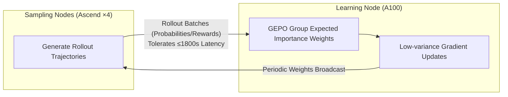

# GEPO: Group Expectation Policy Optimization for Stable Heterogeneous Reinforcement Learning

**Conference**: ICLR 2026  
**OpenReview**: [https://openreview.net/forum?id=movNwgQtDt](https://openreview.net/forum?id=movNwgQtDt)  
**Code**: [https://github.com/HanlardResearch/Hetero-RL](https://github.com/HanlardResearch/Hetero-RL)  
**Area**: Reinforcement Learning / LLM Post-training  
**Keywords**: Asynchronous RL, Importance Sampling, Variance Reduction, Decentralized Training, Policy Staleness  

## TL;DR
Addressing the training instability of LLM reinforcement learning in decentralized environments with high network latency, this paper proposes coarsening importance weight granularity from the token/sequence level to the **group level** (using group-wise expected probabilities as the denominator). Theoretically, this exponentially reduces importance weight variance against high KL divergence, maintaining performance with only a 3% drop under 1800s latency.

## Background & Motivation
- **Background**: As single-center compute power approaches power consumption limits, decentralized training across geographically distributed and heterogeneous hardware (e.g., mixed clusters of NVIDIA + Ascend) is becoming an inevitable trend. RL remains a critical method for LLM post-training on complex tasks like mathematical reasoning.
- **Limitations of Prior Work**: Traditional RL frameworks (GRPO, PPO series) **tightly couple** rollout sampling with parameter updates, requiring strict synchronization. In decentralized scenarios, this leads to two fatal bottlenecks: first, GPU idle time as nodes wait for the slowest generator (e.g., generating ultra-long reasoning chains); second, **policy staleness** $\tau$ between the sampler policy $\pi_{\theta_k}$ and the learner policy $\pi_{\theta_{k+\tau}}$ caused by network latency.
- **Key Challenge**: The authors' analysis reveals that high latency significantly elevates the KL divergence between the sampler and learner policies. When KL divergence is large, the variance of the importance weight $\frac{p(y|x)}{q(y|x)}$ explodes, leading to training instability or reward collapse. Token-level weights in GRPO and sequence-level weights in GSPO fail under such large divergence.
- **Goal**: Construct an asynchronous RL system capable of stable LLM training on heterogeneous compute networks while tolerating arbitrary network latency, addressing instability at its root cause (variance explosion) rather than applying heuristic patches.
- **Core Idea**: **[Decoupled Architecture + Coarse-grained Importance Weights]** At the system level, HeteroRL decouples sampling from learning. At the algorithmic level, GEPO replaces the importance weight denominator with the group expected probability $\hat{\mathbb{E}}_q[q(y|x)]$. This ensures the denominator no longer depends on the probability of any single sample, achieving exponential variance reduction in high KL regions.

## Method

### Overall Architecture
HeteroRL splits the two most compute-intensive stages of the RL pipeline—rollout sampling and parameter learning—into physically/logically independent heterogeneous nodes. Four sampling nodes (e.g., Ascend 910a) continuously generate reasoning trajectories, while one learning node (e.g., A100) asynchronously consumes this data to update parameters. They communicate via a star topology over the internet without waiting for each other, tolerating up to 1800s of latency for model checkpoints and rollout batches. The core algorithm, GEPO, runs on the learning node, following the group sampling paradigm of GRPO but elevating the statistical granularity of importance weights to the **entire group**.

### Key Designs

**1. Group Expectation Importance Weight (GEIW): Replacing the denominator with group expectation to eliminate the variance source.** The instability of the standard importance weight $\frac{p(y|x)}{q(y|x)}$ stems from the denominator $q(y|x)$ potentially approaching zero, causing weights to explode. GEPO leverages group sampling: for each prompt $x$, a group of $G$ responses is generated to estimate the "expected proposal probability" to replace the denominator. Since $\sum_i q(y_i|x) \gg 1$ under top-P/top-K sampling, a naive arithmetic mean would be biased by ignoring relative sampling probabilities. The authors use group-normalized probabilities $\tilde{q}(y_i|x)=\frac{q(y_i|x)}{\sum_j q(y_j|x)}$ as weights to obtain $\hat{\mathbb{E}}_q[q(y|x)] \approx \sum_{i=1}^{G}\tilde{q}(y_i|x)\cdot q(y_i|x)=\frac{\sum_i q(y_i|x)^2}{\sum_i q(y_i|x)}$. The final weight is $w_{\text{GEIW}}(y|x)=\frac{p(y|x)}{\hat{\mathbb{E}}_q[q(y|x)]}$. This denominator is decoupled from any single $q(y|x)$; even if individual proposal probabilities approach zero, extreme weights are avoided. Unlike clipping (which discards data points by zeroing gradients), GEIW preserves valid gradients. This is an intentional "bias-for-stability" tradeoff.

**2. Theoretical Guarantee of Exponential Variance Reduction (Theorem 1): Stability as a function of KL.** The paper proves that there exists a constant $C$ such that $\text{Var}\big[\frac{p(y|x)}{q(y|x)}\big]-\text{Var}\big[\frac{p(y|x)}{\hat{\mathbb{E}}_q[q(y|x)]}\big]\ge \exp(D_{\text{KL}}(p\|q))-C$. This indicates that when $D_{\text{KL}}(p\|q)>\log C$, the GEIW variance is strictly lower than standard importance sampling, with the gap widening **exponentially** as KL divergence increases. This directly addresses the high KL regions caused by high latency where GRPO/GSPO collapse. Visualization on Bernoulli and Gaussian distributions confirms that variance is significantly suppressed in high KL zones.

**3. Gradient Perspective on Granularity: Token → Sequence → Group.** From a gradient formula perspective, the three algorithms differ only in the sharing scope of the importance weight denominator. In GRPO, each token $y_t^i$ uses its own $q_{i,t}$ (token-level, finest, highest variance); in GSPO, all tokens in sequence $i$ share $q_i=q(y_i|x)$ (sequence-level); in GEPO, **all tokens across all sequences in the group share a single denominator** $\hat{\mathbb{E}}_q[q(y|x)]$ (group-level, coarsest). This progression toward coarser granularity results in lower gradient variance. In implementation, this only requires changing the coefficient from `learner_token_p / sampler_token_p` to a group-level shared value.

## Key Experimental Results

Settings: Qwen3-1.7B/8B trained on MATH level 3–5 (8290 samples). Evaluated on MATH500 / AMC23 / AIME24 / AIME25 Pass@1 (average over 8 samples). Comparison against GRPO, GSPO, BNPO, and Dr.GRPO under zero latency (Online RL) and high latency (Hetero RL, max 64 steps / 1800s).

### Main Results (Online RL, Qwen3-8B Average Scores)

| Method | AMC23 | AIME24 | AIME25 | MATH500 | Average |
|--------|-------|--------|--------|---------|---------|
| Qwen3-8B (Base) | 70.6 | 32.4 | 26.1 | 87.1 | 54.1 |
| BNPO | 78.8 | 44.1 | 29.3 | 91.4 | 60.9 |
| Dr.GRPO | 77.5 | 41.0 | 27.7 | 91.6 | 59.4 |
| GRPO | 81.3 | 42.6 | 31.3 | 92.0 | 61.8 |
| GSPO | 77.8 | 41.8 | 31.3 | 90.9 | 60.5 |
| **GEPO (Ours)** | **85.6** | **44.1** | **37.5** | **92.6** | **65.0** |

Even in the ideal zero-latency setting, GEPO outperforms the strongest baseline GRPO by 3.2 points and GSPO by 4.1 points, with a +6.2 gain on AIME2025 (20% relative improvement), suggesting that group-level weights inherently improve gradient quality.

### Ablation Study (Hetero RL, Qwen3-8B, average of best/last)

| Method | best | last | best→last Degradation |
|--------|------|------|-----------------------|
| GRPO | 56.6 | 55.8 | 0.8 |
| GSPO | 58.4 | 46.4 | **12.0 (Collapse)** |
| **GEPO (Ours)** | **62.6** | **60.8** | **1.8** |

GEPO outperforms GSPO by 7.2% on the 'best' metric and reduces the best-to-last degradation by 85% compared to GSPO ($\Delta=1.8$ vs 12.0). GSPO performance collapses sharply between 500–700 steps, while GEPO remains near peak performance throughout.

### Key Findings
- **Latency Robustness**: GEPO performance drops by only ~3% when moving from online to 1800s latency, significantly more stable than baselines.
- **Variance-Gradient-Reward Evidence**: Training curves show that GEPO maintains the lowest importance weight variance, smoother gradient norm changes, and stable training rewards, empirically validating Theorem 1.
- **Token-level Homogeneity**: BNPO and Dr.GRPO perform similarly to the original GRPO as all three utilize token-level weights; weight granularity is the primary differentiator.

## Highlights & Insights
- **Translating System Problems to Statistical Problems**: The authors do not stop at "latency causes instability" but localize the root cause—latency leads to high KL, which causes importance weight variance explosion—and provide a variance reduction solution rather than a heuristic patch.
- **Minimal Implementation, Strong Theory**: The core change involves only two lines of coefficient calculation, yet it is supported by an exponential variance reduction theorem and verified by visualizations.
- **System-Algorithm Synergy**: HeteroRL (decoupling + latency tolerance) and GEPO (divergence tolerance) are complementary; the architecture creates high KL scenarios that the algorithm is specifically designed to handle.
- **"Bias for Variance" Tradeoff**: The authors clearly acknowledge GEIW is biased but argue that in the high KL "danger zone," the cost of bias is small relative to the benefit of variance reduction.

## Limitations & Future Work
- **Unquantified Bias**: GEIW is a biased estimator; while the paper provides variance bounds, it does not provide controllable bounds for bias. It is unclear if bias might harm convergence in extreme distributions.
- **Task/Scale Specificity**: Validated only on mathematical reasoning (MATH series) and Qwen3-1.7B/8B. Universality across code generation, general dialogue, or larger models remains to be proven.
- **Slight Variance Increase in Small KL regions**: GEIW variance is slightly higher when $p$ and $q$ are very close. Gains may be marginal in pure online, low-latency scenarios.
- **Topology Assumptions**: Experiments use a star topology (1 learner + 4 samplers); stability under complex multi-learner or mesh topologies was not explored.

## Related Work & Insights
- **Extension of GRPO/GSPO**: GEPO is a natural extension of the "increasing granularity" path: GRPO (token-level) $\to$ GSPO (sequence-level) $\to$ GEPO (group-level).
- **Asynchronous/Stale Policy RL**: Relates to work on off-policy and policy staleness (like experience replay and weight clipping), but replaces truncation with statistical aggregation to avoid zeroed gradients.
- **Decentralized LLM Training**: Aligns with system work on cross-datacenter and heterogeneous hardware training, providing an algorithmic foundation for large-scale distributed RL post-training.
- **Insight**: When the variance of an estimator is dominated by one "near-zero denominator" point, replacing the single point with the expectation of a group of samples is a general-purpose robustification technique applicable to other importance sampling-heavy contexts (e.g., offline RL, recommendation system debiasing).

## Rating
- **Novelty**: ⭐⭐⭐⭐ Advancing weight granularity to the group level with an exponential variance reduction theorem is a clean and principled extension of the GRPO/GSPO family.
- **Experimental Thoroughness**: ⭐⭐⭐⭐ Covers online/hetero settings, two model sizes, four benchmarks, and multiple baselines with supporting mechanism curves; however, the task domain is narrow.
- **Writing Quality**: ⭐⭐⭐⭐ Logical flow from system bottlenecks to statistical causes, then to theorems and implementation.
- **Value**: ⭐⭐⭐⭐ Provides a plug-and-play, low-code stabilization solution for LLM RL post-training under decentralized, heterogeneous compute, offering high engineering value.

<!-- RELATED:START -->

## Related Papers

- [\[ICLR 2026\] Heterogeneous Agent Q-weighted Policy Optimization](heterogeneous_agent_q-weighted_policy_optimization.md)
- [\[ICLR 2026\] Group Verification-based Policy Optimization for Interactive Coding Agents](group_verification-based_policy_optimization_for_interactive_coding_agents.md)
- [\[ICLR 2026\] Sample More to Think Less: Group Filtered Policy Optimization for Concise Reasoning](sample_more_to_think_less_group_filtered_policy_optimization_for_concise_reasoni.md)
- [\[ICLR 2026\] Revisiting Group Relative Policy Optimization: Insights into On-Policy and Off-Policy Training](revisiting_group_relative_policy_optimization_insights_into_on-policy_and_off-po.md)
- [\[ICLR 2026\] Geometric-Mean Policy Optimization](geometric-mean_policy_optimization.md)

<!-- RELATED:END -->
