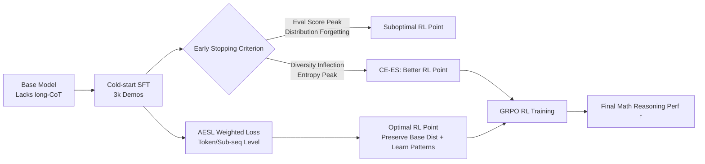

# Getting Your LLMs Ready for Reinforcement Learning with Lightweight SFT

**Conference**: ICLR 2026  
**OpenReview**: [https://openreview.net/forum?id=yezWGJmODg](https://openreview.net/forum?id=yezWGJmODg)  
**Code**: [https://github.com/LXXXXR/AESL](https://github.com/LXXXXR/AESL)  
**Area**: Reinforcement Learning / LLM Post-training  
**Keywords**: cold-start SFT, RLVR, distribution forgetting, diversity early stopping, GRPO, mathematical reasoning  

## TL;DR
This paper reveals that the "optimal SFT checkpoint" and the "best RL starting point" are inconsistent during the RL cold-start phase—models lose RL potential due to **distribution forgetting** even while evaluation scores are still rising. It proposes using diversity metrics (Entropy / self-BLEU) for early stopping and designs an adaptive weighted loss (AESL) at the token and sub-sequence levels to balance new pattern learning with base model distribution preservation.

## Background & Motivation
**Background**: RL (especially RLVR + GRPO based on verifiable rewards) has become a mainstream paradigm for LLM post-training, but its effectiveness highly depends on the quality of the base model. To enable base models to possess reasoning patterns like long chain-of-thought (long-CoT), mainstream pipelines (e.g., DeepSeek-R1) typically add a "cold-start" SFT stage before RL, using a small amount of demonstration data to inject reasoning patterns and improve the sample efficiency of subsequent RL.

**Limitations of Prior Work**: It remains unclear how long cold-start should last and whether the objective of SFT (imitating demonstrations) truly aligns with the goal of "preparing for RL." Conventional practice selects the checkpoint with the highest evaluation score after SFT to proceed with RL—but this paper finds that this is precisely the wrong approach.

**Key Challenge**: By scanning post-RL performance at different cold-start steps (Fig. 1b), the authors discovered a counter-intuitive phenomenon: during the "re-adaptation" phase where SFT evaluation scores continue to rise, the corresponding post-RL performance begins to decline. In other words, **the decay of RL potential occurs before SFT overfitting**. The root cause is that the model deviates excessively from the base model distribution (distribution forgetting), losing the diversity required for RL exploration. There is a fundamental misalignment between the cold-start goal (moving the model toward a good RL starting point) and the CE loss objective (maximizing demonstration imitation).

**Goal**: To find early stopping criteria and loss functions aligned with RL preparation, ensuring that cold-start effectively positions the LLM at a superior RL initialization point.

**Core Idea**: **[Criteria Replacement]** Use the peak or inflection point of response diversity (Entropy $\uparrow$ / self-BLEU $\downarrow$) instead of evaluation scores as the early stopping signal; **[Loss Remodeling]** Reformulate the cold-start objective from "full imitation" to an adaptive trade-off between "learning new patterns" and "preserving the base model distribution," dynamically controlled at token and sub-sequence granularities.

## Method

### Overall Architecture
The method progresses through two layers: First, at the analytical level, it proves that the "diversity inflection point = RL potential sweet spot," leading to a simple improvement—**Diversity Early Stopping** (CE-ES, using CE loss but stopping at the diversity inflection point). Second, it refines the dataset-level uniform early stopping into a token/sub-sequence level adaptive weighted loss, **AESL**, which differentially reduces learning intensity for tokens based on the degree to which they have been mastered by the model, thereby achieving a fine-grained trade-off between preserving the base distribution and adapting to new demonstrations.

### Key Designs

**1. Diagnosing Distribution Forgetting: Diversity, not evaluation score, signals RL potential.** The authors applied RL to Qwen2.5-7B-Instruct at different cold-start steps and plotted before-RL and after-RL curves. They found that SFT undergoes a "shift-and-readaptation" process; crucially, during the readaptation phase, eval scores continue to rise while post-RL scores start to drop. Synchronized measurements show that Entropy reaches a peak and self-BLEU reaches a valley at a certain point (e.g., step 100), and this diversity sweet spot coincides with the best RL potential. The intuition is that at this point, the model retains characteristics of both the base distribution and the new dataset patterns, having learned long-CoT without losing the output diversity necessary for exploration. This leads to the first actionable conclusion: **Select checkpoints at the diversity inflection point rather than the evaluation-optimal checkpoint.**

**2. AESL Token-level Adaptive Weighting: Automatically releasing mastered tokens.** Standard cold-start uses cross-entropy $L_{CE}(\theta)=-\mathbb{E}_{q,s^*\sim D_{SFT}}[\log\pi_\theta(s^*_t|q,s_{<t})]$ to treat all demonstration tokens equally. AESL multiplies each token by an adaptive weight, resulting in $L_{Ada\text{-}stop}(\theta)=-\mathbb{E}[p(q,s^*_t,\pi_\theta)\cdot\log\pi_\theta(s^*_t|q,s_{<t})]$, where the weight is:
$$p(q,s^*_t,\pi_\theta)=1-\mathrm{softmax}\!\left[\frac{y(s^*_t|q,s_{<t})}{-t_{scaling}\cdot\frac{1}{|t|}\sum_{i=1}^t\log\pi_\theta(s^*_i|q,s_{<i})}\right]$$
When a ground-truth token already has a high probability under the current policy, the weight automatically decreases, and the loss contribution is suppressed. This acts as an early stop for tokens the model has already "mastered," preventing excessive distribution shift caused by repeated reinforcement and preserving base model knowledge at a token level.

**3. Sub-sequence Level Scaling: Directing diversity sources to high-probability prefixes.** Token-level trade-offs alone are insufficient because the essence of RL preparation is the ability to generate diverse yet reasonable reasoning paths. Using the chain decomposition of entropy $H(s_t|q)=\sum_{s_{t-1}}\pi(s_{t-1}|q)H(s_t|s_{t-1})+H(s_{t-1}|q)$, the authors show that tokens following high-probability prefixes contribute more to overall diversity. Thus, the denominator of the weight formula uses the average log-probability of the prefix $\frac{1}{|t|}\sum_{i=1}^t\log\pi_\theta(s^*_i|q,s_{<i})$ for scaling—whenever the prefix already aligns closely with the dataset distribution, there is a stronger tendency to preserve the base distribution. In this way, AESL precisely targets "release points" to sub-sequences that most significantly impact diversity, ensuring that post-cold-start outputs are both close to the base model and possess higher entropy.

## Key Experimental Results

**Settings**: Base models Qwen2.5-7B-Instruct and Qwen2.5-Math-7B; cold-start uses 3k R1 long-CoT demonstrations subsampled from Openr1-Math-46k; RL uses the full 46k questions with GRPO; evaluation on AIME24/25, AMC23, MATH-500, Minerva, OlympiadBench (avg@64 for AIME/AMC, pass@1 for others).

### Main Results (Post-RL Avg., ↑)

| Method | Qwen2.5-7B-Instruct +RL | Qwen2.5-Math-7B +RL |
|------|:---:|:---:|
| Base + RL (Direct RL) | 38.09 | 44.67 |
| CE (Eval Optimal) + RL | 40.19 | 48.60 (CE-ES) |
| CE-ES (Diversity Early Stop) + RL | 41.54 | — |
| GEM + RL | 40.53 | 49.42 |
| PSFT + RL | 40.64 | 48.02 |
| **AESL + RL** | **42.26** | **50.04** |

### Diversity & Robustness

| Qwen2.5-7B-Instruct Post-Cold-Start | Entropy(↑) | Self-BLEU(↓) |
|------|:---:|:---:|
| CE | 0.326 | 0.710 |
| CE-ES | 0.530 | 0.696 |
| **AESL** | **0.553** | **0.694** |

AESL + RL consistently outperforms CE-(ES) + RL across different cold-start data scales (1k/3k/6k); e.g., at 1k, AESL reaches 41.14 vs. CE-ES at 40.80.

### Key Findings
- **Diversity Early Stopping is effective on its own**: Although CE-ES has lower evaluation scores after cold-start, it surpasses CE after RL (41.54 vs. 40.19), confirming that cold-start should not focus solely on demonstration imitation or eval scores.
- **AESL preserves base distribution**: AESL shows higher BLEU scores with the base model output (0.140 vs. CE 0.135), indicating better retention of base knowledge, which allows for more effective sampling from the base distribution during RL.
- **Criticality with less data**: When cold-start data is limited, preserving base model capabilities is more important than excessive imitation of demonstrations.

## Highlights & Insights
- **Counter-intuitive Diagnosis**: It quantifies the overlooked phenomenon that "post-RL performance decay occurs before SFT overfitting" and attributes it to distribution forgetting, providing a fresh perspective on cold-start early stopping.
- **Plug-and-play Criteria**: Selecting checkpoints using Entropy / self-BLEU inflection points (CE-ES) costs nearly nothing yet consistently improves post-RL performance, offering high practical value.
- **Lightweight and Principled**: AESL simply adds an adaptive weight to the CE loss without requiring extra models or data. The token and sub-sequence designs are derived from entropy decomposition, ensuring consistent motivation.

## Limitations & Future Work
- Experiments only cover mathematical reasoning + two Qwen2.5 7B models. Generalization to other RLVR tasks like code or agents, and to larger/smaller models, remains to be verified.
- AESL introduces hyperparameters such as $t_{scaling}$, and the weight formula design is somewhat heuristic, lacking a theoretical characterization of the optimal trade-off.
- Detecting diversity inflection points requires continuous monitoring of Entropy / self-BLEU during training; the engineering overhead and stability of online early stopping are not discussed in detail.

## Related Work & Insights
- **Cold-start SFT for RL**: Pipelines like DeepSeek-R1 and Tulu use SFT cold-start as a precursor to RL; this work is the first to systematically question the "Eval Optimal = RL Optimal" assumption.
- **Improved SFT Losses**: Shares similarities with variants like GEM and PSFT that protect distributions/prevent overfitting, but AESL explicitly targets "RL preparation" via fine-grained token/sub-sequence control.
- **Insight**: Viewing post-training as a holistic optimization (where SFT starting points serve the RL endpoint) rather than isolating SFT evaluation scores is a promising direction. Diversity metrics as proxy signals for "preserving capacity for exploration" could potentially transfer to other cold-start or continual learning scenarios.

## Rating
- **Novelty**: ⭐⭐⭐⭐ — The diagnosis of "RL potential decay before SFT overfitting" and the "Diversity Early Stopping" criterion are novel and counter-intuitive observations. The AESL loss design is also grounded in principle.
- **Experimental Thoroughness**: ⭐⭐⭐ — Two base models, multiple math benchmarks, and data scale ablations are provided, but the task domain is limited (math only), lacking cross-task or cross-scale validation.
- **Writing Quality**: ⭐⭐⭐⭐ — The logic from motivational observations to methodological derivation is smooth. The phenomena in Fig. 1b/Fig. 2 are presented clearly with well-aligned intuitive explanations.
- **Value**: ⭐⭐⭐⭐ — Nearly zero-cost early stopping criteria and a lightweight loss consistently improve post-RL performance, offering direct practical value for teams working on RLVR cold-starts.

<!-- RELATED:START -->

## Related Papers

- [\[ICLR 2026\] Scheduling Your LLM Reinforcement Learning with Reasoning Trees](scheduling_your_llm_reinforcement_learning_with_reasoning_trees.md)
- [\[ICLR 2026\] RL Squeezes, SFT Expands: A Comparative Study of Reasoning LLMs](rl_squeezes_sft_expands_a_comparative_study_of_reasoning_llms.md)
- [\[ICLR 2026\] On the Generalization of SFT: A Reinforcement Learning Perspective with Reward Rectification](on_the_generalization_of_sft_a_reinforcement_learning_perspective_with_reward_re.md)
- [\[ICLR 2026\] Reinforcement Learning with Verifiable Rewards Implicitly Incentivizes Correct Reasoning in Base LLMs](reinforcement_learning_with_verifiable_rewards_implicitly_incentivizes_correct_r.md)
- [\[ICLR 2026\] ReTool: Reinforcement Learning for Strategic Tool Use in LLMs](retool_reinforcement_learning_for_strategic_tool_use_in_llms.md)

<!-- RELATED:END -->
