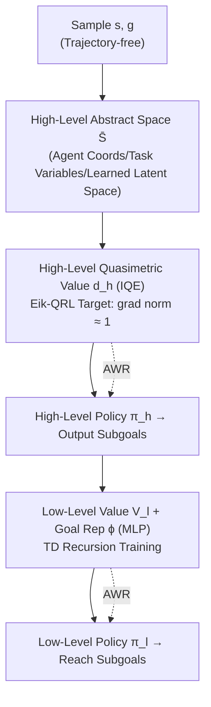

# Goal Reaching with Eikonal-Constrained Hierarchical Quasimetric Reinforcement Learning

**Conference**: ICLR 2026  
**OpenReview**: [https://openreview.net/forum?id=5WhsCB0Vty](https://openreview.net/forum?id=5WhsCB0Vty)  
**Code**: TBD (camera-ready promised to be open-sourced)  
**Area**: Reinforcement Learning / Goal-Conditioned RL  
**Keywords**: Goal-Conditioned RL, Quasimetric RL, Eikonal PDE, PINN, Hierarchical RL, Offline RL  

## TL;DR
The discrete per-transition local constraints of Quasimetric RL are reformulated into continuous-time Eikonal Partial Differential Equation (PDE) constraints (where the gradient norm is 1). This makes value learning "trajectory-free," requiring only sampled states and goals. A hierarchical structure is integrated to alleviate failures under complex dynamics, achieving SOTA on OGbench navigation tasks.

## Background & Motivation

**Background**: Goal-Conditioned Reinforcement Learning (GCRL) replaces manual reward design with "reaching arbitrary goals." The optimal value function $V^*(s,g)$ is exactly equal to the shortest feasible path length from status $s$ to goal $g$, naturally forming a **quasimetric**. Quasimetric RL (QRL) utilizes this geometric property to restrict the value function learning within a quasimetric space satisfying the triangle inequality, thereby narrowing the hypothesis space from "any function" to a "structured subset aligned with shortest-path tasks."

**Limitations of Prior Work**: The local consistency of QRL is enforced through **discrete, trajectory-based constraints**—it samples real transitions $(s, s')$ from the dataset and penalizes $\max(d_\theta(s,s')-\text{cost},0)^2$. This leads to two issues: (1) Dependence on transition pairs that actually appear in the dataset, inherently relying on trajectories; (2) Constraints only act along observed transition directions, resulting in weak generalization for Out-of-Distribution (OOD) state-goal pairs, which is particularly challenging in large environments and offline scenarios requiring "stitching."

**Key Challenge**: While the discrete-time perspective is convenient for implementation, it offers no fundamental advantage for many scenarios—the local consistency of the value function can be characterized by PDEs in **continuous time**. Historically, the difficulty of solving PDEs limited their application in RL, but Physics-Informed Neural Networks (PINN) are breaking this barrier by incorporating PDE constraints directly into training objectives through automatic differentiation.

**Goal**: Replace the discrete trajectory constraints of QRL with continuous-time PDE constraints to make value learning "trajectory-free," while obtaining the stability and OOD generalization benefits provided by PDE as an implicit regularization.

**Core Idea**: **[Continuous-time Reconstruction]** Derive the HJB PDE from the local constraints of QRL, then simplify it to the **Eikonal equation** (where the value function gradient norm is constantly 1) under unit-velocity and isotropic dynamics assumptions to obtain Eik-QRL; **[Hierarchical Solution]** To address the failure of Eikonal assumptions under complex dynamics, embed Eik-QRL into a high/low-level hierarchical architecture, Eik-HiQRL.

## Method

### Overall Architecture

The method is advanced in two layers. The first layer, Eik-QRL, is the core theoretical contribution: starting from the discrete local constraints of QRL, it derives the continuous-time HJB inequality via the triangle inequality and first-order Taylor expansion, then collapses it into a clean Eikonal gradient constraint using isotropic dynamics assumptions. This allows training to require only i.i.d. sampled $(s,g)$ pairs. The second layer, Eik-HiQRL, solves a practical problem: high-dimensional, contact-discontinuous dynamics (such as antmaze) break the Lipschitz regularity that Eikonal relies on. Therefore, a hierarchical design is used where a high level runs Eik-QRL in a low-dimensional abstract space to generate subgoals, and a low level follows subgoals using TD recursion, preserving the benefits of quasimetric structures while bypassing their failure domains.

### Key Designs

**1. From Discrete Constraints to HJB Inequality: The Continuous-Time Bridge**. The starting point is the local constraint of QRL $\mathbb{E}[\max(d_\theta(s,s')-1,0)^2]\le\epsilon^2$, which essentially requires $d(s,s')\le c(s,g)\Delta t+o(\Delta t)$. Substituting this into the triangle inequality $d(s,g)\le d(s,s')+d(s',g)$ and applying a first-order Taylor expansion to $d(s',g)$ as $d(s',g)=d(s,g)+\nabla_s d(s,g)^\top f(s,a)\Delta t+o(\Delta t)$, subtracting $d(s,g)$ from both sides, dividing by $\Delta t$, and letting $\Delta t\to 0$ yields the static HJB inequality $0\le c(s,g)+\nabla_s d(s,g)^\top f(s,a)$. At the optimal solution $d^*$, taking the infimum over actions tightens this to the HJB-PDE. The significance of this step is that the discrete constraint of "penalizing distance along real transitions" is translated into a differential equation regarding the value function **gradient**, thus opening a PINN-style training channel.

**2. Eikonal Simplification: Decoupling Training from Trajectories**. Directly using the HJB residual as a constraint (i.e., HJB-QRL, Equation 7) is difficult to optimize in practice—the inner product $\nabla_s d_\theta(s,g)^\top(s'-s)$ is ill-posed in high-dimensional state spaces, and it still relies on transition pairs $(s,s')$, failing to truly discard trajectories. The key move in this paper is to impose a **unit-velocity, isotropic** dynamics assumption $f(s,a)=a,\ \|a\|\le 1$. In this case, the optimal action $a^*=-\nabla_s d(s,g)/\|\nabla_s d(s,g)\|$, and the HJB constraint collapses into a pure **unit-slope condition**. Thus, the Eik-QRL objective is written as:
$$\max_\theta\ \mathbb{E}_{s,g}\big[\zeta(d_\theta(s,g))\big]\quad\text{s.t.}\quad \mathbb{E}_{s\sim P_\text{state},\,g\sim P_\text{goal}}\big[(\|\nabla_s d_\theta(s,g)\|-1)^2\big]\le\epsilon^2.$$
The constraint only contains $s$ and $g$, and $s'$ no longer appears—this is the source of being "trajectory-free": in navigation, $s,g$ can be sampled uniformly from free poses in occupancy maps, and in manipulation tasks, goal poses can be sampled from collision-free workspaces. Furthermore, each sampling pair contributes a complete gradient vector $\nabla_s d_\theta\in\mathbb{R}^k$, coupling all coordinate directions, which promotes global consistency better than QRL which only constrains along observed transition directions.

**3. Theoretical Guarantees and its Boundaries**. Ours proves that under unit-velocity integrator dynamics + unit running cost, the optimal value $d^*(\cdot,g)=-V^*(\cdot,g)$ is **1-Lipschitz** on the feasible set (Lemma 4.7), which is equivalent to $\|\nabla_s d^*\|=1$. Thus, $d^*$ itself satisfies the Eikonal constraint, and a universal quasimetric approximator can recover $d^*$ (Theorem 4.8, approximate recovery with high probability). However, the authors honestly point out the boundary: in environments like antmaze where contact points are discontinuous and the Lipschitz assumption cannot be verified, pure Eik-QRL will degrade. Fortunately, the shortest-path geometry is preserved under proportional scaling of Lipschitz functions, and policy gradients are insensitive to value scale. Therefore, even if the assumption does not strictly hold, Eik-QRL remains competitive in practice—this constitutes the motivation for introducing hierarchy.

**4. Eik-HiQRL: Scoping the Eikonal Assumption within Low-Dimensional Space**. Enforcing quasimetric structures directly in complex high-dimensional state spaces is inherently difficult (approximation error grows exponentially with dimension), and isotropic assumptions no longer hold. The hierarchical design solves three things simultaneously: (1) **Dimensionality Reduction**—The high level perform quasimetric projection only in a low-dimensional abstract space $\bar S$ (such as agent coordinates, task-related object coordinates, or an end-to-end learned latent space $\nu(s)$), making the regularization assumptions of Eik-QRL approximately valid; (2) **Eikonal Regularization**—The high-level value $d_h$ is parameterized with IQE and trained according to the Eik-QRL objective, generating better subgoals; (3) **SNR Improvement**—Directly estimating $V(s,g)$ in long-range tasks has very low signal-to-noise ratio. The high level producing subgoals and the low level (value $V_l$ + goal representation $\phi$, TD training) only needing to follow near-range subgoals alleviates this issue. Both high and low-level policies are trained using Advantage Weighted Regression (AWR). For manipulation tasks, the abstract latent space is learned end-to-end via an MLP $\nu:S\to Z$, with gradients backpropagated from both global relational loss and Eikonal local constraints, **without adding any additional explicit geometric constraint loss**.

## Key Experimental Results

Experiments are all conducted under the Offline GCRL setting (based on OGbench), as fixed datasets are better for evaluating OOD generalization. In addition to success rate $R$, **collision rate $\kappa$** (percentage of time steps where the agent collides with obstacles) is specifically introduced as a metric.

### Main Results: Comparison of Four QRL Variants (Selected from Table 1, R↑ / κ↓)

| Area | Dataset/Scale | Eik-HiQRL | Eik-QRL | HJB-QRL | QRL |
|---|---|---|---|---|---|
| pointmaze | navigate-giant | 73 / 14 | 82 / 18 | 83 / 17 | 69 / **60** |
| pointmaze | stitch-giant | 62 / 28 | 73 / 19 | 70 / 19 | 51 / 61 |
| antmaze | navigate-medium | **93** / 18 | 84 / 25 | 31 / 35 | 82 / 25 |
| antmaze | navigate-large | **86** / 25 | 74 / 25 | 28 / 36 | 54 / 38 |
| antmaze | stitch-medium | **94** / 19 | 70 / 32 | 37 / 38 | 66 / 26 |
| antmaze | stitch-large | **81** / 23 | 23 / 31 | 13 / 36 | 15 / 39 |

In the ideally isotropic pointmaze, the three PDE-constrained forms perform similarly, and the collision rate is far lower than QRL (QRL's high success rate is achieved through "wall-sliding," which fails in large environments). In high-dimensional complex dynamics of antmaze, pure quasimetric methods collectively degrade, but Eik-QRL always outperforms HJB-QRL (confirming numerical optimization difficulties of Equation 7), and Eik-HiQRL leads comprehensively.

### Comparison with Strong Baselines in Irregular Environments (Selected from Table 2, best eval)

| Area | Dataset | Eik-HiQRL | Eik-HIQL | HIQL | QRL | CRL |
|---|---|---|---|---|---|---|
| antsoccer | navigate-arena | **61** | 19 | 60 | 10 | 24 |
| antsoccer | stitch-arena | **32** | 2 | 17 | 2 | 1 |
| cube | single-play | 12 | 25 | 31 | 11 | **32** |
| scene | play | **55** | 52 | 52 | 8 | 35 |

Learning curves for humanoidmaze (Fig. 4) show that Eik-HiQRL has a statistically significant advantage over the strongest baselines in long-range large/giant-stitch tasks (Welch t-test $t=11.7, p\approx10^{-9}$ and $t=22, p\approx10^{-14}$), achieving SOTA on this benchmark according to the authors.

### Key Findings
- **Stitching is the scenario where the Gain from PDE constraints is most obvious**: The regularization effect makes the value more accurate for OOD state-goal pairs.
- **Collision rate reveals hidden defects in QRL**: High success rates might be built on "wall-crashing" strategies, while PDE constraints significantly reduce collisions.
- **Gains in manipulation tasks (cube/scene) are unstable**: Contact events are often represented by categorical/mode-switching variables, introducing sharp discontinuities in the value function that conflict with smooth PDE topology assumptions; Eik-HiQRL only matches baselines.

## Highlights & Insights
- **Connects "Value Learning in Model-Free RL" with "PINN/PDE Solving"**: The derivation from HJB → Eikonal turns abstract continuous-time optimal control into an auto-differentiable training constraint, providing a "hybrid" perspective between model-free and model-based.
- **"Trajectory-free" is a truly practical property**: Sampling state-goal pairs alone is directly applicable to navigation with occupancy maps, manipulation with collision-free workspace sampling, or autonomous driving with lane centerlines.
- **Honest analysis of limitations**: The authors clearly mark the cost of isotropic assumptions and reasons for failure under contact-discontinuous dynamics, rather than avoiding them.
- **Evaluation protocol introduces collision rate**: Corrects a blind spot in RL literature which focuses solely on success rate and ignores whether the "process is safe."

## Limitations & Future Work
- **Strong isotropic + unit-velocity assumptions**: Restricting the solution space to a specific class of MDPs may not be optimal for all dynamics; the authors list "transcending isotropy while retaining numerical advantages" as future work.
- **Limited Gain in contact-rich manipulation tasks**: Hybrid/discontinuous dynamics fundamentally conflict with smooth PDE assumptions, requiring PDE constraints specifically designed for contact-rich scenarios.
- **Abstract space design remains a heuristic/end-to-end compromise**: Navigation relies on coordinates while manipulation relies on learned latent spaces; how to systematically learn representations that "both satisfy PDE regularization and facilitate control" is an open problem.
- **Theoretical guarantees rely on hard-to-verify regularity conditions**: 1-Lipschitz properties cannot be verified in tasks such as antmaze, and practical effectiveness is primarily supported empirically.

## Related Work & Insights
- **Direct predecessor QRL** (Wang et al. 2023): Ours is a continuous-time reformulation, replacing discrete trajectory constraints with PDE constraints.
- **PINN / HJB Solving** (Raissi et al. 2019; Bansal & Tomlin 2021 DeepReach; Shilova et al. 2023): Provides the technical foundation for placing PDEs into training objectives, but was previously limited to simple/low-dimensional dynamics.
- **PDE-Regularized Value Estimation** (Lien et al. 2024; Giammarino et al. 2025 Eik-HIQL): Previously used PDE as an "additive regularization term," while Ours upgrades it to a core structural constraint.
- **Hierarchical GCRL** (HIQL, Park et al. 2024b): Ours introduces quasimetric + Eikonal values at the high level, surpassing single-value designs.
- **Insight**: When the optimal solution of a learning problem has clear geometric/differential properties (here 1-Lipschitz / Eikonal), rather than "forcing" it out with large amounts of data along observed directions, it is better to inject this property directly as a differentiable constraint into training—this idea of "geometric prior as a constraint" is also applicable to other structured learning problems.

## Rating
- **Novelty**: ⭐⭐⭐⭐⭐ Reformulating discrete QRL constraints into Eikonal PDE constraints to achieve trajectory-free learning is a clear original contribution at the intersection of GCRL and PINN, accompanied by theoretical guarantees.
- **Experimental Thoroughness**: ⭐⭐⭐⭐ Extensive testing across OGbench suites (pointmaze/antmaze/humanoidmaze/antsoccer/cube/scene), 10 seeds, introduction of collision rate metrics, and inclusion of statistical tests and multiple ablation studies; however, the advantage in manipulation tasks is not obvious, and some conclusions lean towards the navigation domain.
- **Writing Quality**: ⭐⭐⭐⭐⭐ The derivation chain (discrete → HJB → Eikonal) is clear, and assumptions, guarantees, and limitations are honestly addressed. The charts are well-organized.
- **Value**: ⭐⭐⭐⭐ Achieves SOTA in navigation-type offline GCRL and provides a transferable "PDE constraint + Hierarchy" paradigm; applicability to contact-rich manipulation tasks remains to be resolved in subsequent work.

<!-- RELATED:START -->

## Related Papers

- [\[ICLR 2026\] Multistep Quasimetric Learning for Scalable Goal-Conditioned Reinforcement Learning](scaling_goal-conditioned_reinforcement_learning_with_multistep_quasimetric_dista.md)
- [\[ICLR 2026\] Dual Goal Representations](dual_goal_representations.md)
- [\[ICLR 2026\] Off-Policy Safe Reinforcement Learning with Constrained Optimistic Exploration](off-policy_safe_reinforcement_learning_with_cost-constrained_optimistic_explorat.md)
- [\[ICLR 2026\] Strict Subgoal Execution: Reliable Long-Horizon Planning in Hierarchical Reinforcement Learning](strict_subgoal_execution_reliable_long-horizon_planning_in_hierarchical_reinforc.md)
- [\[ICLR 2026\] Occupancy Reward Shaping: Improving Credit Assignment for Offline Goal-Conditioned Reinforcement Learning](occupancy_reward_shaping_improving_credit_assignment_for_offline_goal-conditione.md)

<!-- RELATED:END -->
