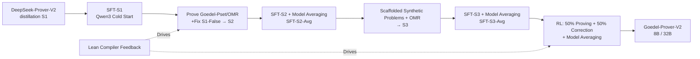

# Goedel-Prover-V2: Scaling Formal Theorem Proving with Scaffolded Data Synthesis and Self-Correction

**Conference**: ICLR 2026  
**OpenReview**: [https://openreview.net/forum?id=j4C0nALrgK](https://openreview.net/forum?id=j4C0nALrgK)  
**Code**: [https://github.com/Goedel-LM/Goedel-Prover-V2](https://github.com/Goedel-LM/Goedel-Prover-V2)  
**Area**: Reinforcement Learning / Formal Theorem Proving / LLM Reasoning  
**Keywords**: Automated Theorem Proving, Lean, Expert Iteration, Reinforcement Learning (GRPO/DAPO), Self-Correction, Data Synthesis, Model Averaging  

## TL;DR
By integrating a trio of "Scaffolded Data Synthesis + Compiler Feedback-driven Self-Correction + Model Averaging," an open-source Lean theorem prover achieves a new SOTA. The 8B model outperforms the 671B DeepSeek-Prover-V2, and the 32B model reaches a 90.4% pass@32 on MiniF2F with 20x fewer parameters and a significantly lower computational budget.

## Background & Motivation
- **Background**: Automated theorem proving (ATP) requires LLMs to generate complete formal proofs verifiable by the Lean compiler. While closed-source frontier models (AlphaProof, Seed-Prover) have reached IMO medal levels, they demand extreme compute and utilize opaque training details; open-source models (DeepSeek-Prover-V2, Kimina-Prover) have achieved strong results via long-CoT reasoning.
- **Limitations of Prior Work**: (1) Open-source models rely heavily on massive sampling budgets (pass@8192) or test-time RL to boost accuracy benchmarks, incurring high inference costs. (2) Models like DeepSeek-Prover-V2 have **lost self-correction capabilities** after repeated training, while general-purpose models like Qwen3 lack formal proving skills. (3) Training data quality is poor—over 80% of unsolved problems in Goedel-Pset-v1 are actually **formalization errors** rather than genuine mathematical difficulties.
- **Key Challenge**: Models tend to "overfit" in late-stage training, leading to **declining output diversity**—where pass@1 increases but pass@N (for large N) decreases. Standard expert iteration or RL struggles to balance accuracy with diversity.
- **Goal**: To approach the frontier of formal theorem proving using computationally efficient and reproducible open-source models, while significantly reducing the sampling budget during inference.
- **Core Idea**: A **[Training-Data-Inference Triple Synergy]** framework that introduces compiler feedback for self-correction at the framework level, synthesizes "appropriately difficult" problems at the data level, and employs model averaging at the training level to recover diversity.

## Method

### Overall Architecture
The pipeline consists of **Expert Iteration + RL** centered around Qwen3 cold-starting: first, distillation data from DeepSeek-Prover-V2 cold-starts Qwen3 for the initial prover, followed by a cycle of "large-scale inference for correct proofs → SFT → Model Averaging → Scaffolded Data Synthesis → Further SFT → Final RL." Three key innovations are embedded in data synthesis, the framework (self-correction), and training (model averaging).

### Key Designs

**1. Scaffolded Data Synthesis: Generating learning signals via appropriately difficult problems.** When training progress plateaus on human-authored problems, the prover synthesizes new problems of increasing difficulty for itself. One path is **rule-based**: if a proof fails, Lean's `extract_goal` tactic extracts unsolved sub-goals from the incomplete proof—even if the overall proof is wrong, the sub-goals are often valid, simpler lemmas. Since extracted propositions are not guaranteed to be provable, the authors also include their **negations** in training to teach the model to identify true/false statements. The second path is **LLM-based**: Qwen3-32B generates harder variants of solved problems and simpler sub-problems for unsolved ones, which are then formalized by Goedel-Formalizer-V2 and evaluated for correctness and difficulty via an LLM filter (discarding trivial problems and storing negations of false ones). The accompanying Goedel-Formalizer-V2 integrates reasoning capabilities, successfully formalizing 228/300 problems on Omni-MATH, significantly outperforming Kimina-Autoformalizer's 161.

**2. Verifier-guided Self-Correction: Feeding Lean errors back for iterative proof refinement.** Traditional whole-proof generation is a "one-shot end-to-end" process, whereas humans refine Lean code iteratively. This method explicitly introduces verifier feedback into the generation loop: after an initial proof failure, the Lean compiler's error messages are parsed and appended to the model input as correction guidance. The model then generates a proof revision, forming an iterative correction loop. Critically, this mechanism is integrated into **long-CoT** reasoning. Ablation shows that removing specific error messages (w/o Error Messages) leads to significant performance drops, proving that error text is core to effective revision; however, removing early-round CoTs (w/o Previous CoTs) has minimal impact, suggesting historical CoTs can be omitted to reduce per-task overhead.

**3. RL Difficulty Curriculum + Model Averaging: Balancing accuracy and sampling diversity.** RL utilizes a hybrid GRPO scheme: removing group normalization (per Dr.GRPO) to eliminate length bias, incorporating DAPO's clip-higher, overlong penalty, and dynamic sampling, while removing the KL divergence term to encourage exploration. In the multi-task setup, 50% of inputs focus on complete proofs and 50% on self-correction. A key observation is that **problem difficulty significantly impacts RL**, so dynamic sampling only retains problems with pass rates in the $(0, 0.75]$ range for optimization. To address the decline in diversity during late-stage SFT/RL (pass@1↑ but pass@N↓), model averaging is applied at each stage: combining base model parameters $\theta_0$ with fine-tuned parameters $\theta$ as $(1-\alpha)\theta_0 + \alpha\theta$. The main experiment uses $\alpha=0.8$, a simple yet effective method to recover pass@N characteristic diversity.

## Key Experimental Results

### Main Results (MiniF2F test, pass@N accuracy)

| Model | Parameters | pass@32 | pass@8192 |
|---|---|---|---|
| DeepSeek-Prover-V2 | 671B | 82.4% | 88.9% |
| Kimina-Prover | 72B | 84.0% (pass@32) | 87.7% (pass@1024) |
| **Goedel-Prover-V2-8B** | 8B | **84.6%** | 90.2% |
| Goedel-Prover-V2-8B w/ Correction | 8B | 86.7% | — |
| **Goedel-Prover-V2-32B** | 32B | **88.1%** | 92.2% |
| **Goedel-Prover-V2-32B w/ Correction** | 32B | **90.4%** | 92.6% |

The 8B model outperforms the 671B DeepSeek-Prover-V2 on MiniF2F while being 80× smaller.

### Ablation Study

| Setting | Effect |
|---|---|
| Full Self-Correction | MiniF2F pass@32 +~2 percentage points; PutnamBench pass@32 +14 problems |
| w/o Error Messages | Significant performance drop (error text is critical) |
| w/o Previous CoTs | Minimal drop (can be omitted for efficiency) |
| DeepSeek-Prover-V2-7B (No correction training) | Self-correction only 75.8%→76.2% (nearly ineffective) |
| 128k Context + 5 revision rounds | pass@32 reaches 92.7%, surpassing pass@8192 (92.2%) without correction |

### Key Findings
- **PutnamBench**: The 32B self-correction mode solves **86 problems** (pass@184), topping the open-source leaderboard and exceeding DeepSeek-Prover-V2's 47 problems (pass@1024) by 39, despite being ~20× smaller with much lower compute.
- **Sample Efficiency**: High pass@N is achieved with small budgets (N=32/64), indicating that strong reasoning strategies are internalized during training, reducing reliance on massive sampling or test-time RL.
- **Correction efficacy is conditional**: Self-correction is only effective for models trained to interpret compiler feedback; untrained models derive almost no benefit.
- **Compute Budget**: Data generation took ~12k H100 GPU hours; SFT/RL for the 32B model took 9.2k/3.9k hours, and 2.3k/1.3k hours for the 8B model.

## Highlights & Insights
- **"Appropriate Difficulty" is the key to data synthesis**: Scaffolding is not about volume, but about using `extract_goal` and LLM variants to generate problems the model is currently capable of learning, plus including negations of false propositions to teach the model to both prove and disprove.
- **Self-correction value is gated by "feedback training"**: Simply feeding Lean errors back is insufficient; the model must be trained to decode compiler feedback. This explains why the proposed model gains 2 points while DeepSeek-Prover-V2-7B remains stagnant given the same feedback.
- **Model Averaging is a cheap antidote to RL/SFT diversity collapse**: Using a single-line interpolation $(1-\alpha)\theta_0+\alpha\theta$ reverses the "pass@1 up, pass@N down" trend, which is crucial for proving tasks that rely on large-N sampling.
- **Small Model + Self-Correction ≈ Large Model + Massive Sampling**: With a 128k context and 5 revision rounds, pass@32 (92.7%) surpasses non-correction pass@8192, essentially trading "sampling iteration" for "revision iteration" for higher efficiency.

## Limitations & Future Work
- The LLM filter in data synthesis may misjudge problems, discarding valid data—a trade-off between throughput and quality.
- Main experiments for self-correction used only 2 rounds and 40k tokens; expanding to 128k/5 rounds is stronger but increases inference costs. The cost-benefit curve for long-context revision remains to be systematically mapped.
- There is still a significant gap compared to the closed-source Seed-Prover (331 problems on PutnamBench); the chasm between open-source and closed-source frontiers remains.
- The method relies heavily on Lean compiler feedback and existing datasets (OMR, Goedel-Pset). Its transferability to other assistants (Coq, Isabelle) or higher difficulties (IMO-level MathOlympiadBench) requires further verification.

## Related Work & Insights
- **Open-source Provers**: DeepSeek-Prover-V2 and Kimina-Prover use long-CoT to push benchmarks; this work builds on them by adding self-correction and data synthesis while lowering sampling budgets.
- **Compiler Feedback Correction**: First et al. (2023) in theorem proving and Olausson/Chen et al. in code generation previously used verifier feedback; this work systematically integrates it into a long-CoT prover with dedicated training.
- **Model Averaging**: Model Soups (Wortsman et al., 2022) showed that weight interpolation improves generalization/diversity; this work applies it to mitigate diversity collapse in late-stage ATP training.
- **RL Algorithms**: The integration of Dr.GRPO (removing group norm for length bias), DAPO (clip-higher / dynamic sampling / overlong penalty), and a difficulty curriculum ($(0,0.75]$ pass rate) provides a reference for other long-reasoning RL tasks.

## Rating
- **Novelty**: ⭐⭐⭐⭐ — Individual innovations (scaffolded synthesis / compiler correction / model averaging) are largely adaptations of existing ideas, but their systematic integration and "difficulty gating" in ATP are robust and effective.
- **Experimental Thoroughness**: ⭐⭐⭐⭐⭐ — Covers MiniF2F / PutnamBench / MathOlympiadBench / FIMO / ProverBench, with extensive ablations on scaling, self-correction, model averaging, and decontamination.
- **Writing Quality**: ⭐⭐⭐⭐ — The pipeline (Figure 3) and data/model flows are clearly explained. The logic across framework, data, and training layers is coherent.
- **Value**: ⭐⭐⭐⭐⭐ — A new open-source SOTA. The 8B model beats 671B, and the 32B model tops PutnamBench with 20x less volume. Full open-sourcing of models, code, and data provides high value to the community.

<!-- RELATED:START -->

## Related Papers

- [\[ICLR 2026\] GAR: Generative Adversarial Reinforcement Learning for Formal Theorem Proving](gar_generative_adversarial_reinforcement_learning_for_formal_theorem_proving.md)
- [\[ICLR 2026\] Webscale-RL: Automated Data Pipeline for Scaling RL Data to Pretraining Levels](webscale-rl_automated_data_pipeline_for_scaling_rl_data_to_pretraining_levels.md)
- [\[ICLR 2026\] R-Zero: Self-Evolving Reasoning LLM from Zero Data](r-zero_self-evolving_reasoning_llm_from_zero_data.md)
- [\[ICLR 2026\] Beyond Pass@1: Self-Play with Variational Problem Synthesis Sustains RLVR](beyond_pass_1_self-play_with_variational_problem_synthesis_sustains_rlvr.md)
- [\[ICML 2026\] ORLoopBench: Solver-in-the-Loop Benchmarks for Self-Correction and Behavioral Rationality in Operations Research](../../ICML2026/reinforcement_learning/orloopbench_solver-in-the-loop_benchmarks_for_self-correction_and_behavioral_rat.md)

<!-- RELATED:END -->
