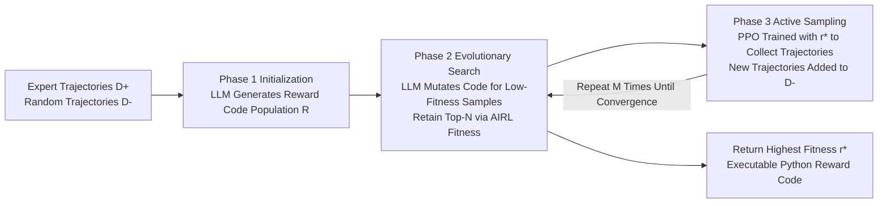

# GRACE: A Language Model Framework for Explainable Inverse Reinforcement Learning

**Conference**: ICLR 2026  
**OpenReview**: [https://openreview.net/forum?id=uW9FoHBuoQ](https://openreview.net/forum?id=uW9FoHBuoQ)  
**Code**: To be confirmed  
**Area**: Reinforcement Learning / Inverse Reinforcement Learning  
**Keywords**: Inverse Reinforcement Learning, Reward-As-Code, Large Language Models, Evolutionary Search, Explainability  

## TL;DR
GRACE replaces the black-box neural network reward models in Inverse Reinforcement Learning (IRL) with "executable Python code." It utilizes code LLMs within an evolutionary search to infer readable and verifiable reward functions using only expert trajectories, without requiring task descriptions or ground-truth rewards.

## Background & Motivation
- **Background**: Performance of modern RL agents heavily depends on the quality of reward functions. However, while environments are often accessible, rewards are frequently missing. IRL seeks to infer rewards from expert demonstrations. Deep IRL (e.g., AIRL, GAIL) represents rewards using neural networks and performs distribution matching through adversarial training.
- **Limitations of Prior Work**: Neural network rewards are **opaque black boxes**, making them difficult to explain, verify, and debug. Furthermore, IRL typically requires large amounts of data, and the recovered rewards may be inaccurate. The "Reward-As-Code" approach (e.g., EUREKA, Reward-As-Code) provides readability, but **EUREKA assumes access to ground-truth rewards for evolution evaluation, and Reward-As-Code relies on explicit task descriptions or goal states and manual pipelines**.
- **Key Challenge**: Explainability (code representation) and the "Pure IRL setting" (only demonstrations, no task descriptions, no ground-truth rewards) have not been simultaneously satisfied. Existing works that generate readable reward code often rely on additional supervision signals.
- **Goal**: To efficiently infer an **executable, explainable, and verifiable** code reward function under the strictest IRL setting—given only expert demonstrations without task descriptions, environment source code, or ground-truth rewards.
- **Core Idea**: **[Reward-As-Code + Evolutionary Search]** Rewards are formulated as a Python program `def reward(state)->float`. Since code is non-differentiable, gradient-based methods are replaced with LLM-driven evolutionary search. The LLM iteratively "self-reflects" on expert and negative states, specifically debugging low-fitness samples to mutate code and approximate rewards that distinguish experts from non-experts.

## Method

### Overall Architecture
GRACE (Generating Rewards As CodE) is a three-phase closed loop: The LLM first analyzes expert trajectories $D^+$ and random trajectories $D^-$ to generate an initial population of reward code (Phase 1); evolutionary search uses the LLM to mutate code targeting low-fitness samples while retaining high-fitness individuals based on AIRL fitness (Phase 2); the current optimal reward is used to train a PPO policy to collect new trajectories, which are added to the negative sample set to expose edge cases (Phase 3), before returning to Phase 1/2 for iteration.

### Key Designs
**1. Population Initialization of Reward-As-Code: Shifting the IRL search space from weights to programs.** In Phase 1, the LLM is provided with a random subset of expert trajectories $D^+$ (and optional environment info like source code or tool signatures) to generate an initial set of reward functions $R_{init}$. Each is a Python function `def reward(state) -> float` aimed at assigning high values to expert states $S_e$ and low values to negative states $S_n$. This set forms the "population" for evolution. An optional data cleaning step allows the LLM to determine which expert states actually "solve the task" as positive samples $S_e$, treating the rest $S_n = \{D^+ \setminus S_e\} \cup D^-$ as negative—critical when expert demonstrations are noisy or suboptimal.

**2. AIRL Fitness + LLM-Targeted Mutation: Using transferable loss for scoring and LLM as a debugger.** Fitness follows the AIRL loss to ensure reward transferability:

$$f(r) = \mathbb{E}_{s\sim S_e}[\log D_r(s)] + \mathbb{E}_{s\sim S_n}[\log(1-D_r(s))]$$

where the discriminator $D_r(s) = \frac{\exp(r(s))}{\exp(r(s)) + \pi(a|s)}$ is parameterized by the reward function. The mutation operator $m(r) = \text{LLM}(\text{source}(r), \text{context}, \text{prompt})$ is not a blind random perturbation. It takes the **parent reward source code, low-fitness "wrong samples" $s_w$, and the current function's output values $r(s_w)$** (along with optional environment info and LLM-defined `debug(s, D+, D-)` prints) to fix failure cases precisely. This transforms "reward learning" into "code debugging," benefiting both explainability and optimizability.

**3. Fitness-Weighted Evolutionary Loop: Softmax selection + Top-N truncation.** Each iteration samples parent rewards based on a softmax distribution of fitness $\frac{\exp(f(r))}{\sum_{r'}\exp(f(r'))}$, applies mutations to generate new candidates, and retains the top $N$ individuals from the combined pool. After $K$ rounds, the individual with the highest fitness $r^* = \arg\max_r f(r)$ is returned. This EVOSEARCH serves as a zero-gradient optimizer for non-differentiable code.

**4. RL Active Data Collection: Exposing reward blind spots via trained policies.** The $r^*$ derived from static demonstrations might misclassify edge cases. Phase 3 uses PPO to train a policy $\pi_{r^*}$ within a preset interaction budget $N$ (instead of training to convergence). New trajectories collected by this policy are added to $D^-$, capturing boundary conditions previously ignored by the reward. If offline fitness is high but online RL performance is poor, **additional reward shaping** is triggered: the LLM is asked to reshape the reward to be monotonically increasing along expert trajectories to mitigate sparsity or poor shaping.

## Key Experimental Results
Evaluations were conducted in BabyAI (procedural reasoning), MuJoCo (continuous control), and AndroidWorld (real device UI control), with **no environment descriptions or source code provided to GRACE** for fairness.

### Main Results (MuJoCo Average Return, 5 seeds)

| Task | PPO (Oracle) | GRACE w/ GPT-4o | GRACE w/ Qwen3-Coder-30B | GAIL (200 traj) | AIRL (200 traj) |
|---|---|---|---|---|---|
| Hopper | 2212±54 | 2143±80 | 2106±76 | 2056±92 | 2028±82 |
| Walker | 2675±292 | 2072±576 | 2229±600 | 1982±101 | 2108±293 |
| Ant | 6239±237 | 5707±210 | 6085±804 | 5521±674 | 4308±306 |
| Humanoid | 6455±302 | 5809±106 | 5921±301 | 6521±337 | 6512±291 |

Policies trained with GRACE code rewards generally approach the PPO oracle and match or exceed GAIL/AIRL (the latter using 200 trajectories).

### Ablation Study (BabyAI Success Rate, GRACE 8 trajectories vs GAIL 2000)

| Level | PPO | GAIL (2000) | GRACE (8) |
|---|---|---|---|
| GoToRedBall | 1.00 | 0.35 | 1.00 |
| PickupLoc | 0.21 | 0.00 | 0.26 |
| OpenTwoDoors | 1.00 | 0.37 | 1.00 |
| OpenMatchingDoor (new) | 0.79 | 0.20 | 0.35 |
| Multi-task | 0.95 | 0.31 | 0.92 |

### Key Findings
- **Sample Efficiency**: In BabyAI, a single demonstration yields non-trivial performance, and only 8 trajectories achieve a reward accuracy of 1.0. Even a single negative trajectory (with sufficient expert data) can reach 0.95 accuracy.
- **Fast Convergence**: In multi-task settings, GRACE converges to high-fitness rewards in fewer than 100 generations without requiring online data (M=1).
- **GAIL Collapse at Low Data**: GAIL fails completely (0% success rate) in several scenarios where GRACE matches the PPO oracle using only 1% of the data.
- **Emergent Modular Reward API**: Evolutionary search naturally develops reusable reward function libraries in multi-task settings, supporting efficient generalization across tasks.

## Highlights & Insights
- **Reformulating IRL as "Program Synthesis"**: Rewards are often simpler than the policies that maximize them (Ng & Russell’s observation). Representations in code with LLM synthesis are naturally complementary, and symbolic representations provide implicit regularization.
- **"Code Debugging" Mutation as a Key Innovation**: Feeding wrong samples, reward values, and custom debug outputs back to the LLM transforms mutation from random search into targeted fixing, which is key to its sample efficiency compared to GAIL.
- **Explainability under Strict IRL Settings**: Unlike EUREKA (requires GT rewards) or Reward-As-Code (requires task descriptions), GRACE produces readable and verifiable rewards from demonstrations alone, offering high engineering value.

## Limitations & Future Work
- **Dependency on Code LLM Capability**: In complex continuous control (e.g., high Walker variance), reward quality is constrained by the LLM's program synthesis abilities.
- **State Parsing Requirements**: BabyAI uses (h,w,3) arrays and Android uses XML view hierarchies—how code rewards can directly consume pixel-only or high-dimensional unstructured states remains an open question.
- **LLM Call Costs**: An average of 2000 LLM calls per task introduces bottlenecks in throughput and cost for evolutionary search.
- **Manual Trigger for Reward Shaping**: Extra shaping currently starts only when offline performance is high but online performance is poor. Mechanisms to automate this decision could be further systematized.

## Related Work & Insights
- **Reward-As-Code**: EUREKA (evolution with GT rewards), Reward-As-Code (depends on task descriptions)—GRACE removes these additional supervision requirements.
- **Deep IRL**: GAIL (adversarial distribution matching), AIRL (transferable disentangled rewards)—GRACE uses AIRL loss for fitness but differs fundamentally in representation and optimization (code + evolution).
- **Evolution + LLM Program Synthesis**: Works like FunSearch and AlphaEvolve use LLMs to search for programs in evolutionary frameworks; GRACE applies this to IRL reward recovery.
- **Insight**: When the objective function is non-differentiable but executable, "LLM-targeted debugging + evolutionary truncation" offers a practical path to replace gradient optimization, generalizable to other learning problems requiring explainable symbolic objectives.

## Rating
- **Novelty**: ⭐⭐⭐⭐ First to produce executable code rewards under pure IRL settings (no task descriptions, no GT rewards). The "code debugging mutation" is a novel angle.
- **Experimental Thoroughness**: ⭐⭐⭐⭐ Covers symbolic, continuous, and real UI domains, including multi-dimensional ablations on sample efficiency and convergence.
- **Writing Quality**: ⭐⭐⭐⭐ Clear three-phase framework and Algorithm 1 description with complete charts.
- **Value**: ⭐⭐⭐⭐ Recovering explainable, verifiable, and sample-efficient rewards has significant practical implications for real-world RL deployment.

<!-- RELATED:START -->

## Related Papers

- [\[ICLR 2026\] Revolutionizing Reinforcement Learning Framework for Diffusion Large Language Models](revolutionizing_reinforcement_learning_framework_for_diffusion_large_language_mo.md)
- [\[AAAI 2026\] Distilling Deep Reinforcement Learning into Interpretable Fuzzy Rules: An Explainable AI Framework](../../AAAI2026/reinforcement_learning/distilling_deep_reinforcement_learning_into_interpretable_fuzzy_rules_an_explain.md)
- [\[ICLR 2026\] Benefits and Pitfalls of Reinforcement Learning for Language Model Planning: A Theoretical Perspective](benefits_and_pitfalls_of_reinforcement_learning_for_language_model_planning_a_th.md)
- [\[ICLR 2026\] GRACE: Generative Representation Learning via Contrastive Policy Optimization](grace_generative_representation_learning_via_contrastive_policy_optimization.md)
- [\[ICLR 2026\] Toward Efficient Exploration by Large Language Model Agents](toward_efficient_exploration_by_large_language_model_agents.md)

<!-- RELATED:END -->
