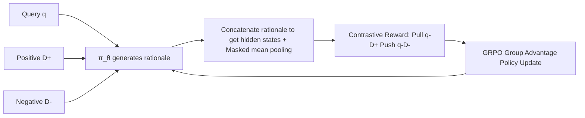

# GRACE: Generative Representation Learning via Contrastive Policy Optimization

**Conference**: ICLR 2026  
**OpenReview**: [https://openreview.net/forum?id=hs9lwjH1bJ](https://openreview.net/forum?id=hs9lwjH1bJ)  
**Code**: [https://github.com/GasolSun36/GRACE](https://github.com/GasolSun36/GRACE)  
**Area**: Reinforcement Learning / Representation Learning / Text Embedding  
**Keywords**: Text embedding, contrastive learning, policy optimization, GRPO, interpretable representation, LLM encoder  

## TL;DR
GRACE reinterprets contrastive learning signals from "losses to be minimized" as "rewards guiding a generative policy." It requires the LLM to first write readable "understanding rationales" for input text before performing mean-pooling on hidden states to obtain embeddings. Using GRPO-style policy gradients to maximize query–positive similarity and minimize query–negative similarity, it significantly improves embedding quality on MTEB while preserving the model's generation and reasoning capabilities.

## Background & Motivation
- **Background**: Utilizing LLMs as general text encoders and fine-tuning them with contrastive loss (InfoNCE) for embeddings is the mainstream approach for tasks like retrieval, clustering, and recommendation (e.g., LLM2Vec, Echo, E5).
- **Limitations of Prior Work**: This paradigm treats the LLM as a black-box function $f_\theta: X \to \mathbb{R}^d$, forcing a model capable of "generation and reasoning" to output only static vectors. Consequently, **generative and reasoning capabilities are suppressed or even compromised**. Furthermore, similarity judgments occur in an opaque latent space; when a model deems two text segments similar, humans cannot discern "why" or which semantic features were captured.
- **Key Challenge**: Discriminative contrastive objectives naturally erase the LLM's most valuable interpretability and generativity, making the two seemingly irreconcilable. Empirical tests in this paper show that standard Contrastive Learning (CL) fine-tuning causes general capabilities (e.g., GSM8K, MMLU, HumanEval) to collapse toward zero.
- **Goal**: To enable an LLM to serve as a strong embedder while retaining readable reasoning traces and general capabilities, unifying representation learning with text generation.
- **Core Idea**: **[Contrastive signals as rewards rather than losses]** Instead of using gradient descent to minimize contrastive loss, the principle that "query and positive samples should be similar, while query and negative samples should be dissimilar" is treated as a reward. This reward guides a generative policy optimized via Group Relative Policy Optimization (GRPO) to **first generate a rationale and then derive embeddings from that rationale**.

## Method

### Overall Architecture
GRACE reformulates representation learning as a sequential decision-making problem. The LLM acts as a policy $\pi_\theta$ that generates an explicit natural language "understanding rationale" for the query $q$, positive document $d^+$, and negative document $d^-$. The "instruction + input + rationale" are fed back into the model to extract the last-layer hidden states, followed by masked mean-pooling to obtain embeddings. Contrastive similarity is used to construct rewards for GRPO policy updates, pulling $q$ and $d^+$ closer while pushing $q$ and $d^-$ apart. No additional generative supervision is used, allowing the rationale to emerge as a human-inspectable decision trace.

### Key Designs

**1. Rationale Generation Policy + Rationale-to-Representation: Anchoring embeddings in readable reasoning.** For any input $x \in \{q, d^+, d^-\}$, a prompt function $P(\cdot)$ with representation instructions is used. The policy samples a rationale $r \sim \pi_\theta(\cdot \mid P(x))$, tasked with identifying key semantic features, core concepts, and latent relationships. Subsequently, the instructed input and rationale are concatenated as $E = \pi_\theta(P(x) \oplus r) \in \mathbb{R}^{L\times d}$. **Masked mean pooling** is then applied, retaining only the text body and excluding system prompt tokens: $h = \frac{1}{|M|}\sum_{t\in M} E_t,\ M=\{t: L_{sys}<t\le L,\ \text{mask}_t=1\}$. Thus, embeddings are "anchored" to explicit reasoning, making them semantically richer and naturally interpretable.

**2. Asymmetric Rollout: Directing compute toward exploring positive samples.** For each training triplet $(q_i, d_i^+, d_i^-)$, the positive document $d^+$ undergoes $K$ random rollouts to generate diverse rationales, exploring different interpretative perspectives of the same content. Conversely, the query and negative documents are sampled only once to serve as **fixed anchors** for reward calculation. This design reduces generative overhead while maintaining exploration diversity, and the multiple positive rollouts facilitate the group-based advantage estimation in GRPO.

**3. Four-way Synergistic Composite Reward: Translating contrastive objectives into policy signals.** The core is the contrastive reward $R_{CL}^{(i,k)} = \text{sim}(h_{q_i}, h_{d_i^+}^{(k)}) - \sum_{m} \text{sim}(h_{q_i}, h_{d_{i,m}^-})$, which pulls positives and pushes negatives. This is augmented by a **consistency reward** $R_{consist}=\frac{1}{K-1}\sum_{j\ne k}\text{sim}(h^{(k)},h^{(j)})$ to ensure multiple rationales for the same document remain close, and **hard negative mining** $R_{hard}=-\frac{1}{B-1}\sum_{j\ne i}\max_l \text{sim}(h_{q_i}, h_{d_j^+}^{(l)})$ to penalize the most confusing distractors within the batch. The total reward $R_{total}=R_{CL}+\lambda_1 R_{consist}+\lambda_2 R_{hard}$ is temperature-scaled $\hat R = R_{total}/\tau$ to sharpen the advantage distribution. Ablations show higher sensitivity to $\lambda_2$ (hard negatives) than $\lambda_1$.

**4. GRPO-style Policy Optimization + Unsupervised Extension: Group advantages without standard deviation normalization.** Advantages are calculated relative to the group baseline but **without standard deviation normalization**: $A^{(i,k)} = R_{final}^{(i,k)} - \frac{1}{K}\sum_l R_{final}^{(i,l)}$. The objective is advantage-weighted log-likelihood $L = -\mathbb{E}\big[\sum_i\sum_k A^{(i,k)}\log\pi_\theta(y_{d_i^+}^{(k)}\mid P(d_i^+))\big]$. Since this is on-policy, importance sampling is omitted. For scenarios with only raw text (unsupervised), following SimCSE, an anchor interpretation of the text is used as the positive, with a self-alignment reward $R_{self}=\text{sim}(h^{anchor}_{x_i}, h^{(k)}_{x_i})$. Consistency and hard negative terms remain the same, allowing the framework to cover both supervised and unsupervised settings.

## Key Experimental Results

### Main Results Table (MTEB 56 datasets across 7 task types, Avg. score)

**Supervised Setting** (Four backbones: Base → w/ reasoning → w/ CL → GRACE):

| Backbone | Base | w/ reasoning | w/ CL | **GRACE** |
|---|---|---|---|---|
| Qwen2.5-1.5B-Instruct | 30.33 | 32.92 | 43.21 | **45.48** |
| LLaMA-3.2-3B-Instruct | 39.34 | 41.54 | 47.39 | **48.49** |
| Qwen2.5-3B-Instruct | 44.12 | 46.59 | 52.10 | **54.74** |
| Qwen3-4B-Instruct-2507 | 45.49 | 46.87 | 54.34 | **56.64** |

The average Gain over Base across four backbones is **+11.52%**, with the largest improvements in Retrieval and Pair Classification.

**Unsupervised Setting** (vs. SimCSE and open-source baselines):

| Backbone | Base | w/ SimCSE | **GRACE** |
|---|---|---|---|
| Qwen2.5-1.5B-Instruct | 30.33 | 39.65 | **41.45** |
| LLaMA-3.2-3B-Instruct | 39.34 | 43.00 | **44.04** |
| Qwen2.5-3B-Instruct | 44.12 | 49.17 | **50.15** |
| Qwen3-4B-Instruct-2507 | 45.49 | 50.11 | **51.03** |

Average unsupervised Gain over Base is **+6.85%**. Optimal results outperfrom LLM2Vec (48.84) and Echo (49.02).

### Ablation Study

**RL Algorithm Substitutability** (GRACE-3B, 16-task subset Avg.):

| Algorithm | Avg. |
|---|---|
| ReMax | 53.36 |
| REINFORCE++ | 54.64 |
| DAPO | 55.78 |
| **GRPO** | **55.89** |

**General Ability Preservation** (Average ∆ across GSM8K/MMLU/TriviaQA/FEVER/BBH/HumanEval):

| Setting (Qwen2.5-1.5B) | Avg. | ∆ |
|---|---|---|
| Base | 40.74 | – |
| w/ CL Fine-tuning | 8.38 | **-32.36** |
| GRACE (Supervised) | 41.08 | **+0.34** |
| GRACE (Unsupervised) | 40.88 | +0.14 |

### Key Findings
- **No trade-off between embedding and generation**: While standard CL fine-tuning causes general task performance to collapse (near 0 for math/code), GRACE maintains performance with near-zero drift or slight gains while significantly improving embedding quality.
- **Hard negative mining is dominant**: Performance is much more sensitive to $\lambda_2$ than $\lambda_1$, suggesting that distinguishing "plausible but incorrect" interference is more critical than interpretation consistency.
- **Decoupling from RL algorithms**: Although GRPO performs best, substituting it with ReMax, REINFORCE++, or DAPO remains effective, verifying the framework's portability.

## Highlights & Insights
- **Elegant Paradigm Reformulation**: Reinterpreting "contrastive loss" as "contrastive reward" integrates representation learning into the RL framework, providing the first empirical evidence that contrastive rewards can train policy models to improve representations.
- **Interpretability as a Free Byproduct**: Embeddings are anchored to human-readable rationales. Why the model considers two segments similar can be inspected directly through text rather than post-hoc probing.
- **Mechanistic Explanation for Stability**: Replacing token-agnostic InfoNCE with relative, advantage-weighted updates shapes the embedding geometry without destroying instruction-following or reasoning, avoiding representation collapse.

## Limitations & Future Work
- **High Inference Cost**: Each input requires generating a rationale (up to 2048 tokens). Compared to traditional single-forward pooling, encoding overhead increases significantly, raising concerns for real-time deployment.
- **Training Resources**: Requires 4×H100. Rollouts (especially $K$ times for positives) amplify training costs; the paper lacks throughput/cost comparisons.
- **Rationale Faithfulness**: While claimed to be interpretable, there is no quantitative verification that rationales truly reflect the basis of similarity judgments, risking "plausible but irrelevant" explanations.

## Related Work & Insights
- **Contrastive Learning Lineage**: Extends from BERT/InfoNCE to LLM2Vec, Echo, E5, and SimCSE, but rewrites the discriminative objective as a reward.
- **LLM Reasoning + RLHF/GRPO**: Migrating outcome-reward policy optimization from alignment/reasoning to representation learning is a novel entry point for "RL-trained embeddings."
- **Inspiration**: Any discriminative task currently minimized via loss might be reformulatable as a reward for a generative policy, yielding interpretable intermediate products while preserving generative capacity.

## Rating
- **Novelty**: ⭐⭐⭐⭐⭐ Reformulating contrastive loss as a reward is a conceptual innovation rather than a mere collection of tricks.
- **Experimental Thoroughness**: ⭐⭐⭐⭐ Solid across multiple backbones and tasks, though lacking inference latency evaluations.
- **Writing Quality**: ⭐⭐⭐⭐ Clear logic throughout; minor typos (e.g., *analysizes*, *Bsse*).
- **Value**: ⭐⭐⭐⭐⭐ Addresses both the "black-box" nature of embeddings and the destruction of general abilities by CL, with an extensible paradigm.

<!-- RELATED:START -->

## Related Papers

- [\[ICLR 2026\] CUDA-L1: Improving CUDA Optimization via Contrastive Reinforcement Learning](cuda-l1_improving_cuda_optimization_via_contrastive_reinforcement_learning.md)
- [\[ICLR 2026\] Single-stream Policy Optimization](single-stream_policy_optimization.md)
- [\[ICLR 2026\] GRACE: A Language Model Framework for Explainable Inverse Reinforcement Learning](grace_a_language_model_framework_for_explainable_inverse_reinforcement_learning.md)
- [\[ICLR 2026\] BAPO: Stabilizing Off-Policy Reinforcement Learning for LLMs via Balanced Policy Optimization with Adaptive Clipping](bapo_stabilizing_off-policy_reinforcement_learning_for_llms_via_balanced_policy_.md)
- [\[ICLR 2026\] SHAPO: Sharpness-Aware Policy Optimization for Safe Exploration](shapo_sharpness-aware_policy_optimization_for_safe_exploration.md)

<!-- RELATED:END -->
