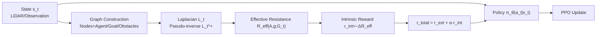

# Graph-Theoretic Intrinsic Reward: Guiding RL with Effective Resistance

**Conference**: ICLR 2026  
**OpenReview**: [https://openreview.net/forum?id=W8bKDPf1Ko](https://openreview.net/forum?id=W8bKDPf1Ko)  
**Code**: To be confirmed  
**Area**: Reinforcement Learning / Intrinsic Reward / Spectral Graph Theory  
**Keywords**: Effective Resistance, Intrinsic Reward, Sparse Rewards, Goal-Conditioned RL, Spectral Graph Theory, Exploration  

## TL;DR
The agent's local perception is modeled as a time-evolving graph. The change in **Effective Resistance ($R_{eff}$)** between the "agent node" and "goal node" on this graph serves as a dense intrinsic reward. This provides a theoretically grounded, on-policy guiding signal for sparse reward exploration from a spectral graph theory perspective, without requiring pre-training.

## Background & Motivation
- **Background**: Exploration in sparse reward environments is a fundamental challenge in RL. Early methods relied on manually designed dense rewards with poor scalability. Modern approaches shift toward intrinsic motivation, using information-theoretic concepts like novelty, curiosity, or surprise to construct dense signals.
- **Limitations of Prior Work**: (1) Most intrinsic reward methods rely on empirical validation and lack theoretical guarantees; (2) Recent SOTA methods like GCPO require expensive Behavioral Cloning (BC) pre-training; (3) Surprise-based methods (e.g., SRL) depend on explicit modeling of transition probabilities $P(s_{t+1}|s_t,a_t)$, which is non-trivial in complex environments; (4) Relational methods like HER are mostly off-policy and struggle with non-Markovian reward structures.
- **Key Challenge**: Common geometric or topological metrics are inadequate—Euclidean distance provides no signal when paths are blocked but straight-line distance remains unchanged; shortest-path distance is brittle and sensitive to single-point failures; algebraic connectivity is too "global" and noisy, failing to focus on the specific "agent-goal" relationship. A metric that is **dense, goal-oriented, and integrates all possible paths** is needed.
- **Goal**: Design an intrinsic reward for Goal-Conditioned RL (GCRL) that is rooted in spectral graph theory, has theoretical guarantees, requires no pre-training, and operates purely on-policy to guide exploration in dynamic sparse reward environments.
- **Key Insight**: **[Quantifying goal reachability via Effective Resistance]** The state vector is decomposed into a graph (nodes representing agent/goal/obstacle clusters, edge weights reflecting proximity within a sensing radius). Effective resistance between the agent and goal nodes serves as the intrinsic reward. It characterizes "information flow" along all possible paths—a drop in resistance indicates the goal is structurally more reachable in the agent's perceptual map, a dense signal that Euclidean distance cannot capture.

## Method

### Overall Architecture
The method superimposes an intrinsic signal onto standard PPO rewards: $r_{total}(t)=r_{ext}(t)+\alpha\cdot r_{int}(t)$. At each step, high-dimensional states $s_t$ (e.g., LiDAR) are converted into a weighted, undirected, time-varying graph $G_t=(V_t,E_t,W_t)$. The effective resistance $R_{eff}(t)$ between the agent node $A$ and goal node $g$ is computed on this graph. Its **change between adjacent steps** is used as a dense intrinsic reward to update the policy. Note that the graph is only used for reward construction; actions are still predicted by $\pi_\theta(a_t|s_t)$ directly from $s_t$.

### Key Designs

**1. From State Vector to Time-Varying Graph: Focusing on Local Agent-Goal Topology.** Graph construction is the foundation. The algorithm follows three steps: first, clustering similar objects by category (with the agent as a standalone egocentric node); second, connecting the agent node to other nodes; and third, introducing intra-cluster and "selective" inter-cluster edges. The clustering threshold $\tau$ is analytically derived (Appendix A.5.3) rather than arbitrary. This structure preserves "bottleneck/pathway" features from obstacle distributions while maintaining egocentric applicability—it works as long as the state space can be decomposed into entities.

**2. Effective Resistance as a Reachability Metric.** For two nodes $u,v$, effective resistance is defined as the potential difference when injecting a unit current at $u$ and extracting it at $v$. it is calculated via the Moore–Penrose pseudo-inverse $L_t^+$ of the graph Laplacian $L_t$:
$$R_{eff}(u,v;G_t)=(e_u-e_v)^\top L_t^+ (e_u-e_v)$$
where $e_u$ is the standard basis vector for node $u$. Unlike shortest paths (brittle) or algebraic connectivity (noisy/global), effective resistance is a **pairwise, goal-oriented** metric that integrates all paths. When more viable paths appear between the agent and goal, resistance decreases even if Euclidean distance remains constant.

**3. Intrinsic Reward based on Resistance Change with Visibility Handling.** The intrinsic reward is defined by the negative change in resistance (rewarding resistance drops) and handles goal visibility:
$$r_{int}(t)=\begin{cases}-\big(R_{eff}(A,g;G_{t+1})-R_{eff}(A,g;G_t)\big) & \text{Goal remains visible}\\ -\beta & \text{Goal lost}\\ +\beta & \text{Goal re-enters view}\\ 0 & \text{Otherwise}\end{cases}$$
where $\beta\gg0$ is a hyperparameter penalizing goal loss and rewarding its recovery. Corollaries suggest setting $\beta$ to override external rewards and scaling $\alpha$ based on environment dynamics. This is algorithm-agnostic and integrated here with PPO, requiring no pre-training.

**4. Theoretical Guarantees: Connectivity, Robustness, and Variance Reduction.** **Lemma 1** proves $\frac{dR_{eff}}{dt}\cdot\frac{d\kappa(G_t)}{dt}\le -C_1\big(\frac{d\kappa}{dt}\big)^2$, showing that reducing $R_{eff}$ is mathematically equivalent to increasing algebraic connectivity $\kappa$, but $R_{eff}$ is more focused. **Lemma 2** ensures that the step-wise change in $\kappa$ is bounded and Lipschitz continuous over time, stabilizing policy optimization. **Lemma 3** relates $r_{int}$ to one-step connectivity improvements, leading to **Theorem 1**, which proves the optimal policy is $(\epsilon, \delta, T)$-robust (preserving connectivity and goal visibility). **Lemma 4** further proves that $r_{int}$ acts as a variance reduction baseline, making the policy gradient nearly unbiased and reducing required updates to $U_{total}=O(U(2-2\rho))$, where $\rho$ is the correlation between the $Q$-function and $-\alpha R_{eff}$.

## Key Experimental Results

### Main Results (Safety-Gymnasium, 3 environments × 3 difficulties, 5 seeds × 200 epochs)

| Environment / Difficulty | Metric | Ours | Prev. SOTA (GCPO) | Gain |
|---|---|---|---|---|
| Navigation-L2 | Success Rate | **55.5%** | 38.7% | +16.8 pts |
| Building-L2 | Success Rate | **88.4%** | 55.7% | +32.7 pts (>2x SRL-Std's 38.8%) |
| Navigation-L1 | Success Rate | **99.6%** | 84.0% | +15.6 pts |
| Building-L1 | Success Rate | **99.2%** | 86.4% | +12.8 pts |
| Navigation-L2 | Median Norm. Reward | **0.0068** | 0.0017 | ~4× |
| Building-L2 | Median Norm. Reward | **0.0134** | 0.0041 | >3× |
| Building-L1 | Median Norm. Reward | **0.0281** | 0.0155 | ~2× |

- Summary: Up to +59% success rate, up to 56% reduction in steps to goal, and 4x cumulative reward.
- Baselines: PPO, PPO+Ent, SRL-Std, SRL-Diff, NGU, AIM, MEGA, GCPO.

### Ablation Study

| Validation Item | Conclusion |
|---|---|
| $R_{eff}$ vs. $\kappa$ (Connectivity) | $R_{eff}$ provides more focused signals with less noise (A.7/A.8.1). |
| Graph Design (Threshold $\tau$, etc.) | Supported by analytical derivation and sensitivity analysis (A.5.1/A.5.3/A.9). |
| Convergence Rate | Ours reaches the loss plateau earlier, confirming Lemma 4. |
| Hyperparameters $\alpha, \beta$ | Selected based on theoretical motivations in Corollary 1 and verified empirically. |

### Key Findings
- **Performance scales with difficulty**: Gains are most significant in high-difficulty (L2) tasks; simple tasks (L0) see all methods hitting ceilings.
- **Training from scratch outperforms pre-trained baselines**: Ours leads even against GCPO, which requires BC pre-training.
- **Instability of PPO+Ent**: In fading environments (goal disappears after 150 steps), pure entropy exploration degrades, highlighting its vulnerability under dynamic goals.
- Strong alignment between theoretical lemmas and empirical observations across all tests.

## Highlights & Insights
- **Effective Resistance as Intrinsic Reward**: First to formalize this spectral graph metric as a surprise-based intrinsic reward for GCRL, offering "all-path reachability" signals that Euclidean or shortest-path metrics lack.
- **Theoretical-Empirical Alignment**: Every step from "Resistance $\downarrow \Leftrightarrow$ Connectivity $\uparrow$" to robustness theorems and variance reduction is supported by lemmas and verified by experiments.
- **Strong Inductive Bias as a "Free Lunch"**: Unlike Quasimetric Learning which learns metrics from data, spectral graph priors provide interpretability and theoretical guarantees, bypassing high sample complexity.
- **Engineering Friendly**: No pre-training, purely on-policy, and plug-and-play with any RL algorithm (PPO used here).

## Limitations & Future Work
- **Reliance on Entity Decomposition**: Requires extracting entities (agent/goal/obstacles) from states; high-dimensional raw observations (pixels) would need an additional perception module.
- **Computational Overhead**: Graph construction introduces hyperparameters ($\tau$, $\alpha$, $\beta$); computing $L_t^+$ each step may be costly for very large graphs (runtime analysis in A.11 provided).
- **Scope of Evaluation**: Testing is limited to Safety-Gymnasium navigation. Effectiveness in multi-object manipulation or long-horizon tasks remains to be seen.
- **Idealized Assumptions**: Assumptions like bounded sensing range and smooth policy transitions are reasonable but might be challenged in extreme dynamic environments.

## Related Work & Insights
- **Intrinsic Motivation/Exploration**: Surprise (SRL), Curiosity (Pathak 2017), RND (Burda 2018), NGU (Badia 2020), AIM (Wasserstein-1 distance), MEGA (Entropy of goal distribution)—Ours replaces information-theoretic/density signals with graph-structural signals.
- **Goal-Conditioned RL**: HER (off-policy relabeling), GCPO (requires BC pre-training)—Ours provides an on-policy alternative without pre-training.
- **Metric Learning**: Quasimetric Learning (Wang 2023, Liu 2024)—Ours uses spectral graph priors for better sample efficiency.
- **Insight**: Pairwise metrics from spectral graph theory (effective resistance, commute time) could bridge "local distance" and "global connectivity," potentially benefiting multi-agent coordination or network robustness optimization.

## Rating
- **Novelty**: ⭐⭐⭐⭐ — Formalizing effective resistance as an intrinsic reward is a clean, theoretically grounded, and distinct approach from information-theoretic methods.
- **Experimental Thoroughness**: ⭐⭐⭐⭐ — Comprehensive baseline comparison and difficulty scaling, though limited to navigation tasks.
- **Writing Quality**: ⭐⭐⭐⭐ — Logical flow from motivation to theory and empirical validation; clear illustrative figures.
- **Value**: ⭐⭐⭐⭐ — Practical, plug-and-play contribution with strong guarantees for sparse reward GCRL.

<!-- RELATED:START -->

## Related Papers

- [\[ACL 2026\] Verifier-Free RL for LLMs via Intrinsic Gradient-Norm Reward](../../ACL2026/reinforcement_learning/verifier-free_rl_for_llms_via_intrinsic_gradient-norm_reward.md)
- [\[ICLR 2026\] GraphOmni: A Comprehensive and Extensible Benchmark Framework for Large Language Models on Graph-theoretic Tasks](graphomni_a_comprehensive_and_extensible_benchmark_framework_for_large_language_.md)
- [\[ICLR 2026\] Self-Aligned Reward: Towards Effective and Efficient Reasoners](self-aligned_reward_towards_effective_and_efficient_reasoners.md)
- [\[ICLR 2026\] SSVPO: Toward Effective Step-level Credit Assignment for Language Model RL Training](ssvpo_effective_step-level_credit_assignment_for_rl_training_of_language_models.md)
- [\[ICLR 2026\] Efficient Reinforcement Learning by Guiding World Models with Non-Curated Data](efficient_reinforcement_learning_by_guiding_world_models_with_non-curated_data.md)

<!-- RELATED:END -->
