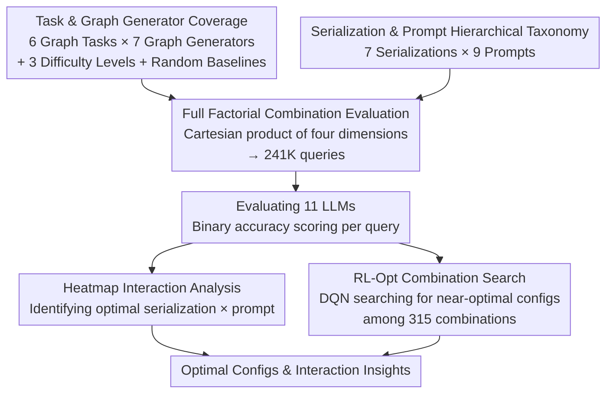

# GraphOmni: A Comprehensive and Extensible Benchmark Framework for Large Language Models on Graph-theoretic Tasks

**Conference**: ICLR 2026  
**arXiv**: [2504.12764](https://arxiv.org/abs/2504.12764)  
**Code**: [GitHub](https://github.com/GAI-Community/GraphOmni)  
**Area**: Reinforcement Learning  
**Keywords**: Graph Reasoning, LLM Benchmarking, Serialization Formats, Prompting Strategies, Reinforcement Learning

## TL;DR

Constructs the GraphOmni benchmark framework to systematically evaluate the graph-theoretic reasoning capabilities of 11 LLMs across 241K queries spanning 7 graph types × 7 serialization formats × 9 prompting strategies. It reveals complex interaction effects among these three dimensions and designs an RL-guided combinatorial search method that maintains approximately 90% optimal accuracy at only 25% of the cost.

## Background & Motivation

**Background**: LLMs have shown excellence in natural language tasks, but reasoning over graph-structured data serialized into text is an emerging direction. Existing benchmarks (NLGraph, GraphQA, GraphInstruct, etc.) have attempted to evaluate LLM graph reasoning but possess significant blind spots in dimensionality coverage.

**Limitations of Prior Work**: As shown in Table 1, existing benchmarks typically focus on a single dimension among graph types, serialization formats, or prompting strategies. NLGraph covers 5 prompts but only 1 graph type and 1 serialization; GraphQA includes 7 graph types but uses only plain text serialization; GraphInstruct supports 3 serializations but only 1 prompt. This "single-dimension tuning" paradigm fails to reveal interaction effects between dimensions and cannot determine if performance gains stem from model capability, text representation, or instruction design. Furthermore, most works lack random baselines, potentially misrepresenting capabilities on class-imbalanced tasks (e.g., cycle detection with a 50% random baseline).

**Key Challenge**: Graph reasoning performance is highly dependent on how the graph is "fed" to the LLM—the same model on the same task can exhibit accuracy fluctuations of up to 40% given different serialization-prompt combinations. Existing work cannot quantify these interactions or guide the selection of optimal configurations in practice.

**Goal**: (1) Build a large-scale benchmark covering the complete Cartesian product of three dimensions; (2) Systematically quantify the interaction effects between graph types, serialization formats, and prompting strategies; (3) Provide an automated mechanism for searching optimal combinations.

**Key Insight**: The core observation is that the three dimensions are not independent—a serialization format effective for open-source models may be detrimental to closed-source ones. Therefore, a full factorial evaluation is necessary for credible conclusions.

**Core Idea**: Through a 7×7×9 full factorial combination evaluation and RL-guided search, this work provides the first systematic characterization of the "graph structure × text representation × prompting method" interaction landscape in LLM graph reasoning.

## Method

### Overall Architecture

GraphOmni is an evaluation framework that decomposes graph input into four pluggable dimensions: 6 types of graph tasks, 7 graph generators, 7 serialization formats, and 9 prompting strategies, overlaid with three difficulty levels: Easy (5-10 nodes), Medium (10-20), and Hard (20-30). Unlike previous benchmarks that fix other dimensions while tuning one, it takes the complete Cartesian product across four dimensions, generating 241,726 query instances. These are evaluated against 7 open-source models (Llama-3, Llama-3.1, Mistral, Phi-4, Qwen-2.5 7B/72B, Qwen-3 8B) and 4+ closed-source models (Claude-3.5, GPT-4o, GPT-4o-mini, Gemini-2.0, o4-mini) using binary accuracy. Results are visualized in heatmaps for interaction analysis and fed into an RL-Opt searcher to identify near-optimal configurations for new tasks without exhaustive grid execution. Each dimension follows a unified interface for extensibility.

### Key Designs

**1. Task & Graph Generator Coverage: Interpretable Reference Frames for Every Score**

To diagnose whether LLMs truly perform graph reasoning, the questions must be interpretable. Six task categories are chosen across three capability tiers: Local Attributes (Connectivity for link understanding, Cycle Detection for pattern recognition), Global Attributes (Diameter requiring the maximum of all-pairs shortest paths, BFS for ordered sequence generation), and Numeric/Path (Shortest Path for planning, Triangle Counting for exact triplet enumeration, the hardest). Each task includes a dedicated random baseline—~67% for Connectivity (prior of real graphs), 50% for Cycle Detection, and ~2% for Triangle Counting—to distinguish actual capability from guessing. The graph side utilizes 7 generators to span topological distributions: Erdős-Rényi (ERM/ERP), Bipartite ER (BERM/BERP), Barabási-Albert (BAG/BAF), and Scale-Free (SF), ensured via statistical testing to have distinct structures within 5-30 nodes.

**2. Serialization & Prompt Hierarchical Taxonomy: Representing Input as Continuous Comparable Axes**

Serialization and instruction depth are the true sources of performance variance. Seven serializations are ordered by redundancy from tight to loose: Edge Set/List (compact edge-based), Adjacency Set/List/Matrix (adjacency-based), and GMoL/GMaL (structured markup). Their token overhead differs significantly, creating a hidden cost/precision trade-off. Nine prompting strategies are ordered by guidance level: from 0-Shot to Algorithm (explicitly describing BFS/Dijkstra steps), with CoT, K-Shot, Instruct, and Least-to-Most (LTM) in between. Mapping these to continuous spectra enables the subsequent heatmap interaction analysis.

**3. Full Factorial Combination Evaluation: Quantifying Interaction Effects for the First Time**

While previous benchmarks fixed dimensions, GraphOmni executes the full Cartesian product. Every combination of (Task, Graph Type, Serialization, Prompt) is executed. This allows accuracy heatmaps for the same model/task to reveal which text representation pairs best with which instruction. This grid uncovers combination variances exceeding 40% and provides data-driven evidence that open-source models benefit from few-shot examples while closed-source models may be hindered by them.

**4. RL-Opt: Efficient Combinatorial Search using Reinforcement Learning**

Since no single combination is universally optimal, a low-cost automated selection mechanism is needed for new tasks. This is modeled as a sequential decision process: the state is the current set of chosen factors (e.g., Adjacency List selected, prompt pending), the action is choosing a candidate option for a dimension, and the reward is verification accuracy. The search space consists of $E = 7 \times 9 \times 5 = 315$ combinations (for 5 open-source models). A DQN approximates the optimal Q-function with $\varepsilon$-greedy exploration ($\varepsilon$ decaying from 1.0 to 0.01). Performance is quantified by Search Cost $\text{Cost}=k/K$ (fraction of explored combinations) and Optimality Rate $\text{Rate}=acc^*/acc_{\max}$ (ratio of found accuracy to global maximum). It achieves ~90% optimality ($\text{Rate}\approx0.90$) while exploring only ~25% of combinations ($\text{Cost}\approx0.22$).

### Loss & Training

Binary accuracy is used throughout, but scoring rules vary by task: qualitative tasks (Connectivity, Cycle Detection) use keyword matching; quantitative tasks (Triangle Counting, Diameter) extract numbers for comparison; and multi-solution tasks (BFS, Shortest Path) use rule-based validation functions. All few-shot experiments use $k=5$ examples to ensure comparability.

## Key Experimental Results

### Main Results (Table 3)

Core results across 6 tasks × 3 difficulties for representative models:

| Task | Difficulty | o4-mini | Claude-3.5 | Qwen-2.5 72B | Qwen-3 8B | Llama-3.1 8B | Random Baseline |
|------|------------|---------|------------|--------------|-----------|--------------|-----------------|
| BFS Traversal | Easy | **95.46** | 91.42 | 71.41 | 65.87 | 18.69 | 0.00 |
| BFS Traversal | Hard | **32.45** | 26.80 | 22.03 | 29.53 | 0.63 | 0.00 |
| Connectivity | Easy | **98.23** | 98.38 | 90.24 | 97.17 | 79.53 | 67.49 |
| Cycle Detection | Easy | **97.97** | 82.56 | 74.02 | 90.30 | 55.49 | 50.00 |
| Diameter | Easy | **98.88** | 83.71 | 78.50 | 77.56 | 41.27 | 11.20 |
| Diameter | Hard | 34.61 | **56.70** | 29.59 | 39.83 | 18.63 | 3.72 |
| Shortest Path | Easy | 95.08 | **94.35** | 90.03 | 77.69 | 38.75 | - |
| Triangle Count | Easy | **84.54** | 43.41 | 36.57 | 41.36 | 14.97 | 2.13 |
| Triangle Count | Hard | **16.27** | 8.63 | 4.73 | 19.54 | 3.07 | 0.47 |

### RL-Opt Search Results (Table 4)

| Task | Difficulty | Avg. Search Cost (Cost) | Avg. Rate (Rate) |
|------|------------|------------------------|------------------|
| BFS Traversal | Easy | 0.220 | 0.974 |
| Connectivity | Easy | 0.224 | 0.988 |
| Cycle Detection | Easy | 0.223 | 0.976 |
| Diameter | Easy | 0.226 | 0.973 |
| Shortest Path | Medium | 0.216 | 0.986 |
| Triangle Count | Easy | 0.228 | 0.906 |
| Triangle Count | Hard | 0.224 | **0.732** |

### Scaling vs. Reasoning Optimization (Table 11)

Using Qwen-2.5 7B as baseline, comparing parameter scaling (72B) and reasoning optimization (Qwen-3 8B):

| Task | Difficulty | Qwen-2.5 7B | Qwen-2.5 72B (Scaling) | Qwen-3 8B (Reasoning) |
|------|------------|-------------|------------------------|-----------------------|
| BFS Traversal | Easy | 21.46 | **71.41** (+50) | 65.87 (+44) |
| BFS Traversal | Hard | 1.38 | 22.03 | **29.53** (+7.5 vs 72B) |
| Diameter | Hard | 15.27 | 29.59 | **39.83** (+10 vs 72B) |
| Triangle Count | Hard | 3.62 | 4.73 | **19.54** (+15 vs 72B) |
| Connectivity | Hard | 81.19 | 84.09 | **92.89** |

### Key Findings

1. **o4-mini leads overall but leaves room for improvement**: o4-mini ranks first in most tasks (Easy BFS 95.46%, Triangle Count 84.54%), but all models drop sharply at Hard difficulty, with Triangle Count (Hard) reaching only 16.27%, indicating limited current capacity for combinatorial graph reasoning.
2. **Scaling lifts the floor, reasoning lifts the ceiling**: The Qwen comparison reveals two paths—72B Significantly improves simple tasks (BFS Easy +50%) but shows negligible gain on Hard Triangle Count (+1.1%); meanwhile, the 8B reasoning model outperforms 72B on late-stage configurations, suggesting combinatorial reasoning benefits more from architecture/paradigm optimization than parameter count.
3. **High variance in serialization-prompt combinations**: Combinations can cause 40%+ accuracy differences. For GPT-4o on Diameter (Easy), the best combo (Algorithm + Adjacency List) reaches 0.715, while the worst is only 0.167.
4. **Different responses to prompting in Open vs. Closed models**: Open-source models benefit significantly from K-Shot and Instruct; closed-source models are more complex—CoT prompts work well in 0-shot, but adding few-shot examples can actually interfere.
5. **Fundamental misconceptions regarding graph concepts**: Error analysis shows LLMs confuse "diameter" with "longest path" and approximate triangle counts as $\lfloor n/3 \rfloor$, suggesting they have not truly mastered graph-theoretic definitions.
6. **Validation on real-world graphs and NP-Hard tasks**: Relative rankings remain consistent on IMDB-MULTI, ogbg-molhiv, and NP-hard problems (Hamiltonian Cycle / Max-Cut), though sparse real-world graphs can lower difficulty for tasks like Connectivity.

## Highlights & Insights

- **Full Factorial Design** is the core methodological contribution. Unlike the "fix others, tune one" approach, GraphOmni’s Cartesian product allows heatmap interaction analysis, a rigorous paradigm rarely seen in NLP benchmarks.
- **Practical value of RL-Opt**: The logic is simple (DQN + ε-greedy search), but it solves the pragmatic problem of finding optimal configurations at minimum cost. Achieving 90% optimality at 25% cost is highly attractive for engineering.
- **Scaling vs. Reasoning comparison** (Table 11) provides a clean control experiment showing how scaling and reasoning architectures offer complementary paths for improvement.
- **Importance of Random Baselines**: Simple tools like the 50% baseline for Cycle Detection reveal that some models (like Llama-3.1 8B at 55.49%) are performing only slightly better than chance.

## Limitations & Future Work

- **Small Graph Scale (max 30 nodes)**: Even with 50-node extensions in the appendix, token limits restrict testing to small-graph "exact reasoning" rather than large-graph "approximate reasoning."
- **Reliance on Synthetic Generators**: Main experiments use synthetic graphs which lack real-world network features like community structure or small-world properties.
- **Lack of Visual Modality**: All inputs are text-serialized. Visual representations (node-edge renders) are unexplored but potentially more natural for VLMs.
- **RL-Opt Search Priors**: The current method assumes zero prior knowledge; incorporating human intuition (e.g., "CoT > 0-Shot") could further reduce costs.
- **Open-source Model Diversity**: Comparison is concentrated in the 7B-14B range; it lacks Llama-3.1 70B or Mistral Large.
- **Expansion to Dynamic/Heterogeneous Graphs**: Current focus is on static homogeneous undirected graphs; temporal or information networks remain for future work.

## Related Work & Insights

- **vs. NLGraph**: NLGraph covers 5 prompts but only 1 graph type/serialization, with a sample size (5902) that is only 2.4% of GraphOmni. GraphOmni refines NLGraph's finding that "Algorithm prompting is best" by showing it depends on the task and model type.
- **vs. GraphQA**: GraphQA lacks multiple serializations and random baselines, potentially leading to overestimating capabilities on tasks like cycle detection.
- **vs. GraphArena**: GraphArena uses only 1 serialization/prompt. GraphOmni reveals the unreliability of single-configuration results.
- **Insight**: When processing graphs in LLM Agent systems, one should tune serialization-prompt combos for specific tasks rather than using a static template.

## Rating

- Novelty: ⭐⭐⭐⭐ Full factorial evaluation is novel, though RL-Opt is standard.
- Experimental Thoroughness: ⭐⭐⭐⭐⭐ 241K queries × 11 models × 3 difficulties plus real-world/NP-hard extensions.
- Writing Quality: ⭐⭐⭐⭐ Clear structure with exhaustive appendices, despite some data redundancy in the main text.
- Value: ⭐⭐⭐⭐ Provides the most comprehensive reference for LLM graph reasoning to date.

<!-- RELATED:START -->

## Related Papers

- [\[ICLR 2026\] Revolutionizing Reinforcement Learning Framework for Diffusion Large Language Models](revolutionizing_reinforcement_learning_framework_for_diffusion_large_language_mo.md)
- [\[ICLR 2026\] Virne: A Comprehensive Benchmark for RL-based Network Resource Allocation in NFV](virne_a_comprehensive_benchmark_for_rl-based_network_resource_allocation_in_nfv.md)
- [\[ICLR 2026\] Graph-Theoretic Intrinsic Reward: Guiding RL with Effective Resistance](graph-theoretic_intrinsic_reward_guiding_rl_with_effective_resistance.md)
- [\[ICLR 2026\] On Predictability of Reinforcement Learning Dynamics for Large Language Models](on_predictability_of_reinforcement_learning_dynamics_for_large_language_models.md)
- [\[ICLR 2026\] VerifyBench: Benchmarking Reference-based Reward Systems for Large Language Models](verifybench_benchmarking_reference-based_reward_systems_for_large_language_model.md)

<!-- RELATED:END -->
