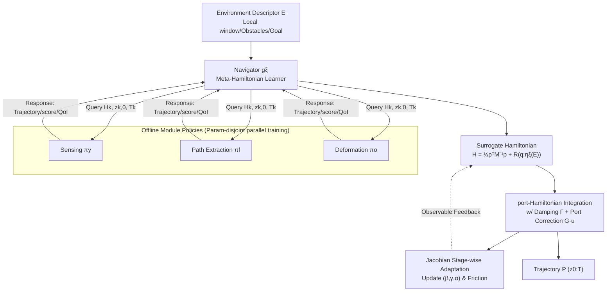

# GRL-SNAM: Geometric Reinforcement Learning with Differential Hamiltonians for Navigation and Mapping in Unknown Environments

**Conference**: ICLR 2026  
**OpenReview**: [https://openreview.net/forum?id=KcC5mwfGf0](https://openreview.net/forum?id=KcC5mwfGf0)  
**Code**: [https://github.com/CVC-Lab/GRL-SNAM](https://github.com/CVC-Lab/GRL-SNAM)  
**Area**: reinforcement learning  
**Keywords**: Geometric Reinforcement Learning, Hamiltonian Dynamics, Simultaneous Navigation and Mapping (SNAM), Differential Policy Optimization, Energy Landscapes, Deformable Robots  

## TL;DR
The paper reformulates "navigation + mapping" as a Hamiltonian energy optimization problem on the cotangent bundle. Control actions are generated directly from the gradients of a learned energy landscape, replacing the Bellman bootstrapping common in mainstream RL. This allows for high-quality navigation with only local observations and minimal global mapping, while generalizing well to unseen environments.

## Background & Motivation
- **Background**: Most RL for continuous navigation employs PPO/SAC/TD3 in Euclidean space, relying on recursive value function bootstrapping (Bellman) to learn policies. Conversely, Simultaneous Navigation and Mapping (SNAM) typically constructs detailed maps before planning. Both approaches have inherent drawbacks.
- **Limitations of Prior Work**: Pure model-free methods suffer from low sample efficiency and cumulative numerical errors during long-range rollouts. Hierarchical methods rely on hand-designed decompositions that fail to transfer across environments. Safety constraints (CBF) are often treated as filters orthogonal to navigation optimality, leading to conservative behavior. Deformable robot navigation mostly relies on pre-programmed deformation sequences, lacking online adaptability.
- **Key Challenge**: Standard RL policies **do not explicitly encode the geometric and physical structures of navigation**. Consequently, they over-rely on statistical patterns of the training distribution rather than the invariant structure of the task, leading to poor robustness and long-range decay under distribution shifts.
- **Goal**: Obtain a navigation policy that maintains high quality and safety margins while generalizing to unseen layouts, using **only local perception and minimal mapping**.
- **Key Insight**: **[Navigation as Hamiltonian energy landscape optimization]** Learn a Hamiltonian $H(q,p)=K(p)+P(q)$ defined on the phase space, where kinetic/potential energies encode control objectives, constraints, and adaptive strategies. The policy is the gradient flow of the learned energy (Differential Policy Optimization). At execution, actions are calculated **feed-forwardly** from the current state, local observations, and the current Hamiltonian, without value propagation rollouts. **[Offline-Online Hamiltonian Synergy]** Fit reusable reference Hamiltonians offline, and perform constrained energy corrections $h_{\text{adapted}}=h_{\text{ref}}+\Delta h_{\text{context}}$ online based on current obstacle configurations.

## Method

### Overall Architecture
GRL-SNAM is coupled in two layers: **Offline**, it learns three independent Hamiltonian response models (sensing $\pi_y$, path extraction $\pi_f$, deformation reconstruction $\pi_o$). **Online**, a navigator $g_\xi$ assembles these responses into a **surrogate Hamiltonian**, which is refined stage-by-stage as the environmental descriptor $E$ changes. The robot state $q_t=(c_t,\theta_t,y_t,\psi_t)$ includes pose and sensory/internal configurations, perceiving only a $2\hat d\times 2\hat d$ local window. In each stage, the navigator queries the three policies sequentially to obtain state-dependent control proposals, assembles the Hamiltonian, integrates the port-Hamiltonian dynamics, and performs a Jacobian-based short weight update using observables (clearance, goal progress, velocity) to form a stage-wise adaptation loop.

### Key Designs

**1. From Optimal Control to Hamiltonians: Transforming control penalties into kinetic energy via Legendre–Fenchel conjugates.** For a fixed environment $E$, consider control-affine dynamics $\dot q=f(q)+A(q)u$ and a stage cost $L(q,u;E)=-R(q;E)+\phi(u)$, where $R$ encodes goals/deviations/obstacle potentials and $\phi$ penalizes control effort. Applying the Pontryagin principle introduces the costate $p$ and the control Hamiltonian. Eliminating $u$ is equivalent to taking the Legendre–Fenchel conjugate of $\phi$, yielding $H(q,p;E)=\phi^*\!\big(A(q)^\top p\big)+p^\top f(q)+R(q;E)$. In the quadratic case $\phi(u)=\tfrac12 u^\top\Phi u$, we get $H(q,p;E)=\tfrac12 p^\top A(q)\Phi^{-1}A(q)^\top p+p^\top f(q)+R(q;E)$. Identifiying $M(q)^{-1}:=A(q)\Phi^{-1}A(q)^\top$ as the inverse mass matrix results in the mechanical form $H=\tfrac12 p^\top M(q)^{-1}p+R(q;E)$. This construction shows that the inner motion law for each scene is inherently Hamiltonian, with kinetic energy induced by control penalties and potential energy shaped by the environment. Soft constraints (barriers) enter $R$ **additively**, and non-conservative effects like friction act as port inputs without destroying the conjugate structure—directly embedding "safety/obstacle avoidance" into the energy.

**2. Navigator Search in Energy Space: Mapping environments to dual weights using permutation-invariant set encoders.** The feasible potential $R$ is viewed as a Hilbert space over $Q$ (and environmental configurations). For planar navigation, the search is restricted to a linear cone of environmental indices spanned by the energy terms of each task. The potential function is written as a weighted sum of module terms: $R(q;\omega, \eta_\xi(E)) = E_{\text{sensor}} + \beta(E)E_{\text{goal}} + \lambda(E)E_{\text{obj}} + \sum_{i\in C_t(E,q)}\alpha_i(E,t)\,b(d_i(q;E);\omega_b)$, where $\omega$ are intra-term parameters (metrics, goal shapes, deformation models, barrier templates), while the meta-navigator $\eta_\xi$ learns **inter-term trade-offs**: mapping environment $E$ to non-negative dual weights $(\beta,\lambda,\{\alpha_i\})$. Since the cardinality of the active constraint set $C_t(E,q)=\{i\mid d_i(q,E)\le\hat d\}$ varies with the environment/time, $\eta_\xi$ is implemented as a permutation-invariant set encoder, outputting non-negative scores $\alpha_i\ge 0$ for each constraint. The active set is discovered online via perception—allowing the number of weights $m(E,t)=2+|C_t|$ to adaptively match the current obstacle count.

**3. Sub-modular Architecture: Independent score functions with disjoint parameters coupled by shared constraints.** Instead of learning a single policy, the system is decomposed into $K=\{y,f,o\}$ independent score functions corresponding to sensing, frame (path), and object (deformation). The phase space states are $z_k=(q_k,p_k)$, and parameter sets are mutually exclusive $\Theta_i\cap\Theta_j=\varnothing$. Policies are defined as $s_k^{\theta_k}(z_k,E,t)=S_k^{\theta_k}(\nabla_{z_k}h_k^{\theta_k})$. Parameter disjointness ensures $\partial s_k/\partial\theta_j=0\,(j\neq k)$, enabling **parallel training** while maintaining coordination via shared constraints $C_t$. Each sub-module integrates along port-Hamiltonian flows over a short horizon: $\dot q_k=\nabla_{p_k}h_k$, $\dot p_k=-\nabla_{q_k}h_k-\Gamma_k\nabla_{p_k}h_k+G_k u_k$ (where $\Gamma_k\succeq 0$ is Rayleigh damping and $G_k u_k$ is the non-conservative port input), returning standardized responses to the navigator.

**4. Multi-scale Temporal Coordination + Decoupling of Offline Physics and Online Energy Correction.** The three policies naturally operate at different frequencies: deformation $f_{\text{shape}}\gg$ path $f_{\text{path}}\gg$ sensing $f_{\text{sensor}}$ (corresponding to $T_{\text{sens}}\gg T_{\text{path}}\gg T_{\text{int}}$). Sensing updates stage-wise to establish constraints $C_t$, path planning calculates waypoints at medium frequency, and deformation adjustments occur at the high-frequency integration step. This temporal separation supports **nested quasi-static approximations**, avoiding cross-scale instabilities. Unlike standard RL that struggles with transfer, GRL-SNAM learns **physically meaningful** Hamiltonians $h_\theta(z,C,t)$ offline and only performs context alignment $\Delta h_{\text{context}}$ targeted at perception $C_t$ online, leading to stable adaptation. Three theoretical properties are provided: multi-policy stability ($E_{\text{total}}\le\epsilon$), symplectic structure preservation ($\omega_k(z_{k,t+1})=\omega_k(z_{k,t})$), and linear sample complexity ($N_{\text{total}}=\sum_k O(\epsilon_k^{-(2d_k+4)})$).

## Key Experimental Results

### Main Results
2D deformable navigation (hyperelastic ring through cluttered environments) compared against global planners, local reactive methods, and deep RL baselines under **matched local perception budgets**, counting only successful runs:

| Method | SPL ↑ | Detour ↓ | Min. Clearance (m) ↑ | Mapping Ratio (%) ↓ |
|--------|-------|----------|----------------------|---------------------|
| PF | 0.77 | 1.42 | 0.18 | 10.3 |
| CBF | 0.96 | 1.04 | 0.32 | 11.2 |
| **GRL-SNAM** | **0.95** | 1.09 | 0.26 | **10.7** |
| PPO | 0.07 | 1.65 | −0.09 | 14.7 |
| TRPO | 0.57 | 1.44 | 0.004 | 14.3 |
| SAC | 0.57 | 1.53 | 0.004 | 14.6 |

Ours achieves navigation quality near CBF (SPL 0.95 vs 0.96) while using minimal map coverage (10.7%). Deep RL baselines reach at most 0.57 SPL with minimal clearance and higher mapping ratios even with Transformer encoders.

Navigation performance under short rollouts with identical perception/architecture:

| Method | Success (%) ↑ | Mean State Error (m) ↓ | Mean Goal Dist. (m) ↓ |
|--------|---------------|------------------------|-----------------------|
| PPO | 26.1 | 1.8 | 1.2 |
| TRPO | 21.7 | 2.1 | 1.5 |
| SAC | 18.4 | 2.4 | 1.9 |
| **GRL-SNAM** | **87.5** | **0.3** | **0.1** |

### Ablation Study

| Ablation Dimension | Setup | Conclusion |
|----------|------|------|
| Loss Components | w/o $L_{\text{friction}}$ | Friction matching is critical for stability. |
| Loss Components | w/o $L_{\text{multi}}$ | Multi-start robustness prevents over-conservatism. |
| Noise/Disturbance | Heavy noise vs Nominal | Success rate 87% vs 99%; adaptive Hamiltonian provides robustness. |
| Sample Efficiency | vs RL Baselines | Physical prior structure leads to faster convergence. |

### Key Findings
- **High-quality navigation via minimal mapping**: Stage-wise Hamiltonian refinement extracts maximum value from each unit of perception, achieving near 100% success in both in-distribution and out-of-distribution environments.
- **Online energy landscape reshaping**: As new obstacles are perceived, $(\beta,\gamma,\alpha)$ evolve dynamically, redefining the reduced Hamiltonian itself. This implements energy-consistent posterior updates rather than heuristic reactive adjustments.
- **Composable force fields**: $F=\beta F_g+\gamma F_{bs}$ unifies goal attraction and obstacle repulsion into a context-balanced navigation field.

## Highlights & Insights
- **Paradigm Shift**: The method bypasses Bellman recursive bootstrapping by reformulating the policy as a gradient flow of learned energy. While value methods and this dual form align at optimality, this work explicitly models dual Hamiltonian dynamics in **non-optimal** regions.
- **Geometric Inductive Bias**: Energy conservation stabilizes long-range rollouts, symplectic geometry naturally separates scales, and barrier encoding welds safety into the potential function.
- **Elegant Offline-Online Decoupling**: Reusable reference Hamiltonians are learned offline, while online adaptation is restricted to $\Delta h_{\text{context}}$ for perception alignment, ensuring both stability and transferability.
- **Modular Parallelism**: Disjoint parameters allow sample complexity to scale linearly with components rather than exponentially with the joint dimension.

## Limitations & Future Work
- **Evaluation restricted to 2D**: Experiments are limited to procedurally generated 2D environments for deformable rings/points; 3D, real-world robots, or high-dimensional perception (images) are not yet validated.
- **Sensitivity to Noise**: Success rates drop from 99% to 87% under severe sensing noise, showing significant degradation despite mitigation by the adaptive framework.
- **Detailed implementation in Appendix**: Full objectives for navigator meta-learning, online QoI adaptation, and theorem proofs reside in the appendix, requiring code reference for full reproducibility.
- **Dependence on energy templates**: Intra-term parameters $\omega$ (barrier templates, goal shapes) still require prior design, restricting the search to a linear cone.
- **Future Work**: Extending Hamiltonian structures to high-dimensional SNAM and incorporating NeRF-SLAM style neural scene representations for potential function calculation.

## Related Work & Insights
- **Geometric RL/Control**: SE(3)-equivariant policies, Riemannian safety, and (port-)Hamiltonian neural models. This paper pushes structure-preserving parametrization from simple control to modular, partially observable navigation.
- **Continuous-time RL**: Closely related to continuous-time q-learning and HJB-perspective TD. The distinction lies in the SNAM focus, modular sub-policies, and stage-wise online adaptation.
- **Safe Navigation**: Unlike CBF+RL which treats constraints as orthogonal filters, this method embeds constraints directly into the energy structure.
- **Insights**: When a task has clear physical/geometric structure, "learning energy and taking gradients" may be more robust than "learning value and bootstrapping," particularly regarding distribution shifts and long-range stability.

## Rating
- **Novelty**: ⭐⭐⭐⭐⭐ Substantial innovation in RL methodology by using Legendre–Fenchel conjugates to transform optimal control into learnable Hamiltonians.
- **Experimental Thoroughness**: ⭐⭐⭐ Rigorous comparisons against global/reactive/deep RL, though limited to 2D procedural environments.
- **Writing Quality**: ⭐⭐⭐⭐ Clear logic from motivation to theory. Formulas and architectural diagrams are well-placed.
- **Value**: ⭐⭐⭐⭐ Provides a reproducible (open-source) template for structured RL and geometric navigation with minimal mapping and strong generalization.

<!-- RELATED:START -->

- **Symplectic ODE-Net**: Structure-preserving neural networks for Hamiltonian systems.
- **HAVEN**: Hierarchical navigation for deformable robots.
- **Deep-PH-RL**: Deep Reinforcement Learning for Port-Hamiltonian Systems.

<!-- RELATED:END -->

## Related Papers

- [\[ICLR 2026\] Solving Parameter-Robust Avoid Problems with Unknown Feasibility using Reinforcement Learning](solving_parameter-robust_avoid_problems_with_unknown_feasibility_using_reinforce.md)
- [\[ICLR 2026\] Beyond Distributions: Geometric Action Control for Continuous Reinforcement Learning](beyond_distributions_geometric_action_control_for_continuous_reinforcement_learn.md)
- [\[ICLR 2026\] OCTAX: Accelerated CHIP-8 Arcade Environments for Reinforcement Learning in JAX](octax_accelerated_chip-8_arcade_environments_for_reinforcement_learning_in_jax.md)
- [\[ICLR 2026\] From Ticks to Flows: Dynamics of Neural Reinforcement Learning in Continuous Environments](from_ticks_to_flows_dynamics_of_neural_reinforcement_learning_in_continuous_envi.md)
- [\[ICLR 2026\] Single Index Bandits: Generalized Linear Contextual Bandits with Unknown Reward Functions](single_index_bandits_generalized_linear_contextual_bandits_with_unknown_reward_f.md)

<!-- RELATED:END -->
