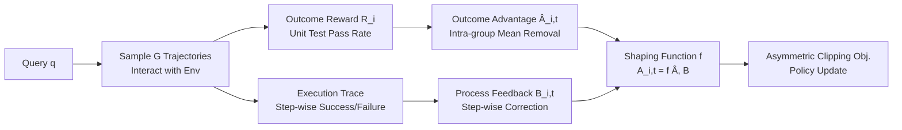

# Group Verification-based Policy Optimization for Interactive Coding Agents

**Conference**: ICLR 2026  
**OpenReview**: [https://openreview.net/forum?id=RY47Tq0VsV](https://openreview.net/forum?id=RY47Tq0VsV)  
**Code**: To be confirmed  
**Area**: Reinforcement Learning / LLM Agents / Interactive Code Agents  
**Keywords**: RLVR, GRPO, Process Reward, Advantage Shaping, Credit Assignment, AppWorld  

## TL;DR
GVPO overlays a "process-verifiable" shaping term onto the group relative advantage of GRPO, directly injecting deterministic intermediate feedback (code execution success/failure) into step-wise advantage. This corrects credit assignment bias caused by sparse outcome rewards, enabling a 32B agent to outperform OpenAI o1 on AppWorld.

## Background & Motivation
- **Background**: RLVR (reinforcement learning from verifiable rewards) has become the mainstream paradigm for training interactive code agents. Among these, GRPO estimates advantage using intra-group relative rewards of sampled trajectories, eliminating the cost of training reward models and significantly enhancing LLM agent capabilities.
- **Limitations of Prior Work**: GRPO and its variants (Dr.GRPO, DAPO, LOOP, etc.) rely almost exclusively on **outcome-verifiable rewards** (e.g., unit test pass rate). Such signals are sparse and delayed, providing little guidance for intermediate steps in the reasoning process.
- **Key Challenge**: Sparse outcome rewards lead to credit assignment distortion—early incorrect steps may be positively reinforced if a trajectory ultimately succeeds, while partially correct reasoning may be suppressed if it ultimately fails. This results in unstable optimization, slow convergence, and wasted environmental feedback.
- **Goal**: Utilize the **process-verifiable signals** inherently present in code execution traces (syntax errors, runtime exceptions, partial unit test results) to achieve fine-grained step-wise credit assignment without breaking alignment with final task objectives.
- **Key Insight**: **Advantage Shaping**—Outcome-level advantage is retained as a long-term alignment anchor, while deterministic process feedback is added as a step-wise "correction term," unifying short-term process guidance and long-term outcome alignment within a single advantage function.

## Method

### Overall Architecture
For each query $q$, a group of $G$ trajectories is sampled for interaction with the environment to obtain outcome rewards $R_i$. Outcome-level advantages $\hat{A}_{i,t}$ are computed from $R_i$, while step-wise success/failure signals $B_{i,t}$ are extracted from execution traces. The shaping function $f(\cdot)$ merges these into the final advantage $A_{i,t}=f(\hat{A}_{i,t}, B_{i,t})$, which is then fed into a PPO-style objective with asymmetric clipping for policy updates.

### Key Designs
**1. Advantage Shaping Framework: Process Feedback as a Correction Term**  
GVPO moves away from the GRPO approach where all tokens in a trajectory share a single scalar advantage. Instead, it defines $A_{i,t}=f(\hat{A}_{i,t}, B_{i,t})$, where the outcome advantage $\hat{A}_{i,t}=R_i-\mathrm{mean}(\{R_i\}_{i=1}^{G})$ **discards standard deviation normalization** (experiments show that std normalization introduces optimization bias). While $\hat{A}_{i,t}$ anchors alignment with the final goal, process feedback $B_{i,t}$ serves as a step-wise addition/subtraction to calibrate credit assignment in real-time. Note that the shaped advantage no longer satisfies the zero-mean unbiased property ($\mathbb{E}[A]\neq 0$), which is an intentional trade-off to gain denser supervision.

**2. Process-verifiable Shaping Function: Case-specific Correction**  
This is the core of the method. Trajectory tokens are partitioned into the successful execution set $I_i^{\mathrm{succ}}$, the failed execution set $I_i^{\mathrm{fail}}$ (steps with error messages), and the observation token set $I_i^{O}$ (feedback from the interpreter, not used for updates). The final advantage is shaped as follows:

$$A_{i,t}=\begin{cases}\hat{A}_{i,t} & t\in I_i^{\mathrm{succ}}\\ \hat{A}_{i,t}-b & t\in I_i^{\mathrm{fail}}\wedge \hat{A}_{i,t}=0\\ (1+b)\cdot\hat{A}_{i,t} & t\in I_i^{\mathrm{fail}}\wedge \hat{A}_{i,t}<0\\ 0 & \text{otherwise}\end{cases}$$

The intuition is clear: successful steps retain the original advantage. Failed steps are penalized—if the outcome advantage is zero (neutral), a fixed penalty $-b$ is applied; if the outcome advantage is already negative, the penalty is **multiplicatively amplified** by $(1+b)$ to more heavily suppress steps that both fail and lead to poor outcomes. Other cases (e.g., failure followed by positive outcome advantage) are zeroed out to avoid accidental penalties. A fixed penalty coefficient $b=0.2$ is used, as multiplicative amplification maintains a better balance between outcome and process signals than purely additive constants.

**3. Asymmetric Clipping + smtm Aggregation: Stabilizing Exploration**  
The objective function employs asymmetric clipping $\mathrm{clip}(a_{i,t}(\theta), 1-\epsilon_{\mathrm{low}}, 1+\epsilon_{\mathrm{high}})$ (the "clip-higher" strategy). Separate controls for upper and lower bounds provide more room for positive updates, maintaining exploration and preventing entropy collapse. Loss aggregation uses sequence-mean-token-mean (smtm): tokens are averaged within each trajectory before averaging across the group. This is more length-invariant and stable compared to the smts (sum-mean-token-sum) used in Dr.GRPO.

**4. Rule-based, Scalable, and Reward-Model-Free**  
Process-verifiable signals are strictly rule-based (compilation status, runtime errors, state transition validation) and do not require training additional reward models. This shaping can be applied to any environment capable of providing deterministic process feedback. While instantiated here in the AppWorld environment, the paradigm is not limited to program synthesis.

## Key Experimental Results
The base model is Qwen2.5-32B-Instruct, using the veRL framework + vLLM. Training is conducted on only 72 samples from AppWorld (Difficulty 1/2) with 8 rollouts per sample. Metrics include TGC (Task Goal Completion) and SGC (Scenario Goal Completion).

### Main Results

| Method | Out. | Proc. | Test-N TGC/SGC | Test-C TGC/SGC |
|---|---|---|---|---|
| OpenAI o1 (Zero-shot) | - | - | 61.9 / 41.1 | 36.7 / 19.4 |
| GPT-4o (Zero-shot) | - | - | 48.8 / 32.1 | 30.2 / 13.0 |
| Qwen2.5-32B (Zero-shot) | - | - | 34.5 / 16.1 | 18.9 / 7.9 |
| GRPO | ✓ | ✗ | 61.3 / 39.3 | 38.5 / 21.6 |
| Dr.GRPO | ✓ | ✗ | 63.7 / 44.6 | 40.5 / 18.7 |
| LOOP (Strongest 32B Baseline) | ✓ | ✗ | 71.3 / 53.6 | 45.7 / 26.6 |
| **GVPO (Ours)** | ✓ | ✓ | **72.6 / 55.4** | **49.4 / 28.8** |

GVPO outperforms o1 by 12.7 TGC points on the more difficult Test-C (unseen apps, longer planning) and outperforms the strongest RL baseline (LOOP) by 3.7 TGC and 2.2 SGC points, demonstrating significant generalization advantages.

### Ablation Study

| Variant | Test-N TGC/SGC | Test-C TGC/SGC |
|---|---|---|
| GVPO Full | 72.6 / 55.4 | 49.4 / 28.8 |
| Aggregation: token-mean | 58.3 / 35.7 | 34.6 / 15.1 |
| Aggregation: smts | 64.9 / 46.4 | 42.8 / 23.7 |
| Symmetric Clipping | 60.1 / 39.3 | 40.5 / 21.6 |
| With std Normalization | 70.8 / 48.2 | 42.8 / 23.7 |
| Additive Shaping only | 64.9 / 46.4 | 39.8 / 23.0 |

Sensitivity to $b$: $b=0.1$ provides insufficient correction; $b=0.4$ leads to instability from over-penalization; $b=0.2$ is the most stable overall.

### Key Findings
- **Entropy Trajectories**: GSPO entropy collapses rapidly (premature convergence), and GRPO/DAPO show steady declines. GVPO maintains higher entropy without collapse, indicating that process shaping combined with asymmetric clipping penalizes errors without killing diversity.
- **Behavioral Shift**: "Query-before-act"—GVPO agents have the lowest execution failure rate but most frequently call `show_api_docs` / `show_api_descriptions` (nearly half of all steps involve documentation lookup). Step-wise penalties encourage the agent to check documentation before acting, reducing error-correction loops. Interaction steps are fewer than GRPO and only slightly higher than Dr.GRPO.
- **Multiplicative vs. Additive**: Replacing multiplicative amplification of negative advantage with a fixed constant penalty (additive) weakens the balance between outcome and process signals, hurting generalization.

## Highlights & Insights
- Leverages an overlooked but substantial signal source in RLVR: code execution feedback itself is free, dense, and deterministic process supervision.
- The case-specific design of the shaping function is restrained—it only increases penalties when "Failure × Outcome Advantage ≤ 0," avoiding the penalization of failed steps in trajectories that eventually succeed.
- Systematically ablates multiple engineering choices (std removal, asymmetric clipping, smtm aggregation) alongside core process shaping, proving their individual contributions.
- Convincing behavioral analysis: performance gains map to interpretable strategy changes (consulting docs before acting) rather than simple reward hacking.

## Limitations & Future Work
- Primarily validated on a single environment (AppWorld) and a single base model (Qwen2.5-32B). The claimed generality of process-verifiable shaping for any deterministic feedback environment needs testing across more tasks.
- Shaped advantage is theoretically biased; its impact on convergence relies on intuition rather than rigorous analysis.
- Process feedback is currently binary (Success/Failure). Finer-grained error types (syntax vs. semantic vs. logic) have not yet been differentiated or utilized.
- Training data scale is small (72 samples); stability on larger, more diverse tasks remains to be seen.

## Related Work & Insights
- **GRPO Family**: GRPO, Dr.GRPO (no std, smts), DAPO (dynamic sampling, asymmetric clipping), LOOP, RLOO, and GSPO all rely solely on outcome rewards. GVPO is the first to integrate process-verifiable signals via advantage shaping.
- **ReAct / Interactive Code Agents**: Aligns with the "reasoning + action" paradigm of ReAct, but actions are executable code rather than natural language commands, naturally yielding execution feedback—the source of GVPO’s process signals.
- **Insight**: Any scenario where an agent interacts with a deterministic environment that returns step-wise success/failure (tool use, SQL, robotic simulation) can benefit from this lightweight "outcome advantage + process shaping" credit assignment approach.

## Rating
- **Novelty**: ⭐⭐⭐⭐ Integrating execution feedback into GRPO via advantage shaping is a concise yet previously unexploited entry point; the case-specific shaping function is well-conceived.
- **Experimental Thoroughness**: ⭐⭐⭐⭐ Main experiments cover zero-shot and multiple RL baselines. Ablations decouple every design choice, complemented by entropy and behavior analysis, though limited to one environment/base model.
- **Writing Quality**: ⭐⭐⭐⭐ Clear logic across motivation, method, and experiments. Contrastive tables are helpful, and formulas are well-matched with intuitive explanations.
- **Value**: ⭐⭐⭐⭐ Plug-and-play approach, reward-model-free, and scalable. Directly useful for training interactive code/tool agents.

<!-- RELATED:START -->

## Related Papers

- [\[ICLR 2026\] Sample More to Think Less: Group Filtered Policy Optimization for Concise Reasoning](sample_more_to_think_less_group_filtered_policy_optimization_for_concise_reasoni.md)
- [\[ICLR 2026\] Revisiting Group Relative Policy Optimization: Insights into On-Policy and Off-Policy Training](revisiting_group_relative_policy_optimization_insights_into_on-policy_and_off-po.md)
- [\[ICLR 2026\] Information Gain-based Policy Optimization: A Simple and Effective Approach for Multi-Turn Search Agents](information_gain-based_policy_optimization_a_simple_and_effective_approach_for_m.md)
- [\[ICLR 2026\] Single-stream Policy Optimization](single-stream_policy_optimization.md)
- [\[ICLR 2026\] GEPO: Group Expectation Policy Optimization for Stable Heterogeneous Reinforcement Learning](gepo_group_expectation_policy_optimization_for_stable_heterogeneous_reinforcemen.md)

<!-- RELATED:END -->
