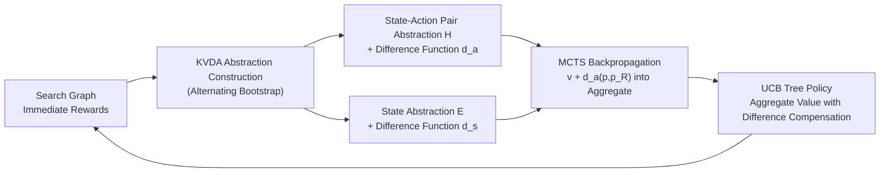

# Grouping Nodes with Known Value Differences: A Lossless UCT-based Abstraction Algorithm

**Conference**: ICLR 2026  
**OpenReview**: [https://openreview.net/forum?id=Zk0zZMSAYc](https://openreview.net/forum?id=Zk0zZMSAYc)  
**Code**: Open sourced (Schmöcker, 2025, implemented in C++)  
**Area**: Reinforcement Learning / MCTS Planning  
**Keywords**: Monte Carlo Tree Search, UCT, State Abstraction, OGA-UCT, Deterministic MDP, Sample Efficiency  

## TL;DR
This paper proposes KVDA-UCT, which relaxes MCTS abstraction from "merging nodes with equal values" to "merging nodes whenever their value difference can be inferred." Without introducing new parameters or sacrificing precision, it discovers significantly more abstractions than the current state-of-the-art OGA-UCT, thereby improving sample efficiency in deterministic environments.

## Background & Motivation
**Background**: A core bottleneck of Monte Carlo Tree Search (MCTS) is sample efficiency. An effective countermeasure is to group "value-equivalent" states or state-action pairs within the search tree and use aggregate statistics instead of single-node statistics to enable information flow across the same tree level. The current SOTA abstraction algorithm for deterministic environments is OGA-UCT, based on the ASAP framework, which detects nodes having the same $Q^*$ values under an optimal policy by analyzing the search graph.

**Limitations of Prior Work**: The ASAP framework requires that two merged state-action pairs must have **identical immediate rewards** ($|R(s_1,a_1)-R(s_2,a_2)|=0$). This condition is too rigid—many nodes have $Q^*$ values that differ by only a small margin (or a calculable constant) but cannot be merged. Previous work $(\varepsilon_a,\varepsilon_t)$-OGA attempted to relax the reward equality condition using thresholds, but this introduced two problems: (1) two difficult-to-tune hyperparameters and (2) potential performance degradation from merging non-value-equivalent nodes, preventing convergence to the optimal action.

**Key Challenge**: The trade-off between the quantity of abstractions (sample efficiency) and the precision of abstractions (losslessness) is difficult to balance—merging more nodes often requires tolerating errors, which can destroy optimality guarantees.

**Goal**: To approach the aggressive abstraction quantity of the "reward-ignoring" version $(\infty,0)$-OGA **without losing precision** and **without introducing any new parameters** in deterministic environments.

**Key Insight**: **[Known-Value-Difference-Abstractions]** Instead of insisting on merging only nodes with equal values, nodes are merged as long as their value difference can be inferred. The value difference is derived through chain reasoning of immediate rewards in the search tree; when using abstractions for aggregation, the value difference is compensated before averaging. In this view, ASAP is merely a special case where the "value difference is always 0."

## Method

### Overall Architecture
KVDA (Known-Value-Difference-Abstractions) extends ASAP: while ASAP builds abstractions iteratively upon abstractions, KVDA maintains "(abstraction, difference function) pairs" and bootstraps them alternately. Given a state abstraction and a difference function, it constructs a state-action pair abstraction and its corresponding difference function $d_a$; conversely, given a state-action pair abstraction, it constructs a state abstraction and its difference function $d_s$. The difference functions are designed to exactly equal the true $Q^*/V^*$ difference upon convergence, making the abstraction "lossless"—merging only nodes with the same or known difference in $Q^*$. The KVDA-UCT algorithm embeds this framework into the tree policy and backpropagation phases of MCTS, serving as a natural generalization of $(\varepsilon_a,\varepsilon_t)$-OGA where $\varepsilon_a$ is decoupled.

### Key Designs

**1. Relaxing Merging Conditions: Dropping Reward Equality, Retaining Transition Equality**  
When constructing state-action pair abstractions, KVDA removes the constraint that immediate rewards must be equal compared to ASAP, retaining only the condition that abstract successor distributions must be identical: two state-action pairs $(s_1,a_1),(s_2,a_2)$ are equivalent if and only if $\sum_{x\in X}\big|\sum_{s'\in x}P(s'\mid s_1,a_1)-P(s'\mid s_2,a_2)\big|=0$, where $X$ is the current set of equivalence classes for state abstraction. Reward differences no longer prevent merging; instead, they are recorded in the difference function. This is why KVDA discovers "strictly more" abstractions than ASAP—in environments like Game of Life where immediate rewards equal the number of surviving cells, states with different cell counts could never be merged by ASAP, but KVDA can merge them.

**2. Chain Derivation and Reliability of Difference Functions**  
The value difference $d_a$ between two merged nodes is recursively accumulated from immediate reward differences and successor state value differences:

$$d_a(p_1,p_2)=R(p_2)-R(p_1)+\sum_{x\in X}\sum_{s'\in x}\big(P(s'\mid p_1)-P(s'\mid p_2)\big)\cdot d'_s(s', s_x)$$

where $s_x$ is a fixed representative of the equivalence class $x$ (the paper proves that $d_a$ is independent of the choice of representative). State-side abstraction $E$ requires that actions of two states can be paired one-to-one, and **the value differences of all pairs equal the same constant $d$**—this $d$ is $d_s(s_1,s_2)$. This generalizes "equal value" to "constant value difference," which still forms an equivalence relation. Theoretical analysis (Appendix A.2) proves that upon convergence, $d_a$ and $d_s$ exactly equal the differences in $Q^*$ and $V^*$, ensuring losslessness in deterministic settings.

**3. Difference-Compensated MCTS Backpropagation**  
When using abstractions, raw values cannot be averaged directly; instead, difference compensation is required. Each abstract Q-node selects a representative $p_R$, and statistics are normalized to this representative: when a ground node $p$ backpropagates a value $v$, $v+d_a(p,p_R)$ is recorded in the abstract statistics. Conversely, when $p$ retrieves an aggregate value from the abstract node, $d_a(p,p_R)$ is subtracted. If the representative switches to $p_R'$, the statistics are updated by $n\cdot d_a(p_R,p_R')$ (where $n$ is the abstract visit count). This design introduces a strong property absent in OGA-UCT: in deterministic settings, once a state-action pair is proven to be merged with another pair with a positive difference (proving it is suboptimal), they share the same exploration term while the $Q$-value difference is exactly $d_a$. Consequently, **KVDA-UCT will never visit this suboptimal action again**, focusing the sampling budget on promising branches.

**4. Incremental Maintenance and Computational Acceleration**  
To make frequent re-computation of abstractions feasible, KVDA-UCT follows the recency counter mechanism of OGA: when a Q-node counter exceeds a threshold, it triggers a re-evaluation of the abstraction and its difference to the representative. Changes in differences trigger re-evaluations of parent node abstractions. Since "perfect pairing" for state abstraction (Eq. 6) is expensive, the paper uses a stricter but faster sufficient condition—first checking if the value difference of actions within the same abstraction is zero, then verifying that the value difference of any chosen ground action between $s_1,s_2$ is constant across all abstract nodes. These modifications introduce no new hyperparameters ($\varepsilon_t$-KVDA does not depend on $\varepsilon_a$; in deterministic settings, $\varepsilon_t=0$ denotes pure KVDA-UCT).

## Key Experimental Results

### Abstraction Discovery Rate (Tab. 1, Deterministic Environments)
Ratio = Non-trivial abstract Q-nodes / Total abstract Q-nodes. A smaller value indicates more merging ($1$ = no abstraction). KVDA-UCT merges more than OGA-UCT in almost every environment and approaches the aggressive $(\infty,0)$-OGA:

| Environment | KVDA-UCT (Ours) | OGA-UCT | $(\infty,0)$-OGA |
|---|---|---|---|
| d-SysAdmin | **0.15** | 0.48 | 0.20 |
| d-Wildfire | **0.19** | 0.37 | 0.30 |
| d-Tamarisk | **0.35** | 0.56 | 0.39 |
| d-Earth Observation | **0.65** | 0.99 | 0.68 |
| d-Manufacturer | **0.64** | 0.95 | 0.79 |
| d-Sailing Wind | **0.70** | 0.92 | 0.74 |
| d-Constrictor | 0.98 | 0.97 | 0.97 |

Abstraction rates in environments like SysAdmin and Wildfire more than double; gains are minimal in specific environments like Constrictor.

### Parameter-Optimal Performance (Tab. 2, Mean Return ↑, 1000 iterations)
All methods used optimal $C\in\{0.5,1,2,4,8,16\}$; $(\varepsilon_a,0)$-OGA additionally tuned $\varepsilon_a$:

| Environment | OGA-UCT | $(\infty,0)$-OGA | $(\varepsilon_a,0)$-OGA | KVDA (Ours) |
|---|---|---|---|---|
| d-Manufacturer | −1255.6 | −1658.4 | −1246.0 | **−1158.2** |
| d-Push Your Luck | 125.1 | 66.7 | 132.4 | **137.9** |
| d-Wildfire | −195.6 | −503.5 | −415.0 | **−179.9** |
| d-Earth Observation | −7.18 | −30.0 | −30.0 | **−7.02** |
| d-SysAdmin | 477.1 | 448.4 | 450.7 | **477.2** |
| d-Skills Teaching | 207.9 | 211.3 | 211.3 | **216.2** |
| d-Connect4 | 42.7 | 46.8 | 47.5 | **47.9** |

KVDA-UCT outperforms OGA-UCT in most environments. Even when $(\varepsilon_a,0)$-OGA is manually tuned for $\varepsilon_a$, KVDA performs equally or better while **requiring no extra parameters**.

### Key Findings
- **Validation of Losslessness**: In environments solvable via value iteration (e.g., Saving / Sailing Wind / Skills Teaching), empirical results confirm that KVDA only merges nodes with truly identical or known-difference $Q^*$, detecting strictly more true equivalences than ASAP.
- **Generalization Ability**: Evaluated using a normalized pairings score for cross-task performance under a single parameter setting, KVDA methods occupied the top two spots.
- **Stochastic Limits**: The extended $\varepsilon_t$-KVDA is generally inferior to $(\varepsilon_t,\varepsilon_a)$-OGA in stochastic environments but achieves best results in specific cases, serving as a complementary tool.

## Highlights & Insights
- **Paradigm Shift**: Moving from "finding value equivalence" to "finding inferable value differences" is a conceptual breakthrough rather than engineering hyperparameter tuning. The observation that "constant value difference" also forms an equivalence relation is elegant.
- **No Free Lunch**: Improving sample efficiency without losing precision or adding parameters comes with almost no downside compared to the tuning burden and potential optimality violations of $(\varepsilon_a,\varepsilon_t)$-OGA.
- **Pruning Byproduct**: Difference compensation naturally leads to a strong pruning property where "provably suboptimal actions are no longer visited," concentrating the sampling budget on valuable branches—a feature OGA-UCT lacks.
- **Rigorous Theory**: Convergence and the reliability of $d_a, d_s$ are formally proven; losslessness is a theorem rather than an empirical claim.

## Limitations & Future Work
- **Stochastic Performance**: $\varepsilon_t$-KVDA rarely outperforms $(\varepsilon_t,\varepsilon_a)$-OGA in stochastic MDPs; the core advantage of this work holds primarily in deterministic settings—this is the boundary of the losslessness guarantee.
- **Scope Constraints**: The method requires rewards to be non-constant and non-sparse; otherwise, KVDA-UCT and OGA-UCT become semantically equivalent. Sparse reward environments like board games require manually designed heuristic potential functions $V^h$ to densify rewards.
- **Computational Overhead**: The chain re-computation of difference functions and incremental maintenance increases the cost per abstraction update. While simpler sufficient conditions mitigate this, it remains a potential bottleneck.
- **Future Directions**: Deepening the idea of known value differences into stochastic settings and combining it with learning-based MCTS (e.g., AlphaZero) are suggested extensions.

## Related Work & Insights
This paper sits within the lineage of automatic MCTS abstractions: AS-UCT (Jiang 2014) → ASAP (Anand 2015) → OGA-UCT (Anand 2016) → $(\varepsilon_a,\varepsilon_t)$-OGA (Schmöcker 2025). Parallel approaches include the "optimistic coarse abstraction then refinement" (Hostetler 2015) and transition function pruning (Sokota 2021). The insight of KVDA is that when exact equivalence is too rare, instead of relaxing to "approximate equivalence" (sacrificing correctness), one should change the dimension—**explicitly model differences as compensatable quantities**, thereby increasing quantity while preserving losslessness. This idea of "replacing threshold approximations with structured differences" provides a valuable lesson for other RL/planning scenarios requiring state aggregation, such as bisimulation metrics in representation learning.

## Rating
- **Novelty**: ⭐⭐⭐⭐⭐ The shift from "value equivalence" to "known value difference" is a genuine conceptual breakthrough, elegant and self-consistent.
- **Experimental Thoroughness**: ⭐⭐⭐⭐ Covers 20+ environments across IPPC, board games, and classic benchmarks. Includes experiments on abstraction rates, parameter optimality, and generalization with 99% confidence intervals; however, a more systematic quantification of stochastic disadvantages and computational overhead is missing.
- **Writing Quality**: ⭐⭐⭐⭐ Theoretical derivations are clear with formal proofs and intuitive examples (Fig. 1). However, the notation is dense, posing a threshold for readers unfamiliar with OGA/ASAP.
- **Value**: ⭐⭐⭐⭐ Provides a plug-and-play, parameter-free, lossless sample efficiency boost for deterministic MDP planning; the scope (deterministic, non-sparse rewards) limits its universal impact.

<!-- RELATED:START -->

## Related Papers

- [\[ICLR 2026\] Value Flows](value_flows.md)
- [\[ICLR 2026\] Relative Value Learning](relative_value_learning.md)
- [\[ICLR 2026\] Policy Newton Algorithm in Reproducing Kernel Hilbert Space](policy_newton_algorithm_in_reproducing_kernel_hilbert_space.md)
- [\[ICLR 2026\] Universal Value-Function Uncertainties](universal_value-function_uncertainties.md)
- [\[ICLR 2026\] Offline Preference-based Value Optimization](offline_preference-based_value_optimization.md)

<!-- RELATED:END -->
