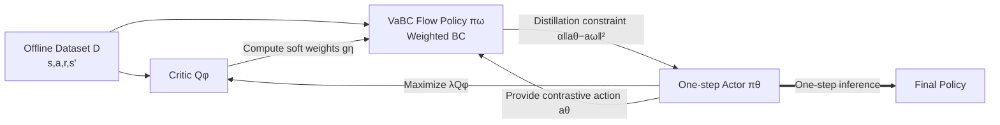

# Guided Flow Policy: Learning from High-Value Actions in Offline Reinforcement Learning

**Conference**: ICLR 2026  
**OpenReview**: [https://openreview.net/forum?id=EBjy1rmpv0](https://openreview.net/forum?id=EBjy1rmpv0)  
**Code**: [simple-robotics.github.io/publications/guided-flow-policy](https://simple-robotics.github.io/publications/guided-flow-policy) (JAX implementation, to be released after rebuttal)  
**Area**: reinforcement learning  
**Keywords**: offline reinforcement learning, behavior regularization, flow matching, weighted behavior cloning, BRAC, value-aware regularization  

## TL;DR
GFP upgrades the dual-policy BRAC framework (Flow Matching BC + 1-step distilled actor) to a **value-aware** version: it uses a critic and an actor to assign soft scores to dataset actions, ensuring behavior cloning prioritizes high-value actions rather than indiscriminately cloning all state-action pairs. This approach achieves SOTA results across 144 offline RL tasks.

## Background & Motivation
**Background**: Offline reinforcement learning involves learning policies from static datasets. The prominent BRAC (Behavior-Regularized Actor-Critic) family suppresses Q-value overestimation of out-of-distribution (OOD) actions by forcing the policy to stay "close" to the dataset distribution—typically by adding a behavior cloning (BC) term to the actor loss (e.g., TD3+BC, ReBRAC). Recently, high-capacity generative models like flow matching and diffusion have been introduced. FQL (Park et al., 2025) distills flow-matching BC into a one-step policy, maintaining multimodal modeling capabilities while avoiding the overhead of iterative sampling and BPTT.

**Limitations of Prior Work**: Existing BRAC methods treat every action in the dataset **indiscriminately**. The BC loss treats high-value and low-value actions equally. Similarly, the flow-matching BC in FQL does not incorporate any reward information.

**Key Challenge**: Datasets are often suboptimal, containing both good and bad actions. Overly loose regularization leads to collapse due to OOD overestimation, while overly strict regularization locks the policy into suboptimal actions, failing to exploit high-reward transitions present in the data. **Cloning all actions $\neq$ cloning good actions**, yet current regularization mechanisms cannot distinguish between the two.

**Goal**: Inject "value-awareness" into the BRAC regularization term, steering behavior cloning to selectively favor the most promising transitions in the dataset.

**Core Idea (Value-aware Behavior Cloning, VaBC)**: Establish a **bi-directional guidance** between the flow-matching BC policy $\pi_\omega$ and the one-step actor $\pi_\theta$. The actor and critic compute soft weights for every dataset action to guide $\pi_\omega$ toward high-value samples. Conversely, $\pi_\omega$ serves as a distributional regularizer to constrain the actor within the support of high-value dataset actions while maximizing the critic.

## Method

### Overall Architecture
GFP consists of three components: a critic $Q_\phi$, a one-step actor $\pi_\theta$, and a multi-step flow-matching value-aware BC policy $\pi_\omega$ (VaBC). These components are trained iteratively through mutual guidance: the critic evaluates action values, the actor pursues high rewards under the critic's guidance while being constrained by VaBC distillation, and VaBC selectively clones high-value actions using scores from the actor and critic.

### Key Designs

**1. Value-aware guidance function $g_\eta$: Softmax scoring for dataset actions**  
This is the core of GFP. For each state-action pair $(s,a)$ in the dataset, GFP does not clone it directly. Instead, it compares the "dataset action $a$" with the "actor proposed action $\mu_\theta(s,z)$" to see which has a higher Q-value, using a softmax-style guidance weight:

$$g_\eta(s,a) = \frac{\exp(\tfrac{\lambda}{\eta} Q_\phi(s,a))}{\exp(\tfrac{\lambda}{\eta} Q_\phi(s,a)) + \exp(\tfrac{\lambda}{\eta} Q_\phi(s,\mu_\theta(s,z)))}$$

When the dataset action has a higher Q-value, $g_\eta > 0.5$, increasing the cloning weight; otherwise, $g_\eta < 0.5$, reducing its influence. Since $g_\eta \in (0,1)$ is naturally bounded, the training remains stable even if the critic is unreliable in early stages. This softmax form is more robust than AWR-style exponential advantage weighting $g^{\mathrm{AWR}}_\eta = \exp(\tfrac{\lambda}{\eta}(Q_\phi(s,a) - Q_\phi(s,\mu_\theta)))$, which often requires clipping to be stable.

**2. VaBC Weighted Flow Matching Loss: Dominating the velocity field with high-value actions**  
The soft weights are integrated into the standard conditional flow matching BC loss to define the VaBC objective:

$$L_{\mathrm{VaBC}}(\omega) = \mathbb{E}_{(s,a)\sim D,\,\epsilon\sim\mathcal{N}(0,I),\,t\sim U([0,1])}\left[g_\eta(s,a)\,\|v_\omega(t,s,a_t) - (a-\epsilon)\|_2^2\right]$$

Here $a_t = (1-t)\epsilon + ta$ is the linear interpolation between noise and action, and the target velocity is $a - \epsilon$ (the optimal transport variant of flow matching). A key property is that **VaBC is trained only on state-action pairs within the dataset**. Therefore, even with extremely sharp filtering (low temperature $\eta$), it never leaves the dataset support, making it a safe regularizer for the actor.

**3. Temperature $\eta$ for filtering sharpness: Balancing fidelity and value exploitation**  
The temperature $\eta$ controls the sharpness of $g_\eta$: large $\eta$ ($\geq 10^{-1}$) leads to soft filtering (reverting to FQL); medium $\eta$ ($\approx 10^{-3}$) provides optimal filtering by biasing toward high-value actions while maintaining diversity; extremely small $\eta$ ($\leq 10^{-5}$) results in aggressive filtering that may push the actor out-of-distribution or cause training to collapse due to critic overestimation.

**4. Bi-directional distillation of the one-step actor: Maximizing critic while staying near VaBC**  
The actor is trained via behavior-regularized policy gradients to maximize the Q-value while being distilled toward the VaBC:

$$L_A(\theta) = \mathbb{E}_{s\sim D,\,z\sim\mathcal{N}(0,I)}\left[-\lambda Q_\phi(s,\mu_\theta(s,z)) + \alpha\|\mu_\theta(s,z) - \mu_\omega(s,z)\|_2^2\right]$$

The term $\lambda = 1/(\tfrac{1}{N}\sum|Q_\phi(s,a)|)$ is a Q-value normalization factor used to maintain consistent scales across loss terms. The distillation term $\alpha\|\mu_\theta - \mu_\omega\|^2$ constrains the actor to the high-value support learned by VaBC. Since the actor is a one-step policy, it requires no iterative sampling or BPTT during inference.

## Key Experimental Results

### Main Results
Evaluated across **144 tasks** (including pixel-based tasks) from D4RL, Minari, and OGBench, totaling ~15k runs. Below are representative results from OGBench (8 seeds, bold indicates top 95% interval):

| Task Category | IQL | ReBRAC | FQL | **GFP actor πθ** |
|---|---|---|---|---|
| antmaze-large-navigate (5) | 53 | **95.9** | 88.1 | 93.8 |
| antmaze-large-explore (5) | 12.9 | 82.7 | 87.9 | **91.9** |
| humanoidmaze-large-navigate (5) | 2 | 12.9 | 6.5 | **17.8** |
| cube-double-play (5) | 7 | 12.6 | 29 | **47.2** |
| cube-double-noisy (5) | 4.5 | 19.6 | 38.2 | **63.1** |
| cube-triple-play (5) | 0.1 | 2.9 | 3.9 | **15.9** |
| cube-triple-noisy (5) | 4.8 | 5.2 | 3.5 | **24.5** |
| puzzle-4×4-play (5) | 7 | 17.1 | 17 | **26.1** |

Compared to 10 previous methods on the 50 OGBench tasks reported by Park et al. (2025), GFP's performance profile significantly outperforms all baselines.

### Ablation Study
The temperature $\eta$ is the core hyperparameter. The performance profile validates that "medium temperature is optimal."

| Variant | Description | Conclusion |
|---|---|---|
| Soft filtering (high η) | Regresses to FQL indiscriminate BC | Suboptimal; loses value-awareness |
| Medium η (≈10⁻³) | Bias toward value + Diversity | **Optimal tradeoff** |
| Strong filtering (low η) | Clones only the highest-value actions | Actor OOD, critic overestimation, collapse |
| gη softmax vs g^AWR | Softmax is bounded in (0,1) | Softmax is more stable without clipping |

### Key Findings
- **Largest gains on suboptimal/noisy datasets**: GFP significantly leads in noisy tasks like `cube-double-noisy` (63 vs FQL 38) and `cube-triple-noisy` (24 vs 4/5), confirming that value-aware regularization is most beneficial when data quality is poor.
- **Superiority on difficult tasks**: GFP shows a clear advantage in high-difficulty tasks like `humanoidmaze-large-navigate` and `cube-triple-play`.
- **Re-evaluation of prior work**: By re-tuning ReBRAC and FQL, the paper finds that hyperparameters and implementation details significantly impact results, occasionally refreshing previously reported scores.
- **Efficiency**: A single training run takes < 30 minutes on modern GPUs.

## Highlights & Insights
- **From "Cloning All" to "Cloning Good"**: GFP addresses a long-standing blind spot in the BRAC family—the indiscriminate treatment of dataset actions. Injecting reward information into the regularization is a simple but essential missing piece for minimalist methods like TD3+BC or FQL.
- **Elegance of Softmax Guidance**: Using a bounded $g_\eta \in (0,1)$ softmax instead of unbounded exponential weights from AWR avoids early training degradation and removes the need for heuristic clipping.
- **Symmetry of Bi-directional Guidance**: The actor provides "contrastive actions" to judge dataset quality, while the VaBC constrains the actor to stay within the high-value distribution. They act as mirrors to one another.
- **Safety of VaBC**: Because VaBC is trained only on dataset transitions, it provides a safe boundary for aggressive filtering without the risk of moving to OOD regions.

## Limitations & Future Work
- **Temperature $\eta$ sensitivity**: The optimal temperature must be manually tuned to balance data fidelity and value exploitation. There is currently no mechanism for an adaptive $\eta$.
- **Critic quality dependency**: The guidance weights $g_\eta$ are entirely driven by $Q_\phi$. If the critic is biased, the value-awareness might mislead the cloning process.
- **Three-way coupling**: Contrasted with single-policy methods, managing the interaction between actor, VaBC, and critic adds hyperparameter complexity ($\alpha, \eta$, conservative targets).

## Related Work & Insights
- **BRAC Family**: GFP builds on the actor loss structure of minimalist regularization methods like TD3+BC (Fujimoto & Gu, 2021) and ReBRAC (Tarasov et al., 2023).
- **Flow/Diffusion for Offline RL**: GFP is the direct successor to FQL (Park et al., 2025), effectively adding a value-based filter to FQL's flow-matching BC component.
- **Weighted BC / AWR**: The advantage-weighting concepts from AWR (Peng et al., 2019) are refined into the softmax guidance mechanism.
- **Insight**: The principle of "injecting value-awareness into regularization" is universal—any offline or imitation learning method relying on distribution mimicking can benefit from bounded value-based reweighting to extract better performance from suboptimal data.

## Rating
- **Novelty**: ⭐⭐⭐⭐ — Precisely targets the "indiscriminate regularization" blind spot in an established framework. The bi-directional distillation is clean, though it functions as a value-aware enhancement of FQL rather than a brand-new paradigm.
- **Experimental Thoroughness**: ⭐⭐⭐⭐⭐ — 144 tasks, ~15k runs across multiple benchmarks, and rigorous re-evaluation of prior SOTA.
- **Writing Quality**: ⭐⭐⭐⭐ — Clear motivation; figures intuitively explain the guidance and filtering mechanisms.
- **Value**: ⭐⭐⭐⭐ — Simple to implement, fast to train, and provides significant gains on noisy data—highly practical for offline RL deployment.

<!-- RELATED:START -->

## Related Papers

- [\[ICLR 2026\] Reinforcement Learning via Value Gradient Flow](reinforcement_learning_via_value_gradient_flow.md)
- [\[ICLR 2026\] One-Step Flow Q-Learning: Addressing the Diffusion Policy Bottleneck in Offline RL](one-step_flow_q-learning_addressing_the_diffusion_policy_bottleneck_in_offline_r.md)
- [\[ICLR 2026\] Flow Actor-Critic for Offline Reinforcement Learning (FAC)](flow_actor-critic_for_offline_reinforcement_learning.md)
- [\[ICLR 2026\] Peng's Q($\lambda$) for Conservative Value Estimation in Offline Reinforcement Learning](pengs_qlambda_for_conservative_value_estimation_in_offline_reinforcement_learnin.md)
- [\[ICML 2026\] Fast and Highly Expressive Policy Learning for Offline Reinforcement Learning via Bootstrapped Flow Q-Learning](../../ICML2026/reinforcement_learning/fast_and_highly_expressive_policy_learning_for_offline_reinforcement_learning_vi.md)

<!-- RELATED:END -->
