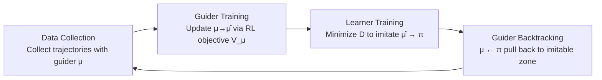

# Guided Policy Optimization under Partial Observability

**Conference**: ICLR 2026  
**OpenReview**: [https://openreview.net/forum?id=SYLarqWqVH](https://openreview.net/forum?id=SYLarqWqVH)  
**Code**: To be confirmed  
**Area**: Reinforcement Learning / Partially Observable RL  
**Keywords**: POMDP, Privileged Information, Teacher-Student Learning, Imitation Gap, Policy Mirror Descent, GPO  

## TL;DR
To address the **imitation gap** often encountered when "distilling a teacher trained with privileged information into a student," the GPO framework is proposed. It enables a guider (using privileged information) and a learner (observing partial information) to perform **simultaneous co-training**. Through "backtracking" constraints, the guider is consistently pulled back into a range that the learner can imitate, providing a theoretical guarantee that the student's supervised learning is equivalent to direct RL, thereby fully utilizing privileged information without leaving behind an "impossibly good teacher" that cannot be learned.

## Background & Motivation
- **Background**: In scenarios such as robotics, sensors are partially observable and noisy (POMDP) during real-world deployment, but full state or other **privileged information** is often available during training (e.g., in simulators). A common practice is to train a teacher using privileged information and then transfer knowledge to a student via imitation learning, teacher-student learning (TSL), or policy distillation.
- **Limitations of Prior Work**: When a teacher possesses privileged information, its optimal policy might be **fundamentally inimitable** for the student—this is known as the "impossibly good teacher" problem or the **imitation gap**. The paper illustrates this with the TigerDoor example: the teacher directly opens the correct door, but the student must first "listen" to locate the tiger. Since the teacher never "listens," a student following the teacher can only guess between two doors, resulting in an expected reward of 0.5 and never learning the optimal listen-then-open solution.
- **Key Challenge**: Existing remedies either **degenerate into pure RL** when the teacher is inimitable (wasting the expensive privileged teacher) or use indirect supervision via reward shaping (weak signals, requiring additional learning). Furthermore, **no existing method theoretically guarantees that the teacher's supervision is necessarily beneficial**.
- **Goal**: To train a "**possibly good**" teacher—whose policy remains within the student's imitable region, allowing for efficient learning using privileged information while being reliably followed by the student.
- **Core Idea**: **Co-training + Backtracking constraints**. Inspired by Guided Policy Search (GPS), an intermediate agent (guider) is introduced to learn rapidly via RL and privileged information. The learner mimics the guider through supervised learning, which in turn constrains the guider, making supervised learning theoretically equivalent to performing direct RL on the learner.

## Method

### Overall Architecture
GPO co-trains two entities: a **guider** $\mu(a|s)$ (with access to privileged information/global state $s$) and a **learner** $\pi(a|o)$ (with access only to partial observations $o$). They are aligned through a four-step iterative loop until convergence. The key difference from traditional TSL is that the teacher is no longer independently pre-trained but is trained alongside the student and **backward-constrained by the student**.

### Key Designs

**1. Co-training + Backtracking, converting Supervised Learning into RL:** The core of GPO is a four-step cycle: the guider executes and collects trajectories using privileged information; the guider is updated using trust-region RL like PPO; the learner mimics the guider by minimizing the KL divergence $D(\pi,\hat\mu)=\mathbb{E}[D_{KL}(\mu(\cdot|s),\pi(\cdot|o))]$; and finally, backtracking sets $\mu^{(k+1)}(\cdot|s)=\pi^{(k+1)}(\cdot|o)$. The paper proves (Proposition 1) that if the guider is updated using Policy Mirror Descent, the learner's update is exactly equivalent to a **constrained Policy Mirror Descent**:
$$\pi^{(k+1)}=\arg\min_{\pi\in\Pi}\{-\eta_k\langle\nabla V(\pi^{(k)}),\pi\rangle+D_{\pi^{(k)}}(\pi,\pi^{(k)})\}$$
This means that even if the learner never directly interacts with the environment and only performs supervised learning, its policy update inherits the policy improvement properties of TRPO/PPO, thus obtaining optimality guarantees "equivalent to direct RL." The advantage is **offloading the high-variance RL gradients to the privileged guider**, while the partially observable learner only performs low-variance supervised learning, significantly reducing complexity—for instance, when training for noise robustness, the guider uses clean inputs while the learner uses noisy inputs for supervision.

**2. GPO-penalty: Adaptive coefficients to balance "leading" and "pulling back":** A key insight is that the guider **does not need to backtrack strictly to the learner**; it only needs to stay within the imitable region. Letting the guider lead slightly can actually result in better trajectory collection. Thus, a coefficient $\alpha$ is introduced to modulate the guider's backtracking loss $L(\mu)=L_1(\mu)+\alpha L_3(\mu)$, where $\alpha$ is adapted based on whether the backtracking distance $L_3(\mu)$ exceeds a threshold $d$: $\alpha=k\alpha$ (if $L_3>kd$), $\alpha=\alpha/k$ (if $L_3<d/k$), similar to the KL penalty adjustment in PPO-penalty. Since Proposition 1 shows GPO+PPO is equivalent to running PPO directly on the learner, an additional PPO objective $L_4(\pi)$ is added for the learner, combined as $L(\pi)=\alpha L_4(\pi)+L_2(\pi)$. When the learner fully catches up with the guider, $\alpha\to0$ and optimality is reached via supervision alone; otherwise, the RL term compensates. Proposition 2 further explains that when $d_{targ}$ is small, the behavior policy is close enough to the learner's policy to safely reuse the guider's samples for learner training.

**3. GPO-clip: Double clipping + Backtracking mask to anchor the guider at the imitable boundary:** An ideal guider should stay at the boundary of the learner's imitable region—too far and the learner cannot follow, too close and it loses the value of exploration and providing superior trajectories. GPO-clip draws from PPO-clip, replacing the inner ratio with a **double clipping function**:
$$\rho^{\mu,\pi}_{clip}=\text{clip}(\text{clip}(\frac{\mu(a|s)}{\pi(a|o)},1-\delta,1+\delta)\cdot\frac{\pi(a|o)}{\beta(a|s)},1-\epsilon,1+\epsilon)$$
Updates that move the guider further away are stopped once it deviates from the learner's $\delta$-region. Since the gap between $\pi$ and $\mu$ can accumulate over multiple updates and cannot be pulled back by double clipping alone, the paper adds a **backtracking mask** $m(s,a)=\mathbb{I}(\frac{\mu(a|s)}{\pi(a|o)}\notin(1-\delta,1+\delta))$. This applies a backtracking penalty only when the guider drifts out of the $\delta$-region, replacing the adaptive $\alpha$ in the penalty version. Furthermore, since the guider and learner solve the same task and have similar policy structures, they **share the same policy network**: the guider input is $o_g=[s,o,1]$ and the learner input is $o_l=[\vec{0},o,0]$, using a trailing indicator bit to distinguish roles, combined with stop-gradient into a unified loss $L_{\text{GPO-clip}}(\theta)$.

## Key Experimental Results

### Main Results
On Brax continuous control tasks (constructed as POMDPs by removing joint velocity and adding Gaussian noise, noise scale $\sigma\in\{0,0.1,0.2,0.3\}$), the performance hierarchy is **GPO-clip > GPO-penalty > PPO-asym > GPO-naive > other baselines**. Methods relying on pre-trained privileged teachers (DAgger / ADVISOR / ELF, etc.) only perform passably on Halfcheetah and Swimmer, and their **performance collapses rapidly** as noise increases—because teachers "too strong" for students provide little useful or even harmful supervision.

| Method | Train Guider | Behavior Policy | Train Learner | Value Function | Pre-trained Teacher Req. |
|------|------|------|------|------|------|
| PPO | - | $\pi(a|o_l)$ | PPO | $V(o_l)$ | No |
| PPO-asym | - | $\pi(a|o_l)$ | PPO | $V(o_g)$ | No |
| PPO+BC | PPO | $\mu(a|o_g)$ | BC | $V(o_g)$ | No |
| A2D | PPO | $\pi(a|o_l)$ | BC | $V(o_l)$ | No |
| ADVISOR-co | PPO | $\pi(a|o_l)$ | BC+PPO | $V(o_l)$ | No |
| **GPO-naive** | PPO | $\mu(a|o_g)$ | BC | $V(o_g)$ | No |
| **GPO-penalty** | PPO | $\mu(a|o_g)$ | BC+PPO | $V(o_g)$ | No |
| **GPO-clip** | PPO | $\mu(a|o_g)$ | BC+PPO | $V(o_g)$ | No |

Consistent conclusions were reached on 15 memory-based tasks from POPGym (Autoencode / Battleship / CountRecall / CartPole / RepeatPrevious at Easy/Medium/Hard): GPO-clip ≳ GPO-penalty > PPO-asym > PPO. In two didactic tasks, TigerDoor and TigerDoor-alt, all GPO variants converged to the optimum, while PPO+BC remained at sub-optimal levels—notably, **GPO-naive achieved the optimum through supervised learning alone**, directly validating the optimality guarantee of Proposition 1.

### Ablation Study
- **Removing Supervision (GPO-ablation = GPO-penalty without supervision)**: On Humanoid, GPO-ablation still outperformed PPO-asym, indicating that "using data collected by the guider" itself improves learning efficiency (better behavior policy).
- **Removing RL (GPO-clip with supervision only)**: On memory-intensive tasks (AutoencodeEasy), GPO-clip outperformed GPO-ablation / PPO+BC / PPO-asym, showing that **supervision is more valuable than RL** in such tasks.
- **Necessity of Backtracking**: The difference between PPO+BC and GPO-naive is only the guider constraint; PPO+BC collapses on noisy tasks and only matches PPO-asym on memory tasks, highlighting the importance of constraining the guider to the imitable region.
- **KL Threshold $d$ / Clip Parameter $\delta$**: While some tasks (BattleshipMedium, CountRecallHard) did not rank first under a single parameter set, performance improved after tuning.

### Key Findings
- **Why Pre-trained Teacher + TSL often fails**: Fig. 5 shows that while ADVISOR and PPO+BC perform well on fully observable Ant (the teacher's training environment), the teacher is deemed inimitable when switching to partially observable Ant, causing the algorithms to **degenerate to PPO**.
- GPO's advantages stem from two points: effective RL training of the learner (better behavior data) and effective supervision from the guider (constrained to the imitable region yet still learning fast).

## Highlights & Insights
- **Theoretical Bridging**: Uses Policy Mirror Descent to strictly prove that "the learner's supervised learning" is equivalent to "the learner's constrained RL," an optimality guarantee missing in most TSL methods.
- **Perspective Shift**: A "possibly good teacher" is more learnable than an "impossibly good teacher"—proactively pulling the teacher to a level the student can reach, rather than passively discarding the teacher when it becomes inimitable.
- **Engineering Friendly**: Shared network for guider/learner with input indicator bits adds almost no extra parameters; the penalty and clip versions correspond to two styles of PPO, making them easy to implement.

## Limitations & Future Work
- Still requires access to privileged information/global state during training, which is inapplicable to scenarios without simulators or where privileged inputs cannot be constructed.
- A single hyperparameter (KL threshold / clip $\delta$) may not be optimal across all tasks; some memory tasks require per-task tuning.
- In practice, memory models cannot store all critical information; the assumption of "theoretical zero imitation gap" for the guider in complex POPGym tasks may be weakened.
- Orthogonal to methods based on "reconstructing privileged information from partial observations" (which require the MDP to be decodable), and the combination of the two has not been explored in depth.

## Related Work & Insights
- **Guided Policy Search (GPS)**: The direct inspiration for GPO—introducing an intermediate agent to guide policy learning. However, GPS is model-based trajectory optimization, while GPO transfers this idea to model-free RL under POMDPs.
- **Teacher-Student Learning / Policy Distillation (ADVISOR, TGRL, ELF, A2D, DAgger)**: Existing methods use dynamic weights to degenerate into RL or use reward shaping for indirect supervision. GPO uses co-training and backtracking constraints to fundamentally avoid an "inimitable teacher."
- **Policy Mirror Descent (TRPO / PPO)**: Serves as the unifying framework for theoretical analysis, enabling the optimality argument for GPO.
- **Insight**: When information asymmetry exists between "strong at training, weak at deployment," it is better to let the teacher and student co-evolve and constrain the teacher to the student's capability boundary, rather than training the strongest teacher possible and forcing distillation. This approach can be transferred to broader scenarios such as sim-to-real and multimodal distillation.

## Rating
- **Novelty**: ⭐⭐⭐⭐ — The combination of "possibly good teacher" + co-training + backtracking constraints is explicitly proposed, with theoretical guarantees that supervised learning is equivalent to constrained RL, distinguishing it from prior "degenerate to RL" or "reward shaping" remedies.
- **Experimental Thoroughness**: ⭐⭐⭐⭐ — Covers didactic (TigerDoor), Brax continuous control (multi-noise), and POPGym memory tasks, comparing against 13 baselines with ablations for RL, supervision, and backtracking components.
- **Writing Quality**: ⭐⭐⭐⭐ — Uses TigerDoor to intuitively explain the imitation gap; the connection between theory and implementation (penalty/clip versions) is clear; formulas are dense and require some RL background.
- **Value**: ⭐⭐⭐⭐ — Provides a theoretically supported and plug-and-play framework for the core sim-to-real / POMDP problem of "how to utilize privileged information," offering high practical value.

<!-- RELATED:START -->

## Related Papers

- [\[ICLR 2026\] R2PS: Worst-Case Robust Real-Time Pursuit Strategies under Partial Observability](r2ps_worst-case_robust_real-time_pursuit_strategies_under_partial_observability.md)
- [\[ICLR 2026\] Multi-Agent Guided Policy Optimization](multi-agent_guided_policy_optimization.md)
- [\[ICLR 2026\] Boosting Multi-Domain Reasoning of LLMs via Curvature-Guided Policy Optimization](boosting_multi-domain_reasoning_of_llms_via_curvature-guided_policy_optimization.md)
- [\[ICLR 2026\] Geometric-Mean Policy Optimization](geometric-mean_policy_optimization.md)
- [\[ICLR 2026\] Single-stream Policy Optimization](single-stream_policy_optimization.md)

<!-- RELATED:END -->
