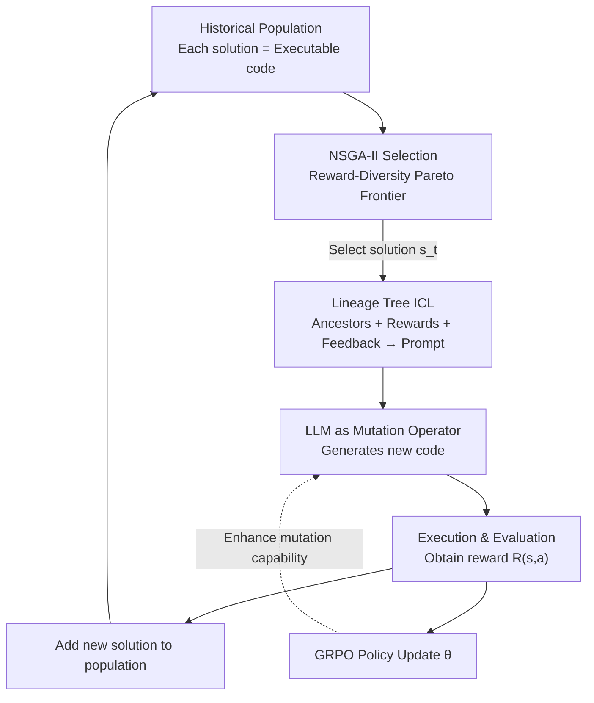

# Helix: Evolutionary Reinforcement Learning for Open-Ended Scientific Problem Solving

**Conference**: ICLR 2026  
**arXiv**: [2603.07642](https://arxiv.org/abs/2603.07642)  
**Code**: None (not provided in the paper)  
**Area**: Reinforcement Learning / Scientific Discovery  
**Keywords**: Evolutionary Algorithms, GRPO, Scientific Optimization, NSGA-II, In-context Learning

## TL;DR

The authors propose HELIX, a framework that combines Reinforcement Learning (GRPO) with Evolutionary Algorithms (NSGA-II) for open-ended scientific problem solving. RL iteratively optimizes the policy, evolutionary mechanisms balance solution quality and diversity, and in-context learning utilizes historical solutions to guide exploration. Using only a 14B model, it outperforms GPT-4o pipelines across 20 tasks, including circle packing and machine learning optimization.

## Background & Motivation

**Background**: Using LLMs to solve complex scientific problems (symbolic regression, molecular generation, mathematical optimization) is a prominent direction. Post-training methods (SFT/RLVR) are effective for reasoning tasks but prone to entropy collapse when facing open-ended scientific problems, making it difficult to discover truly novel solutions. Workflow-based methods (e.g., AlphaEvolve) embed LLMs into evolutionary pipelines but rely heavily on task-specific designs.

**Limitations of Prior Work**: (a) Pure RL methods lack memory—the sampling context for the same problem is fixed, failing to utilize historically discovered high-quality solutions; (b) Evolutionary methods use fixed pre-trained models for mutation without updating model parameters, limiting exploration capability to pre-existing knowledge; (c) Both approaches lack a robust balance between exploration and exploitation.

**Key Challenge**: Three characteristics of open-ended scientific problems—domain-specificity, unbounded solution spaces, and no global optimum guarantee—require the ability to learn from experience, balance quality and diversity, and explore by "standing on the shoulders of giants."

**Goal**: Design a general framework that enables LLMs to continuously discover superior solutions through the collaborative iteration of RL and evolution in scientific optimization problems without standard answers.

**Key Insight**: Represent "solutions" as code and use the LLM as a mutation/improvement operator; employ RL (GRPO) to update policy parameters for better solution refinement; and use NSGA-II to filter the population along the reward-diversity Pareto frontier.

**Core Idea**: RL teaches the model "how to improve solutions," evolution ensures "exploration in diverse directions," and in-context learning allows the model to "explore based on known good solutions."

## Method

### Overall Architecture

HELIX addresses open-ended scientific optimization where no standard answers exist and the solution space is unbounded. It represents each "solution" as executable code, treats the LLM as a mutation operator, and integrates three modules into an iterative loop. In each iteration: NSGA-II selects high-quality and diverse solutions from the historical population to find the target $s_t$ for improvement; this solution and its lineage tree are packed into a prompt, allowing the model to generate a new version of the code based on previous modifications; after execution, the new solution receives a reward $R$, is added back to the population, and the policy $\theta$ is updated via GRPO to enhance the mutation operator.

### Key Designs

**1. NSGA-II Multi-objective Population Selection: Countering Entropy Collapse with Diversity**

If solutions are selected solely by reward, RL quickly collapses entropy and converges to a local optimum. HELIX treats population selection as a dual-objective problem of reward and diversity. Besides the reward $R(s)$, a diversity score is calculated:

$$\text{Div}(s_i) = 1 - \frac{1}{k}\sum_{j \in \mathcal{N}_k(i)} \cos(E(s_i), E(s_j))$$

This measures how "unique" a solution is by averaging cosine similarities with its $k$-nearest neighbors in a pre-trained embedding space. NSGA-II performs non-dominated sorting and crowding distance filtering on these objectives to maintain the Pareto frontier, ensuring the population contains both high-performing and diverse solutions.

**2. Lineage Tree In-context Learning: Providing the Evolutionary Genealogy**

To make model improvements more purposeful, instead of providing random high-quality examples, HELIX inserts the entire lineage of the current solution—ancestors, their rewards, and feedback—into the prompt:

$$q = \text{ConstructPrompt}\big(\{p\} \cup \{s_t, R(s_t), F(s_t)\} \cup \{f^{(k)}(s_t), R(f^{(k)}(s_t)), F(f^{(k)}(s_t))\}_{1 \leq k < n}\big)$$

where $f^{(k)}$ is the $k$-th generation ancestor. The model observes how the solution evolved from $v_0$ to $v_n$ and how rewards changed, allowing it to infer "effective improvement directions" rather than re-attempting failed steps.

**3. GRPO Policy Optimization: Strengthening the "Mutation Operator"**

Unlike workflow methods that use a fixed pre-trained model, HELIX uses RL to feedback reward signals into the parameters. After executing a new solution and obtaining its reward, the model samples $G$ rollouts $\{a_j\}$ given prompt $q$ and solution $s_t$. It is trained using the clipped surrogate objective of GRPO, with advantages normalized within the group:

$$\hat{A}_{j,k} = \frac{R(s_t,a_j) - \text{mean}\{R\}}{\text{std}\{R\}}$$

This allows the model to truly learn how to modify code for specific problem classes, improving its mutation capability over time.

### Loss & Training

The training objective is the standard GRPO objective with clipping $\epsilon$ and KL penalty $\beta$. Diversity is measured using a pre-trained embedding model in the semantic space rather than raw code comparison to avoid treating stylistic differences as functional diversity. Training is iterative: generating new solutions $\rightarrow$ evaluation $\rightarrow$ updating the population with NSGA-II $\rightarrow$ updating policy parameters with GRPO.

## Key Experimental Results

### Main Results

Comparison of best results across 20 tasks in 5 categories:

| Task Category | Task | Task-Specific | GPT-4o+OpenEvolve | **HELIX (14B)** |
|----------|------|---------------|-------------------|-----------------|
| ML | Adult Income (F1↑) | 80.72 | 72.27 | **82.07** |
| ML | Bank Marketing (F1↑) | 76.32 | 78.54 | **80.65** |
| ML | Boston Housing (RMSE↓) | 3.258 | 2.937 | **1.747** |
| Circle Packing | Sum of Radii ↑ | - | - | **2.63598** |

HELIX with a 14B model outperforms GPT-4o pipelines in ML tasks, with an average F1 improvement of 5.95 points.

### Ablation Study

| Configuration | Average Reward | Description |
|------|----------|------|
| Full HELIX | Highest | RL + Evolution + ICL |
| w/o RL | Medium | Model parameters not updated; fixed mutation capability |
| w/o Evolution | Low | Entropy collapse; loss of solution diversity |
| w/o ICL | Medium | Unable to leverage ancestral experience |
| w/o Diversity selection | Med-Low | Selection by reward only; rapid local optimum convergence |

### Key Findings

- **RL and Evolution are both indispensable**: Pure RL leads to entropy collapse, while pure evolution is limited by the fixed mutation capability of the base model.
- Semantic embeddings are superior to raw code for diversity metrics, as functionally identical solutions with different styles should not be considered "diverse."
- Lineage tree depth significantly impacts performance; too short lacks context, while too long exceeds prompt limits.
- A 14B model using HELIX surpasses GPT-4o with hand-designed pipelines, suggesting that updating parameters (RL) is more effective than increasing model scale.

## Highlights & Insights

- **Fusion of RL and Evolution**: RL handles "improving capability," while evolution handles "exploring multiple directions." This dual system is better suited for unbounded open-ended problems than either method alone.
- **Lineage Tree as ICL Context**: Instead of random examples, the model sees a complete evolutionary history, helping it understand effective modification trajectories.
- **General Framework**: A single HELIX framework handles diverse problem classes like ML optimization, physics simulation, and symbolic regression, demonstrating strong generalization.

## Limitations & Future Work

- **Security of Code Evaluation**: Executing generated code for rewards poses security risks, especially in simulator environments.
- **Task-Specific Reward Functions**: While the framework is general, each task still requires a precisely defined reward function $R(s)$.
- **Computational Overhead**: Each iteration involves generation, evaluation, and RL updates, resulting in significant training costs.
- **Scaling Requirements**: Tasks requiring high geometric reasoning (e.g., complex physics) may still require models larger than 14B.

## Related Work & Insights

- **vs. AlphaEvolve/OpenEvolve**: These use fixed models for mutation. HELIX's integration of RL to evolve the mutation capability itself is a fundamental advancement.
- **vs. Standard RLVR (GRPO/DAPO)**: Standard RLVR does not maintain a population of solutions. HELIX uses evolutionary populations to preserve diversity and historical memory.
- **Inspiration for AI for Science**: The "RL for capability + Evolution for diversity + ICL for context" triad can be extended to protein design, catalyst discovery, and hardware optimization.

## Rating

- Novelty: ⭐⭐⭐⭐ Creative combination of RL and Evolution, though individual components are established.
- Experimental Thoroughness: ⭐⭐⭐⭐⭐ Comprehensive coverage across 20 tasks with detailed ablations.
- Writing Quality: ⭐⭐⭐⭐ Clear framework description, though mathematically dense.
- Value: ⭐⭐⭐⭐⭐ Provides a powerful general framework for solving open-ended scientific problems.

<!-- RELATED:START -->

## Related Papers

- [\[ICLR 2026\] QuRL: Rubrics As Judge For Open-Ended Question Answering](qurl_rubrics_as_judge_for_open-ended_question_answering.md)
- [\[ICLR 2026\] From Verifiable Dot to Reward Chain: Harnessing Verifiable Reference-based Rewards for RL of Open-ended Generation](from_verifiable_dot_to_reward_chain_harnessing_verifiable_reference-based_reward.md)
- [\[ACL 2026\] KASER: Knowledge-Aligned Student Error Simulator for Open-Ended Coding Tasks](../../ACL2026/reinforcement_learning/kaser_knowledge-aligned_student_error_simulator_for_open-ended_coding_tasks.md)
- [\[ICLR 2026\] Neural Predictor-Corrector: Solving Homotopy Problems with Reinforcement Learning](neural_predictor-corrector_solving_homotopy_problems_with_reinforcement_learning.md)
- [\[ICLR 2026\] Solving Parameter-Robust Avoid Problems with Unknown Feasibility using Reinforcement Learning](solving_parameter-robust_avoid_problems_with_unknown_feasibility_using_reinforce.md)

<!-- RELATED:END -->
