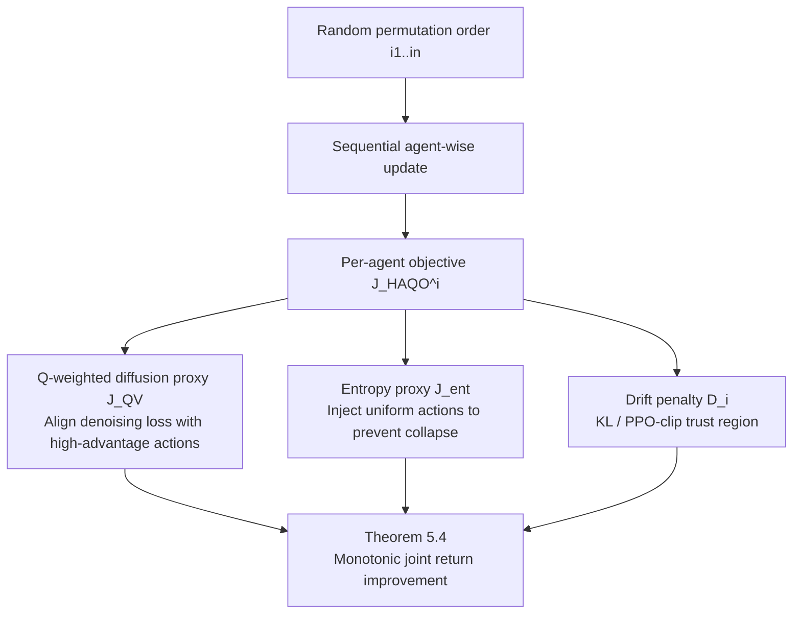

# Heterogeneous Agent Q-weighted Policy Optimization

**Conference**: ICLR 2026  
**OpenReview**: [https://openreview.net/forum?id=kPrvXjUZPG](https://openreview.net/forum?id=kPrvXjUZPG)  
**Code**: TBD  
**Area**: Reinforcement Learning / Multi-Agent Reinforcement Learning  
**Keywords**: Multi-Agent Reinforcement Learning, Heterogeneous agents, Diffusion policy, Q-weighted variational objective, Sequential updates, Trust region, Monotonic improvement guarantees  

## TL;DR
HAQO integrates sequential advantage updates, Q-weighted diffusion policies, and entropy regularization into a unified framework. This allows heterogeneous agents to represent multimodal policies using diffusion models while ensuring monotonic improvement of joint returns, similar to trust region methods.

## Background & Motivation
- **Background**: Cooperative MARL has long been dominated by two categories of methods: value decomposition/trust region methods (QMIX, MAPPO, HAPPO, HATRPO) which provide stability but restrict policies to unimodal Gaussians; and generative policies (diffusion, normalizing flows) which offer strong expressiveness but lack optimization-level improvement guarantees.
- **Limitations of Prior Work**: In heterogeneous scenarios (where agents have different observation/action spaces and roles), unimodal Gaussian policies suffer from **mode collapse** into sub-optimal behaviors, failing to represent the multimodal coordination required. Simultaneously updating all heterogeneous agents introduces non-stationarity because the advantage function is defined over the joint policy, breaking improvement guarantees.
- **Key Challenge**: **Stability ↔ Expressivity**—Stability requires constrained updates to prevent divergence, while expressivity requires capturing multimodal policies. These are difficult to achieve simultaneously in heterogeneous MARL. Furthermore, the log-likelihood $\log\pi^i$ of diffusion policies is not analytically computable, rendering classic likelihood-ratio proxies and entropy regularization ineffective.
- **Goal**: Achieve both expressivity (multimodal diffusion policies) and stability (monotonic improvement + trust region) in heterogeneous MARL, providing a formalized bound for return differences.
- **Core Idea**: **Sequential updates for stability** + **Q-weighted variational objective to align diffusion denoising loss with return maximization** + **Entropy proxy to maintain exploration when likelihood is unavailable**. These components form a per-agent trust region optimization objective with proven monotonic improvement.

## Method

### Overall Architecture
Within the CTDE paradigm, HAQO decomposes each agent's update into three layers: sequential, Q-weighted, and entropy-regularized. Agents are updated one by one according to a random permutation. Conditioned on the updated policies of predecessors, each agent maximizes an objective consisting of a Q-weighted denoising proxy (driving return improvement), an entropy proxy (injecting exploration), and a drift penalty (KL or PPO-clip constraints). The framework ensures the monotonic improvement of the overall joint return.

### Key Designs

**1. Sequential Advantage-Aware Update: Decomposing multi-agent non-stationarity into controllable step-wise improvements.** Updating all agents simultaneously invalidates the advantage function defined on the joint policy, losing improvement guarantees. HAQO adopts the sequential update concept from HAML, decomposing the return difference via a telescoping sum $J(\pi_{\text{new}})-J(\pi_{\text{old}})=\sum_{m=1}^{n}\big[J(\pi^{i_{1:m}}_{\text{new}},\pi^{i_{m+1:n}}_{\text{old}})-J(\pi^{i_{1:m-1}}_{\text{new}},\pi^{i_{m:n}}_{\text{old}})\big]$. Each agent optimizes a proxy objective $L_i(\pi^i)=\mathbb{E}_{s\sim\rho_{\pi_{\text{old}}},a^{-i}\sim\pi^{-i}_{\text{new}}}\mathbb{E}_{a^i\sim\pi^i}[A_i(s,a^i)]$ given its predecessors have been updated and successors maintain old policies. Trust region constraints $\mathbb{E}_{s\sim\rho_{\pi_{\text{old}}}}\mathrm{KL}(\pi^i_{\text{old}}\|\pi^i)\le\delta_i$ ensure that distribution drift contributes only a second-order small term. Proposition 5.1 provides the bound $J(\pi_{\text{new}})-J(\pi_{\text{old}})\ge\sum_i\big[L_i(\pi^i_{\text{new}})-L_i(\pi^i_{\text{old}})\big]-\sum_i C_i\delta_i^2$, where the penalty scales **linearly** rather than exponentially with the number of agents.

**2. Heterogeneous Q-weighted Variational (QV) Diffusion Target: Using non-negative weights to transform denoising loss into a valid policy gradient proxy.** Diffusion policies are implicitly defined via reverse SDEs, making $\log\pi^i$ impossible to evaluate in closed form. HAQO defines a denoising proxy for each agent $J^{QV}_i(\theta_i)=\mathbb{E}\big[\omega_i(s,a^i,a^{-i})\,\|\epsilon-\epsilon_{\theta_i}(\sqrt{\bar\alpha_t}a^i+\sqrt{1-\bar\alpha_t}\epsilon,s,t)\|^2\big]$, biasing denoising updates toward high-advantage actions. Since advantages $A_i$ can be negative, the authors employ two positive-preserving transformations: `qadv` (centering followed by rectification $\omega_i=\max\{0,A_i(s,a^i)-\mathbb{E}_{\tilde a^i}A_i(s,\tilde a^i)\}$) to maintain weight calibration, and `qcut` (thresholding $\omega_i=\max\{0,A_i\}\cdot\mathbb{1}\{A_i\ge\varepsilon\}$) to focus on high-advantage samples. Proposition 5.2 proves $L_i(\pi^i)\ge J^{QV}_i(\theta_i)-\xi_i$ with $\xi_i=O(\epsilon_Q)$ (critic bias), achieving equivalence to classic policy gradients at the limit of zero bias.

**3. Entropy Proxy for Diffusion Policies: Maintaining exploration via uniform action injection.** Classic entropy regularization requires $\log\pi^i(a^i|s)$. HAQO injects **uniformly sampled actions** into the denoising objective $J^{ent}_i(\theta_i)=\mathbb{E}_{s,\tilde a^i\sim U(A_i),\epsilon,t}\big[\alpha_i\|\epsilon-\epsilon_{\theta_i}(\sqrt{\bar\alpha_t}\tilde a^i+\sqrt{1-\bar\alpha_t}\epsilon,s,t)\|^2\big]$, using state-independent uniform reconstruction to broaden policy support. Proposition 5.3 proves this proxy is non-negative and enforces a spectral lower bound on action covariance $\lambda_{\min}(\Sigma^i_s)\ge\sigma^2_{\min}>0$, yielding an entropy lower bound $H(A_i|s)\ge\frac{d_i}{2}\log(2\pi e\,\sigma^2_{\min})$. This extends Maximum Entropy RL principles to settings with intractable likelihoods.

**4. Synthesized Objective and Monotonic Improvement Theorem.** The components are combined into a per-agent objective $J^{HAQO}_i(\theta_i)=\max_{\pi^i\in\mathcal{T}^i(\pi^i_{\text{old}})}J^{QV}_i(\theta_i)+J^{ent}_i(\theta_i)-D_i(\pi^i\|\pi^i_{\text{old}})$, where $\mathcal{T}^i$ is the trust region and $D_i$ is the drift penalty. Theorem 5.4 proves $J(\pi_{\text{new}})-J(\pi_{\text{old}})\ge\sum_i\big[J^{QV}_i+J^{ent}_i\big]-\sum_i C_i\delta_i^2-O(\epsilon_Q)$ under assumptions of bounded rewards and critic bias. Algorithm 1 implements this using centralized critic updates and sequential agent-wise policy optimization with K-candidate variance reduction.

## Key Experimental Results

### Main Results (Multi-Agent MuJoCo, Average Return, standard deviation in parentheses)

| Environment | HAA2C | MAPPO | HATRPO | HAPPO | HAQO |
|------|-------|-------|--------|-------|------|
| Ant-v2 4x2 | 5637 (86) | 5874 (32) | 5013 (432) | 5793 (59) | **6014 (201)** |
| HalfCheetah-v2 2x3 | 4231 (1069) | 6984 (132) | 5369 (247) | **7024 (103)** | 6873 (137) |
| Hopper-v2 3x1 | 1832 (923) | 3612 (57) | 3733 (102) | 3481 (173) | **3884 (81)** |
| Walker2d-v2 2x3 | 1124 (94) | 5013 (483) | 3744 (373) | 5523 (214) | **5681 (301)** |
| Walker2d-v2 6x1 | 1923 (234) | 4693 (247) | 2109 (223) | 4317 (401) | **4789 (293)** |
| Humanoid-v2 17x1 | − | 732 (13) | − | 6739 (201) | **7013 (311)** |

HAQO achieves the highest return in 5 out of 6 continuous control tasks. It shows a significant advantage in high-dimensional multimodal tasks like Humanoid 17x1, where Gaussian policies may collapse, whereas diffusion policies capture complex gaits (alternating leg phases, torso stability, etc.).

### Ablation Study (GRF, Gaussian vs. Diffusion Policy, Average Return)

| Environment | Gaussian | Diffusion |
|------|----------|----------|
| PS | 76.24 (8.23) | **92.14 (2.13)** |
| RPS | 43.27 (10.31) | **80.39 (3.87)** |
| 3 vs 1 with keeper | 66.82 (9.12) | **97.27 (1.07)** |

### Key Findings
- **Sequential Update** (Bi-D dexterity): Simultaneous updates lead to frequent object drops and unstable grasping due to action conflicts. Sequential updates allow agents to adapt to the latest policies of their partners, resulting in faster learning and higher performance.
- **Expressivity** (GRF): Diffusion policies not only yield higher returns but also significantly lower variance, proving that multimodal representation is a necessity for complex coordination.
- **Entropy Regularization** (MPE Landmark): Without entropy regularization, agents collapse to covering only two landmarks (over-exploitation). The entropy proxy enables balanced coverage of all landmarks, empirically validating Proposition 5.3.

## Highlights & Insights
- Unifies the "Stability vs. Expressivity" trade-off into a **provable** framework: sequential updates manage stability, QV proxies manage alignment, and entropy proxies manage exploration.
- Solves the two "intractable likelihood" pain points of diffusion policies: using QV denoising as a policy gradient surrogate and uniform injection as an entropy surrogate.
- The improvement bound scales **linearly** with the number of agents (due to sequential execution), making it friendly to heterogeneous and large-scale scenarios.
- The design of `qadv`/`qcut` transformations is practical: directly using advantages as weights would violate the lower-bound property.

## Limitations & Future Work
- The entropy proxy is **one-sided**; it guarantees an entropy lower bound to prevent collapse but does not upper-bound entropy, differing from standard symmetric Maximum Entropy RL constraints.
- Improvement guarantees still rely on bounded critic bias $\epsilon_Q$ and small trust region radii $\delta_i$. In practice, diffusion variance and computational costs may amplify estimation errors.
- Inference requires multi-step sampling, which may impact real-time performance and throughput in online MARL compared to unimodal Gaussians.

## Related Work & Insights
- **Heterogeneous Mirror Learning (HAML)**: HAQO's sequential update and monotonic improvement framework are built upon HAML's mirror descent and trust region guarantees, extending them from unimodal to diffusion policies.
- **QVPO / Advantage Weighting**: The idea of aligning diffusion VLB with policy gradients originated from single-agent QVPO; this work generalizes it to multi-agent settings with sequential update corrections.
- **Diffusion/Generative Policies**: While previous works offered expressivity, they lacked optimization guarantees and were often limited to homogeneous settings. HAQO fills the gap for stable integration in heterogeneous online collaboration.

## Rating
- **Novelty**: ⭐⭐⭐⭐ First to unify diffusion policies, Q-weighted variation, and sequential trust regions in heterogeneous MARL with monotonic improvement theorems.
- **Experimental Thoroughness**: ⭐⭐⭐⭐ Covers MPE, SMAC, GRF, Multi-MuJoCo, and Bi-D.
- **Writing Quality**: ⭐⭐⭐⭐ Clear logic; clear mapping between propositions, theorems, and algorithms.
- **Value**: ⭐⭐⭐⭐ Provides a provable template for how high-expressivity generative policies can achieve MARL improvement guarantees.

<!-- RELATED:START -->

## Related Papers

- [\[ICLR 2026\] Multi-Agent Guided Policy Optimization](multi-agent_guided_policy_optimization.md)
- [\[ICLR 2026\] GEPO: Group Expectation Policy Optimization for Stable Heterogeneous Reinforcement Learning](gepo_group_expectation_policy_optimization_for_stable_heterogeneous_reinforcemen.md)
- [\[ICLR 2026\] Correlated Policy Optimization in Multi-Agent Subteams](correlated_policy_optimization_in_multi-agent_subteams.md)
- [\[ICLR 2026\] Dichotomous Diffusion Policy Optimization](dichotomous_diffusion_policy_optimization.md)
- [\[ICLR 2026\] TRAPO: Trust-Region Adaptive Policy Optimization](trust-region_adaptive_policy_optimization.md)

<!-- RELATED:END -->
