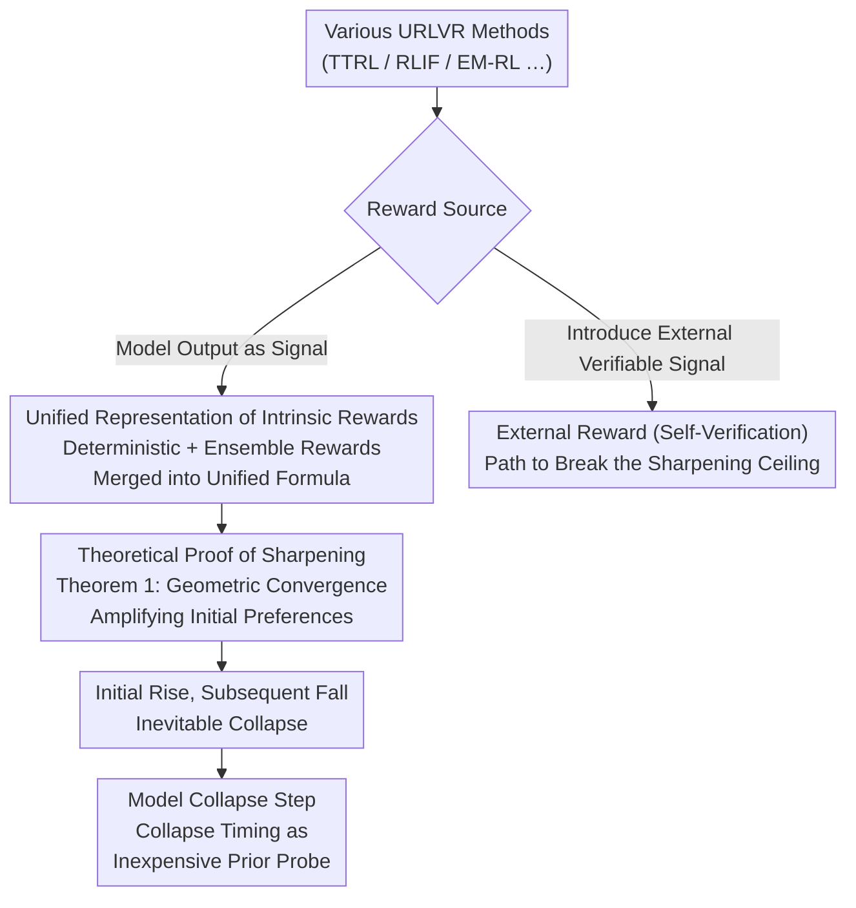

# How Far Can Unsupervised RLVR Scale LLM Training?

**Conference**: ICLR 2026  
**arXiv**: [2603.08660](https://arxiv.org/abs/2603.08660)  
**Code**: [PRIME-RL/TTRL](https://github.com/PRIME-RL/TTRL)  
**Area**: Reinforcement Learning  
**Keywords**: unsupervised RLVR, model collapse, intrinsic rewards, sharpening mechanism, test-time training

## TL;DR

This paper provides a comprehensive analysis of Unsupervised Reinforcement Learning via Verifiable Rewards (URLVR), revealing that all intrinsic reward methods essentially "sharpen" the model's initial distribution. This leads to an inevitable "rise-then-fall" collapse pattern. The authors propose the Model Collapse Step as a prior metric for model trainability and suggest that external reward methods are the key to breaking the scalability bottleneck.

## Background & Motivation

RLVR (Reinforcement Learning via Verifiable Rewards) is the core driver behind recent breakthroughs in LLM reasoning (e.g., DeepSeek-R1, Gemini 2.5, Qwen3). However, supervised RLVR relies on high-quality annotated datasets. As model capabilities approach or exceed human levels, obtaining reliable ground truth labels becomes increasingly difficult and expensive—this is the **supervised bottleneck**.

**Unsupervised RLVR (URLVR)** has emerged to provide reward signals without relying on ground truth labels. Similar to how scaling laws in pre-training transform massive unlabelled data into intelligence, URLVR aims to extend this paradigm to post-training.

However, existing URLVR methods (e.g., TTRL, RLIF, EM-RL) report initial improvements but exhibit issues like reward hacking and model collapse. Systematic comparisons across different settings are lacking, raising a fundamental question: **Can intrinsic rewards truly scale LLM training?**

## Method

### Overall Architecture

Rather than proposing a new algorithm, this paper investigates whether intrinsic rewards without annotations can scale post-training like pre-training. The authors categorize URLVR methods into "intrinsic rewards" and "external rewards." For intrinsic rewards, the paper proves that despite diverse formulations, they all essentially **sharpen the model’s initial distribution**. A theorem is derived showing this leads to an inevitable "rise-then-fall" performance pattern. Finally, the "Model Collapse Step" is introduced as an inexpensive metric to predict RL trainability, and "external rewards" (e.g., Self-Verification) are identified as the solution to break the performance ceiling.

### Key Designs

**1. Unified Representation of Intrinsic Rewards: Categorization and Merging**

The authors first categorize intrinsic rewards into two branches: **deterministic rewards** calculated directly from model logits—including Self-Certainty (KL divergence from uniform), Token-Level Entropy (negative entropy), Trajectory-Level Entropy (sequence log-probability), and Probability (product of probabilities)—and **ensemble rewards** based on consistency across multiple rollouts, such as Majority Voting in TTRL. Crucially, all five methods can be represented by a unified formula:

$$r_{uni}(x,y) = \psi\!\left(\frac{\sigma}{|\mathcal{I}|} \sum_{i \in \mathcal{I}} \mathbb{H}(q_i, \pi_\theta^i)\right)$$

where $\mathcal{I}$ determines the aggregation granularity, $q$ is a reference anchor distribution, $\sigma \in \{+1,-1\}$ controls the direction of cross-entropy, and $\psi$ is a monotonic transformation. This unified view establishes that these methods are essentially equivalent implementations of cross-entropy manipulation.

**2. Theoretical Proof of Sharpening Mechanism: Why Rewards Only Amplify Existing Preferences**

Since intrinsic rewards use the model's own output as signals, no external information is introduced. The training only increases the model's confidence in its existing tendencies. Using TTRL as an example, the authors prove this via **Theorem 1 (Geometric Convergence to Deterministic Policy)**. Under the assumptions of "majority stability" and "effective learning," the probability of the majority answer $p_{maj}^{(k)}$ converges to 1 at a geometric rate $\rho = e^{-1/\beta}$. This explains the structural nature of the observed collapse: it is not a hyperparameter issue but an inherent result of the sharpening mechanism, which is beneficial when confidence aligns with correctness but harmful when it amplifies incorrect preferences.

**3. Model Collapse Step: Collapse Timing as an Inexpensive Prior Probe**

Since collapse is inevitable, the "timing of collapse" becomes the critical piece of information, reflecting the strength of the model's prior. A model with a stronger prior (closer to the correct distribution) can undergo more sharpening steps before performance drops. The authors define the number of steps from the start of training until performance peaks and begins to decline as the **Model Collapse Step**. This metric correlates strongly with **GT Gain** (improvement achieved using ground truth rewards) across various model families but requires only $1/5.6$ of the computation and zero ground truth labels.

### Loss & Training

Experiments are conducted using the GRPO algorithm within the veRL framework. Default settings include temperature 1.0, batch size 64, 8 rollouts per question, and no KL regularization. The main experiments use Qwen3-1.7B-Base on the DAPO-17k dataset.

## Key Experimental Results

### Main Results: Rise-then-Fall Pattern

Systematic experiments across 5 intrinsic reward methods and 4 hyperparameter combinations:

| Method | Degradation Pattern | Characteristics |
|------|---------|------|
| Self-Certainty | Progressive Degradation | Most stable; slowest degradation; maintains high Label Accuracy. |
| Majority Voting | Progressive Degradation | Operates at answer level; avoids token-level artifacts. |
| Probability | Length Collapse | Rewards short sequences; model output length shrinks drastically. |
| Token-Level Entropy | Repetition Collapse | Minimizes entropy via high-probability token repetition. |
| Trajectory-Level Entropy | Repetition Collapse | Fills sequences with repetitive text. |

### Ablation Study

| Configuration | Key Finding |
|------|---------|
| Hyperparameter Tuning | All settings eventually collapse; differences lie only in "when," not "if." |
| Single-Question Training | Only 12% of 25 questions flipped correctness; most only sharpened existing preferences. |
| Dataset Size (32 to 16,384) | $\le 128$ samples prevent collapse; $\ge 512$ samples lead to inevitable collapse. |
| Test-time vs Train-time | Test-time training on small datasets is effective; train-time on large datasets collapses. |
| 32 Samples (All Wrong Initial Vote) | Still improves OOD performance (AIME24/AMC23). |

### Model Collapse Step

| Model | Collapse Step | GT Gain | Correlation |
|------|--------------|---------|--------|
| OLMo Series (Weak Prior) | ~14-22 steps | Low | Strong Positive |
| LLaMA Series (Medium) | ~19-128 steps | Medium | Strong Positive |
| Qwen Series (Strong Prior) | ~172-195 steps | High | Strong Positive |

Cost Comparison: Model Collapse Step requires only **1/5.6** of the computation of GT Gain and requires no ground truth labels.

### External Rewards: Self-Verification Experiments

| Method | Qwen3-1.7B Validation Acc | Characteristics |
|------|---------------------|------|
| Trajectory-Level Entropy | ~40% (then collapse) | Inherent scalability limit. |
| Self-Verification | ~65% (continuous rise) | Reward Accuracy recovers after initial drop. |
| Oracle Supervision | ~70% | Upper bound. |

### Key Findings

- **Sharpening nature of all intrinsic rewards**: Regardless of design, they converge toward the model's initial distribution.
- **Rise-then-fall is an inherent issue**: Even with optimal hyperparameters, collapse occurs after ~1000 steps (approx. 4 epochs).
- **Unique value of small datasets**: $\le 128$ samples avoid collapse via local overfitting rather than global policy shift (KL divergence 0.057 vs $>2\times$ on large datasets).
- **Counter-intuitive OOD generalization**: Training on questions where the model was initially wrong can still improve test set performance.
- **Model prior is everything**: Qwen > LLaMA, SFT > Base; smaller models are paradoxically more stable.
- **Instruction alignment is key for Self-Verification**: Aligned models start at 60%+ acc and are robust to prompts; base models only succeed with specific prompts.

## Highlights & Insights

- **Unified theoretical framework**: Unifies seemingly diverse intrinsic reward methods as instances of cross-entropy manipulation.
- **Theoretical proof of sharpening**: Redefines the understanding of URLVR—not as learning new knowledge, but as amplifying existing preferences.
- **Model Collapse Step**: A simple, cost-effective predictor for RL trainability without needing GT labels, offering direct utility for model selection.
- **Bridging theory and practice**: Theorem 1 perfectly corresponds to the "rise-then-fall" patterns observed in empirical experiments.

## Limitations & Future Work

- Experiments primarily focus on mathematical reasoning; validation in other domains (code, general dialogue) is needed.
- Self-Verification is only tested on the simple Countdown task.
- Systematic research on external reward methods is preliminary.
- Theoretical assumptions (majority stability, effective learning) may not always hold in practice.
- The effective combination of intrinsic and external rewards remains unexplored.

## Related Work & Insights

This work intersects with RLVR (DeepSeek-R1, Qwen3), unsupervised/self-supervised learning, and test-time training. Specific methods like TTRL, RLIF, and EM-RL are analyzed within the sharpening framework. The exploration of Self-Verification suggests a path to break the confidence-correctness ceiling of intrinsic rewards, particularly through generation-verification asymmetry (e.g., formal verification, code execution).

## Rating

- Novelty: ⭐⭐⭐⭐⭐ (Unified theory + Model Collapse Step + systematic analysis)
- Experimental Thoroughness: ⭐⭐⭐⭐⭐ (5 methods × 4 hyperparameters × multiple model families/datasets)
- Writing Quality: ⭐⭐⭐⭐⭐ (Clear structure with a complete logic chain from theory to practice)
- Value: ⭐⭐⭐⭐⭐ (Provides a clear roadmap and practical tools for the URLVR field)

<!-- RELATED:START -->

## Related Papers

- [\[ICLR 2026\] Prosperity before Collapse: How Far Can Off-Policy RL Reach with Stale Data on LLMs?](prosperity_before_collapse_how_far_can_off-policy_rl_reach_with_stale_data_on_ll.md)
- [\[ICLR 2026\] Prompt Curriculum Learning for Efficient LLM Post-Training](prompt_curriculum_learning_for_efficient_llm_post-training.md)
- [\[ICLR 2026\] Unsupervised Learning of Efficient Exploration: Pre-training Adaptive Policies via Self-Imposed Goals](unsupervised_learning_of_efficient_exploration_pre-training_adaptive_policies_vi.md)
- [\[ICLR 2026\] When Greedy Wins: Emergent Exploitation Bias in Meta-Bandit LLM Training](when_greedy_wins_emergent_exploitation_bias_in_meta-bandit_llm_training.md)
- [\[ICLR 2026\] Exploratory Diffusion Model for Unsupervised Reinforcement Learning](exploratory_diffusion_model_for_unsupervised_reinforcement_learning.md)

<!-- RELATED:END -->
