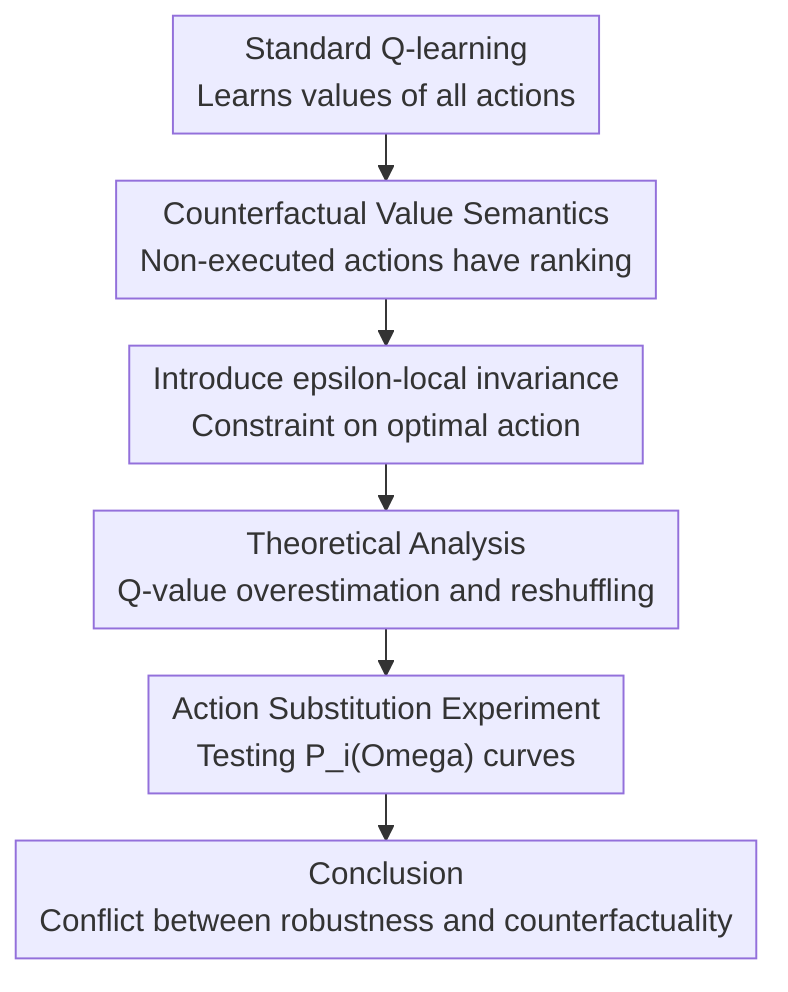

# How to Lose Inherent Counterfactuality in Reinforcement Learning

**Conference**: ICLR2026  
**OpenReview**: [https://openreview.net/forum?id=2kutK2Y8Sv](https://openreview.net/forum?id=2kutK2Y8Sv)  
**Code**: None  
**Area**: Reinforcement Learning / Robust Reinforcement Learning  
**Keywords**: Counterfactual value, Robust Reinforcement Learning, Local invariance, Q-value estimation, Adversarial training

## TL;DR

This paper demonstrates through both theoretical analysis and Atari experiments that standard reinforcement learning naturally learns ordered counterfactual values for non-executed actions, whereas robust training that explicitly pursues $\epsilon$-local invariance distorts the Q-function, reshuffles suboptimal actions, causes value overestimation, and forces the policy to lose this counterfactual capability.

## Background & Motivation

**Background**: Since deep reinforcement learning utilizes neural networks to approximate policies or Q-functions, it has achieved complex control strategies in high-dimensional MDPs such as Atari. Simultaneously, an influential direction in robust and safe reinforcement learning suggests that since small observation perturbations can change action selection, training should explicitly constrain the policy to maintain action invariance within an $\epsilon$-ball, ensuring that $\arg\max_a Q(s,a)$ is insensitive to local perturbations.

**Limitations of Prior Work**: While this approach is intuitive—similar local invariance objectives are common in adversarial training for classification—the Q-function in RL is not equivalent to the logits of a standard classifier. It must simultaneously represent the long-term returns of the optimal action and all non-executed actions. If training only cares about "maintaining the identity of the optimal action before and after perturbation," it may preserve the superficial action while sacrificing the ranking and numerical semantics of Q-values.

**Key Challenge**: The paper identifies a fundamental contradiction: value learning in RL inherently involves counterfactuality—even if an action is not executed, the Q-function should estimate "what would happen if it were chosen." However, $\epsilon$-local invariance training shifts the objective to "nearby states cannot change the optimal action," which pushes all suboptimal actions to serve geometric constraints for robustness margins rather than the true MDP returns.

**Goal**: The authors aim to answer two questions: first, the consequences of explicitly embedding safety or robustness constraints into Q-learning updates on the learned value function; second, why the seemingly simple counterfactual value ranking in standard RL is worth preserving rather than being treated as a disposable byproduct.

**Key Insight**: The paper connects the mathematical intuition of RL with counterfactual decision-making in neuroscience. Human decision-making encodes not only the value of chosen actions but also the value of unchosen options, using this ranking to guide future decisions. Formally, $Q(s,a)$ in standard Q-learning naturally possesses similar semantics. The authors argue that this semantic structure is not decorative but a fundamental part of generalization and reasoning capabilities.

**Core Idea**: A structural conflict between "accurate Q-value estimation" and "enforcing $\epsilon$-local invariance" is proven using an analytically solvable linear Q-function MDP, followed by high-dimensional Atari experiments demonstrating that robust training indeed causes the Q-function to lose its counterfactual ordering.

## Method

### Overall Architecture

The paper does not propose a new RL algorithm but performs a "mechanism diagnosis": it first formalizes the counterfactual value semantics of standard RL, analyzes how $\epsilon$-local invariance regularization alters the TD loss, and finally designs action substitution experiments to check if the trained Q-functions still distinguish the true differences between suboptimal and worst actions. The key to the framework is converting "whether robust training is safe" into "whether the Q-function ranking remains consistent with true returns."

In the theoretical section, the authors analyze MDPs under linear function approximation. The goal is to identify the gradient preferences of robust regularization: it tends to expand the gap between the optimal action and competing actions, even if this expansion requires inflating certain Q-values or disrupting the true order of suboptimal actions. In the experimental section, these predictions are applied to high-dimensional visual states in ALE, comparing vanilla DDQN with $\epsilon$-invariance training strategies like SA-MDP, RADIAL, and ORP.

### Key Designs

**1. Definition of Counterfactuality: Q-functions serve more than the current optimal action**

The first step is re-emphasizing the semantics of $Q(s,a)$: at state $s$, the Q-value of action $a_i$ should represent the expected discounted return of "executing $a_i$ first, then following the optimal policy thereafter." Thus, a trained Q-function should not only identify $a_1=\arg\max_a Q(s,a)$, but the ranking of $a_2, a_3, \ldots$ should correspond to real-world consequences. Counterfactuality here is not a philosophical concept but an estimation target assigned to every state-action pair by the Q-learning update itself.

This is critical for robust training. Many $\epsilon$-invariance methods only check if local perturbations change the identity of the optimal action, requiring $\arg\max_a Q(s,a)=\arg\max_a Q(\hat{s},a)$. However, if the Q-function ranks the second-best action behind the worst action, the optimal action might remain unchanged, and robust certification might appear to hold. Consequently, the paper shifts the evaluation focus from "whether actions flip" to "whether the entire action-value ranking is still credible."

**2. Local Invariance Regularization: Rewriting value semantics to preserve action identity**

The robust RL baselines discussed add a regularization term to the TD loss. This term roughly searches for the most "dangerous" perturbed state $\hat{s}$ within an $\epsilon$-ball and ensures that the Q-values of non-optimal actions do not exceed the original optimal action's Q-value:

$$
R(\theta)=\sum_s \left(\max_{\hat{s}\in D_\epsilon(s)}\max_{a\ne a^*(s)} Q_\theta(\hat{s},a)-Q_\theta(\hat{s},a^*(s))\right).
$$

The training objective then becomes the TD Huber loss plus $R(\theta)$. While this form appears to only protect the action margin, the paper points out that it alters the optimizer's preference for the Q-function. To minimize the regularizer, the model can amplify certain optimal action directions, suppress competing directions, or even push values far from the true $Q^*$. Essentially, robust regularization is not "adding a protective shell to the true value function" but reshaping the value function itself.

This mechanism explains why $\epsilon$-invariance can cause overestimation. If the optimal action is only slightly better than the suboptimal one in a given state, the ranking would naturally flip under local state interpolation; to forcibly avoid this, the model may inflate the optimal Q-value or widen the action gap. Superficially, action selection is more stable, but the calibration between Q-values and actual MDP returns is destroyed.

**3. Linear MDP Counter-example: Accurate estimation and robust invariance are not free**

The paper's first core theorem constructs a linear function approximation example with two states and two actions. Let $s_1, s_2$ be at distance 1, with true optimal values $Q^*(s_1,a_1)=\epsilon/10$, $Q^*(s_1,a_2)=0$, $Q^*(s_2,a_1)=0.8$, and $Q^*(s_2,a_2)=1.0$. If any linear Q-function accurately matches $Q^*$ at $s_1$ and $s_2$, the two action value lines will cross very close to $s_1$, meaning the optimal action changes within the $\epsilon$-neighborhood, failing $\epsilon$-local invariance.

Conversely, the authors show a linear Q-function can be constructed that maintains the correct optimal action at $s_1$ but inflates $Q(s_1,a_1)$ from the true $\epsilon/10$ to $0.8$ to achieve local invariance. The cost is severe overestimation, with an overestimation factor up to $8/\epsilon$. This example is sharp: the issue is not a poorly tuned optimization algorithm, but a structural geometric conflict between "accurate value estimation" and "local action invariance."

**4. Action Substitution Curves: Inferring Q-ranking credibility from behavioral consequences**

To test the theory in high-dimensional Atari, the paper proposes performance degradation curves $P_i(\Omega)$. For each state, actions are ranked by Q-value as $a_1, a_2, \ldots, a_{|A|}$. Then, a proportion $\Omega$ of visited states is randomly sampled, where the $i$-th best action $a_i$ is forced, while $a_1$ is executed in the remaining states. The normalized performance degradation relative to a clean run is defined as:

$$
P=\frac{Score_{base}-Score_{actmod}}{Score_{base}-Score_{min}}.
$$

If the counterfactual ranking of the Q-function is credible, the loss from forcing the second-best action $a_2$ should be smaller than that of the worst action $a_w$, i.e., $P_2(\Omega)<P_w(\Omega)$. The paper also uses $\tau$-domination to compare the area difference between curves: if one curve is significantly higher in an integral sense, it indicates the corresponding action caused greater behavioral loss. This evaluation is well-suited for this problem as it examines whether Q-value rankings translate into return differences during real environment interaction.

### Loss & Training

The theoretical analysis focuses on the difference between standard Q-learning/DDQN style TD updates and $\epsilon$-local invariance regularization. The standard objective is to regress $Q_\theta(s,a)$ toward $r(s,a)+\gamma\max_{a'}Q_{target}(s',a')$. Robust training overlays a local worst-case perturbation regularizer on this objective, forcing non-optimal actions within $D_\epsilon(s)$ to not overtake the original optimal action. In experiments, vanilla policies use DDQN with prioritized experience replay, while robust policies include State-Adversarial MDP RL, RADIAL, and ORP, which represent methods centered on state perturbation or Bellman error robustness.

## Key Experimental Results

### Main Results

The paper compares vanilla RL and $\epsilon$-invariance training on high-dimensional MDPs in the Arcade Learning Environment, such as BankHeist, RoadRunner, and Freeway. The core metric is not the final score but the area of performance degradation after action modification; if $a_2$ is truly the second-best action, $P_2$ should not exceed $P_w$.

| MDP | Action Mod | $\epsilon$-Invariance AUC | Vanilla AUC | Phenomenon |
|-----|----------|---------------------------|-------------|------|
| BankHeist | $a_2$ | $0.449\pm0.007$ | $0.191\pm0.040$ | Robust $a_2$ causes massive loss |
| BankHeist | $a_w$ | $0.311\pm0.011$ | $0.398\pm0.011$ | Vanilla is sensitive to worst action; ranking is more reasonable |
| RoadRunner | $a_2$ | $0.414\pm0.015$ | $0.247\pm0.009$ | $a_2$ loss is higher under robust training |
| RoadRunner | $a_w$ | $0.345\pm0.011$ | $0.393\pm0.002$ | Worst action is indeed worse in Vanilla |
| Freeway | $a_2$ | $0.351\pm0.009$ | $0.302\pm0.007$ | Smaller gap but same direction |
| Freeway | $a_w$ | $0.241\pm0.007$ | $0.311\pm0.010$ | Worst action loss is lower in robust training |

The key takeaway is the horizontal comparison between $a_2$ and $a_w$. Vanilla RL largely aligns with the intuition "second-best action has small loss, worst action has large loss." $\epsilon$-invariance training frequently shows $P_w(\Omega)<P_2(\Omega)$, indicating that the Q-function's ranking for counterfactual actions is unreliable.

### Ablation Study

The paper does not perform a traditional module ablation as it is not introducing a new model; instead, it compares different training paradigms, action modification types, and value diagnosis indicators. The core analysis can be understood by "removing/adding the local invariance constraint."

| Configuration / Subject | Metric | Description |
|-----------------|----------|------|
| Vanilla DDQN | $P_2(\Omega)$ lower than robust; $P_w(\Omega) > P_2(\Omega)$ | Standard RL preserves reasonable suboptimal action ranking |
| $\epsilon$-Invariance Training | $P_2$ AUC significantly higher than Vanilla | Local invariance makes the "second-best action" behaviorally poor |
| Robust methods (ORP / SA-MDP / RADIAL) | Occurrence of $P_w(\Omega)<P_2(\Omega)$ | Not an implementation issue; a shared trend in robust objectives |
| Q-value Numerical Analysis | Higher Q-values for robust policies despite similar returns | Supports the explanation of value overestimation rather than gain |
| Action gap Analysis | Robust training expands action gap but still learns biased values | Increasing the gap is not equivalent to reliable value estimation |

### Key Findings

- Counterfactual value ranking in standard RL is observable at the behavioral level: when actions are changed to $a_2$ in some states, performance drop is usually smaller than changing to $a_w$, showing the Q-function learns more than just optimal action labels.
- $\epsilon$-invariance training disrupts the semantics between suboptimal actions without necessarily showing an immediate drop in clean scores; this makes the problem insidious as standard score evaluations might miss that the Q-function is misaligned.
- Q-value overestimation and expanded action gaps do not result in truly reliable value estimations. Robust regularization focuses on keeping the optimal action from flipping, leading the model to use distorted values to satisfy geometric margins.
- The experiments support the core trade-off: sacrificing Q-value calibration for local perturbation stability causes the policy to lose counterfactual information used for generalization and reasoning.

## Highlights & Insights

- The most valuable part of the paper is the shift from "is robust RL safe?" to "does the Q-function still represent the MDP?" This perspective is more fundamental than checking score drops under attack, as it directly examines whether the semantics of the value function have been overwritten.
- The performance degradation curve $P_i(\Omega)$ is a highly practical diagnostic tool. It requires no knowledge of true $Q^*$; by forcing the $i$-th best action according to the model itself, one can infer ranking credibility from behavioral outcomes.
- The critique of the action gap is enlightening: widening the gap might stabilize the argmax, but without constraining the relative order of counterfactual actions, a larger gap simply means the model is "confidently wrong."
- This work serves as a reminder that safety training cannot solely prioritize local invariance. For RL, safety should include value calibration, counterfactual ordering, and long-term behavioral consistency; otherwise, "certified robustness" might just be a superficial property of the local input space.

## Limitations & Future Work

- The theoretical portion is primarily developed on linear function approximation and constructed MDPs. While it reveals mechanisms, it doesn't fully cover all phenomena in deep networks, non-linear representations, and real exploration processes.
- Experiments focus on ALE and value-based RL. The applicability of conclusions to actor-critic, continuous control, multi-agent, or offline RL needs further verification.
- The paper criticizes the $\epsilon$-invariance approach but does not propose an alternative training objective. A natural next step is to evolve robustness constraints from "preserving the optimal action identity" to "maintaining the stability of the entire Q-value ranking or calibration relationship."
- $P_i(\Omega)$ diagnosis requires environment interaction and action modification, which might be costly in robotics or medical domains. An offline version of counterfactual ranking evaluation is a promising direction.
- The neuroscience alignment is inspiring but remains somewhat interpretive. Converting this alignment into actionable algorithmic constraints would be more persuasive than a simple analogy.

## Related Work & Insights

- **vs SA-MDP / SA-DDQN**: SA-MDP models state perturbations within the MDP and pursues certified robustness. This paper argues such constraints cause Q-functions to learn misaligned counterfactual values for the sake of local stability.
- **vs RADIAL**: RADIAL enhances deep RL robustness through adversarial loss. Ours places it in the same $\epsilon$-invariance category, emphasizing that robust loss may expand action gaps without guaranteeing correct suboptimal rankings.
- **vs ORP**: ORP focuses on optimal adversarial robust Q-learning under Bellman infinity-error. Experiments show even advanced robust strategies suffer from $P_2$ and $P_w$ relationship issues.
- **vs Vanilla DDQN**: Standard DDQN, without explicit robust constraints, demonstrates more reasonable counterfactual ordering in action modification experiments. This leads to a counter-intuitive conclusion: standard RL might actually be closer to natural value comparison in decision-making.
- **Insights**: Future safety RL designs could replace "keeping the optimal action invariant" with more granular constraints, such as maintaining top-k rankings, constraining Q-value calibration error, or using counterfactual roll-outs to check long-term consequences of non-executed actions.

## Rating

- Novelty: ⭐⭐⭐⭐⭐ Criticizing $\epsilon$-local invariance robust training from the perspective of counterfactual value semantics is distinct and theoretically supported.
- Experimental Thoroughness: ⭐⭐⭐⭐☆ ALE experiments across multiple robust methods cover the core arguments, though tasks are still limited to value-based Atari.
- Writing Quality: ⭐⭐⭐⭐☆ Clear logic and impactful arguments, although the neuroscience alignment is sometimes more assertive than the algorithmic evidence.
- Value: ⭐⭐⭐⭐⭐ Reminds the community that safety in RL cannot treat local action invariance as a proxy for value function reliability.

<!-- RELATED:START -->

## Related Papers

- [\[ICLR 2026\] Enough is as good as a feast: A Comprehensive Analysis of How Reinforcement Learning Mitigates Task Conflicts in LLMs](enough_is_as_good_as_a_feast_a_comprehensive_analysis_of_how_reinforcement_learn.md)
- [\[ICLR 2026\] How Far Can Unsupervised RLVR Scale LLM Training?](how_far_can_unsupervised_rlvr_scale_llm_training.md)
- [\[ICLR 2026\] Mirage or Method? How Model–Task Alignment Induces Divergent RL Conclusions](mirage_or_method_how_modeltask_alignment_induces_divergent_rl_conclusions.md)
- [\[ICLR 2026\] RL Grokking Recipe: How Does RL Unlock and Transfer New Algorithms in LLMs?](rl_grokking_recipe_how_does_rl_unlock_and_transfer_new_algorithms_in_llms.md)
- [\[ICML 2026\] How Reasoning Evolves from Post-Training Data: An Empirical Study Using Chess](../../ICML2026/reinforcement_learning/how_reasoning_evolves_from_post-training_data_an_empirical_study_using_chess.md)

<!-- RELATED:END -->
