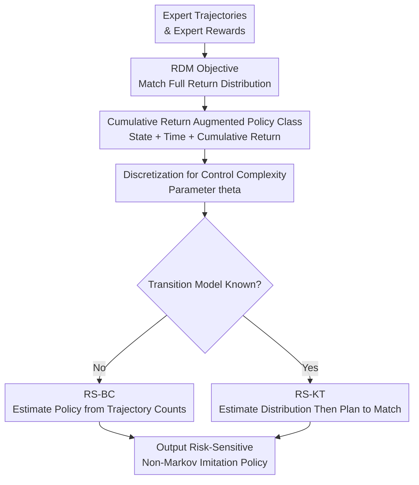

# Imitation Learning as Return Distribution Matching

**Conference**: ICLR 2026  
**OpenReview**: [https://openreview.net/forum?id=7fwd3vjipk](https://openreview.net/forum?id=7fwd3vjipk)  
**Code**: https://github.com/filippolazzati/risk-IL  
**Area**: Reinforcement Learning / Imitation Learning / Risk-Sensitive RL  
**Keywords**: Risk-sensitive imitation learning, return distribution matching, Wasserstein distance, non-Markovian policies, sample complexity  

## TL;DR

This paper reformulates risk-sensitive imitation learning as a "matching the complete return distribution of the expert" problem. It designs two algorithms, RS-BC and RS-KT, with sample complexity guarantees using a class of non-Markovian policies that depend on cumulative returns in tabular MDPs.

## Background & Motivation

**Background**: Classic imitation learning typically treats expert trajectories as behavioral data to learn a policy that matches the expert's occupancy measure. Behavior Cloning directly fits the mapping from states to actions, while GAIL/IRL methods indirectly approach expert behavior via rewards or discriminators. Theoretically, as long as the occupancy measure is sufficiently close, the expected return under any reward will approximate the expert's return.

**Limitations of Prior Work**: The occupancy measure essentially serves the expected return, i.e., "average performance." However, many real-world experts are not risk-neutral: human drivers in autonomous driving avoid low-probability but severe hazards, and expert financial deciders might sacrifice average yield to mitigate tail losses. Matching only the average return collapses these risk attitudes, resulting in learned policies with similar average scores but entirely different variances, tail risks, or overall return distribution shapes compared to the expert.

**Key Challenge**: Existing risk-sensitive IL primarily attempts to match a CVaR at a fixed level, which only focuses on a small tail segment of the return distribution. Furthermore, they often restrict the output to Markovian policies. Risk-sensitive optimal behavior frequently depends on "how much return has been accumulated so far" rather than just the current state and time. If the expert is non-Markovian, Markov policies may suffer from structural misspecification errors even with infinite data.

**Goal**: The authors aim to establish a more complete imitation objective than "expectation + single CVaR," allowing the student policy to reproduce the shape of the expert's return distribution. Meanwhile, they seek to avoid the exponential dimensionality curse of searching all non-Markovian policies while providing provable sample complexity.

**Key Insight**: Risk attitudes can be directly encoded in the return distribution $\eta_r^\pi$. If the complete return distributions of the expert and student are matched using the Wasserstein distance, then statistics such as expectation, CVaR at any level, and variance will naturally align. Furthermore, the Wasserstein distance is more suitable than total variation for estimating one-dimensional return distributions due to its better sample complexity.

**Core Idea**: Match the full expert return distribution using Wasserstein distance and define a class of non-Markovian policies that depend on "current state + time + discretized cumulative return," which is expressive enough for risk-sensitive behavior while maintaining polynomial storage complexity.

## Method

### Overall Architecture

The paper first defines the Return Distribution Matching (RDM) objective: given the expert reward $r_E$, directly minimize the distance between the student and expert return distributions $W(\eta_{r_E}^{\pi}, \eta_{r_E}^{\pi_E})$. It then proves that Markov policies cannot fully represent this objective and expands the policy space to a non-Markovian class $\Pi(r_E^\theta)$ dependent on discretized cumulative returns. Based on this, the authors design RS-BC (for unknown transitions) and RS-KT (for known transition models).

Fundamentally, RDM does not replicate the full historical dependence of every expert action but retains a minimal history summary useful for the return distribution: the reward accumulated up to the current moment. This summary is sufficient to express many risk-sensitive behaviors, such as being conservative when "enough has been earned" or adventurous when "losses have occurred," whereas Markov policies cannot distinguish between these cases at the same state.

### Key Designs

**1. Return Distribution Matching: Elevating Risk Attitude from Single Statistics to the Full Distribution**

Standard IL objectives are typically equivalent to making the student's expected return close to the expert's under any reward, which only constrains $\mathbb{E}[G]$. The RDM defined here matches the expert return distribution directly:

$$
\hat{\pi} \in \arg\min_{\pi \in \Pi_{NM}} W\left(\eta_{r_E}^{\pi}, \eta_{r_E}^{\pi_E}\right).
$$

Where $\eta_r^\pi(g)=\Pr_\pi(\sum_{h=1}^{H} r_h(s_h,a_h)=g)$, and $W$ is the 1-Wasserstein distance. If the student's return distribution approximates the expert's, then not only is the expected return close, but the CVaR at any level $\alpha$ also satisfies $|\mathrm{CVaR}_\alpha(\eta_{r_E}^{\pi_E})-\mathrm{CVaR}_\alpha(\eta_{r_E}^{\pi})| \le W/\alpha$, and variance is similarly bounded. Unlike "matching only one CVaR," this does not compress the expert's risk preference into a single hand-tuned point.

**2. Cumulative Return Augmented Policy Class: Expressing Risk-Sensitive Behavior with Minimal History**

The authors provide a counterexample where a Markov policy fails: in an MDP with horizon $H=3$, an expert can choose final actions based on history to keep the total return at exactly $1$. Any Markov policy, unable to see history at the final state, might mix and produce returns of $0, 1, 2$, resulting in a Wasserstein distance of at least $0.5$. This indicates structural misspecification rather than a lack of data.

To avoid using all non-Markovian policies, $\Pi(r)$ is defined such that policies depend only on phase $h$, state $s$, and cumulative reward $G(\omega;r)$. For any expert policy $\pi_E$, an "averaged" policy $\pi_r$ can be constructed where the probability of choosing action $a$ given $(s, g)$ equals the conditional probability of the expert choosing $a$ across all cases reaching that $(h,s,g)$:

$$
\pi_r(a\mid s,\omega)=
\frac{\Pr_{\pi_E}(s_h=s,a_h=a,\sum_{t<h} r_t(s_t,a_t)=G(\omega;r))}
{\Pr_{\pi_E}(s_h=s,\sum_{t<h} r_t(s_t,a_t)=G(\omega;r))}.
$$

The core lemma shows that $\pi_r$ and the expert share the exact same return distribution.

**3. Discretized Cumulative Returns: Controlled Trade-off via $\theta$**

Using exact cumulative rewards can be expensive as the number of possible values can grow exponentially. The paper discretizes rewards into a grid $Y_h^\theta=\{0,\theta,2\theta,\ldots\}$, yielding $r_E^\theta$. The policy table size is reduced to $O(SAH|Y_\theta|)$, with $|Y_\theta|=O(H/\theta)$. Lemma 4.2 shows that there exists a policy $\pi_{r_E^\theta} \in \Pi(r_E^\theta)$ such that:

$$
W\left(\eta_{r_E}^{\pi_{r_E^\theta}},\eta_{r_E}^{\pi_E}\right) \le H\theta.
$$

**4. RS-BC and RS-KT: Model-Free vs. Model-Based Estimation**

RS-BC is used for offline scenarios with no interaction and unknown transitions. It counts expert action frequencies at each $(h,s,g)$ grid point to estimate $\hat{\pi}(a\mid h,s,g)$. This is behavior cloning in a "state-augmented" MDP.

RS-KT is used when the transition model $p$ is known. Instead of state-wise estimation, it first estimates the expert return distribution $\hat{\eta}$ from trajectories, then uses the dynamics to find a policy in $\Pi(r_E^\theta)$ that induces a return distribution closest to $\hat{\eta}$. This is solved via linear programming on the occupancy measure of the augmented state space $S\times Y_\theta$.

### Loss & Training

RS-BC relies on conditional frequency estimation (MLE style). Expert trajectories are mapped to augmented samples $(h,s,G(\omega;r_E^\theta),a)$ to compute:

$$
\hat{\pi}(a\mid h,s,g)=\frac{M_h(s,g,a)}{\sum_{a'}M_h(s,g,a')}.
$$

RS-KT estimates the empirical distribution:

$$
\hat{\eta}(g)=\frac{1}{N}\sum_{i=1}^{N}\mathbf{1}\left\{\sum_{h=1}^{H}r_{E,\theta,h}(s_h^i,a_h^i)=g\right\}.
$$

It then solves an LP to minimize $W(\eta, \hat{\eta})$. For a fixed $\theta = \epsilon/7H$, the sample complexity for RS-KT is $O(H^2\epsilon^{-2}\log(1/\delta))$, which is independent of $S$ and $A$.

## Key Experimental Results

### Main Results

Evaluations on tabular MDPs compare RS-BC, RS-KT, BC, and MIMIC-MD based on the Wasserstein distance to the expert distribution.

| Setting | N | RS-BC | RS-KT | BC | MIMIC-MD |
|------|---|-------|-------|----|----------|
| Non-Markov Expert, $S,A,H=(2,2,5)$ | 80 | 0.038±0.016 | 0.049±0.017 | 0.076±0.054 | 0.086±0.055 |
| Non-Markov Expert, $S,A,H=(2,2,5)$ | 1000 | 0.012±0.005 | 0.019±0.007 | 0.069±0.058 | 0.070±0.057 |
| Non-Markov Expert, $S,A,H=(2,2,20)$ | 1000 | 0.027±0.010 | 0.053±0.017 | 0.151±0.086 | 0.153±0.087 |

Baselines like BC and MIMIC-MD hit a performance plateau due to structural bias of Markov policies, while RS-BC and RS-KT continue to improve as $N$ increases.

### Ablation Study

| Configuration / Analysis | Key Metric | Explanation |
|---------------|----------|------|
| $\theta=0.05$, $N=10000$ | RS-BC 0.005, RS-KT 0.011 | Fine grid allows both methods to approach expert distribution accurately. |
| $\theta=0.5$, $N=10000$ | RS-BC 0.022, RS-KT 0.106 | Coarse grid increases discretization error; RS-KT is more sensitive to $\theta$. |
| Markov Expert | BC 0.003, RS-BC 0.004 | For Markov experts, BC is more sample efficient due to its smaller hypothesis space. |

### Key Findings

- RS-BC and RS-KT derive their advantage from policy expressivity, enabling them to distinguish risk contexts based on cumulative rewards.
- $\theta$ is the critical hyperparameter: small $\theta$ reduces discretization error but increases complexity; large $\theta$ collapses histories and degrades risk representation.
- In known transition models, RS-KT's bottleneck is estimating a 1D distribution, giving it theoretical sample complexity advantages in large $S,A$ scenarios.

## Highlights & Insights

- Reformulating risk-sensitive IL as return distribution matching via Wasserstein distance is clean and avoids the arbitrariness of picking a single CVaR level.
- The proof of the necessity of non-Markovian policies is compelling: same states with different accumulated rewards require different actions to maintain risk profiles.
- The cumulative-reward-augmented policy class is a useful abstraction, offering better analyticity than RNNs while being more expressive than Markov policies.

## Limitations & Future Work

- The study is limited to tabular finite-horizon MDPs; scaling to continuous or high-dimensional spaces is not addressed.
- Known rewards represent a strong assumption; while the paper provides a theoretical oracle analysis for unknown rewards, practical algorithms are missing.
- Evaluation is restricted to numerical simulations on random MDPs rather than real-world human demonstration benchmarks.

## Related Work & Insights

- **vs Standard IL**: Standard IL matches occupancy measures for average performance; this work matches return distributions for risk shape.
- **vs CVaR-IL**: Prior works match specific CVaR points using Markov policies; this work matches the whole distribution and uses non-Markovian history.
- **vs Distributional RL**: This work treats the return distribution not as something to simply estimate, but as the target to be imitated.

## Rating

- Novelty: ⭐⭐⭐⭐⭐ 
- Experimental Thoroughness: ⭐⭐⭐⭐ 
- Writing Quality: ⭐⭐⭐⭐⭐ 
- Value: ⭐⭐⭐⭐ 

<!-- RELATED:START -->

<!-- RELATED:END -->

## Related Papers

- [\[ICLR 2026\] Q-Learning with Adjoint Matching](q-learning_with_adjoint_matching.md)
- [\[ICLR 2026\] Latent Wasserstein Adversarial Imitation Learning](latent_wasserstein_adversarial_imitation_learning.md)
- [\[ICLR 2026\] Flow Matching Policy Gradients](flow_matching_policy_gradients.md)
- [\[ICLR 2026\] Near-Optimal Second-Order Guarantees for Model-Based Adversarial Imitation Learning](near-optimal_second-order_guarantees_for_model-based_adversarial_imitation_learn.md)
- [\[ICLR 2026\] On Discovering Algorithms for Adversarial Imitation Learning](on_discovering_algorithms_for_adversarial_imitation_learning.md)

<!-- RELATED:END -->
