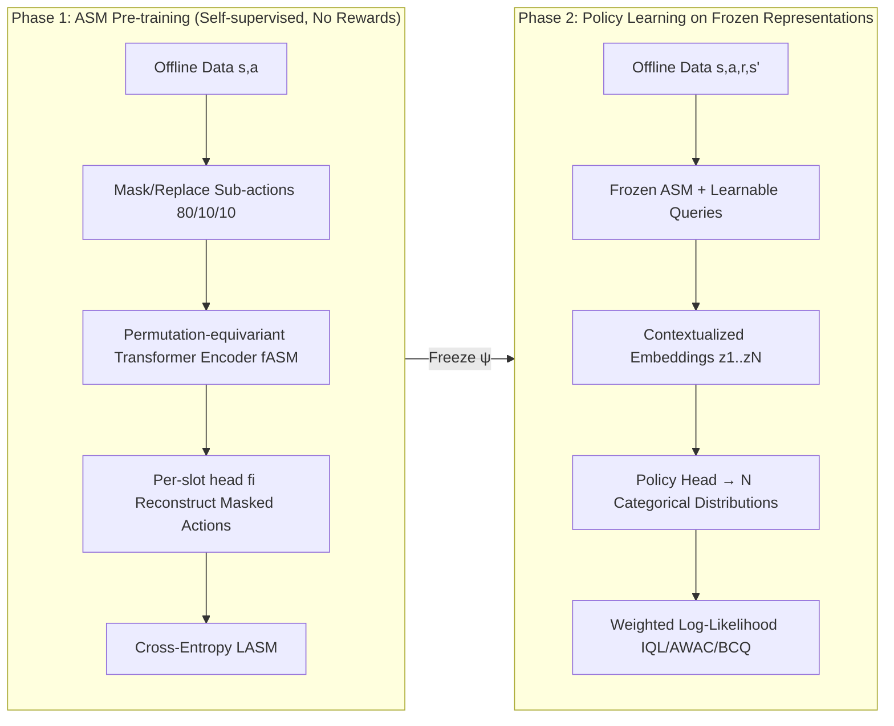

# Improving and Accelerating Offline RL in Large Discrete Action Spaces with Structured Policy Initialization

**Conference**: ICLR 2026  
**OpenReview**: [https://openreview.net/forum?id=rPrNaDJrLx](https://openreview.net/forum?id=rPrNaDJrLx)  
**Code**: [https://github.com/matthewlanders/SPIN](https://github.com/matthewlanders/SPIN)  
**Area**: Reinforcement Learning / Offline RL / Large-scale Discrete Action Spaces  
**Keywords**: Offline RL, Combinatorial Action Spaces, Structured Policy, Representation Pre-training, Masked Self-supervision, Transformer Policy  

## TL;DR
SPIN decouples "learning action structure" from "learning control"—first utilizing a BERT-like masked self-supervised objective to pre-train an Action Structure Model (ASM) that characterizes the low-dimensional manifold of valid joint actions, then freezing this representation to train a lightweight policy head. This approach improves average returns by up to 39% and accelerates convergence by up to 12.8x in offline RL across exponentially large discrete combinatorial action spaces.

## Background & Motivation
**Background**: Scenarios such as healthcare, robotic assembly, recommendations, and ride-hailing often require decision-making in high-dimensional **discrete combinatorial action spaces**, where the action is a Cartesian product $A = A_1 \times \cdots \times A_N$. The number of joint actions grows exponentially with dimensionality ($|A| = \prod_{d=1}^{N} m_d$, reaching up to $30^{38}\approx1.35\times10^{56}$). Online exploration in these settings is costly or unsafe, making offline RL more suitable. However, standard offline RL methods (e.g., CQL, IQL) are computationally infeasible as they either require maximizing over $Q$ or parameterizing the policy across the entire discrete action set.

**Limitations of Prior Work**: Existing approaches for combinatorial action spaces generally fall into two categories, both with significant drawbacks. **Factored approaches** (e.g., Factored IQL, Tang et al.) assume conditional independence between sub-actions, decomposing the joint policy into $N$ independent distributions. While tractable, this loses dependencies between sub-actions, often resulting in incoherent or invalid combinations. **Joint learning approaches** (e.g., SAINT, BraVE, autoregressive policies) attempt to learn action representations and control policies simultaneously. SAINT uses Transformer self-attention to capture dependencies but mixes "structure learning" and "control learning" within a single RL loss, leading to slow and unstable training.

**Key Challenge**: There is a tension between representation capacity (modeling sub-action dependencies) and optimization stability/speed. Maintaining dependencies through joint learning leads to instability and slowness, while pursuing speed and stability through factorization sacrifices action coherence.

**Goal**: To enable offline policies in combinatorial action spaces to learn faster, more stably, and more effectively without sacrificing the ability to model cross-dimensional dependencies.

**Core Idea**: **[Reformulate offline RL as a two-stage "representation problem + control problem"]** — First, use self-supervision to learn the geometric structure of "what constitutes a valid/coherent joint action" and freeze it. Then, have the policy perform lightweight adaptation only on this pre-learned low-dimensional manifold. This completely detaches expensive and unstable structure learning from the RL optimization loop.

## Method

### Overall Architecture
SPIN (Structured Policy INitialization) is a two-stage framework that explicitly decouples representation learning from control. **Phase One**: Use masked self-supervision to pre-train an Action Structure Model (ASM)—a permutation-equivariant Transformer encoder—to map structurally coherent joint actions to a low-dimensional manifold given a state $s$. **Phase Two**: Freeze the ASM representation and simplify the control problem by training lightweight policy heads (only the query vectors and output heads are updated) on this action manifold. "Learning structure first, then policy" allows the agent to directly exploit action geometry instead of searching in the raw combinatorial space.

### Key Designs

**1. Action Structure Model (ASM): Learning the "Valid Action Manifold" via Masked Self-supervision.** The ASM input sequence concatenates $M$ learnable state embeddings and $N$ sub-action embeddings $X=(x_{s_1},\dots,x_{s_M},x_{a_1},\dots,x_{a_N})\in\mathbb{R}^{(M+N)\times d}$. **Positional encodings for sub-actions are intentionally omitted** to maintain permutation equivariance over $a_1,\dots,a_N$ (since combinatorial actions have no natural order). The training objective follows BERT's masked language modeling: for each sample, a subset of sub-action indices $\mathcal{M}$ is sampled. Each $i \in \mathcal{M}$ is replaced with a mask token, a random sub-action, or kept unchanged (80/10/10 ratio). After encoding, per-slot heads $f_i:\mathbb{R}^d\to\mathbb{R}^{|A_i|}$ reconstruct the masked actions. Cross-entropy is computed only at masked positions:
$$L_{ASM} = \mathbb{E}_{(s,a)\sim D}\Big[\mathbb{E}_{\mathcal{M}}\sum_{i\in\mathcal{M}}\ell\big(f_i(h_{a_i}), a_i\big)\Big].$$
This objective requires no reward supervision and learns how sub-actions co-occur coherence given a state, clustering structured joint actions onto a low-dimensional manifold. This is an inherently offline pre-training process requiring only a static dataset.

**2. Policy Learning on Frozen Representations: Maintaining Cross-dimensional Dependency while Remaining Tractable.** The Stage 2 policy $\pi_\theta$ reuses the SAINT architecture, but the ASM backbone is frozen; only query vectors and output heads are updated. $M$ state embeddings and $N$ learnable action queries pass through the frozen permutation-equivariant Transformer to produce contextualized embeddings $z_1,\dots,z_N$. Each $z_i$ encodes the state, the corresponding query, and relationships with other sub-actions via shared attention. Sub-action specific MLP heads then output logits for categorical distributions, where the joint policy is factored by dimension:
$$\pi_\theta(a\mid s)=\prod_{i=1}^{N}\pi_\theta(a_i\mid s, z_i).$$
Crucially: **Like factored methods, it decomposes the exponential joint distribution into $N$ categorical distributions** to ensure tractability. However, because $z_i$ is contextualized through shared self-attention and dependencies are pre-learned in the ASM, it **does not assume conditional independence** like pure factorization, thus remaining fast while preserving cross-dimensional coherence.

**3. Compatibility with Offline RL Objectives.** SPIN is naturally compatible with algorithms that formulate actor updates as "weighted log-likelihood maximization over dataset actions":
$$\max_\theta \mathbb{E}_{(s,a)\sim D}\big[w_\Phi(s,a)\log\pi_\theta(a\mid s)\big],$$
where $w_\Phi(s,a)\ge0$ represents algorithm-specific weights (e.g., advantage or value estimates), covering IQL, AWAC, and candidate-filtering updates like BCQ. Objectives requiring global operations over the entire joint action space (e.g., CQL's value regularization) are generally intractable unless $Q_\Phi$ or $\pi_\theta$ are strictly factored, which would sacrifice the modeled structure. Thus, such objectives fall outside SPIN's compatibility range, consistent with SAINT.

## Key Experimental Results
Evaluation is based on discretized DeepMind Control Suite (introduced by Beeson et al. 2024), with action dimensions ranging from 6 (cheetah) to 38 (dog-trot), and bins per dimension from 3–30. Joint action spaces range from hundreds to $3^{38}$. Four dataset quality levels (medium, medium-expert, random-medium-expert, expert) were used. "Time to Target" indicates the wall-clock minutes required to reach 95% of F-IQL's asymptotic performance, with SPIN's time **including the entire ASM pre-training duration**.

### Main Results (Average Return / Time to Target by Dataset Quality)

| Dataset Quality | F-IQL | AR-IQL | SAINT | SPIN |
|---|---|---|---|---|
| Medium Avg. Return | 341.8 | 334.7 | 343.0 | **345.2** |
| Medium Time-to-Target | 48.2 | 114.3 | 174.6 | **45.5** |
| Medium-Expert Avg. Return | 724.7 | 717.2 | 733.3 | **753.2** |
| Medium-Expert Time-to-Target | 257.3 | 285.8 | 308.4 | **62.0** |
| Random-Med-Exp Avg. Return | 388.3 | 395.6 | 438.9 | **499.2** |
| Random-Med-Exp Time-to-Target | 85.1 | 95.8 | 100.2 | **38.4** |
| Expert Avg. Return | 778.1 | 770.3 | 773.1 | **778.7** |
| Expert Time-to-Target | 167.5 | 288.7 | 261.8 | **77.4** |
| **Total Avg. Return** | 558.2 | 554.5 | 572.1 | **594.1** |
| **Total Time-to-Target** | 558.1 | 784.6 | 845.0 | **223.3** |

SPIN achieves a total average return of 594.1, surpassing SAINT's 572.1. Its total convergence time is 223.3 minutes, approximately 2.5x faster than F-IQL and 3.8x faster than SAINT. On the most challenging random-medium-expert dataset, SPIN outperforms SAINT by over 13%. On medium-expert, SPIN requires only 62 minutes while other methods exceed 250 minutes.

### Ablation Study (Dog-trot performance with increasing action bins, Medium-Expert)

| Bins | F-IQL | AR-IQL | SAINT | SPIN |
|---|---|---|---|---|
| 3 Bins | 472.3 | 526.5 | 635.1 | **647.0** |
| 10 Bins | 483.8 | 457.4 | 529.1 | **629.5** |
| 30 Bins | 485.0 | 557.4 | 562.5 | **703.9** |
| Average Return | 480.4 | 513.8 | 575.6 | **660.1** |
| Time to Target | 545.8 | 692.6 | 291.6 | **237.0** |

As the action space grows from $3^{38}$ to $30^{38}$, SPIN's lead **increases with the complexity of the space**: at 30 bins, SPIN (703.9) outperforms SAINT (562.5) by 25%, while F-IQL plateaus and AR-IQL becomes unstable.

### Key Findings
- **Complexity Scalability**: The benefits of decoupling structure learning from control amplify as combinatorial complexity increases, as the agent operates on a pre-learned manifold while end-to-end methods are bogged down by the raw joint space.
- **Representation Quality**: Downstream returns generally improve with the amount of ASM pre-training (from 10–100 epochs), proving that the action structure itself is a key component of effective control.
- **Action-Centric Acceleration**: Comparisons in the Appendix show that SPIN's advantage stems specifically from action-centric pre-training objectives rather than general pre-training (trajectory-centric pre-training yielded weaker results).

## Highlights & Insights
- **Elegant Reformulation**: Explicitly splitting combinatorial offline RL into "representation problem + control problem" provides a clean, transferable perspective—aligning it with the "self-supervised pre-training + lightweight fine-tuning" paradigm in NLP/CV.
- **Action Manifold Learning**: Using BERT-style MLM to learn the geometry of "valid joint actions" bypasses reward supervision, and the removal of positional encodings correctly preserves permutation equivariance.
- **Balancing Tractability and Expressivity**: The factored form maintains tractability, but the contextualization of factors via shared attention avoids the pitfalls of conditional independence.
- **Tangible Efficiency Gains**: Even when including pre-training costs in "Time-to-Target," the method remains several times faster, providing a strong argument for its adoption.

## Limitations & Future Work
- **Compatibility Boundaries**: Objectives requiring global joint action operations (e.g., CQL) are incompatible, limiting applicability in offline scenarios that heavily rely on pessimistic value regularization.
- **Static Data Assumption**: Stage 1 ASM pre-training is inherently offline and relies on a dataset with sufficient coverage of valid actions. If the dataset's action distribution is too narrow, the learned manifold may be incomplete.
- **Evaluation Scope**: While Maze experiments were added, direct validation in real-world combinatorial domains like healthcare or recommendation is still pending.
- **Frozen Representation Costs**: Completely freezing the ASM might limit policy adaptation under significant distribution shifts; future work could explore lightweight fine-tuning or online incremental updates for the ASM.

## Related Work & Insights
- **Combinatorial Action RL**: Compared to Factored IQL (independency loss), autoregressive policies (unnatural ordering), and BraVE (poor scalability), SPIN’s decoupled design preserves dependencies while ensuring scalability.
- **SAINT (Direct Baseline)**: Both use Transformers to capture dependencies, but SAINT learns structure and control jointly. SPIN uses the same policy class for a controlled comparison, isolating the contribution of decoupling representation from control.
- **Offline Action Representations**: Unlike MERLION (pseudo-metric representations requiring nearest neighbor search over enumerable actions), SPIN generates joint actions dimension-wise and explicitly models combinatorial structure, making it suitable for exponentially large spaces.
- **Self-supervised Pre-training in RL**: Most prior work is state- or trajectory-centric and assumes online interaction. SPIN proposes **action-centric** pre-training to provide structured initialization, suggesting that "action geometry pre-training" is a promising direction for discrete decision-making.

## Rating
- **Novelty**: ⭐⭐⭐⭐ — Decoupling combinatorial offline RL into two stages and using masked self-supervision for action manifolds is a powerful perspective; action-centric pre-training diverges from the mainstream trajectory-centric focus.
- **Experimental Thoroughness**: ⭐⭐⭐⭐ — Covers four data qualities, action dimensions 6–38, and bin sizes 3–30. Includes cardinality robustness, representation quality analysis, and multi-objective compatibility (IQL/AWAC/BCQ), though lacks real-world combinatorial validation.
- **Writing Quality**: ⭐⭐⭐⭐ — The logic flows well from motivation to method and verification; discussions on compatibility boundaries are rigorous.
- **Value**: ⭐⭐⭐⭐ — Tackles the difficult problem of exponential action spaces with simultaneous gains in performance (+39%) and efficiency (up to 12.8x), with a paradigm that is likely transferable to industrial recommendation and scheduling tasks.

<!-- RELATED:START -->

## Related Papers

- [\[ICLR 2026\] Scalable Offline Model-Based RL with Action Chunks](scalable_offline_model-based_rl_with_action_chunks.md)
- [\[ICLR 2026\] Accelerating Diffusion Planners in Offline RL via Reward-Aware Consistency Trajectory Distillation](accelerating_diffusion_planners_in_offline_rl_via_reward-aware_consistency_traje.md)
- [\[ICML 2026\] MoMa QL: Accelerating Diffusion/Flow Matching Policies for Offline and Offline-to-Online RL via Moment Matching](../../ICML2026/reinforcement_learning/moment_matching_q-learning.md)
- [\[ICLR 2026\] Structured In-context Environment Scaling for Large Language Model Reasoning](structured_in-context_environment_scaling_for_large_language_model_reasoning.md)
- [\[ICLR 2026\] DEAS: DEtached value learning with Action Sequence for Scalable Offline RL](deas_detached_value_learning_with_action_sequence_for_scalable_offline_rl.md)

<!-- RELATED:END -->
