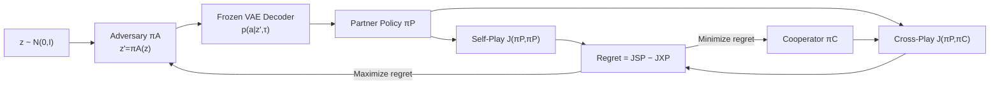

# Improving Human-AI Coordination through Online Adversarial Training and Generative Models

**Conference**: ICLR 2026  
**OpenReview**: [https://openreview.net/forum?id=AeehNfbHqD](https://openreview.net/forum?id=AeehNfbHqD)  
**Code**: [https://sites.google.com/view/goat-2025/home](https://sites.google.com/view/goat-2025/home)  
**Area**: Reinforcement Learning / Human-AI Coordination / Zero-shot Coordination  
**Keywords**: Zero-Shot Coordination, Adversarial Training, Generative Models, Regret, Curriculum Learning, Overcooked  

## TL;DR
GOAT integrates a **frozen cooperative policy generative model (VAE)** into an online adversarial training loop, where the adversary searches for "regret-maximizing" partners within the latent space of the generative model. This approach continuously exposes the weaknesses of the cooperative agent without degrading into self-sabotage, achieving SOTA results in human evaluations on Overcooked.

## Background & Motivation
- **Background**: Training AI agents for Zero-Shot Coordination (ZSC) with diverse humans primarily relies on Population-Based Training (PBT) and diversity objectives to approximate the distribution of human behavior using simulation partners. Recently, GAMMA utilized a VAE to generate diverse cooperative policies, setting a new SOTA in human-AI collaboration.
- **Limitations of Prior Work**: PBT samples partners randomly rather than targeting the learner's weaknesses, leading to low sample efficiency and poor coverage of actual human behavior. Meanwhile, although adversarial training (min-max / cross-play minimization) can automatically generate difficulty-based curricula, it suffers from "maladaptation" in cooperative tasks—minimizing cooperative rewards incentivizes partners to learn **handshaking protocols and intentional sabotage**, ceasing to be reasonable human-like partners.
- **Key Challenge**: An "antagonistic opponent" in cooperative scenarios must satisfy two conflicting requirements: it must be **difficult enough** (finding the learner's blind spots) while remaining a **valid cooperator** (not destroying the task). Simple added penalty terms (e.g., mixed-play) treat symptoms rather than the cause, as the objective of "minimizing cross-play" inherently fosters uncooperative motives.
- **Goal**: Design an adversarial training framework that fully explores the space of difficult partner policies while ensuring the generated partners remain realistic and cooperative.
- **Core Idea**: **[Applying constraints to the generative model rather than the objective function]** A VAE generative model is pre-trained on diverse cooperative data and then **frozen** within the adversarial loop. The adversary no longer directly trains a partner policy but instead searches for a latent vector $z$. Any decoded partner is naturally cooperative, allowing the adversarial objective to "behave maliciously" without crossing the boundary. Combined with a **regret** objective (instead of min-max), "difficult but solvable" partners compose a dynamic curriculum.

## Method

### Overall Architecture
GOAT (Generative Online Adversarial Training) consists of three components: a **frozen VAE decoder** responsible for decoding a latent vector into a valid partner policy $\pi_P$; an **Adversary** $\pi_A$ that learns to map a randomly sampled $z\sim\mathcal{N}(0,I)$ to $z'=\pi_A(z)$ with the goal of maximizing the Cooperator's regret; and a **Cooperator** $\pi_C$ that conversely minimizes regret to adapt to these challenging partners. The three roles iterate online: sample $z \rightarrow$ adversary transformation $\rightarrow$ decode partner $\rightarrow$ run Self-Play (SP) and Cross-Play (XP) simultaneously $\rightarrow$ calculate regret $\rightarrow$ update Adversary and Cooperator respectively.

### Key Designs

**1. Replacing adversarial constraints with a frozen generative model: Locking "valid cooperation" into the architecture.** The naive cooperative adversarial objective is a min-max form $J_{XP}=\max_{\pi_C}\min_{\pi_A}J(\pi_C,\pi_A)$, but directly training a partner to minimize rewards encourages sabotage. The key shift in GOAT is that the adversary does not produce the policy itself but only a latent vector $z'=\pi_A(z)$, which is fed into a frozen VAE decoder $p(a_t|z',\tau_{0:t-1};\theta)$ to obtain the partner $\pi_P$. Thus, the optimization objective becomes $\max_{\pi_C}\min_{\pi_A}\mathbb{E}_{z\sim\mathcal{N}(0,I)}[J(\pi_C,\pi_P^{\pi_A(z)})]$. Since the VAE is trained only on cooperative data and its weights are fixed, its latent space cannot "generate" handshaking or self-sabotage strategies. The destructive nature of the adversary is blocked by the inductive bias of the generative model, providing the adversary with a continuous, smooth, and easily optimized search space.

**2. Replacing min-max with regret: Selecting "difficult but solvable" partners rather than the worst ones.** Even with a generative model, pure min-max still focuses on the worst-case scenario, causing the adversary to converge on partners that are inherently poor and cannot score with anyone (observed in ablations where min-max stays in low-reward regions). GOAT adopts a cooperative version of regret, defined as the gap between the optimal self-play performance of a specific partner and its performance when paired with the Cooperator: $\mathrm{Regret}(\pi_P,\pi_C)=\mathbb{E}[J(\pi_P,\pi_P)-J(\pi_P,\pi_C)]=J_{SP}-J_{XP}$. The advantage of this metric is that a partner's regret is only high when it "performs well alone but poorly with the Cooperator," forcing the adversary to find strategies that are **solvable but not yet mastered** by the Cooperator. For ineffective partners that no one can play with, optimal self-play is also low, causing regret to zero out and removing the adversary's incentive to select them. Thus, regret automatically anchors the training curriculum in the "Zone of Proximal Development."

**3. Online loop = Automatic curriculum driven by Cooperator's weaknesses.** The final goal is a min-max regret game $\min_{\pi_C}\max_{\pi_A}\mathrm{Regret}(\pi_P^{\pi_A(z)},\pi_C)$ (Algorithm 1). In each step, the adversary uses REINFORCE to move toward high-regret latent regions, while the Cooperator uses PPO to lower the regret. Once the Cooperator adapts to a region and regret is minimized, the adversary is forced to migrate to a new high-regret area. Visualizations (Fig 5a) show the adversary's latent vector "wandering" through the generative model's latent sphere during training—from uniform sampling early on, to attacking a specific region mid-stage, to constantly switching regions later. This naturally forms a curriculum from easy to difficult, avoiding the policy stagnation common in Self-Play/PBT. The adversary training is independent of the specific RL algorithm (being a stateless one-step optimization); implementation uses REINFORCE for the adversary and PPO for the Cooperator.

## Key Experimental Results

Three types of environments: One-Step Cooperative Matrix Game (CMG), Cooperative Reaching Game (CRG), and Overcooked (Counter Circuit and the more complex Multi-Strategy Counter). Compared against 5 competitive baselines: BC+RL, FCP, MEP, CoMeDi, and MEP+GAMMA (Prev. SOTA).

### Main Results (Human Evaluation / Overcooked)

| Layout | Evaluation Method | GOAT vs Prev. SOTA (GAMMA) |
|------|----------|------------------------|
| Counter Circuit | Human | +3% (Both near optimal, simple layouts show little gap) |
| Multi-Strategy Counter | Human | **+38%** (Significant advantage in complex layouts) |

- Human User Study: 40 Prolific participants, 6 rounds each, random order, checkpoints randomly sampled from 5 seeds, IRB approved.
- CRG: Across 11 heuristic partners, GOAT achieved the highest average score (11/11).
- CMG: GOAT not only covers all reward modes but also assigns higher probability to high-reward modes (suppressing probabilities for modes 3/4/7), whereas SP/MEP lacks full coverage, and CoMeDi/GAMMA spreads probabilities evenly across modes, with MiniMax converging to the worst case.

### Ablation Study (Min-Max vs Regret)

| Adversary Objective | Behavioral Performance |
|----------|----------|
| Min-Max | Fixed in a single low-reward region (red cluster); the adversary learns to "just barely not destroy the task," relying solely on the partner to score. |
| Regret | Migrates between multiple modes in the latent space with broader coverage, generating robust training scenarios like "blocking paths / swapping roles." |

### Key Findings
- Simulation learning curves (Fig 4b/4e): GOAT outperforms 4 simulation baselines and converges faster in both Overcooked layouts. Adversarial exploration in the latent space quickly covers diverse behaviors from simple to complex, with lower sample complexity than traditional PBT.
- Greater complexity brings greater advantage: While the gap narrows as simple layouts approach optimality, complex layouts are where GOAT truly differentiates itself.

## Highlights & Insights
- **Moving "Hard Constraints" from loss functions to model architecture**: Instead of repeatedly adding balancing terms to an adversarial objective to prevent sabotage, it is more effective to switch to a search space where sabotage cannot be represented. The frozen cooperative VAE allows the adversarial objective to "behave maliciously" without consequences. This is a clean approach to handling the tension between "adversarial search" and "validity."
- **Reinterpreting regret in cooperative scenarios**: Skillfully mapping regret from single-agent UED (Optimal vs Learner) to cooperation (Self-Play vs Cross-Play). Zero-reward partners naturally result in zero regret, ensuring both solvability and an inherent curriculum.
- **Human evaluation over human proxies**: A 38% human improvement in complex layouts is far more convincing than simulation metrics.

## Limitations & Future Work
- Evaluation environments are limited to grid-based cooperative games like Overcooked; whether this scales to high-dimensional, long-horizon tasks like robotics or autonomous driving remains unknown (listed as future work).
- High dependence on a high-quality pre-trained cooperative VAE: If the generative model fails to cover certain real human strategies, the adversary cannot find them—the performance ceiling is locked by the data distribution of the generative model.
- The adversary uses REINFORCE, a one-step stateless optimization; its adequacy for long-range tasks requiring temporal adversarial policies is questionable.
- No explicit human feedback was introduced; the authors suggest incorporating human feedback during training as a future direction.

## Related Work & Insights
- **UED / regret (Dennis et al. 2021; PAIRED)**: GOAT translates the regret curriculum concepts from single-agent environment design to cooperative partner generation.
- **Min-max diversity (CoMeDi, Sarkar 2023 mixed-play)**: Identifies that "minimizing cross-play inherently fosters sabotage"; GOAT fundamentally bypasses this via a frozen generative model rather than just mitigating it with mixed-play.
- **Generative models for coordination (GAMMA, Liang et al. 2024)**: GOAT directly utilizes its VAE training pipeline but upgrades "random partner sampling" to "adversarial active search for weak points," serving as a targeted enhancement of GAMMA.
- **Insight**: When an adversarial objective induces degenerate behavior, rather than patching the objective, change to a parameterized space that "physically cannot express degenerate behavior"—encode safety into the representation, not the reward.

## Rating
- **Novelty**: ⭐⭐⭐⭐ — The combination of "frozen generative model + regret adversary" solves the fundamental contradiction of cooperative adversarial training with clean insights, though components (VAE, regret, adversarial curriculum) derive from existing work.
- **Experimental Thoroughness**: ⭐⭐⭐⭐ — Three environments + 5 baselines + 40-person human study + min-max/regret ablation + latent space visualization; the chain of evidence is complete, though scale remains limited to Overcooked-level tasks.
- **Writing Quality**: ⭐⭐⭐⭐ — Logical progression (why min-max fails $\rightarrow$ why add generative models $\rightarrow$ why use regret) with clear RQ-based structure.
- **Value**: ⭐⭐⭐⭐ — A 38% improvement in human trials for complex layouts is a solid contribution to the ZSC/Human-AI coordination community, and the paradigm is transferable to other cooperative training scenarios prone to adversarial collapse.

<!-- RELATED:START -->

## Related Papers

- [\[ICLR 2026\] Toward Conservative Planning from Human-AI Preferences in Reinforcement Learning](toward_conservative_planning_from_human-ai_preferences_in_reinforcement_learning.md)
- [\[ICLR 2026\] GAR: Generative Adversarial Reinforcement Learning for Formal Theorem Proving](gar_generative_adversarial_reinforcement_learning_for_formal_theorem_proving.md)
- [\[ICLR 2026\] Critique-RL: Training Language Models for Critiquing Through Two-Stage Reinforcement Learning](critique-rl_training_language_models_for_critiquing_through_two-stage_reinforcem.md)
- [\[ICLR 2026\] Using Reinforcement Learning to Train Large Language Models to Explain Human Decisions](using_reinforcement_learning_to_train_large_language_models_to_explain_human_dec.md)
- [\[ICLR 2026\] Shop-R1: Rewarding LLMs to Simulate Human Behavior in Online Shopping via Reinforcement Learning](shop-r1_rewarding_llms_to_simulate_human_behavior_in_online_shopping_via_reinfor.md)

<!-- RELATED:END -->
