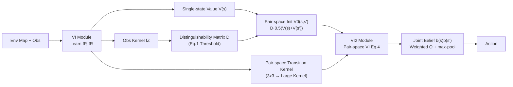

# Information-based Value Iteration Networks for Decision Making Under Uncertainty

**Conference**: ICLR 2026  
**OpenReview**: [https://openreview.net/forum?id=if1Ndb6RWD](https://openreview.net/forum?id=if1Ndb6RWD)  
**Code**: TBD  
**Area**: reinforcement learning / POMDP planning  
**Keywords**: Value Iteration Network, POMDP, partial observability, Pairwise Heuristic, value of information, differentiable planning  

## TL;DR
This paper proposes VI2N (Value Iteration with Value of Information Network), which implements the "Pairwise Heuristic" as a differentiable convolutional network module. This enables Value Iteration Networks, for the first time, to learn strategies that "resolve uncertainty before collecting rewards" in partially observable navigation environments with high perceptual ambiguity.

## Background & Motivation
- **Background**: Value Iteration Networks (VIN), which explicitly embed classical value iteration into the network architecture, exhibit generalization capabilities far exceeding standard CNN/MLP architectures in fully observable environments and can generate environment models that correctly identify reward regions.
- **Limitations of Prior Work**: VIN and its subsequent improvements are almost entirely limited to fully observable environments. Once perceptual ambiguity (partial observability) occurs, the agent must maintain a "belief" (probability distribution) over current states, and decision-making must be based on this belief rather than a single state—existing planning modules in networks cannot support this.
- **Key Challenge**: Optimal POMDP decision-making cannot be solved in polynomial time, and powerful approximations (sampling, tree search) are non-differentiable and cannot be integrated into neural networks. The current SOTA differentiable POMDP network, QMDP-Net, relies on the simplest QMDP solver—it **assumes all uncertainty disappears after the first step**, which inevitably fails in high-uncertainty environments.
- **Goal**: To design a **truly differentiable planning module capable of long-term uncertainty reduction** for value iteration networks under partial observability.
- **Core Idea**: **Borrow from the Pairwise Heuristic**—it considers only the "minimal sub-problem consisting of two states," resolving ambiguity for each pair before collecting rewards. This calculation can be formulated as a Bellman equation, allowing it to be implemented using convolutional layers like VIN and significantly compressed via factorization in mixed-observability environments.

## Method

### Overall Architecture
VI2N decomposes the Pairwise Heuristic for POMDPs into two cascaded differentiable value iteration modules: first, a standard VI module calculates the single-state value $V(s)$ on the underlying MDP and learns the transition kernel $f_P$ and reward kernel $f_R$; then, the environment's transition/reward/value are "uplifted" to a state-pair space $(s, s')$. A second value iteration module (VI2 module) runs on this pair space. Finally, the joint belief $b(s, s') = b(s)b(s')$ is used to weight the pair-space Q-values, and action selection is performed via max-pooling. The entire pipeline consists of convolutions, outer products, thresholds, and matrix multiplications, and is end-to-end differentiable.

### Key Designs

**1. Pairwise Heuristic: Using "state pairs" to carry uncertainty and formulating it as a Bellman equation.** The reason full-space POMDPs are non-differentiable is that the belief is a continuous distribution. The cleverness of the Pairwise Heuristic lies in retaining only the **minimal sub-problem that still contains uncertainty**—a pair of states. It assumes a $0.5/0.5$ belief for each pair, and the expected total return is recorded as the pairwise value $V(s, s')$. For each pair, the strategy follows "resolve ambiguity, then collect reward": if two states are inherently distinguishable by observation, the uncertainty is considered resolved, and the pairwise value takes the average of the underlying MDP values $0.5(V(s) + V(s'))$; if they are indistinguishable, the agent must actively move to a distinguishable state pair to resolve the ambiguity. This "pair space" is also an MDP, where the transition is the joint distribution of the original transitions $T((s, s'), a, (s'', s''')) = p(s''|s, a)p(s'''|s', a)$, and the reward is the mean reward of the two states $R(s, s') = 0.5(R(s) + R(s'))$. Thus, the pairwise value satisfies the Bellman equation:
$$V_k(s, s') = \max_a \Big[ R(s, s') + \gamma \sum_{s'', s'''} T((s, s'), a, (s'', s''')) V_{k-1}(s'', s''') \Big]$$
Because this is a Bellman recursion, it can be implemented with convolutional value iteration like VIN—this is the key to making the paper's approach "differentiable."

**2. Distinguishability criterion and convolutional encoding of uncertainty.** Whether two states can be distinguished by observations determines the initialization of the pairwise value. This paper provides a formal criterion using the observation function: $s$ and $s'$ are distinguishable if and only if
$$\sum_o p(o|s)\big(1-p(o|s')\big)+p(o|s')\big(1-p(o|s)\big)\ge 2\lambda$$
where $\lambda$ is set by domain experts (standardly 1 if there is no observation noise). The network implementation is straightforward: the observation kernel $f_Z$ is convolved over the map to obtain matrix $Z$, then the outer product of $Z$ and $1-Z$ is compared with a threshold to output a binary $|S| \times |S|$ distinguishability matrix $D$. Pairwise value initialization $V_0(s, s')$ uses $D \cdot 0.5(V(s) + V(s'))$ (for distinguishable pairs) plus $(1-D) \cdot \min R(S)$ (minimum reward for indistinguishable pairs)—the latter is the mechanism that "forces the agent to resolve ambiguity first."

**3. Transition kernel uplifting and action selection.** When mapping single-state $3 \times 3$ transition kernels to the pair space, the kernel expands to $(2(\sqrt{S}+1)+1) \times (2(\sqrt{S}+1)+1)$ to accommodate individual transitions of both states in the pair along row and column directions; the nine values of $f_P$ are filled into the corresponding channels on the main diagonal of the pair-space kernel, with the number of channels equal to the number of actions. Action selection implements Eq.5: multiplying the belief outer product $b(s, s') = b(s)b(s')$ with the pair-space Q-values and performing max-pooling:
$$a_k^* = \arg\max_a \sum_{(s, s')} b(s, s') Q((s, s'), a)$$
When probabilities other than the most likely state are negligible, this choice naturally degrades to the optimal action of the underlying MDP on the most likely state, ensuring consistency with the fully observable case.

**4. Mixed observability factorization: Compressing quadratic costs to linear.** In reality, states can often be decomposed into visible factors $S_v$ and hidden factors $S_h$ ($S = S_v \times S_h$), i.e., MOMDPs. A key observation is that **any state pair with different visible factors is naturally distinguishable**, so the pairwise value only needs to be calculated for $V(s_v, s_h, s_h')$. The number of pairwise value iterations decreases from $|S|(|S|-1)/2$ to $|S_v| \cdot |S_h|(|S_h|-1)/2$. When $|S_h| \ll |S_v|$, the scale of the pairwise module drops from $|S_v|^2|S_h|^2$ to $|S_v||S_h|^2$. In "unknown goal location" tasks ($N=10$, $|G|=4$), this brings about a 100x compression in memory/computation, making the network trainable and scalable.

## Key Experimental Results

The baseline is QMDP-Net (which has been shown to significantly outperform unconstrained networks). Transformer architectures (Decision Transformer types) were excluded after failing on more than 10% of test cases. For fair comparison, all agents share the same belief update module, and the number of VI recursions for QMDP-Net was set to the sum of VI + VI2 recursions in VI2N (in fact, QMDP-Net still has an advantage in free parameters).

### Main Results: Task 1 (Visible goal, unknown self-position)

| Model | Random(5%) | Random(10%) | Walls(1) | Walls(2) | Walls(3) | Symm(5%) | Symm(10%) | Symm(15%) |
|------|-----------|------------|---------|---------|---------|---------|----------|----------|
| **Ours** | 93±1% | 95±1% | **77±1%** | **83±1%** | **82±1%** | **76±3%** | **74±3%** | **65±4%** |
| Prev. SOTA | 93±1% | 96±1% | 69±1% | 78±2% | 80±2% | 61±3% | 51±5% | 41±4% |

As the environment becomes more ambiguous (longer corridors in "walls", four-corner symmetry in "symm"), the advantage of VI2N increases; in the most difficult symmetric environments, the gap exceeds 20 percentage points. In robustness tests against broken symmetry, VI2N achieved a median success rate of 68% vs 48% for QMDP-Net.

### Main Results: Task 2 (Unknown goal position, visible self-position, MOMDP)

| Target Count | 2 (Det) | 3 (Det) | 4 (Det) | 2 (Stoch) | 3 (Stoch) | 4 (Stoch) |
|--------|--------|--------|--------|--------|--------|--------|
| **Ours** | **98±2%** | **96±2%** | **95±2%** | **91±2%** | **91±3%** | **91±2%** |
| Prev. SOTA | 57±4% | 53±2% | 51±2% | 27±2% | 28±2% | 30±17% |

The gap is extremely large; QMDP-Net nearly collapses under stochastic transitions. In scalability tests with a 20x20 grid and 4 targets, VI2N achieved 79±3% vs 27±2% for QMDP-Net. Trajectory analysis showed that VI2N visited "landmarks" to resolve ambiguity in 96% of episodes on average, while QMDP-Net did so in only 34%—directly validating the "resolve ambiguity first" behavior.

### Ablation Study: Effect of recursion steps (Task 2, |G|=4)

| kVI | kVI2 | Success Rate |
|-----|------|--------|
| 5 | 5 | 58±16% |
| 20 | 1 | 41±2% |
| 1 | 60 | 45±9% |
| 40 | 20 | **95±2%** |
| 60 | 40 | 94±2% |

Reducing the steps of either planning module to 1 leads to a significant performance drop, indicating that **both planning modules—VI (collecting rewards) and VI2 (resolving ambiguity)—are indispensable**; performance saturates after a certain number of steps, consistent with the patterns of classical value iteration.

### Key Findings
- VI2N not only wins in success rate but also produces **interpretable cognitive maps**: the single-state value $V(s)$ marks the reward region, while the marginal pairwise value $\sum_s V(s, s')$ marks the "information-rich" region. These information regions are completely absent in QMDP-Net's value functions because its algorithm does not consider resolving uncertainty.

## Highlights & Insights
- **Translating non-differentiable POMDP heuristics into convolutional value iteration**: The fact that the Pairwise Heuristic is naturally a Bellman recursion is fundamental to fitting it into the VIN framework, demonstrating that "picking the right algorithmic skeleton" is smarter than "brute-forcing approximations."
- **Explicit modeling and visualization of "Value of Information"**: Using the marginals of the pairwise value to map out "where to go to resolve ambiguity" makes planning behavior interpretable—this is a fundamental mechanical difference compared to QMDP-Net.
- **Enormous engineering value of MOMDP factorization**: The 100x compression turns an otherwise infeasible network into something trainable and scalable, which is the key to scaling the method.

## Limitations & Future Work
- All experiments were conducted on **grid navigation** tasks (2D, actions are movements to adjacent cells) with $3 \times 3$ transition kernels; there is still a gap to more general high-dimensional/continuous control.
- The distinguishability threshold $\lambda$ requires domain expert setting; automatic learning/adaptation has not been implemented.
- The Pairwise Heuristic is ultimately a sub-optimal approximation as it only considers "two-state sub-problems." It theoretically has blind spots in extreme ambiguity scenarios requiring third-order or higher joint reasoning.
- The transition kernel in the VI2 module **does not backpropagate gradients** (it is fixed); while this simplifies training, it also limits the potential for end-to-end optimization of the pair-space transitions.
- While sensor/execution noise was tested and performance held, the paper focuses on perceptual ambiguity rather than sensor noise; performance under more complex noise combinations remains to be verified.

## Related Work & Insights
- **VIN Lineage** (Tamar 2016; Niu 2018; Zhang 2020; Ishida & Henriques 2022) embeds value iteration into convolutional networks but mostly stays in full observability; this work is a substantial extension of this line into partial observability.
- **QMDP-Net** (Karkus 2017) was the previous SOTA for differentiable POMDP planning, but its QMDP kernel's assumption that "uncertainty disappears after one step" is a fundamental weakness in highly ambiguous scenarios; this paper serves as a targeted improvement over it.
- **Pairwise Heuristic** originates from Bayesian active learning (Golovin 2010) and general POMDP solving (Khalvati & Mackworth 2013); transforming it into a differentiable network module is an exemplar of combining "classic planning heuristics × deep differentiable planning."
- Insight: For problems where "existing differentiable approximations are too weak," rather than increasing network capacity, it is better to return to classical OR/planning literature to find a heuristic that is **both sub-optimally effective and exactly representable as a differentiable recursion**—this is a universal recipe for neuralizing non-differentiable algorithms.

## Rating
- **Novelty**: ⭐⭐⭐⭐ — First to turn the Pairwise Heuristic into a differentiable VIN module; mechanically solves "long-term uncertainty resolution," representing a fundamental rather than incremental improvement over QMDP-Net.
- **Experimental Thoroughness**: ⭐⭐⭐ — Two types of tasks, seven environmental structures, deterministic/stochastic transitions, scalability, and recursion ablations are well-covered with fair comparisons; however, it is limited to grid navigation and only compared against QMDP-Net, making the baselines somewhat sparse.
- **Writing Quality**: ⭐⭐⭐⭐ — Solid grounding in POMDP/MOMDP background, clear mapping from heuristic math to network implementation, and the added value of cognitive map visualization.
- **Value**: ⭐⭐⭐⭐ — Provides a new interpretable and scalable skeleton for differentiable planning under partial observability, with implications for robot navigation and neuro-cognitive modeling.

<!-- RELATED:START -->

## Related Papers

- [\[ICLR 2026\] Continuous-Time Value Iteration for Multi-Agent Reinforcement Learning](continuous-time_value_iteration_for_multi-agent_reinforcement_learning.md)
- [\[ICML 2025\] Scaling Value Iteration Networks to 5000 Layers for Extreme Long-Term Planning](../../ICML2025/reinforcement_learning/scaling_value_iteration_networks_to_5000_layers_for_extreme_long-term_planning.md)
- [\[ICLR 2026\] Bayesian Ensemble for Sequential Decision-Making](bayesian_ensemble_for_sequential_decision-making.md)
- [\[ICLR 2026\] Ada-Diffuser: Latent-Aware Adaptive Diffusion for Decision-Making](ada-diffuser_latent-aware_adaptive_diffusion_for_decision-making.md)
- [\[ICLR 2026\] Frozen Policy Iteration: Computationally Efficient RL under Linear $Q^{\pi}$ Realizability for Deterministic Dynamics](frozen_policy_iteration_computationally_efficient_rl_under_linear_qpi_realizabil.md)

<!-- RELATED:END -->
