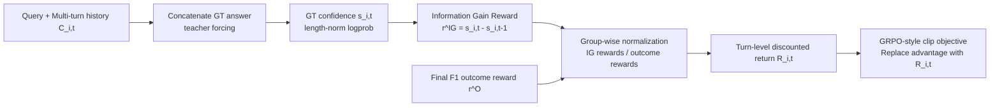

# Information Gain-based Policy Optimization: A Simple and Effective Approach for Multi-Turn Search Agents

**Conference**: ICLR 2026  
**Code**: [https://github.com/GuoqingWang1/IGPO](https://github.com/GuoqingWang1/IGPO)  
**Area**: Reinforcement Learning / Agentic RL / Multi-Turn Search Agents  
**Keywords**: Information Gain, Process Rewards, GRPO, Multi-Turn Search Agents, Dense Rewards, Credit Assignment  

## TL;DR
IGPO treats each turn of agent-environment interaction as a process of "approximating the ground truth." It uses the increment in the model's own confidence regarding the ground truth as a turn-level dense reward. This approach mitigates the advantage collapse issue caused by sparse outcome rewards in multi-turn RL without requiring external reward models or Monte Carlo estimation.

## Background & Motivation
**Background**: LLM-based search agents increasingly utilize RL to train multi-turn tool-calling capabilities. Critic-free, group-normalized methods like GRPO have become the mainstream paradigm for agentic RL. For each rollout, these methods typically use only a scalar outcome reward (e.g., word-level F1 between the final answer and ground truth) to drive policy updates via relative advantages within a group.

**Limitations of Prior Work**: Outcome rewards provide supervision only at the final step, which is problematic in multi-turn, long-trajectory scenarios: (i) **Advantage Collapse**: When all rollouts in a group yield the same answer (all correct or all incorrect), the relative advantages become zero, providing no gradient signal. This is more prevalent with smaller models or harder queries. (ii) **Lack of Fine-grained Credit Assignment**: Subsequent actions strictly depend on previous ones. A correct tool call might be penalized due to prior errors, or early successes might be obscured by later failures. Terminal rewards cannot distinguish which steps were truly effective. (iii) **Low Sample Efficiency**: Recycling only one terminal signal per trajectory wastes significant information from intermediate reasoning and tool interactions.

**Key Challenge**: Existing process reward solutions either rely on external oracles/reward models (expensive and biased) or estimate step values via Monte Carlo simulations (high variance with limited samples). The core challenge is to provide dense, reliable, and ground-truth-aligned rewards for multi-turn trajectories without introducing external supervision.

**Goal**: To provide an intrinsic, stable process reward with near-zero additional overhead, allowing every sample to contribute learning signals even if no rollout in a group is entirely correct.

**Core Idea**: **Information Gain as Reward**—the interaction is modeled as an incremental process of "acquiring information about the ground truth." The turn-level reward is defined as the change in the model's confidence in the ground-truth answer between two consecutive turns. This dense signal is combined with the outcome reward within the GRPO framework.

## Method

### Overall Architecture
IGPO adds a "turn-level information gain reward" path to the standard GRPO. For each intermediate turn $t$ of a rollout, the ground-truth answer is appended to the current interaction history $C_{i,t}$ using the same schema as predicted answers. Under teacher forcing, the length-normalized log-probability (confidence $s_{i,t}$) of the ground-truth tokens is calculated. The difference in confidence between consecutive turns serves as the information gain reward $r^{IG}_{i,t}$. Both information gain and outcome rewards are group-normalized and accumulated into turn-level discounted returns, which replace the rollout-level advantage in GRPO for policy optimization.

### Key Designs

**1. Information Gain Reward: Using model confidence increments as process supervision.** Instead of using an external discriminator, IGPO asks the model: "Does the new information in this turn increase your certainty about the ground-truth answer?" Specifically, at each intermediate turn, the ground-truth answer $a=(a_1,\dots,a_L)$ is appended to $C_{i,t}$, and the length-normalized confidence is computed as $s_{i,t}=\frac{1}{L}\sum_{j=1}^{L}\log\pi_\theta(a_j\mid C_{i,t},a_{<j})$. The turn-level reward is the difference in confidence with gradients detached: $r^{IG}_{i,t}\triangleq \mathrm{sg}(s_{i,t}-s_{i,t-1})$. This design is **ground-truth aware** (minimizing external bias), provides **dense supervision** (mitigating advantage collapse and enabling credit assignment), and is **computationally efficient** as it requires only standard forward passes.

**2. Vectorized Implementation: Computing confidence for all turns in one forward pass.** A naive implementation would require separate forward passes for each prefix $C_{i,t}$, with complexity approximately $\sum_t L_{i,t}^2$. IGPO appends $T_i$ formatted ground-truth targets to the end of the trajectory, corresponding to prefixes $C_{i,0},\dots,C_{i,T_i-1}$. A **custom attention mask** ensures each copy only attends to its corresponding prefix and its own preceding ground-truth tokens. This calculates all required log-probabilities in a single forward pass, making the process reward computationally inexpensive.

**3. Turn-level Discounted Return and Policy Optimization.** To account for the long-term impact of decisions, IGPO applies **group-wise z-normalization** separately to $\{r^{IG}_{i,t}\}$ and $\{r^O_i\}$ to balance reward scales: $\tilde r_{i,t}=\frac{r^{IG}_{i,t}-\mu^{IG}}{\sigma^{IG}}$ for intermediate turns and $\tilde r_{i,T_i}=\frac{r^{O}_i-\mu^{O}}{\sigma^{O}}$ for the final turn. The turn-level discounted return is $\tilde R_{i,t}=\sum_{k=t}^{T_i}\gamma^{k-t}\tilde r_{i,k}$. Each generated token $m$ at turn $\kappa_i(m)$ is assigned $\tilde R_{i,\kappa_i(m)}$. The final objective modifies GRPO by replacing the rollout advantage with these turn-level returns: $$J_{IGPO}(\theta)=\mathbb{E}\big[\frac{1}{G}\sum_i\frac{1}{M_i}\sum_m \min(\rho_{i,m}\tilde R_{i,\kappa_i(m)},\,\mathrm{clip}(\rho_{i,m},1-\epsilon,1+\epsilon)\tilde R_{i,\kappa_i(m)})-\beta D_{KL}(\pi_\theta\Vert\pi_{ref})\big]$$. Tool response tokens are treated as context and excluded from the loss.

## Key Experimental Results

Setting: Qwen2.5-7B-Instruct (3B for ablation) backbone, verl framework, $\gamma=1.0$, 32 prompts × 16 rollouts per step, max 10 dialogue turns, Google Search API. Metrics: word-level F1 across 4 in-domain and 3 out-of-domain datasets.

### Main Results (Comparison with Agentic RL Baselines, 7B, Avg.)

| Method | Type | NQ | TQ | HotpotQA | 2Wiki | Musique | Bamboogle | PopQA | Avg. |
|---|---|---|---|---|---|---|---|---|---|
| CoT | Prompt | 19.8 | 45.6 | 24.4 | 26.4 | 8.5 | 22.1 | 17.0 | 23.4 |
| Search-o1 | Prompt | 32.4 | 58.9 | 33.0 | 30.9 | 14.7 | 46.6 | 38.3 | 36.4 |
| Search-r1-base | Outcome RL | 45.4 | 71.9 | 55.9 | 44.6 | 26.7 | 56.5 | 43.2 | 49.2 |
| DeepResearcher | Outcome RL | 39.6 | 78.4 | 52.8 | 59.7 | 27.1 | 71.0 | 48.5 | 53.9 |
| GiGPO | Step RL | 46.4 | 64.7 | 41.6 | 43.6 | 18.9 | 68.9 | 46.1 | 47.2 |
| **IGPO** | **Ours** | **46.4** | **80.6** | **59.0** | **72.1** | **32.7** | **77.0** | **53.8** | **60.2** |

IGPO achieves an average of 60.2, surpassing the strongest baseline DeepResearcher by +6.3. Step-reward baselines (StepSearch, GiGPO) remain unstable and lag behind strong outcome-based baselines. Compared to standard RL algorithms under the same configuration, IGPO leads significantly (RLOO 49.7 / PPO 51.5 / GRPO 51.9 / Reinforce++ 47.3 / GSPO 52.0).

### Ablation Study (Reward Components, Avg.)

| Model | IGPO (w/ F1) = GRPO | IGPO (w/ IG) | IGPO (w/ F1+IG) |
|---|---|---|---|
| Qwen2.5-3B | 32.3 | 34.6 | **48.9** |
| Qwen2.5-7B | 51.9 | 53.5 | **60.2** |

### Key Findings
- **Reward Complementarity**: Using either IG or F1 alone is significantly inferior to the combination. Outcome rewards anchor the final goal, while IG rewards provide dense intermediate guidance.
- **Robustness of IG**: Using only IG (without outcome rewards) matches or exceeds standard GRPO, suggesting the reward is well-grounded and resistant to reward hacking.
- **Small Models Benefit More**: Compared to GRPO, the 3B model improves by +16.6 (32.3→48.9) and the 7B by +8.3 (51.9→60.2). Weaker models suffer more from advantage collapse and rely more on dense signals.
- **Faster and More Stable Learning**: IGPO consistently outperforms ablation variants across all datasets, converging to higher F1 scores with greater stability.

## Highlights & Insights
- **Intrinsic process rewards via ground-truth confidence** is a clever approach. It converts "is this step useful" into "does the model become more certain of the correct answer," bypassing external RM costs and biases.
- **Vectorization + Custom Attention Masks** make the process reward almost "free." The low engineering overhead is central to the efficacy of the proposal.
- **Separate normalization** for the two reward types is a crucial practical detail to prevent the scales from overwhelming each other.

## Limitations & Future Work
- **Dependence on ground-truth answers during training**: The IG reward requires a clear reference answer for teacher forcing, making it less applicable to open-ended generation tasks without unique ground truths.
- **Confidence as a proxy for "information"**: Confidence increases may occasionally result from surface correlations rather than genuine evidence acquisition, necessitating further analysis for multi-hop reasoning.
- **Scope of evaluation**: Experiments focused on Qwen2.5 and search QA; generalizability to other tools (coding, math) and larger models remains to be verified.
- **Discount factor $\gamma=1.0$**: The design of returns for very long horizons may require more sophisticated discounting strategies.

## Related Work & Insights
- **GRPO Family** (Shao et al. 2024): IGPO is a minimal modification of GRPO, retaining group normalization while replacing rollout-level advantages with turn-level returns.
- **vs. External Process Rewards** (StepSearch, PRM): Avoids the cost and bias of external discriminators.
- **vs. Monte Carlo Step Value** (ReasoningRAG): Avoids high-variance estimation and additional sampling.
- **Inspiration**: Using the change in target confidence as an intrinsic dense reward could extend to other verifiable multi-step tasks (e.g., executable code, verifiable math).

## Rating
- **Novelty**: ⭐⭐⭐⭐ Using GT confidence increments as turn-level rewards is intuitive and practical. The vectorized implementation is a valuable engineering contribution.
- **Experimental Thoroughness**: ⭐⭐⭐⭐ Comprehensive comparison across 7 datasets and various baseline types (prompt-based, outcome RL, step RL).
- **Writing Quality**: ⭐⭐⭐⭐ Clearly articulated motivations and a well-defined methodology with transparent pipelines.
- **Value**: ⭐⭐⭐⭐ Provides a cheap, stable, and reproducible dense reward solution for multi-turn agentic RL, directly addressing advantage collapse.

<!-- RELATED:START -->

## Related Papers

- [\[ICLR 2026\] Group Verification-based Policy Optimization for Interactive Coding Agents](group_verification-based_policy_optimization_for_interactive_coding_agents.md)
- [\[ICLR 2026\] TIPS: Turn-Level Information-Potential Reward Shaping for Search-Augmented LLMs](tips_turn-level_information-potential_reward_shaping_for_search-augmented_llms.md)
- [\[NeurIPS 2025\] Reinforcement Learning for Long-Horizon Multi-Turn Search Agents](../../NeurIPS2025/reinforcement_learning/reinforcement_learning_for_long-horizon_multi-turn_search_agents.md)
- [\[ICLR 2026\] Kevin: Multi-Turn RL for Generating CUDA Kernels](kevin_multi-turn_rl_for_generating_cuda_kernels.md)
- [\[ICLR 2026\] Multi-Agent Guided Policy Optimization](multi-agent_guided_policy_optimization.md)

<!-- RELATED:END -->
