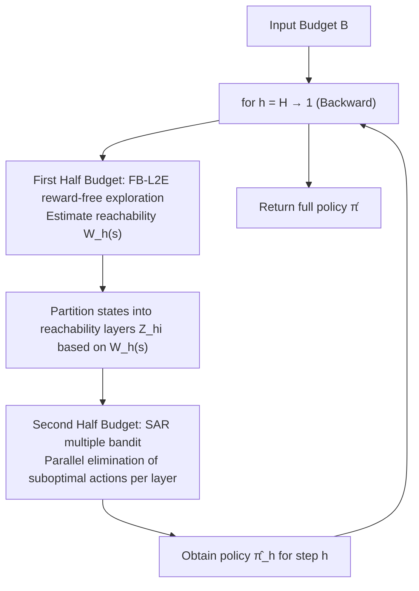

# Instance-Dependent Fixed-Budget Pure Exploration in Reinforcement Learning

**Conference**: ICLR 2026  
**OpenReview**: [https://openreview.net/forum?id=xIycolc5Xw](https://openreview.net/forum?id=xIycolc5Xw)  
**Code**: Not open-sourced (Purely theoretical work)  
**Area**: Reinforcement Learning / Learning Theory (Pure Exploration, Policy Identification)  
**Keywords**: fixed-budget, pure exploration, policy identification, instance-dependent, $\epsilon$-uniform guarantee, multiple bandit, reward-free exploration  

## TL;DR
This paper conducts the first study on the fixed-budget pure exploration problem in MDPs and proposes the BREA algorithm. By taking only the interaction budget $B$ as input, it provides an instance-dependent "$\epsilon$-uniform" failure probability upper bound (valid for all precision levels $\epsilon$ exceeding a budget-related threshold), liberating policy identification from the PAC paradigm that requires pre-specifying precision $\epsilon$ and confidence $\delta$.

## Background & Motivation
**Background**: Policy identification (pure exploration) in reinforcement learning theory has long been dominated by the **fixed-confidence (PAC RL)** paradigm. Algorithms require a target precision $\omega$ and failure rate $\delta$ as inputs and continue sampling until they can "self-verify" that the returned policy is indeed $\omega$-optimal before stopping. In contrast, the **fixed-budget** paradigm, which is already popular in multi-armed bandits (where a fixed number of interactions $B$ is given and a policy must be output after exhaustion), remains almost entirely unexplored in MDPs.

**Limitations of Prior Work**: The fixed-confidence paradigm has three major inconveniences. First, it assumes algorithms can "sample as much as needed"; if forced to terminate due to practical constraints, the quality of the returned policy cannot be guaranteed. Fixed-budget allows users to directly control the budget, which is closer to engineering practice. Second, verification requirements force algorithms to spend extra samples "proving themselves right," preventing them from achieving the instance-dependent speedups and data-poor regime guarantees found in bandits. Third, $\omega$ and $\delta$ are often burdensome hyperparameters for many non-critical applications.

**Key Challenge**: Directly "converting" fixed-confidence algorithms to fixed-budget is infeasible. Such conversion requires knowing unknown instance-dependent quantities, and even if possible, it would only hold for a pre-specified $\omega$, which is far weaker than a guarantee holding for all $\omega$ simultaneously. Furthermore, under fixed-budget, neither the confidence $\delta$ nor the precision $\omega$ is known, making it impossible to apply Hoeffding/Bernstein concentration inequalities with pre-set confidence levels as in fixed-confidence settings.

**Goal**: Given only the budget $B$, provide an exponentially decaying upper bound on $P(V_0^* - V_0^{\hat\pi} > \omega)$ in terms of $B$ and instance-dependent quantities, which holds **simultaneously for all $\omega \ge \omega^\dagger$** (a specific budget-related threshold). The authors term this an **$\epsilon$-uniform guarantee**, which essentially characterizes the entire tail distribution of the learned policy's suboptimality.

**Core Idea**: **[Backward Decomposition + Dual Mechanism]** Each (state, step) is treated as a bandit instance. By combining "reward-free exploration to estimate reachability" and "multiple bandit action elimination," the algorithm proceeds via backward induction from $h=H$ to $h=1$, progressively identifying near-optimal actions for each relevant state.

## Method

### Overall Architecture
BREA (Backward Reachability Estimation and Action elimination) performs backward induction from the final step $H$ to the first step $1$. At each step $h$, the budget is split into two halves: the first half runs **reward-free exploration** to estimate the reachability $W_h(s)$ of each state, and the second half utilizes a **SAR multiple bandit** mechanism to eliminate suboptimal actions. The reason for backward induction is that learning actions at step $h$ requires sampling trajectories using a "sufficiently accurate policy" for subsequent steps (Proposition 1 ensures that near-optimal policies suffice), and these subsequent policies must be determined before step $h$.

### Key Designs

**1. $\epsilon$-uniform guarantee: Characterizing the entire tail of suboptimality rather than a single point.** Traditional PAC guarantees take the form "returns an $\omega$-optimal policy with probability $1-\delta$," requiring $\omega$ and $\delta$ to be fixed as inputs. This paper instead proves that for any $\omega \ge 2SH^2\omega_B$ (where the threshold $\omega_B := (1+\tfrac{\log(2)B}{c(B)})^{-0.6321}$ decreases monotonically with budget $B$), the failure probability $P(V_0^* - V_0^{\hat\pi} > \omega)$ is bounded by an exponential function of $B$ and the instance difficulty. In other words, by treating the suboptimality of the learned policy as a random variable, the entire tail distribution is characterized, so $\omega$ and $\delta$ are no longer inputs but quantities that can be arbitrarily chosen during analysis.

**2. Reachability Estimation (FB-L2E): Bringing fixed-confidence reward-free exploration into the fixed-budget setting.** The authors carefully adapt the Learn2Explore mechanism by Wagenmaker et al. into a fixed-budget version, FB-L2E. The core trick is reward resetting: set $R_{h'}(s',a')=1$ if and only if $(s',a',h')=(s,1,h)$, and 0 otherwise. The optimal policy then precisely maximizes the probability of visiting $(s,1)$, such that $V_0^* = W_h(s)$. Reachability estimation is thus converted into a standard optimal policy problem (solved using STRONGEULER due to its high-probability regret bound with $\log\tfrac1\delta$ dependence). Theorem 3.1 guarantees that, with high probability, the reachability of each subset $X_i$ satisfies $\tfrac{|X_i|}{|X|}2^{-i-3} \le W_h(X_i) \le 2^{-i+1}$, and the preserved policies provide sufficient samples for each relevant state-action pair for downstream elimination.

**3. $\epsilon$-correctness of multiple bandit (SAR): Saving $S$-dependence by "solving multiple bandits simultaneously."** At step $h$, all states in the same reachability layer form $M$ bandit instances (each with $K=A$ arms). The goal is to select a good arm for each instance. For the first time, the authors prove an $\epsilon$-correctness guarantee for the SAR (Successive Accept and Reject) algorithm by Bubeck et al.: budget is adaptively allocated after sorting the empirical gaps of all instances. Theorem 3.2 gives $P(\exists m: \mu_{m,1}-\mu_{m,J(m)} > \omega) \le 2M^2K^2\exp\!\big(-\tfrac{B-MK}{128\sigma^2\overline{\log}(MK)\sum_i(\bar\Delta_{(i)}\vee\omega)^{-2}}\big)$. Compared to applying best-arm-identification per state, multiple bandit significantly reduces the dependence of the final sample complexity on $S$.

**4. Main Theorem and Instance-Dependent Complexity: Characterization by $H^5 \cdot \text{Controllability}^2 \cdot \text{gap}^{-2}$.** By combining the above mechanisms, the main result for BREA (Algorithm 3) in Theorem 3.3 bounds the failure probability as the sum of two exponential terms. The term from reachability estimation is a lower-order error, while the main term takes the form $\exp\big(-\tilde\Omega\big(\tfrac{B}{H^5\max_h C_h^2\sum_s W_h(s)^{-1}\sum_a(\bar\Delta_h(s,a)\vee\frac{\omega}{W_h(s)})^{-2}}\big)\big)$. Here, $C_h$ is the "controllability" of the MDP ($1\le C_h\le S$, where larger values indicate harder control), and $\bar\Delta_h(s,a)$ is the suboptimal gap. Converting this to sample complexity, the bandit special case ($S=H=1$) recovers the classic $\sum_a(\bar\Delta_{(a)}\vee\omega)^{-2}$, consistent with existing best-arm-identification literature; the extra $H^5$ (compared to $H^4$ in PAC RL) is the cost of the inherent difficulty in fixed-budget settings where one "doesn't know how to allocate budget across steps." If $\omega$ is additionally provided as an input, a refinement phase (Theorem 3.4) can be added to obtain a complexity expression highly aligned with the MOCA algorithm.

## Key Experimental Results

> This paper is a purely theoretical work with no numerical experiments. The core contributions are the algorithm design and theoretical bounds for failure probability/sample complexity. The table below summarizes key theoretical results.

### Main Results

| Result | Target | Key Bound | Significance |
|------|------|--------|------|
| Theorem 3.1 | FB-L2E Reachability Estimation | $\frac{|X_i|}{|X|}2^{-i-3}\le W_h(X_i)\le 2^{-i+1}$ | Tool for fixed-budget reward-free exploration |
| Theorem 3.2 | SAR multiple bandit | $\le 2M^2K^2\exp(-\tfrac{B-MK}{128\sigma^2\overline{\log}(MK)\sum_i(\bar\Delta_{(i)}\vee\omega)^{-2}})$ | First $\epsilon$-correctness guarantee for SAR |
| Theorem 3.3 | BREA Main Theorem | Main term $\exp(-\tilde\Omega(\tfrac{B}{H^5\max_h C_h^2\sum_s W_h(s)^{-1}\sum_a(\cdots)^{-2}}))$ | First MDP fixed-budget instance-dependent $\epsilon$-uniform bound |
| Corollary 3 | Exact Optimal Policy Identification | $P(V_0^*-V_0^{\hat\pi}>0)$ decays exponentially | Identifies exact optimal when gaps are unique |
| Theorem 3.4 | Variant with target precision $\omega$ | Sum of three exponential terms, including $|\mathrm{OPT}_h(3\omega)|$ | Complexity aligned with MOCA |

### Key Findings
- **Bandit Consistency**: When $S=H=1$, the main term reduces to $\sum_a(\bar\Delta_{(a)}\vee\omega)^{-2}$, matching classic bandit results from Even-Dar/Audibert/Karnin et al., verifying the correct scale of the bound.
- **Deterministic vs. Probabilistic**: The sample complexity in this paper is deterministic, whereas PAC RL sample complexity usually holds only with probability $1-\delta$.
- **Controllability Difficulty**: The appearance of $C_h$ ($1\le C_h\le S$) in the bound intuitively characterizes the controllability of each step in the MDP—larger values imply it is harder for a policy to regulate occupancy, making the problem more difficult.

## Highlights & Insights
- **Paradigm-level Contribution**: Systematically brings the mature fixed-budget concepts from bandits to MDPs for the first time, filling a gap in RL theory and proving that fixed-budget can achieve instance-dependent guarantees that fixed-confidence cannot due to verification requirements.
- **$\epsilon$-uniform is a Stronger Guarantee**: Characterizing the entire tail of the suboptimality random variable at once, rather than at a single $(\omega,\delta)$ point, is conceptually more elegant and user-friendly than traditional PAC (as only a budget is required).
- **Reusable Toolbox**: Both FB-L2E (fixed-budget reward-free exploration) and the $\epsilon$-correctness of SAR are explicitly noted by the authors as having "potential independent value," serving as ready-made analytical building blocks for future fixed-budget RL work.

## Limitations & Future Work
- **No Empirical Validation**: As a purely theoretical work, numerical experiments are absent. The constant factors and scalability of the algorithm on actual MDPs are unknown; the implementation complexity of the two-stage backward induction structure in BREA is also high.
- **Loose $H^5$ Dependence**: Contains one extra factor of $H$ compared to $H^4$ in PAC RL. The authors attribute this to the budget allocation problem in fixed-budget settings and conjecture that variance-dependent concentration bounds could improve the factor by $H^2$.
- **Acceleration Rates and Data-Poor Regime not Addressed**: The authors leave "acceleration rates" (faster when there are more good arms) and "data-poor regimes" (non-trivial guarantees when budget is smaller than the number of arms) as open problems.
- **Tabular MDP Restriction**: Currently limited to finite state and finite action spaces; extension to function approximation settings remains future work.

## Related Work & Insights
- **Fixed-budget Bandit**: Even-Dar et al. (2006), Bubeck et al. (2009/2013, SAR), and Zhao et al. (2023, data-poor regime) are direct ancestors on the bandit side. SAR is upgraded here into a tool for multiple bandit $\epsilon$-correctness.
- **PAC RL / Reward-free Exploration**: L2E and MOCA by Wagenmaker et al. (2022) and STRONGEULER by Simchowitz & Jamieson (2019) form the technical basis for FB-L2E and the action elimination phase. This paper re-adapts them for fixed-budget and provides $\epsilon$-uniform bounds.
- **Insight**: The approach of "turning target precision/confidence from inputs into analytical variables" provides a useful reference for other learning theory problems requiring pre-set hyperparameters (e.g., pure exploration, active learning)—replacing single-point PAC guarantees with "uniform over threshold" tail characterizations.

## Rating
- **Novelty**: ⭐⭐⭐⭐⭐ First instance-dependent $\epsilon$-uniform guarantee for fixed-budget MDPs, opening a new setting in RL theory with solid conceptual contributions.
- **Experimental Thoroughness**: ⭐⭐ Purely theoretical work with no numerical experiments; practical constants and feasibility are unverified (common for theory papers, but still a drawback).
- **Writing Quality**: ⭐⭐⭐⭐ Clear motivation, well-defined correspondence between three main challenges and designs, and thorough comparison with bandit/PAC literature; however, notation is dense with a high reading threshold.
- **Value**: ⭐⭐⭐⭐ Fundamental significance for the RL theory community, providing reusable tools for fixed-budget reward-free exploration and multiple bandits, with significant potential in future acceleration/data-poor directions.

<!-- RELATED:START -->

## Related Papers

- [\[ICLR 2026\] Q-Learning with Fine-Grained Gap-Dependent Regret](q-learning_with_fine-grained_gap-dependent_regret.md)
- [\[ICLR 2026\] Instance-wise Adaptive Scheduling via Derivative-Free Meta-Learning](instance-wise_adaptive_scheduling_via_derivative-free_meta-learning.md)
- [\[ICLR 2026\] Is Pure Exploitation Sufficient in Exogenous MDPs with Linear Function Approximation?](is_pure_exploitation_sufficient_in_exogenous_mdps_with_linear_function_approxima.md)
- [\[ICLR 2026\] Off-Policy Safe Reinforcement Learning with Constrained Optimistic Exploration](off-policy_safe_reinforcement_learning_with_cost-constrained_optimistic_explorat.md)
- [\[ICLR 2026\] Selective Expert Guidance for Effective and Diverse Exploration in Reinforcement Learning of LLMs](selective_expert_guidance_for_effective_and_diverse_exploration_in_reinforcement.md)

<!-- RELATED:END -->
