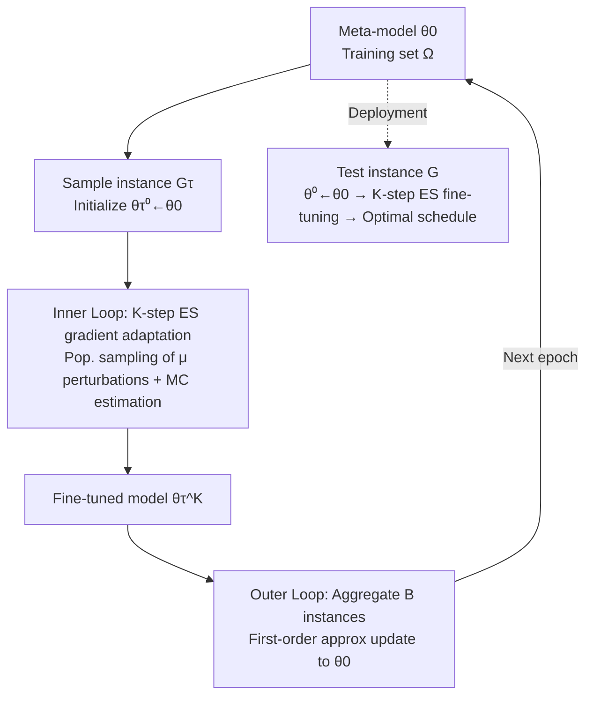

# Instance-wise Adaptive Scheduling via Derivative-Free Meta-Learning

**Conference**: ICLR 2026  
**Code**: [https://github.com/calmQ/DF-META](https://github.com/calmQ/DF-META)  
**Area**: Reinforcement Learning / Neural Combinatorial Optimization / Scheduling  
**Keywords**: Job Shop Scheduling, FJSP, Meta-Learning, MAML, Derivative-Free Optimization, Evolutionary Strategies, Instance-wise Adaptation

## TL;DR
Addressing the issue where Deep Reinforcement Learning (DRL) scheduling models "only optimize average performance and perform sub-optimally on individual instances," this paper utilizes MAML meta-learning to train an initial model "born for fine-tuning." By replacing both inner and outer loop optimizations with derivative-free Evolutionary Strategies (ES) and leveraging GPU parallelism, the model performs full-parameter adaptive search for each instance during testing, significantly outperforming test-time methods like Active Search and EAS.

## Background & Motivation
- **Background**: DRL has made significant progress in NP-hard Job Shop Scheduling (JSP) and its Flexible version (FJSP). The dominant paradigm involves using DRL to learn Priority Dispatching Rules (PDR), modeling scheduling as an MDP, and training GNN/Attention policy networks via PPO. Fast solutions are generated during inference through greedy or sampling strategies.
- **Limitations of Prior Work**: Existing methods follow standard machine learning conventions by **optimizing average performance across a training set**, whereas the true objective of scheduling is to solve "each specific instance" optimally. Since DRL often yields sub-optimal policies, even instances within the training distribution may receive poor solutions. Although test-time adaptation (e.g., Active Search, Efficient Active Search) can fine-tune on a per-instance basis, they suffer from two major flaws: ① They are pure test-time mechanisms where **adaptive knowledge is discarded after use and cannot be reused across tasks**; ② They rely on **gradient optimization**, which easily falls into local optima during instance-level searches in combinatorial optimization spaces like JSP/FJSP.
- **Key Challenge**: There is a misalignment between the training objective (average performance) and the actual demand (single-instance optimality). Furthermore, test-time search, which could bridge this gap, is hindered by the susceptibility of gradient-based optimization to local optima in combinatorial spaces and the lack of knowledge reusability.
- **Goal**: To learn a **fine-tuning-oriented parameter initialization** that allows the model to quickly converge to high-quality, instance-specific solutions for unseen instances during inference, ensuring the adaptation process possesses strong global search capabilities and enables knowledge sharing across instances.
- **Core Idea**: **[Explicit Meta-Learning for Fine-Tuning]** Use MAML to simulate "per-instance fine-tuning" during the training phase, making the meta-model a robust starting point for new instances; **[Fully Derivative-Free Optimization]** Replace both inner and outer gradient steps of MAML with Evolutionary Strategy (ES) estimates to bypass local optima and avoid the complex second-order derivatives of original MAML; **[GPU Population Parallelism]** Migrate traditional CPU-intensive ES computations to GPU batch inference.

## Method

### Overall Architecture
The proposed method is an "instance-wise derivative-free meta-learning" framework built upon MAML. **Inner Loop**: Per-instance $K$-step "simulated fine-tuning" using ES gradients to capture instance-specific features. **Outer Loop**: Aggregation of fine-tuning results from multiple instances within a mini-batch to update a shared meta-model, serving as an initialization conducive to rapid adaptation. The training objective is defined as $\theta_0^* = \arg\min_{\theta_0}\, \mathbb{E}_{G_\tau\sim\Omega}\big[F(\theta_\tau^{(K)}\mid G_\tau)\big]$, where $\theta_\tau^{(K)}$ is the model fine-tuned from meta-model $\theta_0$ on instance $G_\tau$ over $K$ steps, and $F$ represents the objective (makespan). The framework is model-agnostic and applicable to various scheduling learning models.

### Key Designs

**1. Inner-loop Derivative-Free Adaptation & Two MC Fitness Estimators: Transforming "Instance Search" into a Global Process.** For a training instance $G_\tau$, the model is initialized as $\theta_\tau^{(0)}\leftarrow\theta_0$, followed by $K$ steps of ES gradient updates. Each step samples $\mu$ perturbed individuals $\theta+\sigma\varepsilon_i$ from the parameter distribution and estimates the gradient via the OpenAI ES formula $\frac{1}{\mu\sigma}\sum_i F_i\varepsilon_i$. Since scheduling environments are highly stochastic, the fitness variance from a single rollout is excessive. Consequently, the authors parallelly sample $L$ solutions for each individual to provide two estimators: **MC Mean**, which uses $F_i=\frac{1}{L}\sum_l F_i^{(l)}$ to reduce variance for greedy inference; and **MC Best**, which uses $F_i=\min_l F_i^{(l)}$ to inject the target of "caring only about the best sample" directly into the inner-loop gradient, aligning with standard NCO sampling inference. Ablations show that MC Best yields the strongest adaptive capability.

**2. Outer-loop First-Order Approximation Meta-Update: Eliminating High-Order Variance from "Nested Perturbations" using FOMAML.** The outer loop treats each training instance as a pseudo-test instance, maximizing performance after $K$ steps of ES adaptation. A challenge arises as both inner and outer loops involve population perturbations, creating a "perturbation-on-perturbation" effect. Similar to high-order derivatives, this amplifies ES gradient variance. Combined with the naturally slow convergence of derivative-free methods, full second-order training is impractical. This work adopts the first-order approximation of FOMAML, explicitly discarding second-order terms and replacing the full meta-gradient $\nabla_{\theta_0}$ with instance-level gradients $\nabla_{\theta_\tau}$: $\theta_0\leftarrow\theta_0-\frac{\beta}{B}\sum_{\tau=1}^{B}\nabla_{\theta_\tau}\mathbb{E}_{\varepsilon}\big[F(\theta_\tau^{(K)}+\sigma\varepsilon\mid G_\tau)\big]$. This significantly reduces computational overhead while maintaining effectiveness. Table 5 demonstrates that Ours consistently outperforms FOMAML under identical conditions.

**3. GPU Population Parallelism: Moving traditional ES CPU Bottlenecks to GPU Batch Inference.** Traditional ES (e.g., Salimans et al.) relies on CPU clusters via Dask/Ray to evaluate fitness per individual, where communication and synchronization become bottlenecks and GPU power is underutilized. This work constructs a perturbation matrix $\varepsilon=[\varepsilon_1,\dots,\varepsilon_\mu]\in\mathbb{R}^{d\times\mu}$ and organizes the entire population into a "population network" $\Theta=\theta+\sigma\varepsilon$. A single forward pass outputs action policies $\Pi=F(\Theta,S)$ for all individuals. The FJSP environment is then vectorized as $E=[E_1,\dots,E_\mu]$ for parallel interaction and synchronous fitness collection $R=E(\Pi)$, allowing the ES gradient to be calculated as $\frac{1}{\mu\sigma}R\varepsilon^\top$. The entire fitness evaluation is offloaded to the GPU, making the derivative-free method faster than EAS, which is typically known for its speed.

## Key Experimental Results

### Main Results (FJSP, deployed on SOTA model DANIEL; Gap relative to OR-Tools)

| Setting | Method | 10×5 | 20×10 | 30×10* | 40×10* |
|------|------|------|-------|--------|--------|
| SD2 Greedy | DANIEL | 25.20% | 32.09% | 15.75% | 2.59% |
| SD2 Greedy | EAS | 16.65% | 23.21% | 10.51% | -1.64% |
| SD2 Greedy | **Ours** | **13.18%** | **21.22%** | **9.47%** | **-1.94%** |
| SD2 Sampling | EAS | 8.80% | 17.08% | 6.83% | -3.72% |
| SD2 Sampling | **Ours** | **6.59%** | **14.72%** | **5.10%** | **-5.20%** |

(* denotes unseen large sizes, generalizing from the 20×10 model; negative Gap indicates performance superior to OR-Tools within the time limit. Ours consistently leads across all sizes and distributions, using MC Mean for greedy mode and MC Best for sampling mode.)

Ours also leads comprehensively over DANIEL/AS/EAS on cross-distribution public benchmarks (using the SD1 small model), with particularly significant improvements in edata (OOD) tasks.

### Ablation Study

| Ablation Dimension | Key Result |
|----------|----------|
| DFO vs. Meta-Learning (Table 3, SD2 gap) | Using only ES training + fine-tuning (14.38%@10×5) already exceeds AS/EAS; adding meta-learning brings Ours to 13.18%, proving both components contribute. |
| Comparison with FOMAML (Table 5) | Given the same architecture/init/200 epochs/10 steps, Ours outperforms gradient-based FOMAML across all sizes with comparable inference speed. |
| Inner-loop Estimators (Fig 3) | Single-sample NES ≈ AS/EAS; MC Mean and MC Best show significant gains, with MC Best providing the strongest adaptive capability. |
| GPU vs. CPU-Ray (Table 4, 100 individuals) | On 20×10, GPU 3.8s vs. CPU-Ray 122.3s; the advantage scales with population size. |

### Key Findings
- **The value of meta-learning lies in "explicit fine-tuning modeling"**: The meta-model serves as a better starting point than pure test-time methods (AS/EAS) for instance-level convergence because the fine-tuning process is considered during training.
- **Derivative-free optimization makes full-parameter adaptation feasible**: Since ES does not require backpropagation, it can search the entire parameter space. This avoids the local optima of gradient methods and surpasses EAS in both quality and speed.
- **The method is universal across learning paradigms**: In addition to FJSP (RL model DANIEL), the authors migrated the method to the self-supervised JSP model SPN (Self-labeling Pointer Network) with equal effectiveness, demonstrating its model-agnostic nature.

## Highlights & Insights
- **Precise Problem Positioning**: The work accurately identifies the misalignment of "average performance vs. single-instance optimality" in DRL scheduling and addresses the bottlenecks of non-reusable adaptation and gradient-based local optima.
- **Innovative Method Combination**: This is the first instance of using pure derivative-free optimization for instance-level adaptation in scheduling/combinatorial optimization. Re-engineering MAML with ES for both loops and stabilizing variance with a first-order approximation is a cohesive engineering design.
- **Solid Efficiency Demonstration**: GPU population parallelism isn't just "functional"; it allows derivative-free methods to outperform the speed of EAS, substantially alleviating the "slow" reputation of ES on the inference side.
- **Alignment of Estimators with Inference Modes**: Using MC Mean for greedy and MC Best for sampling reflects a meticulous consideration of how the training objective should mirror inference behavior.

## Limitations & Future Work
- **Relatively Slow Training**: The authors acknowledge that derivative-free optimization converges more slowly than gradient methods. Although mitigated by first-order approximations and GPU parallelism, training overhead remains a weakness that requires more efficient future solutions.
- **Hyperparameters Tuned on Minimum Size**: All hyperparameters were tuned on 10×5 and fixed for all sizes. Whether these remain optimal for ultra-large instances (e.g., 50×20, 100×20) requires more systematic verification.
- **Dependence on Underlying Policy Model**: While model-agnostic, the performance ceiling is still constrained by the quality of the base PDR model (e.g., DANIEL). The method provides "better adaptation" rather than a "stronger base strategy."
- **Orthogonality with Continuous Space Search**: The authors note that the method is orthogonal to approaches that search solution distributions in learned continuous spaces (e.g., latent search, T2T), but these were not integrated in this work.

## Related Work & Insights
- **Learning-based Scheduling**: Dominant via PDR learning (Zhang 2020, Song 2023, Wang 2023's DANIEL), using disjunctive graphs + GNN/Attention for size invariance. Another route learns control strategies for local search, yielding better quality but slower speeds.
- **Instance-wise Adaptation**: Active Search and Efficient Active Search are representative of test-time fine-tuning. Meta-model explorations exist in VRP/Graph optimization but rely on problem-specific tricks and gradient methods. This work is the first to use derivative-free optimization for such tasks.
- **Methodological Roots**: MAML / FOMAML (Finn 2017) provide the meta-learning skeleton; OpenAI ES (Salimans 2017) and NES (Wierstra 2014) provide the derivative-free foundation.
- **Insights**: ① "Simulating test-time search during training" is an effective lever for shifting from average optimization to instance-wise optimality. ② When the search space is combinatorial/discrete and gradients are unreliable, replacing the MAML pipeline with population-based derivative-free estimation and GPU parallelism is a robust engineering path. ③ Fitness estimators should explicitly align with downstream inference modes.

## Rating
- **Novelty**: ⭐⭐⭐⭐ First to introduce fully derivative-free meta-learning for instance-wise adaptation in scheduling, "ES-ifying" MAML loops with first-order approximations to stabilize variance.
- **Experimental Thoroughness**: ⭐⭐⭐⭐ Covers 6 sizes across SD1/SD2 synthetic data and 4 public benchmarks for cross-distribution testing. Includes multi-dimensional ablations (DFO/Meta-learning decomposition, FOMAML comparison, estimators, efficiency).
- **Writing Quality**: ⭐⭐⭐⭐ Logical flow from motivation to method and experiment. Complete pseudocode and formulas.
- **Value**: ⭐⭐⭐⭐ Practically significant for test-time optimization in industrial scheduling. The model-agnostic nature and GPU parallelism make it easy to deploy.

<!-- RELATED:START -->

## Related Papers

- [\[ICLR 2026\] MIRACLE: Model-free Imitation and Reinforcement Learning for Adaptive Cut-Selection](miracle_model-free_imitation_and_reinforcement_learning_for_adaptive_cut-selecti.md)
- [\[ICLR 2026\] Instance-Dependent Fixed-Budget Pure Exploration in Reinforcement Learning](instance-dependent_fixed-budget_pure_exploration_in_reinforcement_learning.md)
- [\[ICLR 2026\] Scheduling Your LLM Reinforcement Learning with Reasoning Trees](scheduling_your_llm_reinforcement_learning_with_reasoning_trees.md)
- [\[AAAI 2026\] MARS: A Meta-Adaptive Reinforcement Learning Framework for Risk-Aware Multi-Agent Portfolio Management](../../AAAI2026/reinforcement_learning/mars_a_meta-adaptive_reinforcement_learning_framework_for_risk-aware_multi-agent.md)
- [\[ICLR 2026\] Leveraging Explanation to Improve Generalization of Meta Reinforcement Learning](leveraging_explanation_to_improve_generalization_of_meta_reinforcement_learning.md)

<!-- RELATED:END -->
