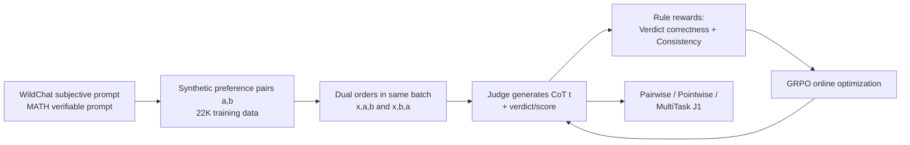

# J1: Incentivizing Thinking in LLM-as-a-Judge via Reinforcement Learning

**Conference**: ICLR 2026  
**OpenReview**: [https://openreview.net/forum?id=dnJEHl6DI1](https://openreview.net/forum?id=dnJEHl6DI1)  
**Code**: TBD  
**Area**: Reinforcement Learning / LLM-as-a-Judge / Reward Modeling  
**Keywords**: LLM-as-a-Judge, Verifiable Reward RL, GRPO, Position Bias, Chain-of-Thought Evaluation  

## TL;DR
J1 unifies "subjective/objective judgment tasks" into a format with verifiable rewards, using GRPO online RL to train LLM judges that "think before rendering a verdict." At a 32B scale, it surpasses o3 and DeepSeek-R1-671B on multiple reward benchmarks and eliminates position bias using purely synthetic data.

## Background & Motivation

**Background**: Advancements in AI are increasingly bottlenecked by "evaluation quality," making LLM-as-a-Judge a core solution. Early judges relied on prompts to generate chain-of-thought (CoT) verdicts; later, offline methods like iterative fine-tuning and DPO were used to improve reasoning quality. In parallel, scalar reward models (Bradley-Terry RM) output scores directly without explicit reasoning.

**Limitations of Prior Work**: (1) Offline methods (SFT/Self-Taught/DPO) cannot optimize the "evaluation reasoning process" itself online, limiting the upper bound of reasoning quality; (2) Pairwise judges suffer from stubborn **position bias**—verdicts flip when the order of two responses is swapped; (3) Pointwise judges are naturally position-consistent but lack a reference object, leading to frequent ties; (4) SOTA generative reward models (e.g., DeepSeek-GRM) depend on massive human annotations (millions of judge data + hundreds of thousands of RL samples).

**Key Challenge**: The goal is to enable judges to "reason" for higher accuracy while making reasoning online-optimizable and eliminating position bias. However, most judgment tasks are subjective and non-verifiable, precluding the direct application of verifiable reward RL.

**Goal**: To train a **generalist thinking-judge** capable of both pairwise and pointwise evaluation, relying solely on synthetic data without human annotation, while systematically resolving position bias.

**Core Idea**: **Unify all judgment tasks into a "verifiable reward" format.** Whether for verifiable prompts like MATH or subjective prompts like WildChat, preference pairs $(a,b)$ are constructed. Predicting "which response is better" is treated as a verifiable task with a ground-truth label, allowing the use of RL from verifiable rewards to directly optimize evaluation reasoning.

## Method

### Overall Architecture
J1 trains the judge using GRPO on verl: First, WildChat (subjective) and MATH (verifiable) prompts are used to construct synthetic preference pairs. Both orders $(x,a,b)$ and $(x,b,a)$ are included in the same batch (position-agnostic batching). Then, rule-based "verdict correctness + consistency" rewards are used to optimize the CoT and final verdict online. Finally, various judge formats (pairwise, pointwise, multi-task) are explored and unified into a single multi-task model.

### Key Designs

**1. Unified Verifiable Reward Training: Transforming Subjective Judgment into Tasks with "Standard Answers"**
Ours adopts a synthetic preference pair strategy to transform evaluation into a verifiable task of "predicting the superior response." The 22K training data consists of 17K WildChat + 5K MATH prompts. Rejected responses for WildChat are obtained by having an LLM generate "noisy variants" of the original instruction and then responding. For MATH, rejected responses are samples that do not match the gold answer. This provides ground-truth preference labels even for subjective prompts, enabling verifiable reward RL to cover both task types and allowing direct comparison between "Online RL vs. Offline DPO."

**2. Position-agnostic Batching + Consistency Reward: Eradicating Position Bias via Mechanism**
The verdict reward is binary: $+1$ if the final verdict is correct, $0$ otherwise. Additionally, a **consistency reward** is introduced—$+1$ is granted only if the model identifies the correct response in both orders $(x,a,b)$ and $(x,b,a)$; if either order is wrong, the reward is $0$. This requires placing both orders of the same pair in one batch (position-agnostic batching). The authors also tested format rewards for the `<think>` tag but found no significant gain.

**3. Diverse Judge Formats + Distilling Pointwise Judges via Pairwise Supervision**
J1 uses GRPO to jointly optimize thinking and judgment, defining several formats: **PaV** (promptPaV$(x,a,b)\to(t,y)$, direct verdict), **PaS** (outputs real-valued scores $s_a,s_b$, higher score wins, reward based on alignment with gold), and **PaVS** (outputs both scores and verdict). Crucially, the **PoS (Pointwise) judge** (promptPoS$(x,a)\to(t,s)$) assigns a 0–10 score to a single response. It is trained via **remote supervision from pairwise data**: each preference pair is split into two pointwise samples, their scores are evaluated jointly, and a reward of $1$ is given only if the score ranking matches the gold verdict. Training a thinking-judge via pairwise supervision is a novel contribution of this work.

**4. Multi-task Unification: A Single Model for Pointwise and Pairwise**
Finally, the PoS and PaS paradigms are merged into a single **MultiTask-J1**, trained jointly on pairwise and pointwise data. Since pairwise judgment generally outperforms pointwise, evaluating this multi-task model in a pairwise setting yields the best results, surpassing standalone pointwise and pairwise judges.

## Key Experimental Results

### Main Results (PPE Correctness, Pairwise Setting, Accuracy, Gain over Base)

| Model | Training Pairs | Overall | MMLU-Pro | MATH | GPQA | MBPP-Plus | IFEval |
|------|-----------|---------|----------|------|------|-----------|--------|
| Llama-3.1-8B-Instruct (base) | – | 54.7 | 56.3 | 62.9 | 51.4 | 50.1 | 52.8 |
| EvalPlanner-Llama-70B (DPO) | 22K | 70.2 | 78.4 | 81.7 | 64.4 | 62.2 | 64.3 |
| DeepSeek-BTRM-27B (Scalar RM) | 237K | 66.7 | 68.8 | 73.2 | 56.8 | 68.8 | 66.0 |
| J1-Llama-8B | 22K | 59.2 +4.5 | 65.6 | 70.0 | 53.2 | 53.1 | 54.0 |
| J1-Llama-70B | 22K | 72.9 +7.2 | 79.0 | 86.0 | 65.9 | 66.0 | 67.3 |
| J1-Qwen-32B | 22K | 74.6 +8.1 | 82.2 | 93.3 | 65.2 | 65.3 | 66.8 |
| **J1-Qwen-32B-MultiTask** | 22K | **76.8 +10.3** | 85.0 | 94.3 | 68.6 | 66.3 | 69.5 |

J1-Qwen-32B-MultiTask achieves SOTA with 76.8 ($p<0.0001$), which is 6.8% higher than EvalPlanner and 17% higher than DeepSeek-GRM-27B (which used 1270K + 237K data).

### Cross-benchmark Comparison (Overall across 5 Reward Benchmarks)

| Model | Overall | PPE | RewardBench | RM-Bench | JudgeBench† | FollowBenchEval† |
|------|---------|-----|-------------|----------|-------------|------------------|
| J1-Llama-8B | 61.9 +13.6 | 59.8 | 85.7 | 73.4 | 42.0 | 48.3 |
| J1-Llama-70B | 75.0 +10.7 | 69.6 | 93.3 | 82.7 | 60.0 | 69.3 |
| **J1-Qwen-32B-MultiTask** | **80.8** | 71.8 | 93.6 | 90.3 | 71.4 | 77.1 |
| OpenAI-o3 | 77.4 | 72.1 | 86.4 | 86.1 | 75.7 | 66.8 |
| DeepSeek-R1-671B | 78.4 | 72.3 | 90.6 | 88.6 | 68.9 | 71.7 |

J1-MultiTask at 32B scale outperforms o3 and R1-671B in 3 out of 5 metrics.

### Ablation Study (Position Consistency, PPE Correctness)

| Model | Type | Consistent Acc ↑ | Verdict Flip/Ties ↓ |
|------|------|------------------|---------------------|
| J1-Qwen-32B | Pairwise | 65.2 | 14.5 |
| J1-Qwen-32B | Pointwise | 69.3 | 13.0 |
| J1-Qwen-32B-MultiTask | Pairwise | 67.0 | 17.0 |
| J1-Qwen-32B-MultiTask | Pointwise | **70.6** | **10.5** |

Pointwise judges outperform pairwise in consistent accuracy and flip rates; the multi-task model shows the lowest flip rate (10.5) when using pointwise evaluation.

### Key Findings
- **Online RL > Offline DPO**: J1 consistently outperforms two-round DPO EvalPlanner with the same data, validating the advantage of online optimization for evaluation reasoning.
- **Small Models + Synthetic Data can Surpass Giants**: Training a 32B model on synthetic data exceeds o3 and R1-671B in several categories.
- **Test-time Scaling is Effective**: As the number $N$ for majority vote or average score increases, consistent accuracy rises and tie rates fall.
- **Emergent Behaviors**: J1 spontaneously learns to dynamically generate evaluation criteria, build reference answers, iteratively self-correct, and provide feedback for low-quality responses.

## Highlights & Insights
- **"Unified Verifiability" is the Key**: Converting subjective evaluation into ground-truth preference prediction allows verifiable reward RL to handle tasks previously incompatible with RL.
- **Position Bias Managed at the Mechanism Level**: Using dual orders in the same batch combined with consistency rewards is more effective than simple prompting for consistency.
- **Distilling Pointwise Judges via Pairwise Supervision** avoids expensive pointwise labeling, offering an efficient engineering design.
- **Remarkable Data Efficiency**: Only 22K synthetic preference pairs were needed to beat models trained on millions of annotations.

## Limitations & Future Work
- Training pairs derive from only two seeds (WildChat + MATH); domain coverage and rejected response construction (noisy instructions) may limit generalization to complex real-world scenarios.
- Although pointwise judges are position-consistent, they still suffer from high tie rates; the fundamental challenge of "absolute scoring" without reference objects remains.
- Rewards are pure rule-based binary signals, failing to distinguish between "correct verdict for wrong reasons" and "correct reasoning"; process-level rewards require further exploration.
- 32B still trails o3 on JudgeBench, indicating that ultra-large reasoning models still hold an advantage in the most difficult reasoning-based judgments.

## Related Work & Insights
- **Methodological Lineage**: Evolves from prompt-based LLM-Judge $\rightarrow$ iterative fine-tuning/DPO (EvalPlanner, Self-Taught Evaluator) $\rightarrow$ Ours with online GRPO, following the DeepSeek-R1 philosophy of "verifiable reward RL for reasoning" applied to judge training.
- **Comparisons**: Scalar RMs (Skywork, Armo, DeepSeek-BTRM), Generative RMs (DeepSeek-GRM, Reasoning Reward Model), and reasoning LLMs (o1-mini, o3, R1).
- **Inspiration**: Any "subjective, hard-to-verify" task that can be structured as preference pairs can potentially be reframed as a verifiable reward RL problem. This "unified verifiability" paradigm could be transferred to RLHF reward models, agent self-evaluation, and multimodal assessment.

## Rating
- Novelty: ⭐⭐⭐⭐ — The combination of "unified verifiability + consistency rewards + pairwise-supervised pointwise judge" is a novel integration of judgment tasks into verifiable RL.
- Experimental Thoroughness: ⭐⭐⭐⭐⭐ — Comprehensive across 5 benchmarks, 3 scales, and multiple formats (pairwise/pointwise/multi-task), including position consistency and test-time scaling analysis.
- Writing Quality: ⭐⭐⭐⭐ — Clear structure and ample charts; naming conventions (PaV/PaS/PaVS/PoS/MT) add some reading complexity.
- Value: ⭐⭐⭐⭐⭐ — High practical value as a 32B model surpassing o3/R1-671B using synthetic data, directly applicable to RLHF and evaluation pipelines.

<!-- RELATED:START -->

## Related Papers

- [\[ICLR 2026\] QuRL: Rubrics As Judge For Open-Ended Question Answering](qurl_rubrics_as_judge_for_open-ended_question_answering.md)
- [\[ICLR 2026\] Parallel-R1: Towards Parallel Thinking via Reinforcement Learning](parallel-r1_towards_parallel_thinking_via_reinforcement_learning.md)
- [\[ICLR 2026\] Scheduling Your LLM Reinforcement Learning with Reasoning Trees](scheduling_your_llm_reinforcement_learning_with_reasoning_trees.md)
- [\[ACL 2026\] Glance-or-Gaze: Incentivizing LMMs to Adaptively Focus Search via Reinforcement Learning](../../ACL2026/reinforcement_learning/glance-or-gaze_incentivizing_lmms_to_adaptively_focus_search_via_reinforcement_l.md)
- [\[ICLR 2026\] AbstRaL: Augmenting LLMs' Reasoning by Reinforcing Abstract Thinking](abstral_augmenting_llms_reasoning_by_reinforcing_abstract_thinking.md)

<!-- RELATED:END -->
