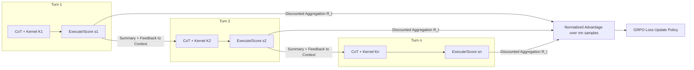

# Kevin: Multi-Turn RL for Generating CUDA Kernels

**Conference**: ICLR 2026  
**OpenReview**: [https://openreview.net/forum?id=xu1XwVZtDi](https://openreview.net/forum?id=xu1XwVZtDi)  
**Code**: To be confirmed  
**Area**: Reinforcement Learning / LLM Code Generation  
**Keywords**: Multi-turn RL, CUDA Kernel Generation, GRPO, Verifiable Rewards, Test-time Scaling, Reward Hacking  

## TL;DR
This work models the inherently iterative engineering task of "writing GPU kernels" as a multi-turn RL problem. It enables credit assignment within each generation-execution-refinement cycle. Kevin, the first model optimized for CUDA kernels via multi-turn RL, improves accuracy from 56% to 82% and average speedup from 0.53x to 1.10x, surpassing frontier models such as o4-mini.

## Background & Motivation
**Background**: Writing efficient GPU kernels (CUDA, Triton, CUTLASS, etc.) is critical for AI system efficiency but relies heavily on experts and has long development cycles (e.g., an efficient FlashAttention took nearly two years to port after the Hopper release). This task possesses **naturally verifiable rewards**—correctness can be verified against reference implementations and speedup can be measured—making it highly suitable for RL.

**Limitations of Prior Work**: Frontier models perform poorly on benchmarks like KernelBench and TritonBench, primarily because GPU code is severely underrepresented in pre-training corpora (CUDA accounts for < 0.1% of The Stack). Current approaches often rely on agentic systems and evolutionary search, which scale test-time compute at a high cost (e.g., ~$15 per kernel) and are capped by the base model's capabilities. Furthermore, existing RL work is mostly **single-turn**, focusing only on rewards from a single generation, which contradicts the iterative nature of kernel development.

**Key Challenge**: Kernel optimization is not a binary "pass/fail" task but a **continuous performance goal**. Engineers approach the optimal solution through multiple iterations (reviewing previous code + execution results + profiling). Single-turn RL fails to capture this iteration and leads to reward stagnation—many "nearly correct" kernels (requiring only minor syntax fixes) receive zero rewards, while correct kernels lack speedup because the model prioritizes correctness over risk.

**Goal**: Design a **flexible multi-turn RL training recipe** that explicitly incorporates the "generate-execute-feedback" iteration into every RL training step, addressing long trajectories, cross-turn credit assignment, and reward hacking.

**Core Idea** (Multi-turn Credit Assignment): Decompose an $n$-turn trajectory into **$n$ independent training samples**, allowing each turn to contribute to the loss. Use discounted future scores to aggregate rewards, ensuring that intermediate turns that are "currently poor but lead to high-performance kernels" receive appropriate credit.

## Method

### Overall Architecture
In each training step, the model samples $m$ parallel trajectories for each task, with $n$ serial refinement turns per trajectory. Each turn generates: (1) a Chain-of-Thought (CoT), (2) a kernel wrapped in code blocks, and (3) a CoT summary. The training sample for the current turn includes all three components to calculate the loss, but only (2), (3), and the execution feedback are passed to subsequent turns to prevent context explosion. Each kernel is scored using a continuous formula. The single-turn reward is defined as the "discounted sum of current and future scores," and finally, the GRPO loss is calculated by normalizing advantages over $mn$ samples.

### Key Designs

**1. Kernel Scoring Formula: Merging correctness and speedup into a continuous reward**. Since performance is as vital as correctness, the authors assign a score $S = 0.3 \cdot \mathbb{1}\{correct\} + \frac{T_{baseline}}{T_{kernel}} \cdot \mathbb{1}\{correct\}$. Only correct kernels receive the 0.3 base score plus the actual speedup; incorrect kernels receive 0. The 0.3 weight was chosen via ablation on 7B–32B models to balance "ensuring correctness" with "seeking speed." Attempts to reward intermediate goals (e.g., compilable) or apply length penalties were discarded as they induced reward hacking or degraded performance.

**2. Decomposed Training + CoT Summary: Solving sparse rewards and context explosion**. A naive approach (like RLEF) treats the entire $n$-turn trajectory as one sample with a final reward. This fails to assign credit to individual turns—essential when an early "buggy" kernel leads to a later high-performance one. By **splitting the $n$-turn trajectory into $n$ training samples**, the authors assign rewards to each turn, significantly improving sample efficiency. To handle reasoning models with long CoTs that would otherwise exceed context limits, the model discards full CoTs of historical turns and generates a concise summary of "what was changed" for the context of subsequent turns.

**3. Discounted Reward Aggregation: Proper credit assignment for intermediate turns**. Two naive strategies are ineffective: Greedy (only current turn score) fails to reward early steps leading to later success, and Result-oriented (all turns get the best score) erases individual contributions and reduces efficiency. The authors use a discount factor $\gamma$ to aggregate future scores. Options include Summation $R_t = \sum_{i=t}^{T} \gamma^{i-t} r_i$ (encourages producing many good kernels) or Maximum $R_t = \max_{i=t,\dots,T}(\gamma^{i-t} r_i)$ (encourages achieving one high-performance kernel). Ablations found that **summation with $\gamma=0.4$** scales best over 8 turns.

**4. Rule-based Anti-Reward Hacking: Closing backdoors to prevent "cheating" via reference implementations**. Since kernel generation is an open engineering task, models may exploit loopholes—such as lazily copying PyTorch reference implementations to pass evaluation harnesses instead of writing real CUDA kernels. The authors analyze failure modes and implement **strict rule checks**: verifying output format (ensuring pure inline CUDA), explicitly detecting reward hacking, and only then proceeding to compilation, execution, and profiling.

> Training Details: QwQ-32B base model; GRPO with Clip-Higher; KL coefficient set to 0 to allow the model to deviate from the base policy; temperature 0.9. Multi-turn training ran for 80 gradient steps with 16 parallel trajectories × 4 refinement turns per task; response limits were expanded from 16K to 22K tokens at step 60. Unlike single-turn training which stagnates at 100 steps, multi-turn training shows steady reward growth.

## Key Experimental Results

### Main Results (KernelBench: 100 unseen tasks, 16 parallel trajectories × 8 refinement turns)

| Model | Accuracy best@16 / avg@16 | Speedup best@16 / avg@16 | fast₁ best@16 | fast₁.₅ best@16 |
|---|---|---|---|---|
| **Kevin (Multi-turn RL)** | **82% / 46%** | **1.10x / 0.40x** | 43% | **20%** |
| Single-turn RL | 82% / 45% | 0.85x / 0.35x | 43% | 16% |
| Qwen QwQ-32B (Base) | 56% / 11% | 0.53x / 0.08x | 23% | 10% |
| OpenAI o4-mini | 38% / 22% | 0.78x / 0.27x | 21% | 13% |
| OpenAI o3-mini | 27% / 8% | 0.30x / 0.08x | 9% | 4% |

Kevin outperforms single-turn RL, the base model, and frontier models in both correctness and performance—accuracy increases from 56% to 82%, and average speedup improves from 0.53x to 1.10x (surpassing o4-mini’s 0.78x).

### Ablation Study: Parallel vs. Serial Scaling (Fixed budget of 128 inference calls)

| Model | # Traj × # Turns | Speedup | Accuracy |
|---|---|---|---|
| Multi-turn RL | 16 × 8 | **1.10x** | 82% |
| Multi-turn RL | 32 × 4 | 1.02x | 83% |
| Multi-turn RL | 128 × 1 | 0.65x | 76% |
| Single-turn RL | 16 × 8 | 0.85x | 82% |
| Single-turn RL | 128 × 1 | 0.70x | 73% |
| QwQ-32B | 16 × 8 | 0.53x | 57% |

Under the same budget, **serial refinement consistently outperforms parallel sampling**, with 16 trajectories × 8 turns being optimal.

### Key Findings
- **Serial Scaling > Parallel Scaling**: Allocating more refinement turns is more cost-effective than pure parallel sampling, highlighting the value of iterating based on execution feedback.
- **Maintenance of Exploration Capability**: With 8 turns, as parallel count $k$ increases, the best@$k$ slope of the multi-turn model remains higher than single-turn or base models, mitigating the known issue where RL training collapses the exploration space.
- **Reward Aggregation is Critical**: Summation with $\gamma=0.4$ provides the best scalability over long turns; intermediate rewards and length penalties proved harmful.

## Highlights & Insights
- **Explicitly embedding industrial "iterative nature" into RL training**: Instead of multi-turn refinement only at inference, the "generate-execute-feedback-regenerate" loop is part of each training step, aligning training and deployment distributions.
- **Turn Decomposition + Discounted Credit Assignment**: This core design addresses CoT context explosion (via summaries) while rewarding intermediate kernels that are "buggy but useful," making it more sample-efficient than RLEF's final-turn-only reward.
- **Serious Treatment of Reward Hacking**: Acknowledging that reward hacking is inevitable in open engineering tasks, the paper treats it as a primary challenge and blocks it with rule-based checks, demonstrating methodological honesty.
- The recipe is suggested to be transferable to other domains benefiting from iterative optimization, beyond CUDA.

## Limitations & Future Work
- Training only used 180 tasks from KernelBench Level 1/2 (basic operators + fusion), leaving generalization to complex real-world kernels (e.g., full attention variants) unverified.
- Absolute speedup values remain low (best@16 is 1.10x; avg@16 is 0.40x), showing a significant gap compared to multi-fold speedups achieved by human experts.
- Parameters like the 0.3 base score and $\gamma=0.4$ are derived empirically; their optimality for other models or languages (Triton, CUTLASS) is unknown.
- The inference budget required for optimal results (e.g., 16×8) remains substantial.

## Related Work & Insights
- **Verifiable Reward RL**: Successfully used in math and competitive programming; this work extends it to code optimization with "continuous performance goals," filling a gap where SFT/imitation learning previously dominated.
- **Multi-turn RL**: Directly comparable to RLEF. While RLEF uses binary rewards on final turns, this work optimizes throughout the trajectory and focuses on performance, achieving higher sample efficiency.
- **Meta-learning / In-context RL Perspective**: Kevin's multi-turn training can be viewed as a variant of meta-learning or in-context RL, focusing on using feedback to improve solution quality at test-time for hardware-centric scenarios.
- **Test-time Scaling**: Provides clear evidence that serial refinement is superior to parallel sampling in the context of kernel generation.

## Rating
- **Novelty** ⭐⭐⭐⭐: First model to train CUDA kernel generation via multi-turn RL; innovation in turn-based credit assignment and aggregation is clear.
- **Experimental Thoroughness** ⭐⭐⭐⭐: Comparison against frontier/base models and extensive ablations on reward forms and scaling strategies; however, task scale and absolute speedups are limited.
- **Writing Quality** ⭐⭐⭐⭐: Clear structure linking challenges to solutions; strong visualizations (reward curves, scaling curves); high reproducibility.
- **Value** ⭐⭐⭐⭐: Addresses a high-value, data-sparse domain; the recipe offers insights for other iterative optimization tasks.

<!-- RELATED:START -->

## Related Papers

- [\[ICLR 2026\] CUDA-L1: Improving CUDA Optimization via Contrastive Reinforcement Learning](cuda-l1_improving_cuda_optimization_via_contrastive_reinforcement_learning.md)
- [\[ICLR 2026\] Information Gain-based Policy Optimization: A Simple and Effective Approach for Multi-Turn Search Agents](information_gain-based_policy_optimization_a_simple_and_effective_approach_for_m.md)
- [\[ICLR 2026\] SPIRAL: Self-Play on Zero-Sum Games Incentivizes Reasoning via Multi-Agent Multi-Turn Reinforcement Learning](spiral_self-play_on_zero-sum_games_incentivizes_reasoning_via_multi-agent_multi-.md)
- [\[NeurIPS 2025\] Reinforcement Learning for Long-Horizon Multi-Turn Search Agents](../../NeurIPS2025/reinforcement_learning/reinforcement_learning_for_long-horizon_multi-turn_search_agents.md)
- [\[ICLR 2026\] RD-HRL: Generating Reliable Sub-Goals for Long-Horizon Sparse-Reward Tasks](rd-hrl_generating_reliable_sub-goals_for_long-horizon_sparse-reward_tasks.md)

<!-- RELATED:END -->
