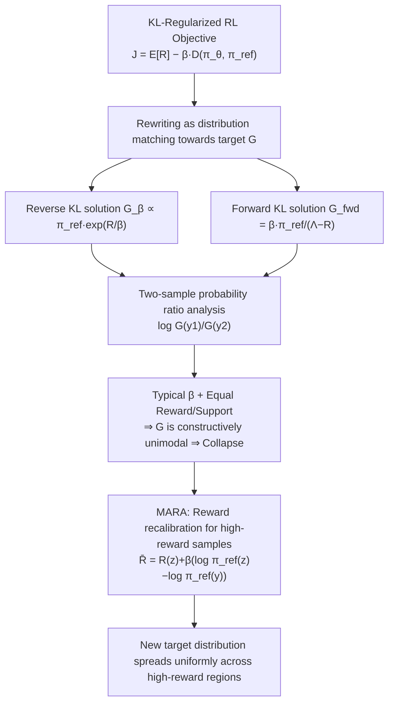

# KL-Regularized Reinforcement Learning for Generative Modelling is Designed to Mode Collapse

**Conference**: ICLR 2026  
**OpenReview**: [https://openreview.net/forum?id=flBRtdIihA](https://openreview.net/forum?id=flBRtdIihA)  
**Code**: To be confirmed  
**Area**: Reinforcement Learning / Generative Post-training  
**Keywords**: KL-regularized RL, mode collapse, diversity, variational inference, RLHF, reward recalibration  

## TL;DR
This paper proves from a variational inference perspective that diversity collapse in KL-regularized RL is not an optimization failure but an inherent property of the target distribution being constructed as unimodal. Under common hyperparameters, even a perfect global optimum will collapse to a single high-reward mode. Based on this, the authors propose MARA (Mode-Anchored Reward Augmentation), which spreads the target distribution uniformly across all high-reward regions with just two lines of code change.

## Background & Motivation
**Background**: RL has become the mainstream method for foundation model post-training (RLHF / RLVR). Its core is a KL-regularized (contextual) bandit problem—maximizing external reward $R(y)$ while using $\beta D(\pi_\theta, \pi_{\text{ref}})$ to anchor the policy near a reference model for coherence. Output diversity is crucial for creative writing, scientific discovery, and exploratory training.

**Limitations of Prior Work**: Empirical studies frequently observe that RL post-training "improves quality but degrades diversity." Current remedies—such as explicit diversity rewards, changing KL directions, selecting diverse data, or count-based exploration—treat the problem as an "exploration failure" during optimization, which only addresses the symptoms.

**Key Challenge**: Classical intuition suggests that reverse KL is "mode-seeking" while forward KL is "mass-covering," leading some to believe switching to forward KL would preserve diversity. This paper argues that this intuition only holds when the **variational family is inflexible** (e.g., 1D Gaussian). For flexible families like foundation models, optimizing any KL to global optimality can approximate complex posteriors; the mode-seeking/mass-covering dichotomy does not apply. The shape is truly determined by the **implicitly minimized target distribution** $G$, rather than the $D(\pi_\theta, \pi_{\text{ref}})$ term itself.

**Goal**: To ask a more fundamental question: Is the global optimum of the objective we are optimizing inherently diverse? **Core Idea**: Rewrite KL-regularized RL as "distribution matching towards a target distribution $G$," and prove that $G$ is constructed to be unimodal under common settings. Diversity collapse is Thus an inevitable result of "solving it correctly." The goal is then to solve this from the source via **reward recalibration**.

## Method

### Overall Architecture
The paper first provides a "diagnosis" followed by a "remedy." The diagnosis part derives the analytical global optima for both KL-regularized objectives, showing that maximizing the objective is equivalent to (implicit) divergence minimization towards a target distribution $G$. Using the "two-sample probability ratio" metric, the authors prove $G$ is inevitably unimodal. The remedy (MARA) recalibrates rewards for high-reward samples to transform $G$ into a multimodal distribution that is uniform in high-reward areas and close to $\pi_{\text{ref}}$ in low-reward areas.

### Key Designs
**1. Reg-RL = Distribution Matching**: The paper proves the gradient of the objective $J_\beta(\pi_\theta)=\mathbb{E}_{\pi_\theta}[R]-\beta D_{\mathrm{KL}}(\pi_\theta\|\pi_{\text{ref}})$ is proportional to the reverse KL gradient towards a target distribution $G optics$, $\nabla_\theta D_{\mathrm{KL}}(\pi_\theta\|G_\beta)\propto-\nabla_\theta J_\beta$, where the optimal solution is $G_\beta(y)=\frac{1}{\zeta}\pi_{\text{ref}}(y)\exp\!\big(R(y)/\beta\big)$. For forward KL regularization, the optimal solution becomes a different distribution $G_{\text{fwd}}(y)=\frac{\beta\,\pi_{\text{ref}}(y)}{\Lambda-R(y)}$ ($\Lambda>\max_y R(y)$). Crucially, the gradient of forward KL regularization **does not equal** a forward KL gradient, invalidating the "mass-covering" intuition for changing KL directions.

**2. Proving "Constructive Unimodality" via Probability Ratios**: Since normalization constants cancel out in ratios, the log-probability ratio of any two samples under the optimum is $\log\frac{G_\beta(y_1)}{G_\beta(y_2)}=\log\frac{\pi_{\text{ref}}(y_1)}{\pi_{\text{ref}}(y_2)}+\frac{1}{\beta}\big(R(y_1)-R(y_2)\big)$. This leads to two critical conclusions: First, under equal prior support (likelihood), $\frac{G_\beta(y_1)}{G_\beta(y_2)}=\exp\!\big(\frac{\Delta R}{\beta}\big)$, meaning **linear** reward differences are exponentially amplified. With $\Delta R=0.1$ and $\beta=10^{-3}$, high-reward samples are amplified by $2.6\times10^{43}$, forcing the solution to a single peak. Second, under equal rewards (standard for verifiable tasks: correct=1, wrong=0), $\frac{G_\beta(y_1)}{G_\beta(y_2)}=\frac{\pi_{\text{ref}}(y_1)}{\pi_{\text{ref}}(y_2)}$, **independent of $\beta$**. This implies RL will never improve the relative probability of a low-prior correct answer—not due to lack of exploration, but because the objective does not prefer it.

**3. $\beta$ as a "Mode Selection Knob"**: When two trajectories differ in reward and reference probability, a unique $\beta$ exists to make them equally likely in the target distribution: $R(y_2)-R(y_1)=\beta\big(\log\pi_{\text{ref}}(y_1)-\log\pi_{\text{ref}}(y_2)\big)$. This reveals the true role of $\beta$: it is not just "closeness to reference," but a switch weighing "high-reward, low-support" vs "low-reward, high-support" solutions.

**4. MARA: Mode-Anchored Reward Augmentation**: Leveraging Remark 4.4, the authors construct a multimodal target. Within a sample batch, a high-reward anchor $z$ with the highest support is selected: $z=\arg\max_{y}\pi_{\text{ref}}(y)\ \text{s.t.}\ R(y)\ge\tau$. Rewards are then recalibrated for all high-reward samples:

$$\bar R(y)=\begin{cases}R(y) & R(y)<\tau\\ R(z)+\beta\big(\log\pi_{\text{ref}}(z)-\log\pi_{\text{ref}}(y)\big) & R(y)\ge\tau\end{cases}$$

Low-reward samples remain unchanged (target stays close to $\pi_{\text{ref}}$), while high-reward samples obtain **uniform** high density in the target distribution, bridging the probability gap between modes.

## Key Experimental Results

### Main Results: Creative Q&A (Qwen3-1.7B + WildChat, Table 1)

| Method | In-dist Reward↑ | Out-dist Reward↑ | Ngrams EAD↑ | Semantic Div↑ | Mean Distinct↑ |
|---|---|---|---|---|---|
| Base Model | 10.94 | 1.166 | 0.413 | 0.220 | 4.01 |
| GRPO | 14.80 | 1.317 | 0.497 | 0.193 | 3.96 |
| RLOO | 15.56 | 1.280 | 0.514 | 0.192 | 3.88 |
| Entropy Reg | 1.44 | 0.786 | 0.267 | 0.228 | 3.45 |
| Unlikely | 10.04 | 1.381 | 0.532 | 0.191 | 4.24 |
| BoN Training | 16.88 | 0.596 | 0.541 | 0.162 | 2.29 |
| **MARA (rev)** | 15.42 | 1.451 | 0.543 | 0.186 | 4.14 |
| **MARA (fwd)** | 15.33 | **1.604** | **0.568** | 0.193 | **4.62** |

MARA (forward KL version) leads across almost all diversity metrics. Entropy regularization crashes the reward, and BoN severely harms diversity, highlighting MARA's quality-diversity balance.

### Verifiable 1-2 Task (Qwen2.5-3B)
The model is tasked to generate "1" or "2" uniformly. Naive KL-regularized RL collapses to a single answer (usually "1" due to higher prior) across various $\beta$ settings. MARA runs succeed in generating 1 and 2 nearly uniformly while maintaining the correct format.

### Drug Discovery (REINVENT, SYNTH task, Table 2a)

| Screen | Algorithm | Yield↑ | OB100↓ | IntDiv1↑ | #Circles↑ |
|---|---|---|---|---|---|
| 0.80 | REINVENT | 6569 | 1042 | 0.766 | 67 |
| 0.80 | MARA (τ=0.80) | **6834** | **1015** | 0.761 | 59 |
| 0.85 | REINVENT | 1614 | 4114 | 0.701 | 7 |
| 0.85 | MARA (τ=0.85) | **2196** | 4010 | 0.703 | 7 |

MARA achieves significantly higher Yield (unique high-reward molecules) and lower OB100 (oracle calls) while remaining competitive in global diversity metrics.

### Key Findings
- **Collapse is constructive**: Unimodality is a property of the objective, independent of the optimization algorithm.
- **Lowering $\beta$ cannot fix missing low-support modes** in equal-reward settings because the probability ratio becomes $\beta$-independent.
- **The same recalibration works for both reverse and forward KL**, whereas naive optimization of either fails to preserve diversity.

## Highlights & Insights
- **Shift from "Algorithm Perspective" to "Objective Perspective"**: Re-diagnosing diversity collapse as an objective design flaw rather than an optimization failure is a clean and falsifiable framework.
- **Debunking KL Myths**: Clarifies that reverse/forward KL intuition doesn't apply to flexible foundation models and reveals that forward KL-regularized RL doesn't actually follow a forward KL gradient.
- **Plug-and-play Simplicity**: Requires only two lines of code, applicable to GRPO, RLOO, and REINVENT without external diversity signals.
- **Cross-domain Validation**: Consistent benefits across LLM verifiable tasks, creative alignment, and chemical molecular design.

## Limitations & Future Work
- **Non-sequential Setting**: Analysis is based on a contextual bandit framework; shape consistency under token-level credit assignment remains to be verified.
- **Anchor Dependency**: MARA requires high-reward samples in the batch. Performance may vary if high-reward samples are extremely scarce or reward ranges are unknown.
- **Mode Definition**: Defining multimodality as "approximate equal density in high-reward regions" is somewhat idealized for continuous reward distributions.
- **Local Probability Alignment**: MARA explicitly balances high-reward modes relative to each other; it does not "actively" search for new structural diversity beyond the provided samples.

## Related Work & Insights
- **Post-training from VI/Target perspective**: Connects to DPO and Reinforcement Learning through Variational Inference, but shifts focus from "what the solution is" to "how its diversity is constructed."
- **Filtering methods (STaR, RAFT)**: Interprets these as rejection sampling approximations of the target distribution $G_\beta$.
- **Heuristic**: Before adding exploration or diversity rewards to fix "quality-up, diversity-down" issues, one must first verify if the global optimum of the objective is diverse.

## Rating
- **Novelty**: ⭐⭐⭐⭐⭐ High. Re-diagnosing collapse from an objective perspective and debunking KL myths is theoretically elegant.
- **Experimental Thoroughness**: ⭐⭐⭐⭐ Strong verification across three distinct domains with multiple baselines.
- **Writing Quality**: ⭐⭐⭐⭐⭐ Excellent. The logical progression from analytical solutions to constructive unimodality is very clear.
- **Value**: ⭐⭐⭐⭐⭐ High. Provides direct, actionable guidance and a simple fix for practitioners of RL post-training.

<!-- RELATED:START -->

## Related Papers

- [\[ICLR 2026\] The Choice of Divergence: A Neglected Key to Mitigating Diversity Collapse in Reinforcement Learning with Verifiable Reward](the_choice_of_divergence_a_neglected_key_to_mitigating_diversity_collapse_in_rei.md)
- [\[ICLR 2026\] GAR: Generative Adversarial Reinforcement Learning for Formal Theorem Proving](gar_generative_adversarial_reinforcement_learning_for_formal_theorem_proving.md)
- [\[ICLR 2026\] GRACE: Generative Representation Learning via Contrastive Policy Optimization](grace_generative_representation_learning_via_contrastive_policy_optimization.md)
- [\[ICML 2026\] Offline Reinforcement Learning with Generative Trajectory Policies](../../ICML2026/reinforcement_learning/offline_reinforcement_learning_with_generative_trajectory_policies.md)
- [\[NeurIPS 2025\] Convergence Theorems for Entropy-Regularized and Distributional Reinforcement Learning](../../NeurIPS2025/reinforcement_learning/convergence_theorems_for_entropy-regularized_and_distributional_reinforcement_le.md)

<!-- RELATED:END -->
