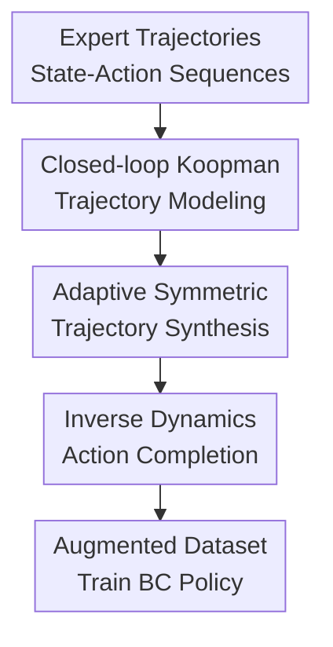

# Koopman-Assisted Trajectory Synthesis: A Data Augmentation Framework for Offline Imitation Learning

**Conference**: ICLR 2026  
**OpenReview**: [https://openreview.net/forum?id=UAZCKdd4R7](https://openreview.net/forum?id=UAZCKdd4R7)  
**Code**: To be released  
**Area**: Reinforcement Learning / Offline Imitation Learning / Trajectory Synthesis  
**Keywords**: Offline Imitation Learning, Koopman Operator, Trajectory-level Data Augmentation, Inverse Dynamics Model, Covariate Shift  

## TL;DR
KATS models expert closed-loop behavior as linear dynamics in a Koopman latent space and synthesizes new trajectories using latent space symmetry transformations that commute with these dynamics. By augmenting these with actions via an inverse dynamics model, KATS significantly improves policy performance in offline imitation learning and few-shot offline reinforcement learning tasks with low data diversity.

## Background & Motivation
**Background**: Offline imitation learning (IL) typically trains policies from a fixed expert dataset. The most fundamental approach, Behavior Cloning (BC), formulates this as supervised learning: given a state $s$, predict the expert action $a$. This approach is simple and stable, making it suitable for robot control, navigation, and manipulation tasks where online interaction is unavailable. However, its premise is fragile: the policy only sees states visited by the expert during training. During deployment, small action errors cause the state distribution to drift from the expert trajectories. Subsequent actions continue to fail in unseen regions, leading to typical covariate shift.

**Limitations of Prior Work**: There are two main strategies to mitigate distribution shift. One is algorithm-centric, such as conservative regularization, model rollouts, or support set constraints. The other is data-centric, i.e., augmenting the offline data. The latter is attractive because it does not require environment resampling; generating more reasonable state-action samples can make the policy more robust near expert trajectories. However, simple step-wise perturbations, Mixup, or noise injection only focus on local transitions and may move states to physically inconsistent positions. Conversely, using a forward dynamics model to recursively generate entire trajectories accumulates one-step prediction errors over time. Generative models like GANs or diffusion, while expressive, lack sufficient data support when expert demonstrations are scarce, often producing trajectories that look diverse but are behaviorally untrustworthy.

**Key Challenge**: Offline imitation learning requires "trajectory-level" augmentation rather than a collage of independent transitions. Simultaneously, this augmentation cannot rely on long-term rollouts due to compounding model errors. In other words, the method must satisfy three conditions: synthesized results must be dynamically consistent, must preserve expert behavior style, and must be trainable and scalable with few demonstrations.

**Goal**: The authors aim to construct an offline data augmentation framework that generates new state-action sequences using expert trajectories as basic units. Synthesized state trajectories should follow expert closed-loop dynamics, actions should match synthetic state transitions, and the process should avoid the scaling issues of previous Koopman augmentation methods in action dimensions.

**Key Insight**: The paper leverages Koopman operator theory. Koopman methods lift nonlinear dynamics into a high-dimensional observation space where evolution is described by a linear operator. If a symmetry transformation $\sigma$ that commutes with the Koopman dynamics can be found, applying $\sigma$ point-wise to an existing trajectory should result in a new trajectory that evolves under the same linear dynamics. This property is naturally suited for "transforming entire trajectories" because it does not predict the future step-by-step from an initial state but maps every time step of the original expert trajectory to a new, structurally consistent position.

**Core Idea**: KATS replaces action-conditioned Koopman dynamics with expert closed-loop Koant dynamics. It then learns commutative latent space symmetry transformations for trajectory-level synthesis and completes the actions for synthetic state transitions using an inverse dynamics model (IDM).

## Method

### Overall Architecture
KATS takes offline expert trajectories $D_E=\{\tau_i\}$ as input and outputs an augmented dataset $D_{final}=D_E\cup D_{aug}$, which is then used to train a standard BC policy. Unlike step-by-step rollouts, KATS first learns the "closed-loop dynamics under the expert policy" $s_{t+1}\approx G(s_t)$, finds approximately commutative transformations $\sigma$ in the Koopman latent space to map entire expert state trajectories to new ones, and finally uses an IDM to infer actions from adjacent state pairs.

The key to this workflow is decoupling actions from the Koopman dynamics: the Koopman model only handles expert closed-loop state evolution, while actions are handled by a separate IDM. This avoids the cost of maintaining operators for each action dimension (as seen in KFC) and prevents state-action mismatches caused by forcefully attaching original actions to new states.

### Key Designs
**1. Closed-loop Koopman Trajectory Modeling: Absorbing Expert Policy into State Dynamics**

Previous Koopman augmentation methods usually model open-loop dynamics $s_{t+1}=F(s_t,a_t)$ and learn action-related operators, such as the bilinear form $z_{t+1}\approx (K_0+\sum_k K_k a_{t,k})z_t$ in KFC. This is inefficient when action dimensions are high: model complexity and inference costs rise, and step-wise augmentation still struggles with long-term consistency. KATS instead models the closed-loop system induced by the expert policy $s_{t+1}\approx G(s_t)$, implicitly embedding the information of "how the expert acts in this state" into the state transition.

Specifically, KATS trains an autoencoder $(E_\phi,D_\psi)$ and an action-independent Koopman matrix $K$. The encoder maps states to latent variables $z_t=E_\phi(s_t)$, the Koopman matrix handles linear forward evolution $z_{t+1}\approx Kz_t$, and the decoder reconstructs states. The training objective includes reconstruction loss and Koopman prediction loss: $L_{recon}=\mathbb{E}_{s\sim D_E}\|s-D_\psi(E_\phi(s))\|^2$, $L_{koopman}=\mathbb{E}_{(s_t,s_{t+1})\sim D_E}\|E_\phi(s_{t+1})-K E_\phi(s_t)\|^2$. Since $K$ learns directly from adjacent expert state pairs, it describes closed-loop expert behavior rather than environmental dynamics under arbitrary actions. Subsequent transformations that commute with $K$ are more likely to preserve expert style.

**2. Commutative Symmetric Trajectory-level Synthesis: Avoiding Rollout Errors**

The theoretical core of KATS is policy-equivariance. If closed-loop dynamics $F_\pi$ is equivariant to a state transformation $\sigma$, i.e., $F_\pi(\sigma\cdot s)=\sigma\cdot F_\pi(s)$, then the corresponding Koopman operator satisfies the commutation relation $K_\pi\sigma=\sigma K_\pi$. Intuitively: applying a symmetry transformation and then taking a step under expert dynamics should yield the same result as taking the step first and then applying the transformation.

Given an expert latent trajectory $z^E_0,z^E_1,\ldots,z^E_T$, KATS constructs $\hat z_t=\sigma z^E_t$ for all $t$ simultaneously. If $K\sigma\approx \sigma K$, the new trajectory approximately satisfies $\hat z_{t+1}\approx K\hat z_t$. This "simultaneous mapping" preserves the temporal structure and avoids the compounding errors inherent in forward model rollouts. After decoding $\hat s_t=D_\psi(\hat z_t)$, the state sequence becomes a new candidate trajectory consistent with expert dynamics.

**3. Adaptive Symmetry Learning: Focusing on Koopman Errors**

Finite-dimensional Koopman representations are rarely perfect, especially in regions with sparse data, small state variations, or complex dynamics. Applying transformations indiscriminately could amplify model bias. The paper provides an error decomposition: if the expert latent step error is $\epsilon_t=z^E_{t+1}-Kz^E_t$ and the commutation error is $\Delta=\sigma K-K\sigma$, the transformed trajectory error satisfies $\hat\epsilon_t=\sigma\epsilon_t+\Delta z^E_t$, with $\|\hat\epsilon_t\|\le \|\sigma\|\|\epsilon_t\|+\|\Delta\|\|z^E_t\|$. Synthesis quality depends on both Koopman accuracy and how well $\sigma$ commutes with $K$.

KATS avoids solving a fixed homogeneous Sylvester equation $K\sigma-\sigma K=0$. Instead, it learns the transformation with a weighted objective: $L_\sigma=\mathbb{E}_{(s_t,s_{t+1})\sim D_E} w_{s_t}\|\sigma(z_{t+1})-K\sigma(z_t)\|^2$, where $w_{s_t}=\exp(\tau\|z_{t+1}-Kz_t\|)$. Higher local Koopman error leads to higher weights, forcing $\sigma$ to satisfy commutation consistency in these vulnerable regions. This design focuses augmentation on states where the original policy is most likely to deviate.

**4. Inverse Dynamics Action Completion: Inferring Matching Actions**

The closed-loop design generates only state sequences $s'_0,\ldots,s'_T$. Using original actions might lead to mismatches since states have changed. KATS uses an independent inverse dynamics model (IDM) $f_{IDM}:S \times S \rightarrow A$ to infer the actions that match the synthesized state pairs.

The IDM is trained on expert data: $L_{IDM}=\mathbb{E}_{(s_t,a_t,s_{t+1})\sim D_E}\|a_t-f_{IDM}(s_t,s_{t+1})\|^2$. During generation, for each synthetic pair $(s'_t,s'_{t+1})$, the action is $a'_t=f_{IDM}(s'_t,s'_{t+1})$, resulting in a complete tuple or trajectory. The combined dataset $D_E \cup D_{aug}$ is then used for standard BC training. KATS acts as a pre-processor and does not require modifying the downstream imitation learner.

### Loss & Training
Training proceeds in four stages. First, the Koopman autoencoder and linear operator are pre-trained by minimizing $L_{recon}$ and $L_{koopman}$ (latent space dimension $N_z=32$). Second, the IDM is trained to predict actions from state pairs. Third, the sigma model learns the latent transformation via the weighted commutation loss $L_\sigma$ with temperature $\tau=1.5$. Finally, the augmented dataset is used to train the policy; MSE is used for continuous actions and cross-entropy for discrete actions. KATS is a plug-and-play module compatible with learners like BC or SRA. For offline RL, KATS reuses the reward from the source trajectory at the same time step.

## Key Experimental Results

### Main Results
KATS was evaluated on D4RL tasks: AntMaze, Gym/MuJoCo, and Adroit. Baselines include BC, SRA, MILO, and KFC+BC. KATS achieved state-of-the-art results across 15 tasks, with significant gains in sparse data or noisy demonstration scenarios.

| Dataset / Task | Metric | Ours (KATS+BC) | Strong Baseline | Gain |
|--------|------|------|----------|------|
| antmaze-umaze | D4RL score | 96.9 ± 0.8 | SRA 85.3 ± 1.1 | +11.6 |
| antmaze-large-play | D4RL score | 59.3 ± 1.5 | SRA 48.3 ± 2.0 | +11.0 |
| halfcheetah-medium-expert | D4RL score | 81.2 ± 6.7 | SRA 63.4 ± 3.5 | +17.8 |
| hopper-medium-expert | D4RL score | 112.7 ± 3.6 | SRA 104.5 ± 3.3 | +8.2 |
| pen-cloned | D4RL score | 81.3 ± 4.7 | MILO 57.1 ± 2.0 | +24.2 |
| door-human | D4RL score | 37.2 ± 2.1 | MILO 27.0 ± 1.0 | +10.2 |

KATS significantly outperformed its direct predecessor KFC+BC. In antmaze-umaze, KFC+BC scored 79.1 vs. KATS+BC's 96.9. This confirms that modeling closed-loop trajectories is superior to step-wise action-conditioned augmentation for offline IL. KATS+BC also excelled in few-shot offline RL (0.5% - 10% data), outperforming complex RL algorithms like CQL or POR by simply using BC on augmented data.

| Task | Data % | Ours (KATS+BC) | Strongest Baseline | Note |
|------|---------|------|------|------|
| Hopper-e | 1% | 97.1 ± 10.4 | KFC+CQL 89.1 ± 7.6 | Significant gain in low data |
| Halfcheetah-e | 1% | 102.7 ± 8.1 | POR 86.2 ± 5.2 | Surpasses Offline RL baselines |
| Walker2d-e | 1% | 109.4 ± 11.2 | KFC+CQL 86.4 ± 12.2 | Effective for locomotion |
| Antmaze-u | 10% | 83.1 ± 7.2 | TELS 88.7 ± 7.7 | Strong but not SOTA |

### Ablation Study
Ablations verified the importance of the learnable $\sigma_\theta$, the IDM, and the action-decoupled design.

| Configuration | Key Metric | Note |
|------|---------|------|
| KATS (Ours) | antmaze-umaze 96.9 ± 0.8 | Full model, best performance |
| KATS-$\sigma_A$ | antmaze-umaze 87.3 ± 2.6 | Learnable $\sigma$ beats fixed analytic matrix |
| KATS w/o IDM | antmaze-umaze 78.4 ± 4.8 | Dropping action completion hurts matching |
| KFC+BC | antmaze-umaze 79.1 ± 3.4 | Step-wise action-coupled is weaker |

### Key Findings
- The combination of "trajectory-level synthesis" and "closed-loop dynamics" provides the largest gain, maintaining path coherence in long-term tasks like AntMaze.
- The IDM is essential. Without it, performance drops to or below KFC+BC levels, proving that synthetic actions must match the synthetic transitions.
- Adaptive $\sigma$ is more stable than fixed analytic matrices, as it captures effective symmetries even when global symmetry is weak.
- KATS is a universal enhancer; applying it to BC and SRA consistently improves performance.

## Highlights & Insights
- The transition from modelling "action-conditioned environmental dynamics" to "expert closed-loop dynamics" is a clever shift that internalizes behavioral rationality into the operator $K$.
- Trajectory-level augmentation directly addresses the failure mode of covariate shift in offline IL, where policies drift and then fail continuously.
- The error decomposition provides a diagnosis: synthesis failure isn't just about Koopman accuracy but also about the commutation quality of the transformation.
- Decoupling via IDM allows the state synthesizer and action inferrer to specialize, making KATS a modular pre-processor.

## Limitations & Future Work
- The Koopman model (MLP-based) might be too simple for high-dimensional visual observations or highly nonlinear contacts.
- The method assumes learnable approximate symmetries in the expert dynamics; it may struggle in tasks with weak symmetry or narrow data coverage.
- IDM quality limits the synthesis; in multi-modal action scenarios, simple MLPs might produce "averaged" and thus invalid actions.
- Reusing rewards from source trajectories is a rough heuristic that may be inaccurate for significant state deviations.

## Related Work & Insights
- **vs. BC**: BC suffers from covariate shift; KATS expands coverage near experts with dynamically consistent trajectories to stabilize BC.
- **vs. SRA / MILO**: While SRA and MILO focus on algorithmic constraints, KATS is data-centric and complementary to these approaches.
- **vs. KFC / Koopman Q-learning**: KFC uses action-equivariant structures for step-wise augmentation; KATS uses policy-equivariant closed-loop representations for trajectory-wide synthesis, which is more efficient for high-dimensional actions.
- **vs. Diffusion / GANs**: Generative models require more data; Koopman symmetries provide a strong inductive bias that works better in low-data regimes.

## Rating
- **Novelty**: ⭐⭐⭐⭐ Trajectory-level synthesis via closed-loop Koopman and IDM decoupling is a well-targeted combination.
- **Experimental Thoroughness**: ⭐⭐⭐⭐ Covers IL, few-shot RL, and ablations, though verification on real robots or high-dimensional vision is missing.
- **Writing Quality**: ⭐⭐⭐⭐ Clear motivation and decomposition.
- **Value**: ⭐⭐⭐⭐⭐ Highly relevant for data-centric offline IL, particularly for sparse-data and long-horizon tasks.

<!-- RELATED:START -->

## Related Papers

- [\[ICML 2026\] Trajectory-Level Data Augmentation for Offline Reinforcement Learning](../../ICML2026/reinforcement_learning/trajectory-level_data_augmentation_for_offline_reinforcement_learning.md)
- [\[ICLR 2026\] Trajectory Generation with Conservative Value Guidance for Offline Reinforcement Learning](trajectory_generation_with_conservative_value_guidance_for_offline_reinforcement.md)
- [\[ICLR 2026\] GAS: Enhancing Reward-Cost Balance of Generative Model-assisted Offline Safe RL](gas_enhancing_reward-cost_balance_of_generative_model-assisted_offline_safe_rl.md)
- [\[ICLR 2026\] Goedel-Prover-V2: Scaling Formal Theorem Proving with Scaffolded Data Synthesis and Self-Correction](goedel-prover-v2_scaling_formal_theorem_proving_with_scaffolded_data_synthesis_a.md)
- [\[ICLR 2026\] On Discovering Algorithms for Adversarial Imitation Learning](on_discovering_algorithms_for_adversarial_imitation_learning.md)

<!-- RELATED:END -->
