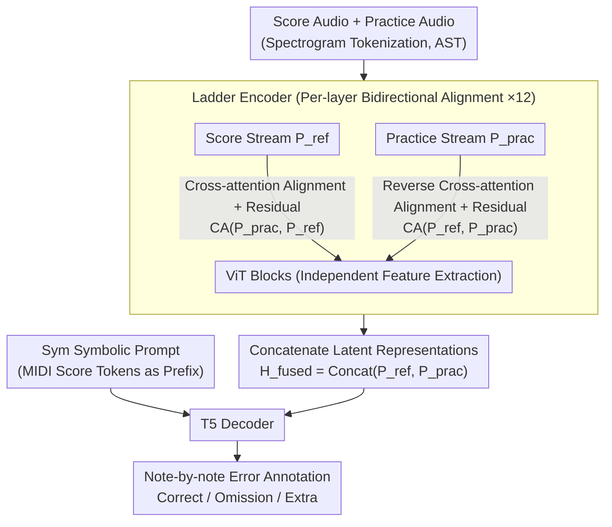

# LadderSym: A Multimodal Interleaved Transformer for Music Practice Error Detection

**Conference**: ICLR 2026  
**arXiv**: [2510.08580](https://arxiv.org/abs/2510.08580)  
**Code**: [GitHub](https://github.com/ben2002chou/LadderSYM)  
**Area**: Reinforcement Learning  
**Keywords**: Music Practice Error Detection, Multimodal Fusion, Cross-attention, Symbolic Prompting, Alignment Module

## TL;DR
The LadderSym architecture is proposed to solve music practice error detection. By overcoming alignment deficiencies in late fusion via an interleaved cross-stream alignment module (Ladder) and reducing frequency ambiguity in pure audio scores with symbolic score prompting (Sym), it improves the omission F1 from 26.8% to 56.3% on MAESTRO-E.

## Background & Motivation

**Background**: Music practice error detection compares practice recordings with reference scores to identify omissions, extra notes, and wrong notes. Early methods relied on DTW for explicit alignment (sensitive to deviations), while Polytune, using Transformers for latent space alignment, represents the current SOTA.

**Limitations of Prior Work**: (1) Polytune utilizes late fusion (joint encoding only in the final layer), and attention map analysis reveals insufficient cross-stream alignment; (2) Scores are input only as synthesized audio, where spectral overlap during polyphony causes ambiguity, particularly affecting omission detection.

**Key Challenge**: Early fusion (single encoder) improves alignment but restricts asymmetric feature extraction due to parameter sharing; late fusion maintains independent processing but sacrifices alignment capability. There is a need to decouple alignment from feature extraction.

**Key Insight**: (1) Design a Ladder encoder that performs bidirectional alignment using cross-attention modules at each layer while ViT blocks independently extract features; (2) Introduce symbolic scores as decoder prompts to reduce audio ambiguity.

## Method

### Overall Architecture
The task involves a note-by-note comparison between a practice recording and a reference score to label correct notes, omissions, and extra notes. LadderSym uses a pair of parallel encoders for the score audio and practice audio. Unlike the "independent encoding, late fusion" approach of the predecessor Polytune, it allows the two streams to **align with each other before extracting features at every layer**: the score stream adjusts itself based on the practice stream, and vice versa. After 12 layers, the latent representations are concatenated and fed into a T5 decoder. Before generating output, the decoder reads a sequence of symbolic MIDI score tokens as a prompt, finally producing MIDI-format annotations (Correct / Omission / Extra). Both innovations focus on "alignment"—one in the encoding stage (Ladder encoder) and the other in the decoding stage (Sym symbolic prompt).

### Key Designs

**1. Ladder Encoder: Decoupling and Interleaving Alignment Layer-by-Layer**

Prior work Polytune used late fusion, where streams were encoded independently and joined only at the final layer; attention maps show this results in insufficient cross-stream alignment. Conversely, simple early fusion (shared single encoder) forces asymmetric inputs to share parameters. Probe experiments quantified this conflict: in late fusion, the streams specialize—the practice stream maintains high locality (position probe 0.86), while the score stream develops stronger globality (0.179 → 0.186). Early fusion forces the locality of both streams to 0.91/0.93 due to parameter sharing, erasing this specialization. LadderSym decouples "alignment" from "feature extraction": ViT blocks in each layer still extract features independently, but a cross-attention (CA) module for bidirectional alignment is inserted before each ViT block. The score stream uses the practice stream as key/value for CA, adds the residual, and then passes through the ViT; the practice stream performs the reverse update symmetrically:

$$P_{\text{ref}}^{(i+1)} = \text{ViT}_{\text{ref}}\big(P_{\text{ref}}^{(i)} + \text{CA}(P_{\text{prac}}^{(i)}, P_{\text{ref}}^{(i)})\big)$$

The streams are concatenated into a fused representation $H_{\text{fused}} = \text{Concat}(P_{\text{ref}}^{\text{final}}, P_{\text{prac}}^{\text{final}})$. This allows Ladder to preserve stream independence (cross-stream correspondence accuracy of 0.30, higher than prior models) while turning explicit temporal alignment (like DTW) into per-layer automated latent alignment. Visualizing the learned cross-attention maps reveals an anti-diagonal structure consistent with DTW alignment paths.

**2. Sym Symbolic Prompt: Using Unambiguous Score Tokens to Clarify Expected Notes**

Omission detection is difficult because synthesized audio scores suffer from spectral overlap in polyphonic sections, making it hard to distinguish individual notes. Sym bypasses this by tokenizing the MIDI score directly and using it as a prefix prompt for the decoder. Before generating annotations, the decoder "sees" an explicit list of expected notes. This provides an unambiguous reference for determining "if a note is missing," rather than forcing the model to extract it from overlapping spectra. Audio and symbolic views are complementary: symbolic tokens may introduce alignment errors under complex time signatures, while audio spectra struggle with concurrent notes; feeding both compensates for their respective weaknesses.

### Loss & Training
- Standard sequence-to-sequence training, outputting MIDI-like tokens with explicit error labels (Correct / Omission / Extra).
- Encoders are 12-layer Audio Spectrogram Transformers (AST); the decoder is an 8-layer T5, aligning with Polytune configurations.

## Key Experimental Results

### Main Results (MAESTRO-E)

| Method | Omission F1↑ | Extra Note F1↑ | Notes |
|------|---------|---------|------|
| Polytune (Prev. SOTA) | 26.8% | 72.0% | Late fusion + Audio only |
| **Ours (LadderSym)** | **56.3%** | **86.4%** | Gain: +29.5% / +14.4% |

### CocoChorales-E

| Method | Omission F1↑ | Extra Note F1↑ |
|------|---------|---------|
| Polytune | 51.3% | 46.8% |
| **Ours (LadderSym)** | **61.7%** | **61.4%** |

### Ablation Study

| Configuration | Omission F1 | Extra Note F1 | Description |
|------|--------|--------|------|
| Ladder + Sym | **56.3** | **86.4** | Full method |
| Ladder only | Mid | Mid | No symbolic prompt |
| Sym only | Mid | Mid | No Ladder alignment |
| Polytune | 26.8 | 72.0 | Baseline |

### Key Findings
- Omission detection saw the largest Gain (+29.5%) because Sym eliminated ambiguity regarding "which notes should exist."
- Attention maps confirm that Ladder learns DTW-like temporal alignment patterns.
- Generalization was validated on real recording data (labeling is extremely expensive: 20 songs required 52 person-hours).

## Highlights & Insights
- **Decoupling Alignment and Feature Extraction**: Cross-attention handles alignment, while ViT blocks focus on feature extraction—this separation of concerns strengthens both capabilities.
- **The Power of Symbolic Prompting**: A simple prompt without architectural changes significantly boosts performance by resolving polyphonic frequency ambiguity at its source.
- **Insights Beyond Music**: The architectural principles for comparison tasks (layer-wise alignment, asymmetric feature extraction) are transferable to other scenarios like RL policy evaluation or human skill assessment.

## Limitations & Future Work
- Validated only on piano and chorales; effectiveness on other instruments (guitar, orchestral) is unknown.
- Real-world data remains scarce (20 songs), making it difficult to fully evaluate real-scene generalization.
- Symbolic scores require MIDI format, which is not always available.
- Computational overhead is higher than Polytune (one extra cross-attention module per layer).

## Related Work & Insights
- **vs Polytune**: Follows the same paradigm but improves fusion strategy and input modalities, doubling omission detection performance.
- **vs DTW Methods**: Upgrades from explicit alignment to learned latent alignment, providing better robustness against deviations.
- **Transferability**: Potential applications in RL policy evaluation (comparing trajectories) and code review (comparing references and submissions).

## Rating
- Novelty: ⭐⭐⭐⭐ The combination of Ladder and Sym is a first in music error detection.
- Experimental Thoroughness: ⭐⭐⭐⭐ Includes synthetic and real data with in-depth attention map analysis.
- Writing Quality: ⭐⭐⭐⭐⭐ Clear motivation, convincing probe experiments, and rich visualization.
- Value: ⭐⭐⭐⭐ Directly impacts music education tools and sequence comparison tasks.

<!-- RELATED:START -->

## Related Papers

- [\[ICLR 2026\] STAIRS-Former: Spatio-Temporal Attention with Interleaved Recursive Structure Transformer for Offline Multi-Task Multi-Agent Reinforcement Learning](stairs-former_spatio-temporal_attention_with_interleaved_recursive_structure_tra.md)
- [\[ICLR 2026\] Echo: Towards Advanced Audio Comprehension via Audio-Interleaved Reasoning](echo_towards_advanced_audio_comprehension_via_audio-interleaved_reasoning.md)
- [\[ICLR 2026\] The State of Reinforcement Finetuning for Transformer-based Agents](the_state_of_reinforcement_finetuning_for_transformer-based_agents.md)
- [\[ICLR 2026\] Recurrent Action Transformer with Memory](recurrent_action_transformer_with_memory.md)
- [\[ICLR 2026\] Chunking the Critic: A Transformer-based Soft Actor-Critic with N-Step Returns](chunking_the_critic_a_transformer-based_soft_actor-critic_with_n-step_returns.md)

<!-- RELATED:END -->
