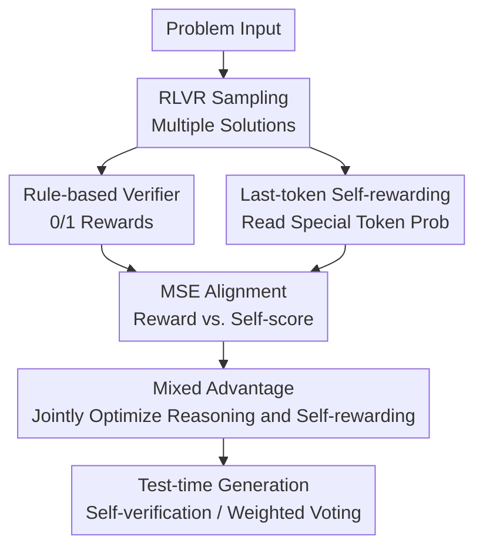

# LaSeR: Reinforcement Learning with Last-Token Self-Rewarding

**Conference**: ICLR 2026  
**OpenReview**: [https://openreview.net/forum?id=1OhgEmix20](https://openreview.net/forum?id=1OhgEmix20)  
**Code**: https://github.com/RUCBM/LaSeR  
**Area**: Reinforcement Learning / LLM Post-training / Self-rewarding  
**Keywords**: [RLVR, Self-rewarding, Self-verification, GRPO, Test-time scaling]

## TL;DR
LaSeR compresses the LLM's judgment of its answer correctness into the log-prob of a special token following the last answer token. By aligning this last-token self-rewarding score to verifier rewards using an MSE auxiliary loss, it simultaneously enhances RLVR reasoning capabilities and test-time self-verification with minimal additional inference cost.

## Background & Motivation
**Background**: In post-training for LLM mathematical reasoning, Reinforcement Learning with Verifiable Rewards (RLVR) has become a core methodology. It typically involves sampling multiple solutions for the same problem and using a rule-based verifier to check if the final answer matches the ground truth, providing 0/1 feedback to policy optimization algorithms like PPO or GRPO. The shared experience behind systems like DeepSeek-R1 and OpenAI o1 is that RLVR drives models toward longer, more deliberate, and self-correcting reasoning trajectories as long as tasks have verifiable answers.

**Limitations of Prior Work**: Standard RLVR rewards are only available during training because ground truth is absent at test time. For test-time candidate ranking, weighted majority voting, or continual self-improvement, the model needs to gauge its own answer correctness. Existing approaches either train an external reward model/verifier or prompt the same LLM to generate a self-verification judgment after producing an answer. Both strategies are resource-intensive: external verifiers incur additional model and training costs, while self-verification prompts nearly double the generation overhead per sample.

**Key Challenge**: While RLVR identifies correct and incorrect answers during training, this supervision is not naturally preserved in the model's output distribution. Test-time requirements favor a low-cost, calibrated scalar score for ranking candidates over a lengthy written critique. The central problem is whether the model can yield a correctness score while generating the answer without auxiliary text generation.

**Goal**: The authors aim to jointly train reasoning and self-rewarding capabilities within a single policy model. This self-rewarding signal must be seamlessly integrated with RLVR during training, accessible immediately after answer generation at the cost of at most one token inference, and sufficiently accurate for self-verification and weighted voting.

**Key Insight**: Starting from the closed-form solution of RL objectives, the paper observes that the optimal reward for a verification task can be expressed as the log-prob ratio of a verification token between the policy and reference models. Furthermore, if an unused special token is selected, the reference model's log-prob at the answer's end is nearly constant. Consequently, the complex verification task is simplified to reading the next-token probability at the end of the answer.

**Core Idea**: Construct a self-rewarding score using the log-prob of a special token after the last answer token and align it with the 0/1 rule-based verifier reward using an MSE loss. This allows the LLM to learn "whether it is likely correct" as a byproduct of the RLVR process.

## Method

### Overall Architecture
LaSeR serves as a lightweight bypass to standard RLVR/GRPO. The model generates multiple solutions as usual, and the rule-based verifier provides 0/1 rewards. Additionally, LaSeR reads the policy model's log-prob for a predefined special token $z_c$ after each solution to compute a last-token self-rewarding score $r_s$. During training, $r_s$ is aligned to the verifier reward via an MSE loss. Once stabilized, $r_s$ contributes to the advantage calculation alongside the verifier reward, providing fine-grained signals for policy updates. At test time, the score is used for self-verification, ranking, and weighted voting without needing ground truth.

### Key Designs
**1. Last-token Self-rewarding: Compressing verification into final token distribution**

Unlike traditional self-verification that requires generating a "correct/incorrect" judgment, LaSeR embeds this judgment into the next-token distribution at the answer's end. Given a problem $x$ and a generated solution $y$, a special token $z_c$ (e.g., `<vision_start>` in Qwen or a reserved token in LLaMA) represents "correctness." The self-rewarding score is defined as $r_s=\beta_v\log\pi_\theta(z_c\mid x,y)-\beta_v c_{ref}$, where $c_{ref}$ approximates the reference model's average log-prob for $z_c$ at that position. This design minimizes cost; since token log-probs are already calculated during RL training, $r_s$ requires no extra forward passes. At test time, only one additional token inference is needed.

**2. From RL Closed-form to MSE Alignment: Mapping 0/1 rewards to learnable scalars**

The paper frames verification as an RL objective where the model outputs a token $z$ that receives a reward of 1 if it matches the verifier's judgment. The optimal solution satisfies a DPO-like form: the verification reward can be expressed via $\beta_v\log\frac{\pi_\theta(z\mid x,y)}{\pi_{ref}(z\mid x,y)}$ plus a partition function term. Since unused special tokens have extremely low probabilities, the partition function vanishes, leading to $r_v(x,y)\approx\beta_v\log\frac{\pi_\theta(z_c\mid x,y)}{\pi_{ref}(z_c\mid x,y)}$. Minimizing $(r_s-r_v)^2$ is more stable than SFT or BCE, which would aggressively push $\pi_\theta(z_c\mid x,y)$ toward 1 and disrupt the reasoning distribution.

**3. Reference Constantization & Class Re-weighting: Efficiency and balance**

Empirical observations show that the reference model's log-prob for $z_c$ is highly stable across different problems and solutions (e.g., $-23.11\pm0.04$ for Qwen2.5). This allows for pre-estimating $c_{ref}$ as a constant, eliminating the need for reference model forward passes. To handle dynamic class imbalances during RL (where correct answers might be rare early on), LaSeR uses weights $w_c=\frac{N_c+N_i}{2N_c}$ and $w_i=\frac{N_c+N_i}{2N_i}$ in the MSE loss, forcing the model to distinguish correct from incorrect solutions regardless of the batch distribution.

**4. Mixed Advantage & Phased Warm-up: Integrating scores into RL updates**

LaSeR incorporates $r_s$ into the RL training itself. In GRPO, advantages are typically computed from verifier rewards within a group. LaSeR computes a self-rewarding advantage and mixes it: $\hat A=(1-\tau)A_v+\tau A_s$. Since $r_s$ is continuous, it provides finer granularity between solutions that are both "incorrect." To ensure stability, a warm-up strategy is used: the model first warms up reasoning, then trains the self-rewarding MSE until scores can reliably distinguish correctness, before finally mixing $A_s$ into the advantage.

### Key Examples
Consider an AIME-style math problem sampled 8 times in a GRPO rollout. The rule-based verifier identifies 3 correct and 5 incorrect solutions ($r_v\in\{0,1\}$). Standard RLVR would only assign positive or negative advantages based on these binary values.

With LaSeR, the model reads $\log\pi_\theta(z_c\mid x,y)$ for each solution. A correct solution might yield $r_s \approx 0.95$, while a partially correct but ultimately failed solution might yield $r_s \approx 0.20$. The MSE loss aligns these scores with the verifier rewards, and the advantage integration uses these continuous values for more nuanced updates. At test time, when 32 solutions are sampled, $r_s$ is used to weight the votes; higher-confidence solutions exert more influence on the final result.

### Loss & Training
LaSeR builds upon GRPO. Given $K$ sampled solutions $y_i$ for problem $x$, the rule-based verifier yields $r_v(x,y_i)\in\{0,1\}$. The auxiliary self-rewarding loss is a re-weighted MSE:

$$
l=\frac{1}{N_c+N_i}\sum_x\sum_y [w_c\mathbf{1}_{r_v=1}+w_i\mathbf{1}_{r_v=0}]\left[\beta_v\log\pi_\theta(z_c\mid x,y)-\beta_v c_{ref}-r_v(x,y)\right]^2.
$$

After warm-up, the advantage is mixed using $r_s^i=\beta_v\log\pi_\theta(z_c\mid x,y_i)-\beta_v c_{ref}$:

$$
\hat A_t^i=(1-\tau)\frac{r_v^i-\mathrm{mean}(r_v^1,\ldots,r_v^K)}{\mathrm{std}(r_v^1,\ldots,r_v^K)}+\tau\frac{r_s^i-\mathrm{mean}(r_s^1,\ldots,r_s^K)}{\mathrm{std}(r_s^1,\ldots,r_s^K)}.
$$

Parameters: $\beta_v=0.1$, MSE weight $\alpha=0.1$, advantage weight $\tau=0.1$. Training uses DeepMath-103K with a rollout of 8 and a response length of 8192.

## Key Experimental Results

### Main Results
Evaluations on OctoThinker-3B-Short-Base, Qwen2.5-7B-Base, and Open-Reasoner-Zero-7B across MATH500, AIME, and OlympiadBench show that LaSeR slightly outperforms GRPO in reasoning accuracy while drastically improving self-verification F1 to 72-80%.

| Model Base | Method | Avg Reasoning Acc | Avg Verification F1 | Key Observation |
|--------|------|----------------|---------------|----------|
| OctoThinker-3B-Short | GRPO | 30.8 | 51.0 | RLVR improves reasoning; self-verification is mediocre |
| OctoThinker-3B-Short | LaSeR | 32.8 | 72.5 | Reasoning continues to improve; verification surges |
| Qwen2.5-7B-Base | GRPO | 41.8 | 49.2 | Strong reasoning, but limited self-verification |
| Qwen2.5-7B-Base | LaSeR | 42.7 | 79.6 | F1 near 80%, reasoning also improves |
| Open-Reasoner-Zero-7B | GRPO | 45.0 | 38.8 | Reasoning improves but verification degrades |
| Open-Reasoner-Zero-7B | LaSeR | 45.5 | 77.6 | Self-rewarding capability is successfully recovered |

Notably, Open-Reasoner-Zero-7B-LaSeR achieves an F1 of 77.6, which is comparable to external reward models like Qwen2.5-Math-RM-72B (76.8) and Open-Reasoner-Zero-7B-RM (78.9) despite being a single model.

### Ablation Study
- **-SWA (No Mixed Advantage)**: Reasoning accuracy drops slightly, but self-verification F1 remains high, indicating MSE alignment is the primary source of self-rewarding capability.
- **Reference Constantization**: Leads to identical performance while halving the score computation cost.
- **Self-rewarding only RL**: Training collapses after ~60 steps if verifier rewards are entirely removed.
- **SFT/BCE vs MSE**: SFT significantly interferes with reasoning training by aggressively shifting token distributions.

### Key Findings
- LaSeR significantly boosts the model's ability to judge its own answers, reaching levels comparable to external reward models.
- The self-rewarding score is well-calibrated (ECE 0.090 for ORZ-LaSeR vs 0.251 for Qwen2.5-Math-RM-72B).
- Scores exhibit a negative correlation with length (Spearman -0.42), avoiding the length bias of cumulative log-ratio methods.
- Generalization to non-mathematical tasks is weaker (AUROC ~0.6 on GPQA), likely due to lower base reasoning capabilities and noisier verifiers.

## Highlights & Insights
- Verification is transformed from an explicit text generation task into a latent log-prob readout, leveraging RL theory to ensure efficiency.
- The use of MSE instead of BCE is a gentle design choice that avoids disrupting the model's primary language modeling distribution.
- Mixed advantages provide fine-grained signals in sparse reward environments, though they cannot entirely replace ground-truth verifiers.
- The method is ideal for test-time weighted majority voting, providing confidence scores at nearly zero cost for high-throughput deployment.

## Limitations & Future Work
- Primarily depends on tasks with verifiable rewards (math, code); performance on open-ended writing or safety remains uncertain.
- While it provides a score, it lacks interpretability (no error localization or critiques).
- There is a risk of reward hacking if the model's own $r_s$ is used for long-term iterative self-improvement without external anchoring.
- Future work could explore process-level scores or bridging LaSeR with PRM distillation.

## Related Work & Insights
- **Standard RLVR/GRPO**: Optimizes generation but lacks test-time scoring; LaSeR adds a readout via the same training process.
- **External RM/PRM**: Offers accuracy but increases deployment and inference costs; LaSeR is near-zero cost.
- **Generative Self-verification**: Offers high interpretability but doubles generation costs; LaSeR trades text for efficiency.
- **SFT/BCE Verification**: Aggressively shifts distributions; LaSeR's MSE is a more tempered approach.

## Rating
- Novelty: ⭐⭐⭐⭐⭐ Elegant compression of verification judgment into a single token readout backed by RL theory.
- Experimental Thoroughness: ⭐⭐⭐⭐ Solid coverage across models and math benchmarks; could benefit from more open-ended task analysis.
- Writing Quality: ⭐⭐⭐⭐ Clear progression from theory to engineering tricks.
- Value: ⭐⭐⭐⭐⭐ Highly practical for RLVR post-training and test-time scaling in reasoning-heavy domains.

<!-- RELATED:START -->

<!-- Paper links would go here -->

<!-- RELATED:END -->

## Related Papers

- [\[ICLR 2026\] Spotlight on Token Perception for Multimodal Reinforcement Learning](spotlight_on_token_perception_for_multimodal_reinforcement_learning.md)
- [\[ICLR 2026\] Token Hidden Reward: Steering Exploration-Exploitation in Group Relative Deep Reinforcement Learning](token_hidden_reward_steering_exploration-exploitation_in_group_relative_deep_rei.md)
- [\[ICLR 2026\] Self-Harmony: Learning to Harmonize Self-Supervision and Self-Play in Test-Time Reinforcement Learning](self-harmony_learning_to_harmonize_self-supervision_and_self-play_in_test-time_r.md)
- [\[ICLR 2026\] Shop-R1: Rewarding LLMs to Simulate Human Behavior in Online Shopping via Reinforcement Learning](shop-r1_rewarding_llms_to_simulate_human_behavior_in_online_shopping_via_reinfor.md)
- [\[ICML 2026\] LASER: Learning Active Sensing for Continuum Field Reconstruction](../../ICML2026/reinforcement_learning/laser_learning_active_sensing_for_continuum_field_reconstruction.md)

<!-- RELATED:END -->
