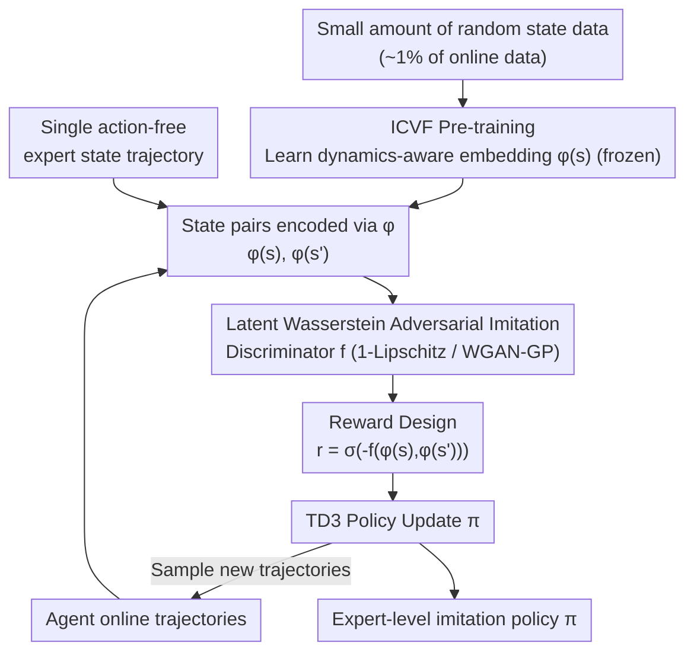

# Latent Wasserstein Adversarial Imitation Learning

**Conference**: ICLR 2026  
**arXiv**: [2603.05440](https://arxiv.org/abs/2603.05440)  
**Code**: [GitHub](https://github.com/JackyYang258/LWAIL)  
**Area**: Imitation Learning/Reinforcement Learning  
**Keywords**: Wasserstein Distance, ICVF, Dynamics-aware Embedding, State-only Imitation, Few-shot

## TL;DR
The authors propose LWAIL, which utilizes ICVF to learn dynamics-aware latent representations from a small amount of random data. By upgrading the "ground metric" of the Wasserstein distance from Euclidean distance to latent space distance, the method achieves expert-level imitation performance using only a single state trajectory.

## Background & Motivation

**Background**: Imitation learning (IL) aims to learn policies from expert demonstrations. Adversarial Imitation Learning (AIL) achieves this by matching the state distributions of the agent and the expert, typically using $f$-divergence or Wasserstein distance as distribution metrics.

**Limitations of Prior Work**: (1) $f$-divergence requires overlapping distribution supports, which is difficult to satisfy when utilizing low-quality non-expert data. (2) Although Wasserstein methods based on Kantorovich-Rubinstein (KR) duality are more robust, the 1-Lipschitz constraint implicitly assumes Euclidean distance as the ground metric. This fails to capture environment dynamics; for instance, state B might be closer to expert state C in Euclidean space, but if B cannot reach C, it is less valuable than a more distant state A that can.

**Key Challenge**: Wasserstein distance requires an effective ground metric to measure distances between states, yet Euclidean distance ignores transition dynamics—states that are close geographically might be completely unreachable in the environment.

**Key Insight**: Utilize Intent-Conditioned Value Functions (ICVF) to learn a dynamics-aware embedding space $\phi(s)$ from a small amount of random state data. In this space, Euclidean distance naturally captures reachability relationships.

**Core Idea**: Replace the Euclidean space in Wasserstein AIL with the dynamics-aware latent space learned by ICVF.

## Method

### Overall Architecture
LWAIL addresses the issue where the ground metric in Wasserstein adversarial imitation learning is "locked" to Euclidean distance. The pipeline consists of two stages: first, an ICVF is trained offline using a minimal amount of random state transition data (approx. 1% of online data) to obtain dynamics-aware state embeddings $\phi(s)$, which are then frozen. Second, the Wasserstein adversarial imitation, originally performed on the raw state space, is migrated into the $\phi$ space. Both agent and expert trajectories are encoded via $\phi$. The discriminator $f$ performs distribution matching on latent state pairs, and its output is reshaped into rewards for policy optimization via TD3, which then generates new trajectories to complete the cycle. In essence, the discriminator, 1-Lipschitz constraint, and state distribution matching remain unchanged, but the ground metric for distance is now defined by reachability.

### Key Designs

**1. ICVF Pre-training: Making Euclidean Distance Dynamics-aware**

The Wasserstein distance under KR duality implicitly assumes a Euclidean ground metric because the 1-Lipschitz constraint is defined relative to Euclidean distance. However, states close in coordinate space may be unreachable. LWAIL learns an embedding $\phi_\theta(s)$ such that "closeness in $\phi$ space" corresponds to "high reachability in environment dynamics." This is modeled via ICVF decomposition:

$$V_\theta(s, s_+, z) = \phi_\theta(s)^\top T_\theta(z)\, \psi_\theta(s_+)$$

Here, $\phi_\theta(s)$ is the state embedding used as the ground metric, $T_\theta(z)$ is the transition matrix for intent $z$, and $\psi_\theta(s_+)$ encodes the target state. The entire objective is trained using offline RL objectives like IQL on random transitions. Theorem 3.1 provides theoretical support, showing that state-pair occupancy probabilities $d_{ss}^{\pi_z}(s,s')$ are approximately linear combinations of $\phi(s)$, meaning the $\phi$ space is naturally suited for Wasserstein matching.

**2. Latent Wasserstein Adversarial Imitation: Same Constraints, Different Metric**

With $\phi$ established, state-pair distribution matching is moved from the original space to the latent space. The optimization target remains the KR dual min-max form:

$$\min_\pi \max_{\|f\|_L \leq 1}\ \mathbb{E}_{d_{ss}^\pi}\big[f(\phi(s), \phi(s'))\big] - \mathbb{E}_{d_{ss}^E}\big[f(\phi(s), \phi(s'))\big]$$

The agent's state-pair occupancy $d_{ss}^\pi$ approximates the expert's $d_{ss}^E$, while the discriminator $f$ seeks the maximum margin under the 1-Lipschitz constraint. Crucially, since $f$ processes $\phi(s)$ and $\phi(s')$, the Euclidean distance associated with the 1-Lipschitz constraint is now dynamics-aware. States that are close in coordinates but unreachable are no longer misidentified as "similar." This allows the model to achieve expert-level imitation from a single action-free trajectory by matching the dynamics-based distribution.

**3. Reward Design: Reshaping Discriminator Output into Stable RL Signals**

The downstream policy is optimized using TD3, requiring the discriminator output $f$ to be converted into per-step rewards:

$$r(s,s') = \sigma\big(-f(\phi(s), \phi(s'))\big)$$

The negative sign is used because $f$ assigns high values to expert pairs and low values to agent pairs; applying the negative sign pushes the agent toward the expert distribution. The sigmoid function $\sigma$ squashes the reward into the $[0,1]$ range, preventing large fluctuations in the early stages of adversarial training from destabilizing the TD3 value estimates.

## Key Experimental Results

### Main Results
MuJoCo environments, single state-only trajectory (no actions):

| Environment | LWAIL | WDAIL | GAIfO | IQlearn | Expert Score |
|------|-------|-------|-------|---------|---------|
| Hopper | ~Expert | Low | Mid | Mid | 113.23 |
| HalfCheetah | ~Expert | Low | Low | Mid | 88.42 |
| Walker2D | ~Expert | Low | Mid | Low | 106.84 |
| Ant | ~Expert | Low | Low | Low | 116.97 |

### Ablation Study

| Configuration | Performance | Description |
|------|------|------|
| LWAIL (Full) | Optimal | ICVF Embedding + Wasserstein |
| No ICVF (Euclidean) | Significant Drop | Validates the importance of the embedding |
| Different Random Data Volumes | 1% is sufficient | Extremely high data efficiency |

### Key Findings
- ICVF requires only 1% of the online data volume in the form of random transitions to learn an effective embedding.
- t-SNE visualizations clearly demonstrate that states in the ICVF embedding space are organized by dynamics (high-reward states cluster together), a property missing in the raw space.
- In Maze2D, LWAIL outperforms TD3 using true sparse rewards because ICVF provides a denser reward signal.

## Highlights & Insights
- **Importance of the Ground Metric**: Points out a widely overlooked issue in KR-dual Wasserstein methods—that the 1-Lipschitz constraint locks the metric to Euclidean distance. This insight is valuable to the broader Wasserstein IL community.
- **Surprising Value of Random Data**: Only 1% of state transition data collected via a random policy is enough to learn a sufficient dynamics-aware embedding, suggesting "garbage data" has immense value when utilized correctly.
- **Elegant Theoretical-Practical Link**: Theorem 3.1 provides the theoretical justification for Wasserstein matching in the $\phi$ space.

## Limitations & Future Work
- Does the multiplicative decomposition structure of ICVF ($V = \phi^T T \psi$) limit expressivity?
- Validated only on continuous control (MuJoCo); high-dimensional observations (pixels) remain unexplored.
- The single expert trajectory setup is extreme; performance with 5–10 trajectories is not reported.
- Environment interaction is required to collect random data; the effectiveness of ICVF in a purely offline setting needs verification.

## Related Work & Insights
- **vs. WDAIL/IQlearn**: Shares the KR-dual framework but ignores the ground metric problem; LWAIL addresses this directly via ICVF.
- **vs. SMODICE**: Uses $f$-divergence, which requires distribution coverage assumptions; LWAIL's use of Wasserstein is more robust.
- **vs. Primal Wasserstein Methods**: Primal forms avoid the metric issue but introduce other complexities.

## Rating
- Novelty: ⭐⭐⭐⭐ The idea of a dynamics-aware ground metric is simple yet insightful.
- Experimental Thoroughness: ⭐⭐⭐⭐ Multiple environments, various baselines, and sufficient ablations.
- Writing Quality: ⭐⭐⭐⭐ Clear motivation and good integration of theory and experiments.
- Value: ⭐⭐⭐⭐ Provides a direct and valuable improvement to Wasserstein IL methods.

<!-- RELATED:START -->

## Related Papers

- [\[ICLR 2026\] On Discovering Algorithms for Adversarial Imitation Learning](on_discovering_algorithms_for_adversarial_imitation_learning.md)
- [\[ICLR 2026\] Model Predictive Adversarial Imitation Learning for Planning from Observation](model_predictive_adversarial_imitation_learning_for_planning_from_observation.md)
- [\[ICLR 2026\] Near-Optimal Second-Order Guarantees for Model-Based Adversarial Imitation Learning](near-optimal_second-order_guarantees_for_model-based_adversarial_imitation_learn.md)
- [\[ICLR 2026\] Minimax Optimal Adversarial Reinforcement Learning](minimax_optimal_adversarial_reinforcement_learning.md)
- [\[ICLR 2026\] Learning to Generate Unit Test via Adversarial Reinforcement Learning](learning_to_generate_unit_test_via_adversarial_reinforcement_learning.md)

<!-- RELATED:END -->
