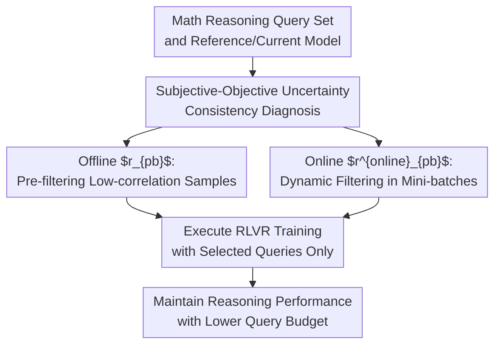

# Learn More with Less: Uncertainty Consistency Guided Query Selection for RLVR

**Conference**: ICLR2026  
**OpenReview**: [https://openreview.net/forum?id=OOTokVgBY6](https://openreview.net/forum?id=OOTokVgBY6)  
**Code**: https://github.com/yihao-123/uncertainty-consistency  
**Area**: Reinforcement Learning / RLVR / LLM Training Data Selection  
**Keywords**: RLVR, Subjective-Objective Uncertainty Consistency, Active Learning, Query Selection, Mathematical Reasoning  

## TL;DR
This paper introduces active learning into RLVR mathematical reasoning training. It identifies that the alignment between "model-perceived difficulty" and "objective error probability" is crucial for training value. By employing offline $r_{pb}$ and online $r^{online}_{pb}$ metrics, the method achieves performance close to or exceeding full-data RLVR training using only 30% of queries.

## Background & Motivation
**Background**: The mathematical reasoning capabilities of LLMs increasingly rely on reinforcement learning post-training with verifiable rewards (RLVR). Methods such as GRPO, RLOO, REINFORCE++, and DAPO do not require an additional reward model or a critic. Instead, they estimate the advantage directly using rule-based rewards (binary correctness) to push the policy model toward generating higher-quality reasoning chains.

**Limitations of Prior Work**: The cost of RLVR stems not only from GPU usage but also from query budgets and answer annotations. Although final answers can be checked via rules in math, constructing and maintaining a large volume of training queries remains expensive. More importantly, more data does not necessarily mean better performance; poor query selection can lead to high gradient variance, premature entropy collapse, and training instability.

**Key Challenge**: Classic active learning (AL) often assumes that "samples with higher uncertainty are more valuable for labeling," selecting samples based on perplexity, entropy, margin, or embedding coverage. However, in RLVR, the model's subjective uncertainty is not equivalent to training value. Samples where the model has low probability but gets the right answer, or is highly confident but gets it wrong, reflect inconsistencies between subjective and objective signals. These cause abnormally large policy gradients, pushing training into high-variance regions.

**Goal**: The authors aim to answer a specific question: In mathematical reasoning RLVR, can we achieve full-data training effects with fewer queries? Specifically, should we select "the hardest problems," "the most uncertain problems," or problems where the relationship between subjective uncertainty and objective correctness is more stable?

**Key Insight**: The paper begins with a warm-up experiment: on Qwen2.5-0.5B + MATH, using only 10% of the data, classic AL methods like PPL, Entropy, K-center, K-means, and AskLLM did not significantly outperform random selection. This negative result prompted the authors to shift focus toward the observation of "whether subjective uncertainty is consistent with objective uncertainty," rather than piling on more complex AL scorers.

**Core Idea**: Instead of chasing high-uncertainty samples in isolation, prioritize "consistent" samples where the model is more likely to be wrong at low probabilities and more likely to be right at high probabilities. Use the point-biserial correlation coefficient $r_{pb}$ to measure this relationship offline, and a combined metric of advantage and current model uncertainty $r^{online}_{pb}$ for dynamic intra-mini-batch selection during online RLVR.

## Method

### Overall Architecture
The overall workflow can be viewed as "diagnosing why traditional active learning fails and then converting that diagnosis into a selection criterion for RLVR." The input is a set of math queries and a reference/current policy model; the output is not a new RL algorithm but a decision on which queries to retain before or during RLVR training.

The offline version uses a reference model to sample multiple responses for each query, calculates the subjective uncertainty and binary reward for each response, and ranks queries using $r_{pb}$ to select a subset for RL training. The online version does not pre-fix a subset but dynamically retains the top-$p\%$ queries within each mini-batch based on $r^{online}_{pb}$ calculated using the current model's advantages and uncertainties.

### Key Designs
**1. Subjective-Objective Uncertainty Consistency: Redefining "Hard Samples" from a Single Score to a Relationship**

The failure of classic AL lies in its focus solely on the model's own uncertainty (e.g., high perplexity). In RLVR, the training signal comes from binary rewards. What truly matters is the relationship between model probability and correctness. If responses generated with low probability are indeed more often wrong, and those with high probability are more often right, the gradient direction is more interpretable. Conversely, if a model is uncertain but correct, or confident but wrong, the policy gradient attempts drastic shifts, leading to outlier gradients.

The paper terms this relationship "uncertainty consistency." Intuitively, consistent samples are not necessarily the "hardest," but rather those where the model's internal uncertainty aligns with verifiable rewards. This shifts the selection goal from "picking maximum PPL/Entropy" to "picking queries where subjective uncertainty $U$ and objective reward $R$ show a stable negative correlation." This also explains why selecting top-hard samples based solely on objective difficulty fails: if all problems have rewards near 0, RLVR gains almost no effective positive gradient.

**2. Offline $r_{pb}$: Quantifying Consistency for Each Query via Point-Biserial Correlation**

In offline scenarios, the authors use a reference model $\pi_{ref}$ to sample $K$ responses for each query $x^{(i)}$ and calculate the subjective uncertainty $U_k^{(i)}$. PPL is used as the default:

$$
PPL_k^{(i)} = \exp\left(-\frac{1}{|y_k^{(i)}|}\sum_t \log \pi_{ref}(y_{k,t}^{(i)}\mid x^{(i)}, y_{k,<t}^{(i)})\right).
$$

Since math problems have verifiable answers, each response receives a binary reward $R\in\{0,1\}$. For the same query, the authors denote the average uncertainty of correct responses as $\bar U_1$ and incorrect responses as $\bar U_0$, then apply the point-biserial correlation coefficient:

$$
r_{pb}(x^{(i)}) = \frac{\bar U_1 - \bar U_0}{s_K}\sqrt{\frac{K_0K_1}{K^2}}.
$$

If correct answers typically have lower PPL and incorrect answers higher PPL, $\bar U_1-\bar U_0$ becomes more negative, yielding a smaller $r_{pb}$. Offline selection thus picks the top-$p\%$ queries with the smallest $r_{pb}$. The key is incorporating "whether the model knows what it knows/doesn't know" into data selection.

**3. Online $r^{online}_{pb}$: Replacing Difficult Correlation Estimates with Advantages**

Offline $r_{pb}$ requires many samples per query and assumes the reference model represents the training process. In online RLVR, the policy model changes constantly, and sampling is limited within a mini-batch. Direct estimation of $r_{pb}$ is expensive and unstable. Thus, the authors designed an online metric:

$$
r^{online}_{pb}(x^{(i)}) = \frac{1}{K}\left(\sum_{A_j>0}\frac{\hat A_j}{U_j^\theta}+\gamma\sum_{A_j<0}\frac{\hat A_j}{U_j^\theta}\right).
$$

Here, $\hat A_j$ is the normalized advantage from algorithms like GRPO, and $U_j^\theta$ is the subjective uncertainty. $\gamma>0$ balances positive and negative responses. This formula essentially multiplies the RL signal by the inverse of uncertainty: responses with positive advantages and low uncertainty provide a large positive contribution. The paper proves that maximizing this online metric corresponds to selecting consistent samples in the offline sense and, under certain conditions, maximizes the reduction of sample uncertainty in one optimization step.

**4. Training Interface with 30% Query Selection: Modifying Data, Not the Loss**

The method does not replace the underlying RLVR loss (e.g., GRPO, RLOO). It functions as a data filter. For example, in the online version, responses are generated and $r^{online}_{pb}$ is calculated for the mini-batch, but only the top $p=30\%$ of queries are used for the actual policy update. This reduces high-variance gradients from inconsistent samples while maintaining the effective gradient of full-data training.

### Loss & Training
The training follows standard RLVR forms:

$$
L_{RLVR}(\theta\mid x^{(i)})=-\frac{1}{K}\sum_{k=1}^{K}\frac{1}{|y_k^{(i)}|}\sum_{t=1}^{|y_k^{(i)}|}\hat A_{k,t}^{(i)}\log \pi_\theta(y_{k,t}^{(i)}\mid x^{(i)}).
$$

Rewards are binary (1 for correct, 0 for incorrect). Experiments primarily used GRPO with a temperature of 1.0, max response length of 2048, $K=8$ samples per query, batch size 256, 50 training steps, AdamW with a learning rate of $1\times10^{-6}$, and a KL regularization coefficient of 0.001. $\gamma$ is selected from $\{0.1, 0.5, 1.0, 1.5, 2.0\}$, with ablation showing smaller $\gamma$ (e.g., 0.1) is more effective.

## Key Experimental Results

### Main Results
Evaluated on GSM8K and MATH using Qwen2.5-7B, Qwen2.5-3B, and Llama-3.1-8B-Instruct. Metric: greedy decoding Pass@1. Sampling ratio: 30%.

| Model | Dataset | Full | Random Offline | $r_{pb}$ Offline | Random Online | $r^{online}_{pb}$ Online |
|------|--------|------|----------------|------------------|---------------|--------------------------|
| Qwen2.5-7B | GSM8K | 91.5 | 88.6 | 90.1 | 88.1 | 91.7 |
| Qwen2.5-7B | MATH | 73.2 | 70.8 | 72.1 | 68.2 | 72.9 |
| Qwen2.5-3B | GSM8K | 85.2 | 82.4 | 83.6 | 81.2 | 84.9 |
| Qwen2.5-3B | MATH | 63.8 | 62.2 | 63.3 | 58.8 | 64.0 |
| Llama-3.1-8B-Instruct | GSM8K | 90.2 | 87.0 | 88.7 | 88.0 | 89.9 |
| Llama-3.1-8B-Instruct | MATH | 52.0 | 50.9 | 51.5 | 50.6 | 52.5 |

The online metric $r^{online}_{pb}$ at 30% data reaches or exceeds full-data results on multiple benchmarks (e.g., Qwen2.5-7B/GSM8K, Qwen2.5-3B/MATH) and significantly outperforms random selection.

### Ablation Study
| Configuration | Key Metric | Description |
|------|----------|------|
| Bottom 30% $r_{pb}$ | Signif. better than Top 30% $r_{pb}$ | Selecting consistent samples is superior; inconsistent samples perform worse than random. |
| $\gamma=0.1$ | Best performance on MATH/GSM8K | Metrics are sensitive to the weight of positive/negative responses; small $\gamma$ is more stable. |
| Sampling Ratio 10% | Lower than Full | Too few queries lead to insufficient signals even with a good selection criterion. |
| Sampling Ratio 50% | Close to Full | Marginal gains diminish beyond 30%. |
| Top Hard 30% | 68.3 (Qwen2.5-7B MATH) | Lower than $r_{pb}$ (72.1). Hard samples lack sufficient positive feedback. |

### Key Findings
- Subjective uncertainty alone is not a reliable selection criterion. PPL/Entropy in online scenarios is slightly better than random but inferior to $r^{online}_{pb}$.
- Consistent samples reduce gradient instability. Analysis shows that the actor gradient variance for inconsistent samples is significantly higher (42.86 vs 4.03 on Qwen2.5-7B + GSM8K).
- Dynamic online selection outperforms fixed offline selection by adapting to the shifting policy distribution.
- Consistency sampling also influences training dynamics, maintaining response lengths close to full-data RL and preventing premature entropy collapse.

## Highlights & Insights
- The most valuable contribution is the diagnosis of why AL fails in RLVR: the assumption of using "only subjective uncertainty" is insufficient for policy gradient training with binary rewards.
- The use of $r_{pb}$ is clever as it naturally handles the relationship between a continuous variable (PPL) and a binary variable (Reward).
- Online $r^{online}_{pb}$ is highly practical. It does not require intensive offline sampling and reuses existing RLVR calculations, making it easy to integrate into current systems.
- The paper reminds us that data efficiency is not just about removing duplicates or picking hard problems; for RL post-training, it’s about selecting samples that yield stable, directional gradients.

## Limitations & Future Work
- Experiments were concentrated on math datasets (GSM8K, MATH) with clean verifiable answers. For code, tool-calling, or open-ended preference alignment where rewards are noisier, the stability of this consistency metric needs further verification.
- The online metric depends on the quality of current uncertainty estimates and advantages. Noisy reward parsers or false negatives could mislead selection.
- Theoretical proofs rely on assumptions like approximately orthogonal gradients and bounded norms. While small model experiments support these, their validity in larger models or complex reasoning chains requires more analysis.
- The method primarily saves on the "query ratio" used for updates but does not necessarily reduce generation overhead if all queries must be sampled to calculate the metric first.

## Related Work & Insights
- **vs. Classic Active Learning**: Traditional methods focus on uncertainty or coverage for labeling budgets; this work points out that RLVR value depends on the interaction between binary rewards and policy gradients.
- **vs. RLVR Optimizers**: Instead of changing the optimizer (GRPO/RLOO), this method acts as a plug-in for query selection.
- **vs. Entropy Analysis**: While other works emphasize high-entropy tokens, this paper argues that consistency with reward signals is the key, not just high uncertainty.

## Rating
- Novelty: ⭐⭐⭐⭐☆ Explaining RLVR selection via subjective-objective consistency is more grounded in policy gradient training than standard AL.
- Experimental Thoroughness: ⭐⭐⭐⭐☆ Covers 3 models, multiple datasets, and various RLVR algorithms, though limited to math.
- Writing Quality: ⭐⭐⭐⭐☆ Clear methodology and complete algorithm flows.
- Value: ⭐⭐⭐⭐⭐ Practical finding that 30% query usage can match full-data RLVR is highly relevant for low-cost reasoning training.

<!-- RELATED:START -->

## Related Papers

- [\[ICLR 2026\] Sample More to Think Less: Group Filtered Policy Optimization for Concise Reasoning](sample_more_to_think_less_group_filtered_policy_optimization_for_concise_reasoni.md)
- [\[ICLR 2026\] Less is More: Clustered Cross-Covariance Control for Offline RL](less_is_more_clustered_cross-covariance_control_for_offline_rl.md)
- [\[ACL 2026\] LENS: Less Noise, More Voice — Reinforcement Learning for Reasoning via Instruction Purification](../../ACL2026/reinforcement_learning/less_noise_more_voice_reinforcement_learning_for_reasoning_via_instruction_purif.md)
- [\[ICML 2026\] Single-Rollout Hidden-State Dynamics for Training-Free RLVR Data Selection](../../ICML2026/reinforcement_learning/single-rollout_hidden-state_dynamics_for_training-free_rlvr_data_selection.md)
- [\[ICLR 2026\] Beyond Binary Rewards: Training LMs to Reason About Their Uncertainty](beyond_binary_rewards_training_lms_to_reason_about_their_uncertainty.md)

<!-- RELATED:END -->
