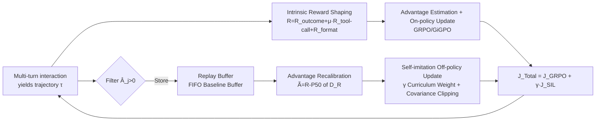

# Learn the Ropes, Then Trust the Wins: Self-imitation with Progressive Exploration for Agentic Reinforcement Learning

**Conference**: ICLR 2026  
**OpenReview**: [https://openreview.net/forum?id=Kssko33Ekq](https://openreview.net/forum?id=Kssko33Ekq)  
**Code**: Open-sourced (Tencent Youtu Lab, including Data & Checkpoints)  
**Area**: Reinforcement Learning / Agentic RL / LLM Tool Use  
**Keywords**: Self-imitation Learning, Progressive Exploration, Intrinsic Reward Shaping, Curriculum Scheduling, Multi-turn Tool Calling, Entropy Control  

## TL;DR
SPEAR employs "curriculum-scheduled self-imitation learning + intrinsic reward shaping" to enable agentic LLMs to explore boldly through tool interactions in early training and exploit successful experiences robustly in later stages. It achieves a progressive exploration-exploitation balance without relying on external expert demonstrations, adhering to the principle of "learning the ropes first, then trusting the results."

## Background & Motivation
**Background**: RL (especially the GRPO family) is the current mainstream paradigm for refining the tool-calling capabilities of LLM agents in long-horizon, sparse-reward tasks. The core difficulty lies in the exploration-exploitation trade-off. Existing works generally stimulate exploration from the perspective of **policy entropy**—where a decrease in entropy implies overconfidence and insufficient exploration—thus using various entropy regularizations to maximize entropy.

**Limitations of Prior Work**: Directly applying entropy regularization to LLM agents is fragile. In multi-turn interactions, environmental feedback continuously introduces low-probability tokens, causing severe **distribution shift**. Mechanical entropy maximization leads either to mode collapse or to continuous entropy growth and runaway divergence. While cold-start SFT or hybrid RL+SFT schemes are stable, they confine the policy within the SFT corpus, sacrificing the ability to discover new strategies.

**Key Challenge**: The agent must utilize pre-trained knowledge and past interactions to maximize rewards while exploring new behaviors through tool-integrated reasoning. Pure entropy control cannot dynamically schedule when to explore and when to exploit under multi-turn distribution shifts without falling into either collapse or uncontrolled divergence.

**Goal**: To answer a core question—can the transition from exploration to exploitation be smoothly scheduled **under the guidance of the policy's own experience**, without moving towards the extremes of entropy collapse or runaway divergence? The authors hypothesize that entropy should increase early on for extensive **skill-level exploration** (rapidly learning tool calls and trial-and-error), and then converge as training progresses toward **action-level exploration** (selecting more effective actions and stabilizing evolutionary paths after becoming familiar with the environment).

**Core Idea**: **[Progressive Self-imitation]** Based on vanilla self-imitation learning (SIL, which stores high-reward experiences in a replay buffer for off-policy updates), this work introduces **curriculum scheduling** to coordinate intrinsic reward shaping with self-imitation. It accelerates exploration via frequent tool interactions at the start and reinforces the exploitation of successful tactics upon convergence, thereby constraining policy entropy within a "dynamically controllable interval" that evolves over time.

## Method

### Overall Architecture
SPEAR (Self-imitation with Progressive Exploration for Agentic Reinforcement learning) is a plug-and-play curriculum RL recipe layered on top of base algorithms like GRPO, GiGPO, or Dr.BoT. The agent first interacts with the environment to produce trajectories; these trajectories undergo **intrinsic reward shaping** and advantage estimation for on-policy updates. Simultaneously, selected trajectories are stored in a **replay buffer** for off-policy updates via the **self-imitation** mechanism. The two paths cooperate: self-imitation maximizes the reuse of past successful experiences and expands the effective exploration space, while intrinsic rewards mitigate continuous uncertainty in multi-turn interactions. Three modifications targeting agent entropy dynamics—curriculum integration of skill/action-level exploration, advantage recalibration for off-policy data, and regularization for entropy stability—collectively realize the "learn the ropes, then trust the wins" strategy.

### Key Designs

**1. Self-imitation with Prioritized Experience Replay: Reusing only "better-than-baseline" trajectories.** SPEAR maintains an independent replay buffer $D=\{(\tau_j, R_j, \hat{A}_j)\}$, retaining only trajectories with positive advantages to encourage high-reward actions. The self-imitation objective is the GRPO objective multiplied by an indicator function $J^{SIL}_{GRPO}(\pi_\theta)=\mathbb{E}\sum_j J^j_{GRPO}\cdot \mathbb{1}(\hat{A}_j>0)$. Trajectories in the buffer come not only from the previous policy $\pi_{\theta_{old}}$ but also from earlier versions. This acts as a "walkthrough guide" for agents in sparse-reward, long-horizon tasks: when the early success rate is extremely low ($<15\%$), replaying successful trajectories allows the agent to quickly understand interaction logic and accumulate tactics, significantly reducing blind trial-and-error.

**2. Advantage Recalibration for Off-policy Drift.** Trajectories in the buffer originate from older policies. As the policy improves, the observed rewards of old trajectories become decoupled from the current policy. While vanilla SIL uses per-state experience rewards for upper-envelope projection to estimate advantages, and GRPO relies on group reward means (which still requires current policy sampling and extra computation), SPEAR maintains a **FIFO baseline buffer** $D_R=\{\bar{R}_j\}$. It uses the **50th percentile** $P_{50}(D_R)$ of the most recent $N_{D_R}$ trajectories as a conservative and robust estimate of the policy baseline. Following Dr.GRPO, it removes the intra-group standard deviation term, resulting in the recalibrated advantage $\tilde{A}^i_t = R_i - P_{50}(D_R)$. This provides three benefits: the baseline tracks policy changes, outdated experiences are filtered via the dual condition $\hat{A}_j>0\ \&\ \tilde{A}_j>0$, and difficulty bias from group normalization is mitigated. The updated off-policy objective applies PPO-style clipping to trajectories satisfying $\hat{A}_j>0\ \&\ \tilde{A}_j>0$.

**3. Curriculum Modulation of Intrinsic Rewards: Tool-calling rewards as a double-edged sword.** The authors found that without tool-calling rewards, agents quickly stop writing code due to negative feedback (missing imports, undefined variables, indentation errors). However, excessive tool-calling rewards stimulate infinite interaction loops that compete with outcome rewards, crowding the context and causing accuracy to fluctuate downward. SPEAR uses a composite reward $R_i = R^i_{outcome} + \mu\cdot R^i_{tool\text{-}call} + R^i_{format}$, where the tool-calling weight $\mu$ **decays over training steps**. This accelerates mastery of tool usage in early stages for rapid transfer to new distributions, while later decay prevents reward hacking and encourages the agent to focus on smarter actions to improve accuracy.

**4. Curriculum Experience Utilization and Covariance Clipping for Entropy Stability.** In the total objective $J_{Total}(\pi_\theta)=J_{GRPO}(\pi_\theta)+\gamma\cdot\tilde{J}^{SIL}_{GRPO}(\pi_\theta)$, the self-imitation term uses a **warm-up weight $\gamma$**. Early on, shifting the distribution toward diverse actions is more important than imitating limited solutions, so $\gamma$ is initially low and then increased, transitioning from skill-level to action-level exploration. Simultaneously, **covariance clipping** is introduced to exclude "overconfident tokens"—whose log-probabilities are highly correlated with advantage gains—from optimization. This prevents a few successful trajectories from being overfitted early, which would lead to entropy collapse and exploration contraction. This "curriculum scheduling + covariance clipping" is the key to SPEAR's steady growth on AIME compared to the stagnation of vanilla replay.

Furthermore, the authors packaged industry-validated RL tricks like DAPO and Dr.GRPO into a strong baseline **Dr.BoT** (Bag-of-Tricks version of GRPO) to prove that SPEAR's gains are not merely relative to a weak baseline.

## Key Experimental Results

### Main Results Table (ALFWorld & WebShop Success Rate, Qwen2.5-1.5B/7B-Instruct)

| Base Algorithm | ALFWorld (All) | WebShop (SR) |
|---|---|---|
| GRPO (1.5B) | 72.8 | 56.8 |
| + SPEAR | **88.9 (+16.1%)** | **77.5 (+20.7%)** |
| Dr.BoT (GRPO) | 79.1 | 62.9 |
| + SPEAR | 87.7 (+8.6%) | 76.8 (+13.9%) |
| GiGPO w/o std | 86.1 | 67.4 |
| + SPEAR | 91.2 (+5.1%) | 79.3 (+11.8%) |
| GRPO (7B) | 77.6 | 66.1 |
| + SPEAR | 85.2 (+7.6%) | 84.6 (+18.5%) |

SPEAR consistently provides gains across three types of base algorithms (GRPO/GiGPO/Dr.BoT) and two scales (1.5B/7B), with a maximum gain of +20.7% on WebShop.

### AIME24/25 Math Tool-Integrated Reasoning (Qwen2.5-32B / Qwen3-32B + Code Interpreter)

| Method | Context | AIME24 | AIME25 |
|---|---|---|---|
| Dr.BoT(GRPO) Qwen2.5-32B | 16K | 64.7 | 54.0 |
| + SPEAR | 16K | 66.3 (+1.6%) | **60.1 (+6.1%)** |
| Dr.BoT(GRPO) Qwen2.5-32B | 32K | 67.2 | 55.1 |
| + SPEAR | 32K | 71.0 (+3.8%) | 61.0 (+5.9%) |
| Dr.BoT(GRPO) Qwen3-32B | 32K | 82.5 | 77.3 |
| + SPEAR | 32K | 85.6 (+3.1%) | 80.5 (+3.2%) |

### Ablation Study Table (SI=Self-imitation, IR=Intrinsic Reward)

| Configuration | ALFWorld (All) | WebShop (SR) |
|---|---|---|
| GRPO (1.5B) | 72.8 | 56.8 |
| + SI | 77.3 (+4.5%) | 74.2 (+17.4%) |
| + SI + IR (SPEAR) | **88.9 (+16.1%)** | **77.5 (+20.7%)** |
| GRPO (7B) | 77.6 | 66.1 |
| + SI | 90.6 (+13.0%) | 83.4 (+17.3%) |
| + SI + IR (SPEAR) | 85.2 (+7.6%) | 84.6 (+18.5%) |

### Key Findings
- **Self-imitation is useful on its own**: When the early success rate is $<15\%$, replaying successful trajectories significantly accelerates convergence and prevents small models from mechanical trial-and-error (WebShop gains +17.4% with SI alone).
- **Intrinsic reward is a double-edged sword**: In AIME ablations, adding SI alone slightly decreases AIME24 performance (-0.9%) because replaying multi-tool-interaction samples causes interaction turns to explode, destabilizing training. Decaying intrinsic reward (IR) is necessary to learn tool usage without "spamming" long interactions.
- **Near-zero extra overhead**: The gains involve only 10%–25% theoretical complexity increase, while actual wall-clock time per step remains nearly unchanged, making it plug-and-play and scalable.

## Highlights & Insights
- **Shifting entropy control from "mechanical maximization" to "experience-guided progressive scheduling"**: Using the agent's own successful experiences as anchors avoids the dilemma of entropy regularization (collapse vs. divergence) under multi-turn distribution shifts. This approach aligns better with LLM agents than direct entropy bonuses.
- **The curriculum metaphor "Learn the ropes, then trust the wins" is apt**: The two curriculum curves—increasing $\gamma$ and decaying $\mu$—cleanly correspond to the transition from early skill-level exploration (learning tools) to late action-level exploration (picking the best actions in familiar environments).
- **Pragmatic Advantage Recalibration using P50 and removing std**: Resolves off-policy drift and group-normalized difficulty bias at minimal cost.
- **Extra Contribution of Dr.BoT**: Packaging industrial RL tricks into a strong baseline ensures that gains are not inflated against weak baselines, enhancing the credibility of the conclusions.

## Limitations & Future Work
- The authors acknowledge that entropy control still possesses **rigidity**: it relies on prior-based curriculum scheduling and covariance clipping, which may not be optimal for all tasks.
- Covariance clipping currently relies on bounded random sampling; future work could adapt this to be **token-probability dependent**.
- Experiments were primarily validated on ALFWorld, WebShop, and AIME with Qwen models. Generalization across more model families and open agent environments (e.g., real Web, GUI) remains to be tested.

## Related Work & Insights
- **RL Algorithm Spectrum**: PPO → GRPO (removing critic, using group baseline) → DAPO (dynamic sampling + clip higher) → Dr.GRPO (removing length/difficulty bias). SPEAR integrates these industrial tricks into the Dr.BoT baseline.
- **Self-imitation/Experience Replay**: Built upon SIL (Oh 2018), SAIL (off-policy extension), and GSIL, but identifies that vanilla SIL induces entropy collapse in agentic RL, thus proposing coordination with curriculum and intrinsic rewards.
- **Comparison of Exploration Methods**: Unlike traditional methods (curiosity-driven, count-based, skill discovery, entropy regularization), SPEAR abandons manual heuristics and relies entirely on the agent's own experience to reinforce effective patterns—offering a stable exploration path for multi-turn tool agent training.

## Rating
- **Novelty**: ⭐⭐⭐⭐ — The perspective of managing agent policy entropy via the coordination of self-imitation and intrinsic rewards through curriculum scheduling is novel. Advantage recalibration (P50 + removing std) is a practical innovation, although individual components (SIL, intrinsic reward, curriculum) are not new.
- **Experimental Thoroughness**: ⭐⭐⭐⭐ — Covers 3 task types, 2 model families, scales from 1.5B to 32B, and 3 base algorithms. Includes step-by-step ablations and overhead analysis. Lacks validation on more open environments and model families.
- **Writing Quality**: ⭐⭐⭐⭐ — The motivation progresses clearly (fragility of entropy control → progressive scheduling hypothesis). The "double-edged sword" discovery is well-articulated, and formulas complement figures effectively.
- **Value**: ⭐⭐⭐⭐ — Plug-and-play with near-zero overhead and significant gains for low-success-rate tasks. Direct practical value for industrial training of multi-turn tool agents.

<!-- RELATED:START -->

## Related Papers

- [\[ICLR 2026\] GEM: A Gym for Agentic LLMs](gem_a_gym_for_generalist_llms.md)
- [\[ICLR 2026\] Self-Harmony: Learning to Harmonize Self-Supervision and Self-Play in Test-Time Reinforcement Learning](self-harmony_learning_to_harmonize_self-supervision_and_self-play_in_test-time_r.md)
- [\[ICLR 2026\] One Life to Learn: Inferring Symbolic World Models for Stochastic Environments from Unguided Exploration](one_life_to_learn_inferring_symbolic_world_models_for_stochastic_environments_fr.md)
- [\[ICLR 2026\] TROLL: Trust Regions improve Reinforcement Learning for Large Language Models](troll_trust_regions_improve_reinforcement_learning_for_large_language_models.md)
- [\[ICLR 2026\] Unsupervised Learning of Efficient Exploration: Pre-training Adaptive Policies via Self-Imposed Goals](unsupervised_learning_of_efficient_exploration_pre-training_adaptive_policies_vi.md)

<!-- RELATED:END -->
