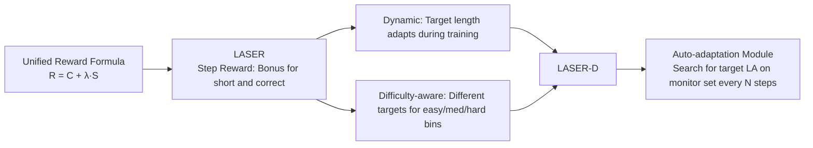

# Learn to Reason Efficiently with Adaptive Length-based Reward Shaping

**Conference**: ICLR 2026  
**arXiv**: [2505.15612](https://arxiv.org/abs/2505.15612)  
**Code**: [hkust-nlp/Laser](https://github.com/hkust-nlp/Laser)  
**Area**: Reinforcement Learning / Efficient Reasoning / Large Reasoning Models  
**Keywords**: Length Reward Shaping, Over-thinking, RL, CoT Compression, Difficulty-aware, Dynamic Target Length  

## TL;DR
Ours unify various RL methods for "compressing long reasoning chains" into a "Length-based Reward Shaping" framework. From this perspective, a step-wise reward LASER and its dynamic, difficulty-aware version LASER-D are proposed. Across five reasoning models (1.5B–32B), these methods simultaneously improve accuracy and token efficiency (e.g., +5.3 accuracy and -64% tokens on AIME24).

## Background & Motivation
**Background**: Large Reasoning Models (LRMs) like DeepSeek-R1 and Kimi-k1.5 learn to generate long CoTs via RL to solve complex problems. However, these long outputs are often redundant—generating thousands of tokens of "self-reflection" even for simple primary school math problems like "1+1=?", a phenomenon known as over-thinking. Recent effective compression techniques involve RL: introducing length-related penalties or rewards alongside correctness rewards to encourage models to be concise and accurate.

**Limitations of Prior Work**: Existing RL compression methods are categorized into three types, each with significant drawbacks. **Budget-based** methods provide fixed target lengths (e.g., L1, E1), but manual budgets are inherently sub-optimal—too tight for hard problems and too loose for easy ones; additionally, target distributions are sparse under large context windows, leading to unstable training rewards. **Adaptive** methods (dual-mode switching) let the model decide whether to "think" (e.g., Thinkless, AutoThink), but in practice, they often degenerate into an extreme mode where easy questions involve no thinking while hard questions remain verbose. **Full-mode** compression aims for efficiency across all difficulty levels (e.g., ThinkPrune, Kimi-k1.5), but it is difficult to increase accuracy while compressing; many such methods rely on multi-stage SFT.

**Key Challenge**: Almost no method can **simultaneously** achieve over 50% token reduction on hard problems (AIME), increase accuracy, and utilize single-stage training without extra SFT. The simplest "truncation baseline" (shortening the context window and penalizing over-length outputs) improves efficiency but severely harms performance on hard problems (AIME accuracy drops by 4–9.7 points) because it penalizes "long but correct" exploration as harshly as "incorrect" answers.

**Goal**: Follow the full-mode route to improve both reasoning efficiency and accuracy using a simple, single-stage, and principled method. **Core Idea**: ① **Unified Perspective**—incorporate truncation and various length rewards into a single formula to identify the essential differences between methods; ② **Step Reward LASER**—reward "short and correct" without penalizing "long but correct"; ③ **Dynamic Difficulty-aware LASER-D**—allow target lengths to evolve during training and be automatically allocated based on problem difficulty.

## Method

### Overall Architecture
Ours first express all RL length compression methods using a unified formula combining a "correctness term + length term," exposing the trade-offs in three design dimensions: correctness term $C$, control variable $\lambda$, and length reward $S$. Under this framework, the step reward LASER is proposed, which is then upgraded to LASER-D by adding "dynamic" and "difficulty-aware" layers. Training is conducted via online GRPO RL in a single stage without additional SFT.

### Key Designs
**1. Unified Length Reward Formula: Placing all methods on the same table.** Ours define the shaped reward as:
$$ \hat{R}(x,y) = C(y) + \lambda(y)\cdot S(y) $$
where $C(y)$ is the correctness term, $S(y)$ is the length reward, and $\lambda(y)$ is a switch controlling when the length reward is active. This formula distinguishes different approaches: vanilla truncation sets $C(y)=0$ and gives a negative reward $\rho$ for over-length (penalizing it like an error); ThinkPrune replaces a fixed target length $L_T$ with an iteratively adjusted $L_A$; group-based methods (Efficient Reasoning, Kimi) use relative length rankings within a group, but this often leads to "reward hacking"—models generate extremely short answers for easy questions, causing training accuracy to drop; budget-based methods (L1) use $-\alpha|L(y)-L_T|$ to penalize deviations, which mitigates hacking but causes reward oscillation in large windows. These insights naturally point toward improvements.

**2. LASER — Step reward, rewarding "short and correct" without penalizing "long and correct".** The primary issue with the truncation baseline is that it penalizes "long but correct exploration" as harshly as "incorrect" results, suppressing beneficial long reasoning. LASER adopts a step-wise approach: the length reward is $S(y) = \alpha\cdot \mathbb{I}(L(y)\le L_T)$, and $\lambda(y)=\mathbb{I}(R)$—**the length reward is activated only when the answer is correct**. Meanwhile, the context window is set much larger than the target length (e.g., 16384 vs. 4096), making actual truncation rare. Intuitively, LASER is similar to truncation but with one key difference: instead of cutting off long answers, it provides a bonus for "correct answers that do not exceed the target length." The coefficient $\alpha=0.5$ balances correctness and length, and the performance is robust to the choice of $\alpha$. This modification makes LASER the first method to significantly improve both accuracy and token efficiency on the challenging AIME24 benchmark.

**3. Dynamic LASER-D: Automatic evolution of target length.** While LASER uses a fixed target length, model reasoning behavior changes during training, necessitating an evolving optimal length. LASER-D replaces $L_T$ with a dynamic $L_A$, driven by an **Auto-adaptation Module**. A small monitor set $D_M$ of ~500 samples is sampled from the training data, and the target length is re-searched every $N$ steps (e.g., 20). The search is based on the **Expected Correct Responses** metric:
$$ \text{ECR}_d(l) = P_{l,d}\cdot C_d $$
where $P_{l,d}$ is the proportion of rollouts with length $\le l$ (empirical coverage), and $C_d$ is the minimum number of correct rollouts required for that difficulty level. For each difficulty, $L_A$ is the **minimum length that satisfies $\text{ECR}_d \ge 1$**—the shortest length expected to yield at least one complete correct answer. Anything shorter would harm accuracy; anything longer is redundant. Monitoring adds only ~3.5% computational overhead.

**4. Difficulty-aware LASER-D: Short for easy, long for hard.** Ours argue that length rewards should not encourage all problems to become shorter uniformly; they must be difficulty-aware. LASER-D categorizes each query into easy, medium, or hard bins based on the in-batch rollout accuracy (using $k/3$ and $2k/3$ thresholds for $k$ rollouts). Each bin maintains its own independent target length $L_A$. Difficulty assessment reuses the training rollout batch in real-time with negligible overhead. This results in a "fast and slow thinking" combination: trivial problems get direct answers, while hard problems retain sufficient reasoning budget. The entire mechanism is fully automated without manual scheduling.

## Key Experimental Results
**Setup**: Five LRMs (DeepSeek-R1-Distill-Qwen 1.5B/7B/32B, OpenReasoning-Nemotron-1.5B, DeepSeek-R1-Distill-Llama-8B), DeepScaleR 40K math data, GRPO online RL, $\alpha=0.5$. Evaluated on MATH500 / AIME2024 / AMC2023 / OlympiadBench.

### Main Results Table (1.5B, Accuracy % / Avg Tokens)

| Method | AIME Acc | AIME Tokens | Mean Acc (4 sets)| Mean Tokens |
|---|---|---|---|---|
| Original | 28.9 | 15956 | 56.9 | 10177 |
| T8192 (Truncate) | 24.8 | 4465 | 55.3 | 2915 |
| L1-Max-4096 | 20.0 | 1718 | 51.4 | 1245 |
| AutoThink (adaptive) | 34.6 | 9514 | 57.6 | 5581 |
| LAPO (full) | 29.3 | 8318 | 59.1 | 5581 |
| LASER (LT=8192) | 31.5 | 6589 | 60.2 | 4509 |
| **LASER-D (LT=4096)** | **34.2** | **5750** | **60.3** | **3520** |

LASER-D achieves 34.2% on AIME (+5.3 over original) while reducing tokens by 64%. On average, it reaches 60.3% accuracy using only 3520 tokens (compared to 10177). Adaptive methods like AutoThink save tokens but still use ~10k on AIME, failing to compress hard problems.

### Scale & Cross-Family (7B & 32B)

| Model/Method | AIME Acc | AIME Tokens | Mean Acc | Mean Tokens |
|---|---|---|---|---|
| 7B Original | 53.1 | 13414 | 73.3 | 8213 |
| 7B LASER | 54.4 | 6320 | 73.6 | 4158 |
| **7B LASER-D** | **58.3 (+5.2)** | **5379** | **75.4** | **3315** |
| 32B Original | 71.7 | 10335 | 80.9 | — |

On the 7B model, LASER-D increases AIME accuracy by 5.2 points and cuts tokens from 13414 to 5379. For 32B, accuracy remains stable due to training set saturation (>76%), but tokens are significantly reduced.

### Ablation Study

| Ablation Item | Conclusion |
|---|---|
| Remove difficulty-aware | Accuracy drops consistently across benchmarks, proving difficulty-based length adjustment is key. |
| Coeff $\alpha$ / Bin thresholds / ECR threshold | Performance remains stable and robust, showing the framework is not hyperparameter-sensitive. |

### Key Findings
- LASER is the first method to simultaneously increase accuracy and save tokens on AIME24; LASER-D further pushes the full-mode frontier.
- RL compression produces a truly "more concise reasoning pattern"—redundant "self-reflection" is significantly reduced rather than simply truncated.
- The combination of difficulty-awareness and dynamic target lengths is the core of achieving both high compression on hard problems and accuracy gains.

## Highlights & Insights
- **Methodological Value of a Unified Perspective**: The $\hat{R}=C+\lambda S$ formula incorporates truncation, group-based, budget, and LASER methods. It directly exposes why previous methods failed (e.g., truncation penalizing long-and-correct exploration, group-based hacking), allowing the improvements to be "derived" rather than guessed.
- **Minimalist Elegance of Step Reward**: The transition from truncation to LASER involves a simple change—"don't cut long answers; give a bonus to short ones, and only if they are correct"—yet it results in a qualitative leap.
- **Fully Automated Difficulty Adaptation**: The ECR≥1 criterion for "shortest correct length" has clear physical meaning. When combined with real-time in-batch difficulty estimation, it adds almost zero overhead (+3.5%) and requires no manual scheduling or multi-stage pipelines.

## Limitations & Future Work
- The experiments are concentrated on mathematical reasoning (DeepScaleR); the transferability to code, science, and general reasoning domains has not been fully verified.
- Accuracy gains on the 32B model are limited, which the authors attribute to training set saturation. More diverse and difficult data may be required to show further gains for LASER-D at scale.
- Difficulty binning uses rollout accuracy as a proxy, which might be unstable for questions with extremely low or high accuracy (sparse signals). Exploring continuous or more granular binning is a potential direction.
- Parameters like monitor set size, search interval $I$, and update frequency $N$ are still engineering hyperparameters; while proven robust, the system is not entirely parameter-free.

## Related Work & Insights
- **Three Schools of CoT Compression**: Budget-based (L1, E1, AnytimeReasoner), adaptive (Thinkless, AutoThink), and full-mode (ThinkPrune, Kimi-k1.5, LAPO). Ours belong to the full-mode school and express all three in a unified way.
- **Over-thinking Research**: Follows the critique of redundant reasoning in LRMs (Chen et al. 2025) but provides a trainable reward-side solution.
- **Insight**: Incorporating a family of empirical methods into a unified parameterized framework is an efficient paradigm for identifying improvements. The concept of "efficiency pressure only when correct" (conditional activation) can be extended to other multi-objective RL reward designs (e.g., Safety vs. Helpfulness, Conciseness vs. Completeness).

## Rating
- **Novelty**: ⭐⭐⭐⭐ Unified length reward framework + step reward + dynamic difficulty-awareness. The framework provides methodological contributions; individual innovations (step-reward, ECR criterion) are solid.
- **Experimental Thoroughness**: ⭐⭐⭐⭐ Five models (1.5B–32B), cross-family, four benchmarks, comparison with representatives of three schools, and comprehensive ablations on difficulty-awareness and robust hyperparameters.
- **Writing Quality**: ⭐⭐⭐⭐ Clear logical chain from truncation baseline to unified framework to LASER-D. Table 3's visual comparison of formulas is effective.
- **Value**: ⭐⭐⭐⭐ Single-stage, no SFT required, fully automated. Open-sourced models, code, and data provide direct practical value for building efficient industrial reasoning models.

<!-- RELATED:START -->

## Related Papers

- [\[ICLR 2026\] Learning to Reason Efficiently with Discounted Reinforcement Learning](learning_to_reason_efficiently_with_discounted_reinforcement_learning.md)
- [\[NeurIPS 2025\] Training Language Models to Reason Efficiently](../../NeurIPS2025/reinforcement_learning/training_language_models_to_reason_efficiently.md)
- [\[ICLR 2026\] Stop Unnecessary Reflection: Training LRMs for Efficient Reasoning with Adaptive Reflection and Length Coordinated Penalty](stop_unnecessary_reflection_training_lrms_for_efficient_reasoning_with_adaptive_.md)
- [\[ICLR 2026\] Causally Robust Reward Learning from Reason-Augmented Preference Feedback](causally_robust_reward_learning_from_reason-augmented_preference_feedback.md)
- [\[ICLR 2026\] TIPS: Turn-Level Information-Potential Reward Shaping for Search-Augmented LLMs](tips_turn-level_information-potential_reward_shaping_for_search-augmented_llms.md)

<!-- RELATED:END -->
