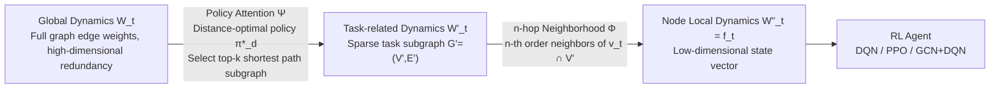

# Learning Dynamics Feature Representation via Policy Attention for Dynamic Path Planning in Urban Road Networks

**Conference**: ICLR 2026  
**OpenReview**: [https://openreview.net/forum?id=1E4Bltg6Xb](https://openreview.net/forum?id=1E4Bltg6Xb)  
**Code**: [https://anonymous.4open.science/r/UrbanDynamicPathPlanning-A59E](https://anonymous.4open.science/r/UrbanDynamicPathPlanning-A59E)  
**Area**: Reinforcement Learning / Dynamic Path Planning  
**Keywords**: Dynamic Path Planning, State Representation, Policy Attention, n-hop Neighborhood, Urban Road Networks, DQN/PPO  

## TL;DR
To address the dilemma in RL-based dynamic path planning where "global dynamic information is complete but expensive, while local dynamic information is efficient but misses key information," this paper proposes a hierarchical distillation approach. By using "Policy Attention to filter task-related subgraphs + n-hop neighborhoods to extract node-level local features," high-dimensional global dynamics are compressed into compact, approximately Markovian states, improving both speed and quality for any RL backbone.

## Background & Motivation
**Background**: Dynamic Path Planning (DPP) in urban road networks typically models the network as a directed weighted graph where edge weights $w(v_i,v_j;t)$ vary in real-time based on traffic conditions. Traditional approaches utilize statistical or deep models to predict future traffic followed by classical searches like A\* or D\* Lite on the predicted graphs. However, planning quality is strictly capped by prediction accuracy, often failing during unexpected events like accidents or road closures. Reinforcement Learning (RL) provides an alternative path: instead of explicitly modeling future dynamics, it embeds dynamics into the state and learns decision-making through interaction. The value function implicitly absorbs the statistical regularities of state transitions, making it more robust to unseen events.

**Limitations of Prior Work**: The success of RL for DPP depends almost entirely on "how to represent traffic dynamics $f_t$ in the state." Two categories of methods exist: global methods encode the entire graph's dynamics into the state, which provides complete information but suffers from dimensionality explosion and high computational costs (the overhead of graph methods like GCN scales linearly with graph size, making real-time planning in large cities impractical); local methods observe only partial dynamics around the agent, which is efficient but prone to missing non-local critical dynamics, leading to short-sighted, suboptimal routes.

**Key Challenge**: More critically, inadequate state representation destroys the Markov property—the current state cannot summarize all information needed for decision-making, leading to unstable training and performance degradation. Thus, dynamic feature design is caught between "sufficiency" and "compactness": it must preserve key dynamics relevant to decision-making while eliminating redundancy and controlling dimensionality.

**Goal**: Construct a state representation that is both computationally efficient and information-sufficient (approximately Markovian), allowing existing RL backbones (DQN/PPO/GCN+DQN) to be used "plug-and-play" with faster convergence and superior planning performance.

**Core Idea (Hierarchical Distillation of Global Dynamics)**: First, an offline pre-trained "shortest path expert" acts as policy attention to select task-related sparse subgraphs (nodes covered by top-k shortest paths) from the global graph. Second, at each decision step, an n-hop neighborhood further shrinks this subgraph into the local context of the current node. This two-stage filtering refines high-dimensional global dynamics $W_t$ into low-dimensional, node-dependent, and temporally predictable state vectors $W''_t$.

## Method

### Overall Architecture
DFR is built on a finite-step, deterministic MDP $M=(S,A,T,R,\gamma,H)$: the state $s_t=\{v_t,v_g,f_t\}$ consists of the current node, target node, and dynamic features $f_t$; the action is moving to a neighbor of the current node; the reward is the negative transition cost plus a constant bonus for reaching the target: $R(s_t,a_t,s_{t+1})=-c(v_t,v_{t+1};W_t)+b\cdot\mathbb{I}(v_{t+1}{=}{=}v_g)$. The core of the method is the design of $f_t$.

The Dynamics Feature Representation (DFR) formalizes the dynamic feature construction as a three-stage refinement chain: $W_{:T} \xrightarrow{\tau,\Psi} W'_{:T} \xrightarrow{v_t,\Phi} W''_{:T}$. Raw global dynamics $W_t$ (edge weights of the entire graph) are first compressed into a task-related subset $W'_t$ via a task-level mapping $\Psi$, then shrunken into local features $W''_t=f_t$ of the current node via a node-level mapping $\Phi$. $\Psi$ is instantiated by Policy Attention, and $\Phi$ by n-hop neighborhoods; both rely solely on fixed road network topology, allowing them to be pre-computed offline once and reused, thus adding almost zero overhead to online planning.

### Key Designs

**1. Policy Attention: Pruning task-irrelevant dynamics with a "Shortest Path Expert."** Global edge weights $W_t$ are high-dimensional and mostly irrelevant to the current source→goal task. DFR first trains a distance-only optimal policy $\pi^*_d$ to serve as a hard, pre-computable attention prior. This is done by removing the dynamic component $f_t$ from the MDP and setting the reward to $R_d(s,a,s')=-d(s,s')$ (where $d$ is the segment length), then solving the Bellman optimality equation to obtain $\pi^*_d$—equivalent to an RL version of a static shortest path planner. Given origin $v_t$ and destination $v_g$, $\pi^*_d$ identifies the top-k shortest paths ranked by length. The nodes and edges covered by these paths form a sparse subgraph $G'=(V',E')$, whose edge weights define the task-related dynamics $W'_t=\Psi(\tau,W_t)$, satisfying the sufficiency condition $\pi^*(v_t,v_g;W'_t)\approx\pi^*(v_t,v_g;W_t)$. Pure distance is used as attention because it is the most fundamental constraint in DPP and remains time-invariant as long as topology is fixed; thus, pre-training can be completed offline to provide a stable, interpretable subgraph reference. The parameter $k$ controls the trade-off between completeness and compactness—too small misses critical paths, while too large introduces redundancy.

**2. n-hop Neighborhood: Shrinking the task subgraph into "localized" context.** Even after global filtering, $W'_t$ may still be high-dimensional in large-scale networks. At each decision step, DFR centers on the current node $v_t$ and takes the intersection of its $n$-hop neighbors and the nodes in the policy attention subgraph: $V_l(v_t)=\bigcup_{i=0}^{n} N^i(v_t)\cap V'$. The edge weights between these nodes form the local dynamic feature $f_t=W''_t(v_t)=\{w(v_i,v_j;t)\mid v_i,v_j\in V_l(v_t)\}$, requiring $\pi^*(v_t,v_g;W''_t)\approx\pi^*(v_t,v_g;W'_t)$. $n$ determines the spatial scale of the local field—small $n$ captures highly localized dynamics but may miss broader context, while large $n$ increases dimensionality and computation. Since n-hop also relies only on fixed topology, it can be pre-computed offline, ensuring the refinement process does not impact online efficiency.

**3. PSR Theoretical Support: Ensuring compressed states remain approximately Markovian.** Why can a near-optimal policy still be learned after two stages of pruning? The paper draws on Predictive State Representations (PSR) to argue that a system's state can be defined by "predictions of future observable outcomes given an action sequence" without latent variables. From this perspective, $W''_t$ is a predictive representation—it encodes sufficient information to predict the effects of future actions, ensuring $\pi^*(v_t,v_g;W''_t)\approx\pi^*(v_t,v_g;W_{:T})$. Furthermore, the refinement process operates on the sequence structure $W_{:T}$ rather than single-frame snapshots. By filtering and aggregating temporally adjacent representations, DFR implicitly captures short-term temporal correlations (e.g., local congestion propagation, traffic flow continuity), allowing $W''_t$ to preserve decision-relevant information across both space and time, aligning with the Markov assumption and mitigating suboptimality under partial observability.

## Key Experimental Results

### Experimental Setup
- **Data**: Three urban road network subgraphs extracted from OpenStreetMap—Nanjing, Beijing Chaoyang, and Shanghai Pudong, modeled as directed weighted graphs. Dynamics are represented as "travel time." The objective is the minimum travel time path. Edge weights are modulated by a congestion factor $\beta\in[0.1,1.5]$: $c(v_i,v_j;W_t)=d(v_i,v_j)/(\nu_0\times\beta(v_i,v_j;t))$.
- **Backbones**: DQN (Value-based), PPO (Policy Gradient), and GCN+DQN (Graph features). Each was compared in two versions: "with DFR" vs. "AD (All Dynamics, using full graph dynamics)."
- **Metrics**: Mean GAP (relative cost difference from the ground-truth dynamic Dijkstra path, lower is better), Success Rate (SR, higher is better), Compactness Rate (CR, DFR dimension / original dimension, lower is better), and Planning Time (per-step planning latency, lower is better).
- **Training Config**: Adam (lr $10^{-3}$), $\gamma=0.99$, approx. 75,600 episodes (≈200 epochs), replay buffer $10^6$, batch 32, fixed episode length of 100 steps, $\epsilon$ decayed linearly from 1.0 to 0.1; network architecture consists of 64-dim embeddings + 2-layer MLP with 64-dim hidden units.

### Main Results
The authors summarized performance using the area of a triangle formed by $1-\text{GAP}$, SR, and $1-\text{CR}$. Across all algorithm settings, the DFR version's triangle area was significantly larger than the AD version:

| Dimension | Observation |
|------|------|
| Overall Performance | The DFR triangle area is consistently larger than the AD version across all backbones. |
| GCN Models | Under AD, SR is high but GAP is also high (insensitive to dynamics); DFR significantly improves sensitivity to dynamic changes. |
| Planning Latency | With DFR, average planning time is $8.18\pm1.74$ ms for DQN/PPO and $27.26\pm6.8$ ms for GCN+DQN. |
| Speedup | Compared to DQN+AD / GCN+DQN+AD / PPO+AD, DFR achieves gains of **85.59% / 46.08% / 79.32%** respectively. |

### Ablation Study
A grid search was performed on the Nanjing subgraph for $k$ (ratio of top-100 shortest paths selected, $-1.0$ indicates Policy Attention disabled) and $n$ (neighborhood order, $-1$ indicates no hop selection):

| Configuration | Mean GAP | SR | Description |
|------|----------|----|----|
| Baseline ($k{=}{-}1.0, n{=}{-}1$) | 0.170 | 0.884 | DQN+AD, full dynamics without compression |
| $k{=}0.6, n{=}1$ | 0.151 | 0.723 | $n$ too small, insufficient local context |
| $k{=}0.6, n{=}2$ | 0.118 | 0.867 | Significant improvement as $n$ increases |
| $k{=}0.6, n{=}4$ | 0.113 | 0.892 | Diminishing returns; curves begin to converge |
| $k{=}0.4, n{=}4$ | 0.095 | 0.908 | CR <5.7% for all $n{=}4$ configurations |

### Key Findings
- DFR significantly compresses dimensionality (CR generally <5.7%) while reducing Mean GAP from 0.170 to 0.095 and increasing SR from 0.884 to 0.908, proving that "Policy Attention for global relevance + n-hop for local dependency" are complementary.
- The impact of $n$ is monotonic and predictable—gains saturate after a "convergence boundary." The impact of $k$ is more complex and non-monotonic (at $n{=}4$, increasing $k$ from 0.4 to 0.6 actually increased GAP and decreased SR). For large-scale deployment, "moderate $k$ + smaller $n$" is recommended, identifying the convergence boundary for $n$ before tuning $k$.
- Speedup stems from "online sampling of dynamics only on small pre-computed subgraphs" rather than sacrificing quality for speed—confirmed by the simultaneous decrease in GAP/CR and increase in SR, showing that structural representation learning and dynamic feature compression are complementary rather than mutually exclusive.

## Highlights & Insights
- **"Feature Selection" as Pre-computable Topological Prior**: Both Policy Attention and n-hop rely solely on fixed road network topology, making the two-stage compression entirely offline with zero extra online overhead—a key engineering insight for efficiency.
- **Shortest Path Expert as "Hard Attention"**: Unlike the soft attention in Transformers, $\pi^*_d$ is a pre-computed hard attention providing a strong, interpretable prior. It drastically prunes the problem dimension before the RL agent even begins learning, similar in spirit to knowledge distillation.
- **PSR Perspective as Theoretical Safety**: Using Predictive State Representations to prove that $W''_t$ remains a sufficient statistic ensures the "completeness" of shrunken states, rather than relying solely on empirical tuning.
- **Plug-and-Play**: DFR is an modification to the state representation layer, compatible with DQN, PPO, and GCN+DQN without being tied to a specific RL algorithm.

## Limitations & Future Work
- **Manual $k, n$ Selection**: The two core hyperparameters rely on manual grid search, and the non-monotonic impact of $k$ makes tuning difficult, limiting "out-of-the-box" utility for massive real-world networks. Adaptive mechanisms for $k, n$ are proposed for future work.
- **Limited Experimental Scale**: Ablations were performed on a single Nanjing subgraph, and city subgraphs were sampled using a radius from a center point, lacking validation on full-scale mega-city networks.
- **Limitations of Distance Prior**: Policy Attention uses distance alone; if optimal time paths deviate significantly from shortest distance paths (e.g., bypasses due to chronic congestion), the top-k shortest distance subgraph might miss critical edges.
- **Lack of Comparison with Traditional/Predictive Planners**: The study focuses on DFR gains within the RL paradigm and does not compare against "prediction + classical search" methods, making it hard to judge absolute SOTA standing.

## Related Work & Insights
- **Path Planning**: Classical searches like A\* and D\* Lite rely on static cost graphs and do not adapt well to highly dynamic networks. Learning-augmented methods (predict then search) are limited by prediction accuracy and fragile to distribution drift. DFR follows the RL path, avoiding explicit prediction.
- **State Representation**: Existing RL-DPP work either sacrifices global optimality for local views or suffers from computational explosion with global views. GNNs encode the full graph but overhead scales with size. DFR's hierarchical refinement follows the logic of feature decorrelation, offering a balanced solution.
- **Attention Mechanisms**: Compared to soft attention in Transformers, the Policy Attention here is a hard, pre-computed attention based on task structural semantics, providing an interpretable dimensionality reduction prior for injecting domain structure into RL states.

## Rating
- **Novelty**: ⭐⭐⭐⭐ — The combination of "Shortest path expert for hard attention + n-hop contraction + PSR theoretical backing" is a clear and well-supported new solution for RL-DPP state representation, even if individual components are not entirely new.
- **Experimental Thoroughness**: ⭐⭐⭐ — Includes three real-world city networks, three backbone comparisons, and $k/n$ grid ablations. Speedup numbers are impressive, but lack of comparison with non-RL planners and small subgraphs are limiting factors.
- **Writing Quality**: ⭐⭐⭐⭐ — Problem motivation, three-stage refinement formalization, and PSR argumentation flow logically. Illustrations are clear, though some notation (e.g., $t$ in graph theory vs. MDP) requires careful reading.
- **Value**: ⭐⭐⭐⭐ — Plug-and-play, zero online overhead, and 46%–86% speedup provide direct engineering value for real-time dynamic planning in logistics and smart cities; potential is even higher once adaptive $k/n$ is addressed.

<!-- RELATED:START -->

## Related Papers

- [\[ICLR 2026\] GRACE: Generative Representation Learning via Contrastive Policy Optimization](grace_generative_representation_learning_via_contrastive_policy_optimization.md)
- [\[ICLR 2026\] Offline Reinforcement Learning with Adaptive Feature Fusion](offline_reinforcement_learning_with_adaptive_feature_fusion.md)
- [\[ICLR 2026\] On-Policy RL Meets Off-Policy Experts: Harmonizing Supervised Fine-Tuning and Reinforcement Learning via Dynamic Weighting](on-policy_rl_meets_off-policy_experts_harmonizing_supervised_fine-tuning_and_rei.md)
- [\[ICLR 2026\] Stackelberg Coupling of Online Representation Learning and Reinforcement Learning](stackelberg_coupling_of_online_representation_learning_and_reinforcement_learnin.md)
- [\[ICLR 2026\] 3D-aware Disentangled Representation for Compositional Reinforcement Learning](3d-aware_disentangled_representation_for_compositional_reinforcement_learning.md)

<!-- RELATED:END -->
