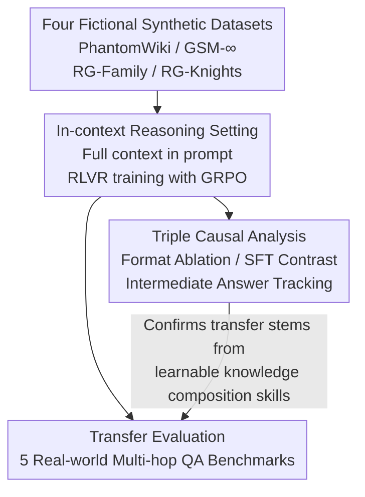

# Learning from Synthetic Data Improves Multi-hop Reasoning

**Conference**: ICLR 2026  
**arXiv**: [2603.02091](https://arxiv.org/abs/2603.02091)  
**Code**: [GitHub](https://github.com/kilian-group/phantom-reasoning)  
**Area**: LLM Reasoning/Reinforcement Learning  
**Keywords**: Synthetic Data, Multi-hop Reasoning, RLVR, Knowledge Composition, Virtual Worlds

## TL;DR
It is discovered that RLVR training on synthetic data generated from completely fictional rules significantly improves LLM performance on real-world multi-hop reasoning tasks (Qwen3-0.6B improves by 56%-131%). This occurs because the model learns the general reasoning skill of knowledge composition rather than memorizing factual knowledge.

## Background & Motivation

**Background**: RLVR utilizes verifiable rewards to train LLM reasoning capabilities, achieving significant progress in fields such as mathematics and programming. However, RLVR relies on large amounts of high-quality verifiable data—manual annotation is expensive, and LLM-generated synthetic data suffers from hallucinations and high costs.

**Limitations of Prior Work**: (1) High-quality training data is scarce and expensive; (2) LLM-generated synthetic data inherits verification difficulties and pre-training knowledge contamination; (3) Synthetic data generated by rules is semantically simple and entirely fictional, leaving it questionable whether it can teach useful skills.

**Key Challenge**: There is a massive gap between PhantomWiki questions like "Who is the nephew of the friend of the person whose hobby is birdwatching?" and HotpotQA's "Aside from Yodobashi, what other towns were merged into..."—fictional simple templates vs. real complex language. Transfer from the former to the latter is not obvious.

**Key Insight**: It is hypothesized that the core of multi-hop reasoning is "knowledge composition"—the ability to link multi-step information—which is a domain-agnostic skill. Zero knowledge overlap in a fictional world means the model cannot take shortcuts via memory and must learn the composition operation itself.

**Core Idea**: Rule-based fictional synthetic data teaches LLMs the general skill of knowledge composition through RLVR, which can be transferred to real-world multi-hop reasoning in a cost-free and infinitely scalable manner.

## Method

### Overall Architecture
The paper addresses a direct question: If RLVR is performed only on completely fictional synthetic problems generated by rule templates, can the model transfer these abilities to real-world multi-hop reasoning tasks? To this end, the workflow adopts a two-stage "Synthetic Domain Training → Real Domain Evaluation" approach. First, RLVR training using GRPO is conducted on 4 rule-generated synthetic datasets (PhantomWiki / GSM-∞ / RG-Family / RG-Knights). Then, the trained model is directly evaluated on 5 real-world multi-hop QA benchmarks to measure transfer effects. The training covers 4 models across the Qwen3 and Phi-4 families ranging from 0.6B to 4B, without any exposure to real annotated data. Finally, a set of control experiments is used to firmly establish the causal chain that "transfer stems from learnable knowledge composition skills rather than other superficial factors."

### Key Designs

**1. Multi-style Fictional Synthetic Datasets: Blocking "Memory Shortcuts" with Zero Knowledge Overlap**

To ensure synthetic data teaches reasoning rather than memory, the model must be prevented from relying on facts memorized during pre-training. The paper selects four rule-generated datasets with distinct reasoning styles but all based on fictional worlds: PhantomWiki features multi-hop QA for fictional characters generated via templates and context-free grammars (1–9 hops); GSM-∞ consists of infinite math word problems reverse-engineered from random computational graphs (2–20 steps); RG-Family requires inferring relationships in a family tree (logical reasoning); RG-Knights involves Knights and Knaves logic puzzles. These cover different reasoning paradigms like relationship chains, arithmetic chains, and logic chains, but share the commonality that the worlds are entirely fictional with zero real-world knowledge overlap—the model can memorize neither the answers nor the intermediate facts, forcing it to learn the operation of "linking multi-step information."

**2. In-context Reasoning Setting: Eliminating Knowledge Retrieval as a Variable**

To prove that transfer comes from "knowing how to compose" rather than "happening to retrieve accurately," knowledge retrieval must be controlled. The paper utilizes an in-context setting: all relevant context is placed directly in the prompt—PhantomWiki includes all 25 articles, and GSM-∞ includes the full problem description. The model uses an `<answer>` tag to box the final answer for extraction. Since all facts are presented, the model does not need to recall anything; the evaluation measures purely the "multi-hop composition" reasoning ability on the given information.

**3. Triple Causal Analysis: Firmly Establishing "Why Transfer Occurs"**

Positive transfer is easy to observe but difficult to distinguish from trivial causes. The paper uses three control groups to solidify the causal chain: First is format ablation, where RLVR is performed only on the `<answer>` output format; Qwen3 and Phi showed no improvement, indicating they already knew the format and transfer did not come from learning it. Second is SFT contrast; using SFT on the same synthetic data improved performance on synthetic tasks but failed to transfer to real tasks, indicating SFT only fits surface patterns while RL learns transferable skills. Third is intermediate answer analysis; the frequency of correct intermediate answers generated by the model increased monotonically during training—directly observing the "knowledge composition" capability growing during training rather than existing from the start.

### Loss & Training
- GRPO (without KL penalty), based on Hugging Face TRL v0.21.0.
- PhantomWiki uses F1 reward (to handle multi-answer scenarios), while other datasets use binary rewards based on exact matching.
- 10K training samples, mixing multiple difficulty levels.

## Key Experimental Results

### Main Results
Qwen3-0.6B + PhantomWiki Training → Real Benchmarks:

| Benchmark | Base F1 | +PhantomWiki | Relative Gain |
|-----------|---------|--------------|---------------|
| HotpotQA  | 0.36    | 0.73         | +103%         |
| 2WikiMQA  | 0.37    | 0.86         | +132%         |
| MuSiQue   | 0.14    | 0.28         | +100%         |
| CofCA     | Low     | Significant ↑| +56-131%      |
| SynthWorlds| Low    | Significant ↑| +Massive      |

### Ablation Study

| Configuration | Synthetic Task | Real Task | Description |
|---------------|----------------|-----------|-------------|
| RLVR on PhantomWiki | ✓ Gain | ✓ Transfer | Full approach |
| SFT on PhantomWiki | ✓ Gain | ✗ No Transfer | SFT overfits patterns |
| Format-only RLVR | ✗ No Help | ✗ No Help | Model already knows format |
| More Synthetic Data | Continuous ↑ | Continuous ↑ | No signs of overfitting |

### Key Findings
- All four types of synthetic data produce positive transfer, with PhantomWiki (most aligned with the target task) performing best.
- SFT improves synthetic task performance but does not transfer → RL indeed teaches general skills, while SFT only teaches patterns.
- The model generalizes to fictional held-out worlds and OOD difficulties → proving the acquisition of transferable composition skills.
- Performance grows monotonically with the number of synthetic samples without overfitting → synthetic data is a scalable resource.
- The number of correct intermediate answers increased during training → emergent grounded reasoning.

## Highlights & Insights
- **The Ultimate "Free Lunch"**: Entirely independent of real data, LLM labeling, or GPU-heavy generation—infinite training data can be generated using templates on a standard computer, significantly boosting real reasoning capabilities.
- **The SFT vs. RL Watershed**: For the same synthetic data, SFT overfits the surface patterns of the synthetic task, whereas RL teaches deep composition skills. This is strong evidence of the independent value of RL.
- **Knowledge Composition as an Independent Skill**: The paper clearly separates the ability to "know facts" from the ability to "compose facts," proving the latter can be learned independently. This challenges the view that "RL only activates pre-trained knowledge."

## Limitations & Future Work
- A gap between real and synthetic tasks remains—RLVR on real data still yields better results.
- Only validated on 0.6B-4B models; transfer patterns might differ for larger models.
- Multi-hop reasoning is a relatively simple reasoning type; transfer for more complex reasoning (e.g., mathematical proofs) remains to be verified.
- Optimal difficulty distribution and mixing strategies for synthetic data have not been explored in depth.

## Related Work & Insights
- **vs. Real Data RLVR**: Real data is more effective but expensive; synthetic data is free and infinitely scalable, making them complementary.
- **vs. LLM-Distilled Synthetic Data**: LLM-generated data is expensive and carries contamination risks, whereas rule-generated data is clean and free.
- **vs. STILL/ART etc.**: Previous work used synthetic data for evaluation; this paper is the first to systematically prove synthetic-to-real transfer.

## Rating
- Novelty: ⭐⭐⭐⭐⭐ The discovery of transfer from fictional synthetic data to real reasoning is of significant importance.
- Experimental Thoroughness: ⭐⭐⭐⭐⭐ Extremely thorough with 4 models × 4 synthetic datasets × 5 real benchmarks × various ablations.
- Writing Quality: ⭐⭐⭐⭐⭐ Clear logical chain and rigorous causal analysis.
- Value: ⭐⭐⭐⭐⭐ Opens a new paradigm for improving LLM reasoning using free synthetic data.

<!-- RELATED:START -->

## Related Papers

- [\[AAAI 2026\] MMhops-R1: Multimodal Multi-hop Reasoning](../../AAAI2026/reinforcement_learning/mmhops-r1_multimodal_multi-hop_reasoning.md)
- [\[ICLR 2026\] Controllable Exploration in Hybrid-Policy RLVR for Multi-Modal Reasoning](controllable_exploration_in_hybrid-policy_rlvr_for_multi-modal_reasoning.md)
- [\[ICLR 2026\] Towards High Data Efficiency in Reinforcement Learning with Verifiable Reward](towards_high_data_efficiency_in_reinforcement_learning_with_verifiable_reward.md)
- [\[ICLR 2026\] R-Zero: Self-Evolving Reasoning LLM from Zero Data](r-zero_self-evolving_reasoning_llm_from_zero_data.md)
- [\[ICLR 2026\] Scheduling Your LLM Reinforcement Learning with Reasoning Trees](scheduling_your_llm_reinforcement_learning_with_reasoning_trees.md)

<!-- RELATED:END -->
