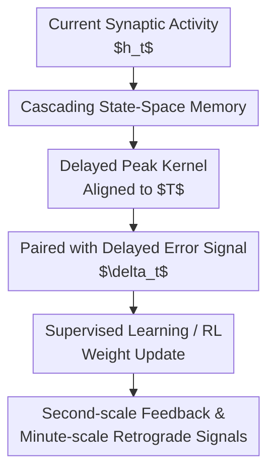

# Learning From the Past with Cascading Eligibility Traces

**Conference**: ICLR2026  
**OpenReview**: [https://openreview.net/forum?id=yQ7ssakeKM](https://openreview.net/forum?id=yQ7ssakeKM)  
**Code**: https://github.com/avecplezir/CET  
**Area**: Reinforcement Learning / Biologically Plausible Credit Assignment  
**Keywords**: [Eligibility Traces, Delayed Credit Assignment, Reinforcement Learning, Biologically Plausible Learning, State-Space Models]

## TL;DR
This paper generalizes traditional exponentially decaying eligibility traces into cascading eligibility traces (CET) composed of multiple stages connected in series. This allows synaptic memory to peak near a specified delay $T$, thereby more accurately attributing error signals to past activity in scenarios involving second-scale behavioral feedback and minute-scale retrograde axonal signals.

## Background & Motivation
**Background**: Eligibility traces are classic tools for processing delayed feedback in reinforcement learning and neural plasticity. Within frameworks such as three-factor learning rules, reward-modulated Hebbian learning, and actor-critic, systems typically store past synaptic activity as a trace that decays over time, which is then used to update weights when rewards, errors, or modulatory signals arrive. This approach is well-suited for cases where "feedback arrives immediately or with few intervening events" and explains many synaptic plasticity experiments on behavioral timescales.

**Limitations of Prior Work**: Delays in real biological learning are not always close to zero. Motor actions may have visual feedback delays of tens to hundreds of milliseconds, rewards may appear after several seconds, and more extremely, retrograde axonal chemical signals may take minutes to travel from the synapse back to the cell body. The kernel of a traditional eligibility trace is exponentially decaying, where the maximum weight is always assigned to the most recent activity. If the delay is fixed at a non-zero value, the activity at time $t-T$ should be attributed; however, exponential traces conflate this with many irrelevant activities near $t$. When inputs change frequently, tasks are non-i.i.d., or networks are deep, this temporal aliasing can bias the gradient direction.

**Key Challenge**: Delayed credit assignment requires two seemingly conflicting properties. On one hand, synapses need to use local, online, low-cost states to store past activity rather than simply buffering the entire history. On the other hand, when a learning signal arrives, it is desirable to read only a narrow window of past time, ideally being as precise as the ideal delay kernel $\delta(t-T)$. Exponential eligibility traces satisfy the former but not the latter: they are cheap but not "punctual."

**Goal**: The authors aim to answer a specific question: if internal synaptic memory is viewed as a biochemical reaction cascade rather than a single decaying variable, can a locally implementable eligibility trace be obtained that aligns with a fixed delay? Under this question, the paper further tests three things: whether CET can withstand second-scale delays in supervised learning; whether it can improve delayed actor updates in RL; and whether it can support the hypothesis of minute-scale, layer-by-layer cumulative retrograde signals.

**Key Insight**: The authors start from biochemical cascades. Many synaptic processes are not single decaying variables but rather pass through kinase cascades, phosphorylation chains, or enzymatic reaction layers. If an input first enters the first state and then propagates through subsequent states, the final state will naturally peak after some time. The more states there are, the narrower the peak, making it closer to a delayed memory.

**Core Idea**: Replace single-exponential eligibility traces (ET) with Cascading Eligibility Traces (CET) composed of $n$ series-connected states. This ensures the eligibility trace kernel peaks near the target delay $T$, thereby reducing temporal aliasing in delayed credit assignment.

## Method

### Overall Architecture
The proposed method can be viewed as a redesign of the "what the synapse stores" step. For each weight, the system no longer maintains a single exponentially decaying variable but instead maintains a sequence of local states. Current Hebbian-like activity is first written to the first state and then passed stage-by-stage with the same decay rate to the final state. When a delayed error or TD signal arrives, the update is not multiplied by the current activity but by the final CET output, which approximately represents the activity from $T$ seconds ago.

In supervised learning, the paper starts from standard gradient updates. If neuronal activity is $z_t=f(x_t^\top w)$, the negative gradient of the loss with respect to weights is $-\delta_t f'(x_t^\top w)x_t$. When a delay occurs, the $\delta_t$ received at time $t$ should actually be paired with the input term at $t-T$, while an online system only sees the current input. The role of CET is to use a local state variable to approximately store $f'(x_{t-T}^\top w)x_{t-T}$.

In reinforcement learning, the authors embed CET into an actor-critic framework. The Critic is still updated using standard backpropagation, while the policy-gradient part of the Actor uses ET/CET to approximate the delayed version of $\nabla_\theta \log \pi_\theta(a_t|s_t)$, which is then combined with the TD error or $\lambda$-return. This setup focuses the research on "which eligibility trace better preserves the correct update direction after the actor's credit assignment signal is delayed."

The paper constructs two specific delay scenarios. The first is on the behavioral timescale: each input lasts about 200ms, with delays ranging from 0.2s to several tens of seconds, where the error signal is broadcast to all layers simultaneously. The second is the retrograde axonal signal timescale: single-layer propagation takes about 2 minutes, where earlier layers receive signals later, forming layer-by-layer stacked delays. The latter is a more radical biologically plausible hypothesis used to test if CET is sufficient to allow very slow chemical signals to participate in credit assignment.

### Key Designs
**1. Cascading State-Space Eligibility Traces: From "Recent Activity Max" to "Target Delay Max"**

Traditional eligibility traces can be written as $h^{ET}_t=\int_0^t e^{-\gamma(t-s)}h_s ds$, which involves convolving past activity with an exponential kernel. Its advantages are being local, online, and inexpensive; its disadvantage is that the kernel is largest at $s=t$, so irrelevant recent events receive higher weights than the truly relevant $t-T$ activity when the delayed signal arrives. CET expands this single-state system into a sequence of states: $\dot h^1_t=-\alpha h^1_t+h_t$, $\dot h^k_t=-\alpha h^k_t+h^{k-1}_t$, with the final stage $h^{CET}_t$ used as the eligibility trace.

The closed-form kernel for this cascade is $h^{CET}_t=\frac{1}{(n-1)!}\int_0^t (t-s)^{n-1}e^{-\alpha(t-s)}h_s ds$. By setting $\alpha=(n-1)/T$, the peak of the kernel $g(\tau)\propto \tau^{n-1}e^{-\alpha\tau}$ falls near $\tau=T$. This is the crux of the paper: it does not store the full history but uses a Gamma-like delay kernel to make the synapse most sensitive at the moment it "should be read." When $n=1$, it degrades to classic ET; as $n$ increases, the peak becomes narrower and temporal resolution higher.

**2. Controlling Temporal Precision via State Count: Complex Tasks Fear Temporal Aliasing**

The number of states in CET is not a decorative hyperparameter but the primary knob for controlling kernel width. A two-state CET can already produce a non-zero delay peak, but the window remains wide; six or ten states push the mass more central to the target delay. Laplace-domain analysis in the paper shows that as $n$ increases, the Laplace transform of the normalized kernel point-wise approaches $e^{-sT}$, the form of an ideal delay operator. Intuitively, CET is not "remembering everything from the past" but is approximating a fixed delay using a low-pass, finite-state approach.

This explains a recurring phenomenon in the experiments: simple, nearly i.i.d. tasks like MNIST are more tolerant of temporal aliasing, where classic ET still works under 1-2s delays. More complex tasks like CIFAR-10, TinyImageNet, and MinAtar/SpaceInvaders have richer input spectra, where incorrectly mixing adjacent moments hurts the gradient direction more. Thus, higher CET state counts lead to higher cosine similarity between CET gradients and true backprop gradients, as well as more stable test performance. The value of this design is not just in raising final scores but in providing a normative explanation for "why high-order biochemical cascades may be significant for learning."

**3. Two Delay Models: Covering Broadcast Feedback and Layer-wise Accumulated Slow Signals**

The authors do not just test CET on a convenient delayed-feedback benchmark but split delays into two mechanisms that are very different in neural learning. Behavioral timescale experiments assume the $\delta$ signal can be broadcast to all layers simultaneously, which aligns with Direct Feedback Alignment, local three-factor rules, or neuromodulatory signals. Here, every layer faces the same delay, and CET primarily solves the problem of "signals arriving late but not getting later with depth."

The retrograde axonal experiment is more demanding. If error information travels slowly backward along synapses and axons, waiting an additional $T$ for every layer it crosses, the last layer has almost no delay, the second-to-last layer has a 2-minute delay, and earlier layers might have 4 or 6-minute delays. The paper also adds salience gating: only the top 1.25% of high-loss samples enter CET to reduce the number of events that need to be stored within long time windows. This setup acknowledges that "minute-scale delays + dense input" is inherently too difficult, using the idea of surprise / prediction error triggering plasticity to sparsify events.

**4. Testing Mechanisms via Gradient Alignment: Looking at Update Directions, Not Just Scores**

The core promise of delayed eligibility traces is improved credit assignment, so looking only at accuracy or return is insufficient. The authors additionally calculate the cosine similarity, $a^\top b/(\|a\|\|b\|)$, between weight update vectors generated by ET/CET and true backprop gradients. If CET truly reduces temporal aliasing, it should not only yield higher task scores but also make approximated gradients closer to the ground truth.

Experimental results generally support this chain of logic. For CIFAR-10 with 1s, 2s, and 4s delays, high-order CET shows higher average cosine similarity than ET, with the gap being clearer at shorter delays. In retrograde signal experiments, alignment decreases in earlier layers due to longer delays; however, within the same layer, higher-order CET is usually closer to the true gradient than lower-order CET. This diagnostic is crucial as it elevates "CET's usefulness" from empirical score improvement to the specific mechanism of credit assignment.

### Mechanism Example
Imagine an online classification network receiving an image every 200ms. An image enters the network at time $t_0$, but the error signal does not arrive until 2s later. This means before the error arrives, the network has processed about 10 time steps. Traditional ET would give high weights to activities from the most recent images, while the activity from $t_0$ would have decayed significantly. If these 10 inputs have different labels and gradient directions, the updates produced by traditional ET would conflate the responsibilities of multiple images.

CET(10) behaves differently. The Hebbian-like activity from $t_0$ enters the 1st state and flows toward the 10th state; the authors tune $\alpha$ so the final stage peaks at around 2s. When $\delta_{t_0}$ arrives, the final stage state happens to represent primarily the activity around $t_0$, rather than the input that just appeared. Thus, the weight update is closer to the ideal update of "this image caused this error then."

In RL, this can be understood similarly. An actor chooses action $a_t$ in state $s_t$, and the reward and TD error become available after some time. CET stores not the full trajectory, but the trace of the policy-gradient factor corresponding to each parameter as it flows through the cascade. When the TD error arrives, the update uses the delay-aligned trace instead of the gradient of the current action. This prevents delayed actor updates from incorrectly holding subsequent actions responsible for past rewards.

### Loss & Training
Supervised learning experiments use cross-entropy loss and AdamW. In visual tasks, the authors treat the batch dimension as the time dimension, using matrix convolutions to efficiently calculate CET outputs; the behavioral timescale experiment uses a batch size of 128, while the retrograde timescale experiment uses a batch size of 1280, keeping only top 1.25% loss samples as salient events. MNIST uses a three-layer MLP, CIFAR-10 uses a small CNN, and TinyImageNet experiments in the appendix use a modified ResNet-20.

Reinforcement learning experiments use actor-critic. The Critic is updated using standard $\lambda$-returns, and the Actor uses RL eligibility traces. For ET, the decay factor $\beta$ is tuned over candidate values; for CET, output normalization can use either area or peak normalization. CartPole and LunarLander use a three-layer MLP with state inputs, while MinAtar/SpaceInvaders uses pixel inputs and a CNN. The paper reports the mean over 3 seeds, with standard deviations and main hyperparameters provided in the appendix.

The temporal assumptions in the retrograde axonal experiment are more specific. In visual tasks, each single layer propagates retrograde signals for about 2 minutes, accumulating across layers. In RL, for simplification, a single step is counted as 300ms, with the second layer delayed by 400 frames and the first layer by 800 frames. The authors also assume that the derivative of the activation function is available at the appropriate delay; the appendix further uses extra CETs or reused CETs to approximate ReLU derivatives as a more biologically plausible preliminary version.

## Key Experimental Results

### Main Results
The following table extracts behavioral timescale results that best illustrate the findings. On simple MNIST, ET can still basically learn at 2s; on CIFAR-10, the advantage of high-order CET is more pronounced at the same delay, indicating that complex visual streams rely more on precise time windows.

| Task | Delay | ET / CET(1) | CET(2) | CET(6) | CET(10) | Backprop |
|------|------|-------------|--------|--------|---------|----------|
| MNIST test accuracy | 4s | 0.95 | 0.97 | 0.98 | 0.98 | 0.99 |
| MNIST test accuracy | 10s | 0.89 | 0.91 | 0.95 | 0.97 | 0.99 |
| CIFAR-10 test accuracy | 2s | 0.62 | 0.66 | 0.74 | 0.77 | 0.81 |
| CIFAR-10 test accuracy | 10s | 0.47 | 0.53 | 0.57 | 0.60 | 0.81 |

Reinforcement learning results also exhibit the trend where "longer delays make state count more important." CartPole and LunarLander are relatively simple and may maintain usable performance even with long delays; SpaceInvaders is a pixel-based, non-i.i.d., more complex sequential task where CET outperforms ET but still has a significant gap compared to zero-delay backprop.

| Environment | Delay | ET / CET(1) | CET(2) | CET(5) | CET(8) | CET(10) | Backprop |
|------|------|-------------|--------|--------|--------|---------|----------|
| CartPole-v1 return | 64s | 120 | 365 | 486 | 490 | 493 | 493 |
| CartPole-v1 return | 128s | 159 | 244 | 406 | 468 | 493 | 493 |
| LunarLander-v2 return | 32s | 107 | 173 | 211 | 236 | 224 | 254 |
| LunarLander-v2 return | 128s | -14 | 148 | 184 | 192 | 192 | 254 |
| SpaceInvaders-v0 return | 8s | 34 | 52 | 66 | 62 | 85 | 298 |

### Ablation Study
The paper does not use a simple "module removal" ablation but decomposes the mechanism through state counts, delay distributions, peak positions, neuron models, and task complexity. These analyses collectively point to the same conclusion: the gain from CET comes from a more suitable temporal kernel, not an accidental training trick.

| Analysis Setup | Key Metric | Result & Explanation |
|----------|----------|------------|
| TinyImageNet, 1s Delay | Top-1 / Top-5 | ET is 0.0973 / 0.2658, CET(10) is 0.3431 / 0.6136, Backprop is 0.4060 / 0.6791 |
| CIFAR-10 Variable Delay, mean 2s | accuracy | At $T_{var}=0$, ET 0.62, CET(10) 0.72; at $T_{var}=2.0$, ET 0.64, CET(10) 0.65. Advantage shrinks as the distribution approaches uniform. |
| LunarLander, true 32s delay, changing CET peak $T'$ | return | Peaks around 30-38s are generally better; higher-order CET is more sensitive to peak mismatch, consistent with narrow-kernel intuition. |
| LIF Neurons LunarLander | return | At 32s delay, ET is -136, CET(5) is 122; at 64s, ET is -89, CET(5) is 64. |
| POMDP LunarLander + reservoir | avg return | No recurrent MLP + CET(5) ≈ 0, reservoir + ET ≈ 0, reservoir + CET(5) > 200. |

### Key Findings
- The maximum gain from CET occurs under conditions of "non-zero delay and fast-changing input"; if the task is simple or the delay is short, traditional ET may be sufficient.
- Higher state counts lead to narrower kernels and generally better gradient alignment, but high-order CET is also more dependent on accurate delay estimation; performance drops faster with peak mismatch.
- Retrograde axonal signals are not completely unusable for credit assignment: CET with salience gating can learn at minute-scale delays, but as layers deepen, cumulative delay still significantly degrades gradients in earlier layers.
- Under variable delays, CET still outperforms ET provided the delay distribution is relatively unimodal; when the delay distribution approaches uniform, the disadvantage of the exponential kernel decreases, and the advantage of the higher-order narrow kernel also diminishes.
- Complex non-i.i.d. tasks serve as a pressure test for CET; results from SpaceInvaders and TinyImageNet show that CET significantly improves upon ET, yet still cannot fully replace ideal zero-delay gradients.

## Highlights & Insights
- The most elegant aspect of this paper is presenting the "eligibility trace shape" as a tunable state-space model rather than treating ET as a fixed tool. Single exponential decay corresponds to $n=1$, CET to $n>1$, and ideal delay to $n\to\infty$. This continuum naturally connects methods, theory, and experiments.
- The paper robustly combines biological mechanisms with machine learning diagnostics. On the biological side, it uses biochemical cascades and retrograde axonal signaling for motivation; on the machine learning side, it uses CIFAR/RL/gradient alignment to verify if credit assignment is truly improved.
- Salience gating is an inspiring compromise. It acknowledges that storing all events under minute-scale delays is unrealistic, thus only allowing high prediction error or high loss events into long-term memory. This connects naturally to neuromodulation, surprise-driven learning, and energy-efficient plasticity.
- CET can be transferred to other delayed-feedback problems. For example, in asynchronous RL, slow-reward robot control, long-horizon credit assignment, or even decoupled forward/backward training, the "choice of temporal kernel" can be treated as a learnable component.
- Gradient alignment analysis is more persuasive than looking at returns alone. It directly measures whether ET/CET pulls the update direction toward the true gradient, informing the reader that performance gains are not due to training noise or accidental hyperparameter tuning.

## Limitations & Future Work
- CET requires knowing or estimating the target delay $T$. While the appendix shows preliminary results of learning $\alpha$ via weight perturbation, this remains a coarse-grained solution; delays in real biological or complex RL environments may be multimodal, task-dependent, or state-dependent.
- High-order CET improves temporal precision while increasing the number of states per synapse. Although complexity only grows linearly with $n$, maintaining multi-level states long-term still carries metabolic and storage costs in large models or real neural systems.
- Retrograde axonal experiments rely on strong assumptions. The main experiments assume delayed activation function derivatives are available and use salience gating to sparsify input; these assumptions are reasonable but do not yet constitute a full biological implementation.
- Experiments focuses primarily on feedforward architectures. While the appendix contains preliminary results for reservoirs, LIF neurons, and POMDPs, there is no systematic validation on spiking networks, recurrent cortical circuits, or more complex continuous control tasks.
- CET cannot eliminate the cumulative delay problem in deep networks. When minute-scale retrograde signals cross multiple layers, gradient alignment in early layers still deteriorates significantly, suggesting that if the brain uses similar mechanisms, it might also require direct reward pathways, local error signals, or stronger hierarchical credit assignment.

## Related Work & Insights
- **vs Traditional Eligibility Traces**: Traditional ET uses an exponential kernel to retain recent activity, suitable for near-zero or uncertain short delays. This paper uses a Gamma-like cascading kernel aligned to a fixed non-zero delay, offering higher temporal resolution at the cost of needing to set or learn the peak position.
- **vs LTP/LTD Dual-Trace Combinations**: Methods like those by He et al. and Huertas et al. generate delay peaks by subtracting two traces (excitation/inhibition). This paper notes that such two-state approximations have wide windows, whereas higher-order CET can continue to narrow the time window.
- **vs BPTT / e-prop Online Credit Assignment**: Methods like e-prop also use eligibility traces to approximate temporal gradients but focus on online approximations for recurrent networks. This paper focuses more on fixed internal delays and how biochemical cascades form temporally precise synaptic memories.
- **vs Feedback Alignment / Biologically Plausible Backprop**: Feedback alignment mainly handles weight transport and error signal propagation paths. CET handles temporal alignment when the error signal arrives; the two can be combined.
- **vs Synthetic Gradients / Decoupled Training**: Synthetic gradients use prediction modules to decouple forward and backward passes. CET does not predict gradients but stores past activity, allowing late real or approximated error signals to still pair with the correct time.
- **Insight**: For delayed RL, eligibility traces do not necessarily only involve tuning a decay factor; the trace kernel can be parameterized as a state-space model, potentially allowing the environment to learn appropriate kernel shapes based on the reward-delay distribution.

## Rating
- **Novelty**: ⭐⭐⭐⭐⭐ Eligibility traces are classic, but generalizing them into interpretable cascading state-space kernels and systematically linking them to retrograde axonal delays is a highly distinctive entry point.
- **Experimental Thoroughness**: ⭐⭐⭐⭐ Covers supervised learning, RL, behavioral delays, minute-scale delays, variable delays, and various appendix analyses; a minor limitation is that complex RL and real biological networks remain somewhat preliminary.
- **Writing Quality**: ⭐⭐⭐⭐ The main thread is clear, and formulas and figures support the intuition; some assumptions in the retrograde experiments require reading the appendix for full understanding.
- **Value**: ⭐⭐⭐⭐⭐ Highly relevant for both delayed credit assignment in RL and plasticity modeling in neuroscience, particularly as a starting point for "eligibility trace kernel design."

<!-- RELATED:START -->

## Related Papers

- [\[ICML 2026\] The Shape of Reasoning: Topological Analysis of Reasoning Traces in Large Language Models](../../ICML2026/reinforcement_learning/the_shape_of_reasoning_topological_analysis_of_reasoning_traces_in_large_languag.md)
- [\[ICLR 2026\] How to Lose Inherent Counterfactuality in Reinforcement Learning](how_to_lose_inherent_counterfactuality_in_reinforcement_learning.md)
- [\[ICLR 2026\] Boolean Satisfiability via Imitation Learning](boolean_satisfiability_via_imitation_learning.md)
- [\[ICLR 2026\] Efficient Offline Reinforcement Learning via Peer-Influenced Constraint](efficient_offline_reinforcement_learning_via_peer-influenced_constraint.md)
- [\[ICLR 2026\] Adaptive Scaling of Policy Constraints for Offline Reinforcement Learning](adaptive_scaling_of_policy_constraints_for_offline_reinforcement_learning.md)

<!-- RELATED:END -->
